# EatWhat 用户流程

> ⚠️ **历史版本提示（2026-07-23）**：本文已由 `02_EatWhat_用户流程_v1.1_权威流程.md` 替代，仅保留用于追溯。本文中的“核心功能必须登录”“固定问卷”“一次 AI 补问”和“三个候选”等规则不再有效。

> 文档状态：第二阶段正式交付物  
> 依据文档：`01_EatWhat_PRD_产品需求文档_v1.1_需求冻结版.md`  
> 产品版本：v1.0 MVP  
> 文档日期：2026-07-21  
> 适用平台：响应式网页，兼容电脑端和手机端

---

# 1. 文档目的

本文档把冻结版 PRD 中的业务规则转化为可执行的用户操作流程，用于指导：

- 页面信息架构；
- 低保真原型；
- 前后端接口设计；
- 数据库设计；
- 测试用例；
- Codex 后续开发任务拆分。

本文档重点回答：

1. 用户从哪里进入功能；
2. 每一步看到什么；
3. 用户可以进行什么操作；
4. 系统如何判断下一步；
5. 何时调用 AI；
6. 何时调用地图服务；
7. 何时扣除每日额度；
8. 异常时如何恢复；
9. 电脑端和手机端流程是否一致。

---

# 2. 用户角色

| 角色 | 说明 | 主要能力 |
|---|---|---|
| 未登录访客 | 尚未建立有效会话的访问者 | 注册、登录、查看免责声明、使用演示账户 |
| 已注册用户 | 使用邮箱和密码登录的正式用户 | 使用全部 v1.0 功能 |
| 演示账户用户 | 使用公开演示账户进入 | 体验完整流程，但数据可能定期清理 |
| 开发者/配置维护者 | 通过配置文件维护数据 | 维护活动、默认热门项、演示地点和 Mock 数据 |

---

# 3. 全局流程原则

## 3.1 登录后才能进入核心功能

未登录用户访问受保护页面时：

```text
访问受保护页面
→ 检查登录会话
→ 无有效会话
→ 跳转登录页
→ 登录成功后返回原目标页面或首页
```

## 3.2 AI 只在用户仍未决定时使用

```text
用户已明确选择食物类型
→ 不调用 AI
→ 不消耗每日次数
→ 直接进入地点与商家流程

用户仍未明确选择
→ 检查剩余额度
→ AI 补问
→ AI 最终推荐
→ 成功后扣除 1 次
```

## 3.3 地图只在用户准备查看商家时调用

```text
推荐食物类型
≠
立即查询所有类型的商家
```

只有用户点击某一个具体食物类型后，系统才查询该类型附近商家。

## 3.4 位置优先复用

当前会话已有位置时：

```text
显示当前地点摘要
→ 询问是否继续使用
→ 用户可直接确认或重新选择
```

不重复无意义地申请定位权限。

## 3.5 页面不能因第三方服务失败而完全不可用

- AI 失败：规则推荐降级；
- 地图失败：保留食物推荐并允许演示地点或 Mock 商家；
- 额度用完：自主选择、活动、公共选择仍可使用；
- 公共数据不足：默认热门项补足首页。

---

# 4. 总体用户流程

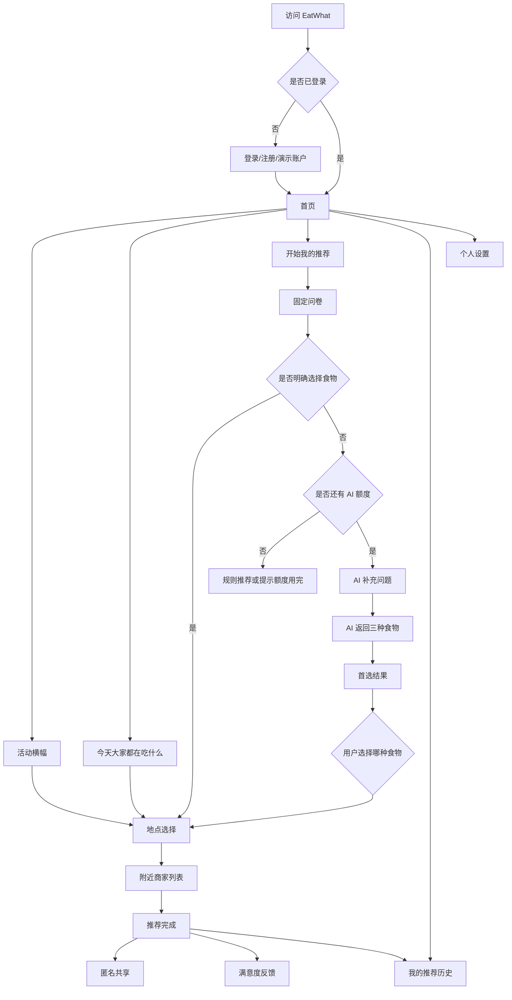

---

# 5. UF-01 注册流程

## 5.1 入口

- 登录页“注册新账号”；
- 未登录访客访问受保护页面后的引导；
- 项目介绍页的注册按钮。

## 5.2 默认流程

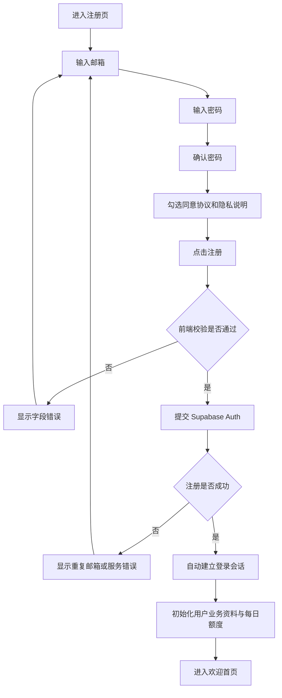

## 5.3 默认设计决定

v1.0 采用：

> 注册成功后自动登录并进入首页。

原因：

- 第一版不要求邮箱验证；
- 减少重复输入；
- 更符合演示项目的快速体验目标。

## 5.4 字段错误

| 情况 | 页面反馈 |
|---|---|
| 邮箱格式错误 | 在邮箱输入框下显示错误 |
| 密码过短 | 显示最低长度要求 |
| 两次密码不同 | 确认密码处显示错误 |
| 未同意协议 | 阻止提交并提示 |
| 邮箱已注册 | 提示前往登录 |
| 网络失败 | 保留输入并允许重试 |

## 5.5 v1.1 预留

- 邮箱验证；
- 注册邮件重发；
- 注册后等待验证页面。

---

# 6. UF-02 登录流程

## 6.1 默认流程

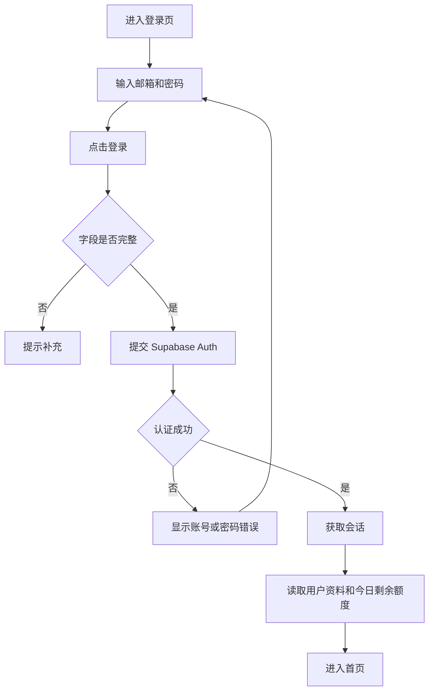

## 6.2 会话恢复

```text
用户刷新网页
→ 前端读取 Supabase 会话
→ 会话有效：继续停留
→ 会话过期：跳转登录页
```

## 6.3 登录后返回目标页

用户未登录时直接访问 `/history`：

```text
/history
→ 登录页
→ 登录成功
→ 返回 /history
```

无法恢复目标页时，默认返回首页。

---

# 7. UF-03 演示账户登录流程

## 7.1 入口

登录页按钮：

> 使用演示账户

## 7.2 流程

```text
点击使用演示账户
→ 显示公共账户提示
→ 用户确认
→ 系统填入或直接提交演示凭据
→ 登录
→ 进入首页
```

## 7.3 必须提示

- 这是公共账户；
- 历史记录可能被其他体验者看到；
- 不要输入真实隐私信息；
- 数据会定期清理。

## 7.4 异常

演示账户额度用完时：

- 允许体验自主选择、活动和公共模块；
- AI 推荐显示额度已用完；
- Mock 展示环境可由开发者配置独立演示额度。

---

# 8. UF-04 退出登录流程

```text
用户点击头像或设置
→ 点击退出登录
→ 清除当前前端会话
→ 清除会话内位置缓存
→ 返回登录页
```

退出前不需要强制确认；若用户正在填写问卷，可以提示当前进度将丢失。

---

# 9. UF-05 首页浏览流程

## 9.1 页面载入

```text
进入首页
→ 获取用户资料
→ 获取今日剩余额度
→ 获取当天活动横幅
→ 获取公共选择数据
→ 判断当前用餐时间段
→ 渲染首页
```

## 9.2 首页核心入口

1. 活动横幅；
2. 开始我的推荐；
3. 今天大家都在吃什么；
4. 我的推荐历史；
5. 个人设置。

## 9.3 数据加载顺序

首屏优先显示：

- 顶部导航；
- 欢迎文案；
- 开始推荐按钮；
- 骨架状态。

活动和公共数据可以异步加载，不应阻塞主入口。

## 9.4 首页加载失败

| 模块 | 失败处理 |
|---|---|
| 剩余额度 | 显示“暂时无法读取”，点击推荐时后端再次校验 |
| 活动横幅 | 隐藏横幅，不阻塞首页 |
| 公共数据 | 显示默认热门项 |
| 用户资料 | 显示通用欢迎语 |

---

# 10. UF-06 活动横幅流程

## 10.1 入口

首页滚动横幅，例如：

> 周四｜肯德基疯狂星期四

## 10.2 流程

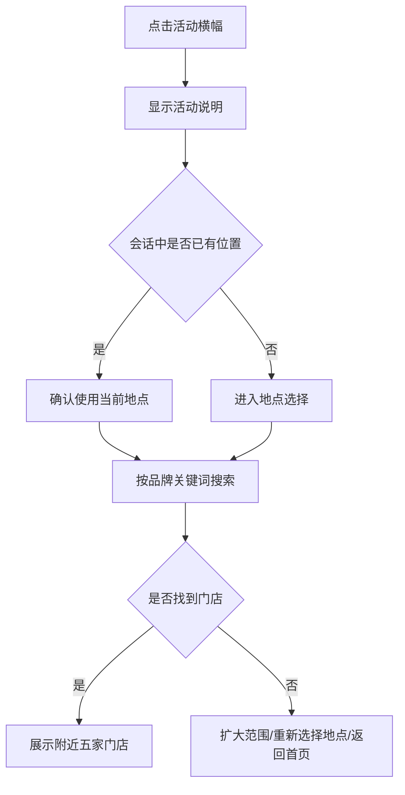

## 10.3 规则

- 不调用 AI；
- 不消耗每日次数；
- 搜索品牌门店，不保证该门店参与活动；
- 固定显示活动免责声明。

---

# 11. UF-07 “今天大家都在吃什么”流程

## 11.1 首页数据生成

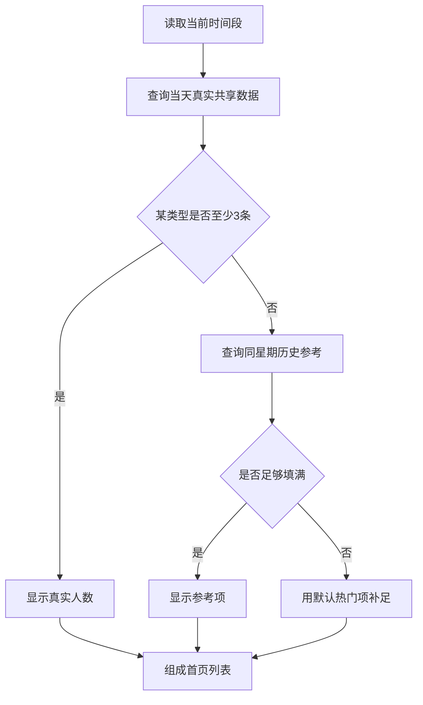

## 11.2 展示规则

- 真实数据优先；
- 真实人数只有达到阈值时显示；
- 默认热门项不显示虚构人数；
- 不显示“假设数据”“演示数据”等标签；
- 手机端最多三项；
- 电脑端最多五项。

## 11.3 用户点击流程

```text
点击食物类型
→ 确认该类型
→ 进入地点选择
→ 搜索附近商家
→ 展示五家
```

不调用 AI，不消耗次数。

## 11.4 “查看更多”

进入完整公共选择页：

- 展示更多食物类型；
- 可按当前用餐时间段查看；
- 仍遵循人数阈值；
- 默认热门项用于补足，不虚构人数。

---

# 12. UF-08 开始我的推荐

## 12.1 入口检查

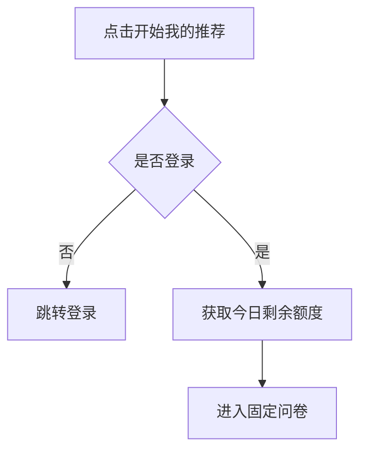

即使额度为 0，也允许进入问卷，因为用户仍可能明确选择食物并走不消耗 AI 的自主选择流程。

## 12.2 问卷状态保存

v1.0 默认：

- 当前浏览器会话内临时保存；
- 刷新页面后尽量恢复；
- 退出登录后清除；
- 不把未完成问卷写入长期历史。

---

# 13. UF-09 固定问卷流程

## 13.1 推荐顺序

建议页面顺序：

1. 用餐时间段；
2. 胃口；
3. 忌口；
4. 口味；
5. 预算；
6. 距离；
7. 根据前述回答生成的食物类型候选。

这样第七题可以根据前六项做规则筛选。

## 13.2 流程

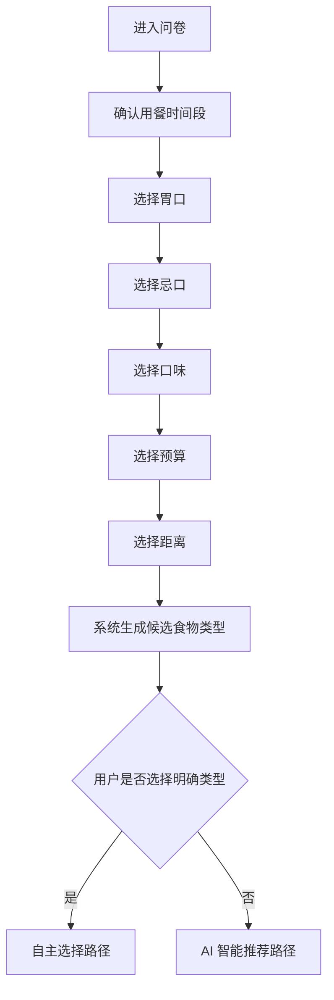

## 13.3 页面操作

每一步支持：

- 下一步；
- 上一步；
- 查看进度；
- 修改已答内容；
- 退出问卷。

## 13.4 忌口规则

- 支持多选；
- “暂无忌口”与其他项互斥；
- 页面提供免责声明入口；
- 不把忌口结果描述成过敏安全保证。

---

# 14. UF-10 用户自主选择流程

## 14.1 触发

用户在候选食物类型中明确选择，例如：

> 麻辣烫

## 14.2 流程

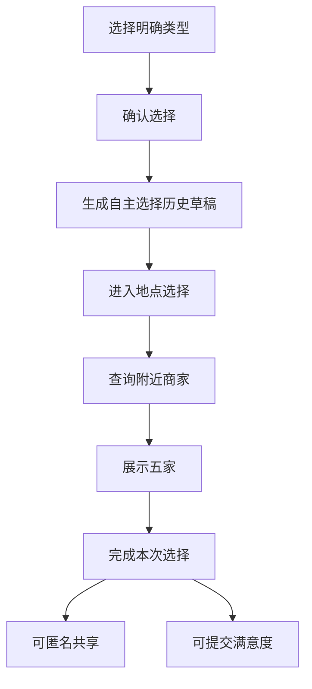

## 14.3 规则

- 不调用 AI；
- 不消耗每日 AI 额度；
- 保存来源为 `user_selected`；
- 可以进入个人历史；
- 可以匿名共享到公共统计。

---

# 15. UF-11 AI 智能推荐流程

## 15.1 额度检查

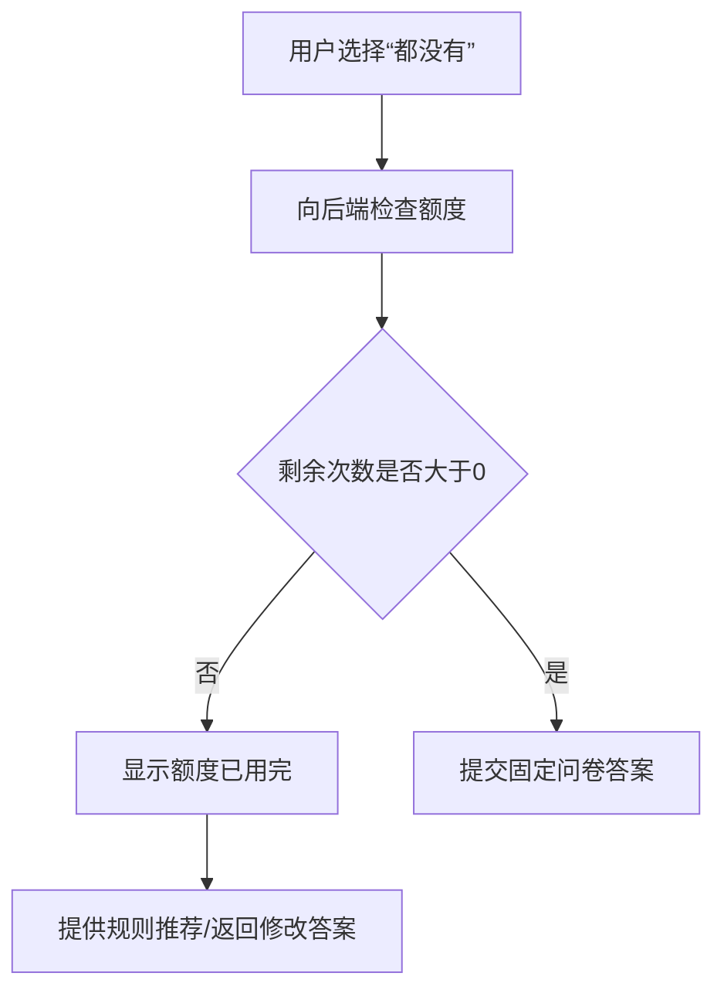

## 15.2 AI 补问

```text
提交固定答案
→ 后端判断是否需要补问
→ 需要：AI 返回 1～2 个选择题
→ 不需要：直接进入最终 AI 推荐
```

AI 补问成功本身不扣次数。

## 15.3 用户回答补问

- 一页显示一个或两个问题；
- 用户提交后不再继续多轮追问；
- 回答与固定问卷共同提交给最终推荐接口。

## 15.4 最终推荐

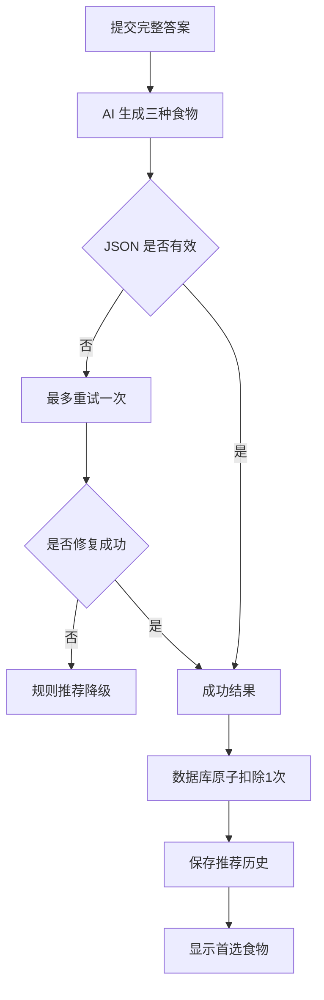

## 15.5 额度扣除安全规则

防止重复扣次：

- 每次推荐生成唯一 `request_id`；
- 同一个请求只可成功扣除一次；
- 刷新结果页不重复扣；
- AI 失败不扣；
- 后端必须执行原子操作。

## 15.6 结果页

默认显示：

- 首选食物；
- 推荐理由；
- 查看附近商家；
- 我想要更多推荐。

点击“我想要更多推荐”：

- 展示备选一、备选二；
- 不再次调用 AI；
- 不再次扣次数。

---

# 16. UF-12 选择 AI 推荐类型

```text
首选：麻辣烫
→ 用户点击查看附近商家
→ 查询麻辣烫

或

点击我想要更多推荐
→ 显示小碗菜、黄焖鸡
→ 用户选择黄焖鸡
→ 查询黄焖鸡
```

一次只查询用户最终点击的一个类型。

---

# 17. UF-13 地点选择总流程

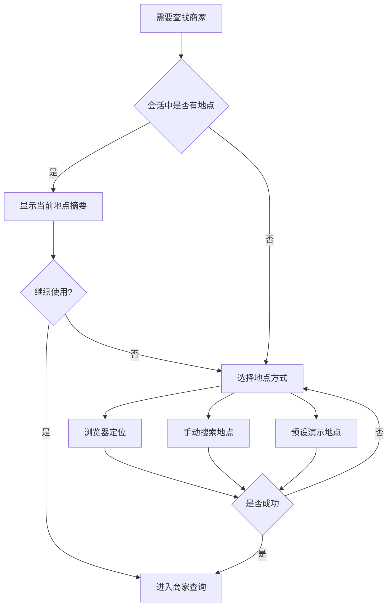

---

# 18. UF-14 浏览器定位流程

```text
点击使用当前位置
→ 展示定位用途说明
→ 调用浏览器定位权限
→ 用户允许
→ 获得经纬度
→ 反向解析为地点摘要
→ 当前会话保存
```

用户拒绝时：

- 不重复强制弹窗；
- 显示手动地点；
- 显示预设演示地点；
- 允许只保留食物推荐而不查看商家。

---

# 19. UF-15 手动搜索地点流程

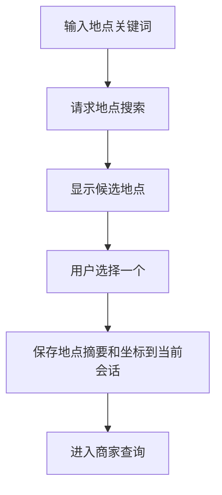

异常：

- 无结果：提示更换关键词；
- 多个同名地点：展示城市和区域；
- 地图 API 失败：提供演示地点。

---

# 20. UF-16 预设演示地点流程

```text
选择预设地点
→ 使用项目内配置的地点坐标
→ 标记当前为演示地点
→ Live POI 可查询真实周边，或 Mock 模式返回演示商家
```

建议首批演示地点在后续技术文档中确定。

---

# 21. UF-17 附近商家列表流程

## 21.1 查询

```text
地点 + 食物类型 + 最大距离
→ 后端 POI Provider
→ 返回候选商家
→ 规则排序
→ 默认显示五家
```

## 21.2 商家卡片操作

- 查看地址；
- 查看距离；
- 查看餐饮分类；
- 在地图中打开；
- 查看更多。

## 21.3 无结果处理

优先顺序：

1. 提示扩大距离；
2. 重新选择地点；
3. 返回选择另一个食物推荐；
4. 显示 Mock/演示商家（仅演示模式）。

## 21.4 不做的能力

- 不展示未经验证的评分；
- 不承诺价格；
- 不承诺营业；
- 不在 v1.0 内提供导航；
- 不让 AI 编造商家。

---

# 22. UF-18 推荐完成流程

完成定义：

- 用户已得到食物类型；
- 商家查询可以成功或明确跳过；
- 推荐历史已保存。

结果页底部依次展示：

1. 是否匿名共享；
2. 简单满意度；
3. 详细反馈入口；
4. 返回首页；
5. 查看我的历史。

---

# 23. UF-19 匿名共享流程

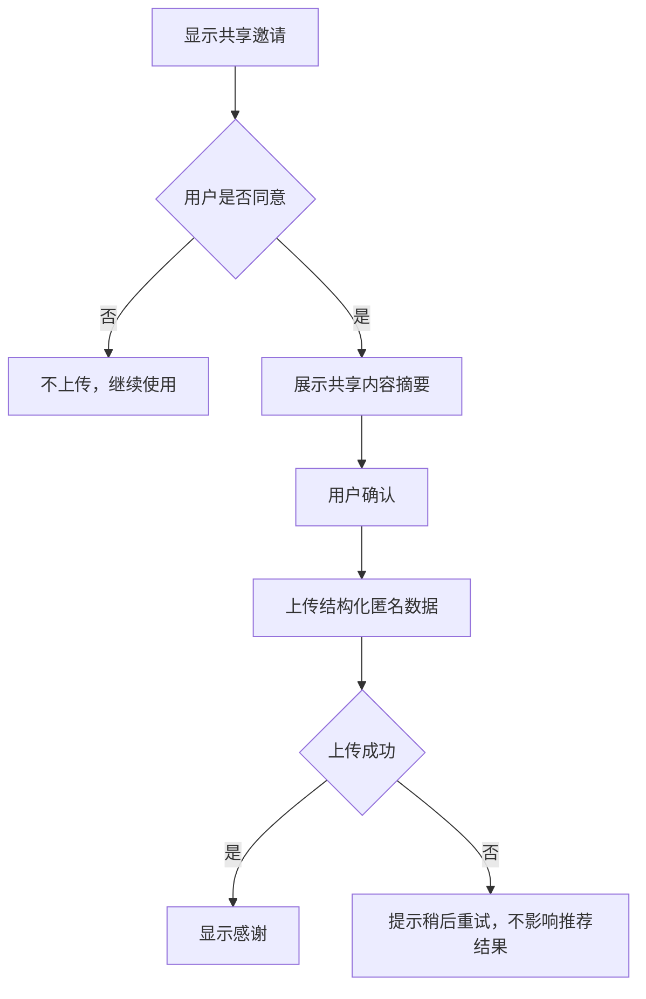

## 23.1 共享摘要必须让用户知道

会共享：

- 用餐时间段；
- 粗略城市/区域；
- 问卷选项；
- 最终食物类型；
- 推荐来源；
- 满意度。

不会共享：

- 邮箱；
- 精确位置；
- 具体门店；
- 完整 AI 对话。

---

# 24. UF-20 满意度反馈流程

## 24.1 简单反馈

```text
这次推荐有帮助吗？
[有帮助] [没帮助]
```

提交后立即保存。

## 24.2 详细反馈

用户点击“填写更多建议”：

- 推荐是否符合胃口；
- 是否解决选择困难；
- 附近是否有合适商家；
- 改进建议。

## 24.3 规则

- 不强制；
- 不使用打断式弹窗；
- 同一推荐记录只能保留一份最新反馈；
- 用户可以跳过。

---

# 25. UF-21 我的推荐历史

## 25.1 入口

- 顶部导航；
- 首页快捷入口；
- 推荐完成页。

## 25.2 列表

每条显示：

- 时间；
- 用餐时间段；
- 最终食物类型；
- 来源；
- 是否共享；
- 满意度摘要。

## 25.3 详情

点击记录可查看：

- 固定问卷答案；
- AI 补问答案；
- 三个推荐；
- 最终选择；
- 查看过的商家；
- 反馈。

## 25.4 删除

单条删除：

```text
点击删除
→ 二次确认
→ 删除个人历史
→ 已共享公共数据不自动删除，但保持匿名
```

清空全部：

- 需要二次确认；
- 仅删除个人历史；
- 不影响认证账户。

---

# 26. UF-22 个人设置

v1.0 包含：

- 当前邮箱只读展示；
- 免责声明；
- 隐私说明；
- 清空历史；
- 退出登录。

v1.1 预留：

- 忘记/重置密码；
- 邮箱验证；
- 注销账户。

未实现的入口不应表现为可用按钮；可以在路线图或“后续版本”中说明。

---

# 27. UF-23 额度用完流程

```text
剩余次数 = 0
→ 首页显示今日 AI 次数已用完
→ 开始推荐仍可进入固定问卷
→ 用户明确选择食物：继续
→ 用户需要 AI：提示明日恢复，并提供规则推荐
```

仍可使用：

- 活动；
- 公共选择；
- 自主选择；
- 历史；
- 地点与商家查询。

---

# 28. UF-24 服务降级流程

## 28.1 AI 不可用

```text
AI 请求失败
→ 最多重试一次
→ 失败
→ 使用规则推荐
→ 不扣次数
→ 标记“基础推荐”
```

## 28.2 POI 不可用

```text
商家查询失败
→ 保留食物结果
→ 提供重试
→ 提供演示地点/Mock 商家
```

## 28.3 公共统计不可用

```text
公共 API 失败
→ 首页使用默认热门项
→ 不影响开始推荐
```

## 28.4 Live 模式关闭

页面可以提示：

> 当前使用演示数据体验核心流程。

这里的“演示模式”是整个系统运行状态提示，与首页默认热门项的展示标签不同；默认热门项本身不需要逐项标注。

---

# 29. 电脑端与手机端流程差异

业务流程一致，仅布局不同。

## 29.1 电脑端

- 顶部导航完整显示；
- 首页主要区域可左右分栏；
- 问卷卡片居中；
- 公共选择最多显示五项；
- 商家列表可以更宽；
- 历史列表可使用表格或宽卡片。

## 29.2 手机端

- 导航收纳到菜单或底部入口；
- 首页按重要性上下排列；
- “开始我的推荐”优先于公共列表；
- 公共选择最多三项；
- 问卷每页一个问题；
- 主要按钮固定在容易触达的位置，但不遮挡内容；
- 商家列表使用单列卡片；
- 历史使用单列卡片。

---

# 30. 页面返回规则

| 当前页面 | 返回行为 |
|---|---|
| 注册页 | 返回登录页 |
| 问卷中 | 返回上一题，首题返回首页并提示进度 |
| AI 补问 | 返回固定问卷摘要 |
| 推荐结果 | 返回问卷摘要或首页 |
| 地点选择 | 返回触发该流程的食物结果 |
| 商家列表 | 返回食物结果或入口页面 |
| 历史详情 | 返回历史列表 |
| 设置页 | 返回首页 |

---

# 31. 流程级验收标准

## 31.1 账户

- 注册成功自动登录；
- 登录失败有明确反馈；
- 刷新后会话恢复；
- 退出后无法访问受保护页；
- 演示账户可直接体验。

## 31.2 推荐

- 用户可完成固定问卷；
- 明确选择后不调用 AI；
- 不明确时最多补问两题；
- AI 成功后只扣一次；
- 展开备选不重复扣次；
- AI 失败可降级。

## 31.3 地点和商家

- 三种地点方式均能进入商家查询；
- 位置可在会话内复用；
- 拒绝定位不会卡死；
- 默认显示五家；
- 无结果有恢复路径。

## 31.4 公共模块

- 真实数据优先；
- 至少三条才显示人数；
- 默认热门项不虚构人数；
- 点击后直接查商家；
- 不消耗 AI 次数。

## 31.5 历史、共享和反馈

- 推荐能形成历史；
- 用户可删除和清空；
- 共享前可查看摘要；
- 拒绝共享不影响使用；
- 满意度非强制。

---

# 32. 下一阶段输入

本用户流程文档将作为以下文档的输入：

```text
03_EatWhat_信息架构与页面清单.md
04_EatWhat_电脑端与手机端低保真原型.md
05_EatWhat_系统架构设计.md
07_EatWhat_API接口设计.md
11_EatWhat_测试与验收计划.md
```

原型阶段重点验证：

- 首页内容层级；
- 问卷每题如何展示；
- AI 首选与更多推荐的关系；
- 位置选择交互；
- 公共真实卡片和默认热门卡片如何保持视觉统一；
- 手机端导航和页面长度。
