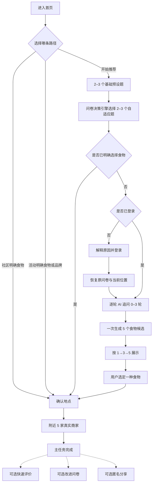

# EatWhat 用户流程 v1.1（权威流程）

> 文档状态：权威流程基线  
> 上游依据：`01_EatWhat_PRD_产品需求文档_v1.2_权威需求基线.md`、`00_EatWhat_统一名词表与状态定义_v1.0.md`  
> 替代文档：`02_EatWhat_用户流程.md`  
> 最后更新：2026-07-23

---

## 1. 本文解决什么

本文把 PRD 中的产品承诺转成可以实现、测试和制作原型的用户流程。若本文与 PRD v1.2 冲突，以 PRD v1.2 为准。

本文重点回答：

1. 访客和登录用户分别能做什么；
2. 首页三条路径如何分流；
3. 七个信息维度如何通过混合自适应问卷覆盖；
4. 何时要求登录、何时调用 AI、何时扣减额度；
5. 等待、返回、刷新、失败和答案修改时如何恢复；
6. 用户选定食物后如何进入真实商家；
7. 主任务结束后如何提供不强制的反馈、调查和匿名分享。

---

## 2. 用户能力边界

| 能力 | 未登录访客 | 登录用户 |
|---|---:|---:|
| 浏览首页、社区和活动 | 可用 | 可用 |
| 选择明确食物并查询附近商家 | 可用 | 可用 |
| 完成基础题和自适应预设题 | 可用 | 可用 |
| 调用 AI 生成追问 | 不可用，触发登录边界 | 可用，受会话额度控制 |
| 调用 AI 生成最终五个候选 | 不可用，触发登录边界 | 可用，受会话额度控制 |
| 查看持久化历史和账户设置 | 不可用 | 可用 |
| 快速反馈、改进问卷、匿名分享 | 可用，但按匿名策略处理 | 可用，分享仍与账户断开 |

登录不是站点入口门槛，而是 AI 能力和个人持久化数据的边界。

---

## 3. 全局流程原则

1. **明确选择优先**：已有明确食物或品牌目标时，直接进入附近商家。
2. **规则先于 AI**：预设题由确定性问卷决策引擎选择，不调用模型。
3. **覆盖七维而非固定七页**：问题数量和页面数量不与维度数量绑定。
4. **AI 逐题追问**：每轮只显示一个 AI 问题，最多三轮，可提前结束。
5. **结果渐进披露**：模型一次生成五个候选，前端依次展示 1、3、5 个。
6. **位置后置**：只有准备查商家时才请求或确认具体位置。
7. **所有草稿可恢复**：登录、刷新、超时或网络中断不得清空有效答案。
8. **主任务先完成**：反馈、调查和分享不得阻断“确定食物并查看商家”。
9. **来源不混淆**：AI 只决定食物类型；商家事实仅来自 POI 提供方。

---

## 4. 核心状态模型

### 4.1 推荐会话状态

```text
draft
  → preset_in_progress
  → preset_complete
  → awaiting_login（仅未登录且即将调用 AI）
  → ai_followup_pending
  → ai_followup_answering
  → final_generation_pending
  → result_ready
  → food_selected
  → poi_browsing
  → completed

任意未完成状态 → abandoned
可恢复错误状态 → 保持原业务状态并记录 transient_error
```

### 4.2 问卷决策动作

问卷决策引擎每次返回一个明确的 `next_action`：

- `ask_questions`：继续显示 1–3 个预设问题；
- `direct_to_poi`：用户已明确选定食物，直接进入地点/商家；
- `require_login`：规则阶段完成、仍需 AI，但当前未登录；
- `request_ai_followup`：登录用户进入下一轮 AI 追问；
- `generate_final`：信息已经充分，直接生成最终五个候选。

---

## 5. 总体流程



---

## 6. UF-01 首页加载与三路分流

### 6.1 首屏加载顺序

1. 立即显示导航、主标题和“开始推荐”按钮；
2. 并行加载活动和社区摘要；
3. 登录态与 AI 剩余额度异步补充，不阻塞访客首屏；
4. 活动或社区失败时，只降级对应模块，不阻塞推荐入口。

### 6.2 路径 A：社区明确食物

```text
点击“大家都在吃什么”中的食物
→ 将该食物记为明确目标，source_type=community
→ 不创建 AI 会话、不消耗 AI 额度
→ 进入地点确认
→ 查询附近商家
```

### 6.3 路径 B：活动明确目标

```text
点击活动
→ 查看活动说明和搜索目标
→ 用户确认“看看附近门店/相关食物”
→ source_type=activity
→ 不进入问卷、不调用 AI
→ 进入地点确认和商家搜索
```

如果活动只有泛主题而没有可执行的食物/品牌搜索目标，不得伪装为直接商家路径；应明确引导用户进入推荐或返回首页。

### 6.4 路径 C：开始推荐

```text
点击“开始推荐”
→ 创建本地草稿标识
→ 获取当前有效问卷版本
→ 进入基础预设题
```

未登录不会在此处被拦截。

---

## 7. UF-02 混合自适应预设问卷

### 7.1 七个必须覆盖的信息维度

`meal_period`、`appetite`、`avoidances`、`tastes`、`budget`、`max_distance_m`、`explicit_food_preference`。

覆盖不代表每个维度都需要单独提问。例如，“现在是午餐，想吃得轻一点还是饱一点？”可以同时确认用餐时段和食量；自动推断只能作为待确认默认值。

预算使用三个单人正餐档位：20 元以下、20–30 元、30 元以上（今天想吃好一点）。它只帮助选择更可能合适的食物方向，不代表附近具体商家一定落在该价位。

### 7.2 基础题阶段

- 通常 2–3 题；
- 可同屏分组，也可逐组呈现；
- 先询问高影响且容易回答的内容；
- 强排除项必须显式确认，不允许仅靠推断；
- 每次提交向后端发送当前版本和完整答案快照。

### 7.3 自适应预设题阶段

```text
提交当前完整答案
→ POST /api/v1/questionnaire/next
→ 服务端从头重算有效路径
→ 返回 next_questions、covered_dimensions、progress、next_action
→ 前端渲染 1–3 个后续预设题
→ 重复直到规则阶段完成
```

同一问卷版本和同一答案快照必须得到相同结果，不能随机选题。

### 7.4 问题选择示例

| 已知答案 | 可以跳过 | 更有信息量的后续题 |
|---|---|---|
| 选择“清淡” | 辣度细分 | 是否想喝汤、偏热食还是冷食 |
| 明确“想吃面” | 泛化食物形态 | 汤面/拌面、预算或距离 |
| 选择“大胃口” | 小份偏好 | 主食强度、肉类偏好 |
| 有强忌口 | 与忌口冲突的候选 | 可接受替代食材 |

### 7.5 直接选定食物

如果用户在预设问卷中明确选择了具体食物：

```text
确认具体食物
→ next_action=direct_to_poi
→ 不要求登录、不调用 AI
→ 进入地点确认
```

---

## 8. UF-03 返回修改与分支失效

用户可以从问卷摘要、AI 追问或结果页返回修改预设答案。

```text
修改上游答案
→ 前端立即更新本地快照
→ 服务端基于完整答案从头重算
→ 返回 invalidated_answer_ids
→ 前端删除/封存已失效的下游答案
→ 明确告知“后续 2 个回答因本次修改需要重新确认”
→ 从首个缺失维度继续
```

不得静默保留与新路径矛盾的旧答案，也不得清空仍然有效的无关答案。

---

## 9. UF-04 AI 登录边界与恢复

### 9.1 触发条件

同时满足以下条件才触发登录：

1. 预设问卷规则阶段已完成；
2. 用户仍未明确选择食物；
3. 下一步需要第一次模型调用；
4. 当前用户未登录。

### 9.2 登录边界界面

必须说明：

> AI 推荐需要登录，用于控制调用额度。你刚才填写的答案已经保存，登录后会从这里继续。

可执行操作：

- 登录；
- 注册；
- 返回修改答案；
- 暂不使用 AI，回首页使用社区、活动或直接找食物。

### 9.3 恢复契约

登录前在当前标签页保存：

- `questionnaire_version`；
- 完整答案快照；
- 当前有效问题路径；
- 已覆盖维度；
- 登录后的安全 `return_to`；
- 草稿过期时间。

登录成功后服务端重新校验版本和答案，再进入 `request_ai_followup` 或 `generate_final`。不得盲信登录前计算结果。

---

## 10. UF-05 逐轮 AI 追问

### 10.1 调用节奏

```text
提交完整上下文
→ AI 返回一个追问或“信息充分”
→ 若有追问：页面只展示这一题
→ 用户回答
→ 将全部上下文和新答案再次提交
→ 最多重复 3 轮
→ 充分或达到上限后生成最终结果
```

通常为 2–3 轮，但允许 0 或 1 轮提前结束。

### 10.2 追问题型

AI 可以返回：

- 单选题；
- 多选题；
- 简短自由文本题。

输出必须符合严格 schema，选项数量、文本长度和敏感内容均受限制。自由文本只是回答形式，不允许模型输出自由 HTML。

### 10.3 等待反馈

1. 提交后立即禁用重复提交，并显示上一答案摘要；
2. 800ms 内完成时直接切换，避免加载器闪烁；
3. 超过约 800ms 显示骨架和真实阶段文案；
4. 追问阶段显示“正在根据你的回答准备下一题”；
5. 最终阶段依次显示“正在综合全部回答”“正在准备 5 个推荐结果”；
6. 等待较长时补充“你的回答已保存”；
7. 不显示虚假百分比，也不展示模型思维过程。

### 10.4 重试与幂等

- 同一提交使用稳定的 `request_id`；
- 重试不得生成额外追问轮次或重复消费额度；
- 网络中断保留所有答案；
- 非法 AI 输出由服务端校验、修复或重试，不直接展示；
- 追问失败时可基于已有信息直接尝试最终生成；
- 最终生成失败不扣完整会话额度。

---

## 11. UF-06 五个候选与渐进展示

### 11.1 生成契约

最终调用一次生成恰好五个不重复食物候选，每项至少包含：

- 标准化食物 ID 和展示名称；
- 一句与实际答案相关的理由；
- 强忌口等硬约束的校验结果；
- 来自食物词典的预算软匹配状态；依据不足时必须标记不确定或省略。

### 11.2 展示节奏

```text
初次进入结果页：只显示第 1 个
→ 点击“更多推荐”：显示第 2、3 个
→ 再次点击“更多推荐”：显示第 4、5 个
→ 五个全部展示后隐藏“更多推荐”
```

“更多推荐”只展开已有结果，不再次调用 AI、不重复扣额度。

### 11.3 用户操作

- 点击任一候选的“找附近商家”；
- 返回修改问卷；
- 在 1、3、5 任一展示阶段选定食物；
- 刷新后恢复已生成五项和当前展开数量。

只有最终生成成功并持久化后，才将一次完整推荐会话记入用户可见额度。

---

## 12. UF-07 地点确认与附近商家

### 12.1 进入来源

- 社区明确食物；
- 活动明确目标；
- 问卷中直接选择；
- AI 候选中选择；
- 历史记录重新查询。

### 12.2 地点选择优先级

```text
当前会话有有效地点
→ 显示地点摘要并允许“继续使用/更换”

没有有效地点
→ 使用浏览器当前位置
→ 或手动搜索区域/地点
→ 或使用演示地点
```

浏览器定位被拒绝时不得循环弹权限；立即提供手动和演示路径。

### 12.3 商家查询

- 默认请求五家真实 POI；
- 排序只能表达“距离较近/匹配搜索词”，不得表达“最好”；
- 未知营业状态必须显示未知或省略；
- 商家地址、距离和营业状态来自 POI，不来自 AI；
- 首版没有可靠商家价格时不展示价格、不按预算过滤，也不标记“符合预算”；
- 商家页说明预算只用于食物方向，实际价格以门店菜单为准；
- 未来若使用参考价格，必须同时展示来源和更新时间，且只作为参考排序/筛选；
- 未登录请求同样受访客会话/IP 限流、缓存和最大翻页限制。

### 12.4 无结果与失败

| 状态 | 操作 |
|---|---|
| 零结果 | 扩大范围、换地点、换食物 |
| 定位拒绝 | 手动地点、演示地点 |
| POI 超时 | 保留食物选择并重试 |
| POI 配额/服务不可用 | 明确说明，允许演示商家或稍后重试 |

---

## 13. UF-08 主任务完成与三个可选支线

当用户进入商家结果，或明确点击“这次就决定它了”，主任务即视为完成。页面底部可显示一个可关闭区域：

1. 快速评价：有帮助 / 没帮助；
2. 改进问卷：匹配度、是否减少犹豫、是否找到合适商家、可选建议；
3. 匿名分享：只分享允许的聚合字段。

三个支线必须：

- 相互独立同意；
- 可分别跳过；
- 不使用阻断式弹窗；
- 提交失败不影响主任务结果；
- 不以提交一个支线为其他支线默认同意。

匿名公开分享记录不得包含 `user_id`、`session_id`、问卷答案、AI 对话、精确位置、具体商家或自由文本。如以后支持撤回，使用独立匿名撤回凭证。

---

## 14. UF-09 历史、退出和删除

### 14.1 历史访问

历史属于登录用户能力。未登录访问时保存目标路由，登录后返回历史页。

历史最小展示：

- 时间段和日期；
- 最终食物；
- `source_type`；
- 若为 AI 推荐，显示五个候选的最小快照；
- 不默认保存精确坐标和全部浏览商家。

### 14.2 删除

- 单条删除和清空必须确认；
- 账户删除需要更强确认和重新认证；
- 已真正匿名且断开关联的公开分享不能通过账户反查；
- 删除说明必须在分享前和删除时保持一致。

### 14.3 退出登录

退出清理身份会话和账户数据缓存；当前标签页中未提交的敏感 AI 草稿清理。普通公开页面仍可继续使用。

---

## 15. UF-10 刷新、返回和跨状态恢复

| 场景 | 必须恢复 | 不应恢复 |
|---|---|---|
| 预设问卷刷新 | 版本、有效答案、当前位置 | 已失效下游答案 |
| 登录往返 | 全部有效问卷上下文 | 任意外部 return URL |
| AI 等待刷新 | request_id、已答内容、请求状态 | 重复模型调用 |
| 结果页刷新 | 五个候选、展开到 1/3/5 | 再次扣额度 |
| 商家页返回 | 食物、地点摘要、已生成结果 | 过期精确坐标长期历史 |

浏览器返回应优先回到上一个稳定业务状态，而不是重新触发副作用请求。

---

## 16. UF-11 配额用完和服务降级

### 16.1 AI 会话额度用完

提示用户 AI 暂不可开始，并继续提供：

- 社区明确食物；
- 活动；
- 预设问卷中的直接食物选择；
- 附近商家；
- 查看历史。

用户可见额度按完成的推荐会话计算；后端另有最多三次追问加一次最终生成的会话预算，以及防反复重开的尝试限流。

### 16.2 AI 服务失败

优先顺序：

1. 幂等重试当前阶段；
2. 追问失败时跳过追问，尝试最终生成；
3. 最终生成失败时保留草稿，允许稍后重试；
4. 不把规则候选伪装成 AI 结果。

### 16.3 问卷规则异常

如果规则配置无法得到下一步：

- 显示可恢复错误；
- 保留答案；
- 记录问卷和规则版本；
- 允许重试或回首页；
- 不进入空白页或无限循环。

---

## 17. 响应式与可访问流程约束

- 320px 宽度下主流程无横向溢出；
- 选择控件使用原生 button、radio、checkbox 或语义等价控件；
- 所有主路径可用键盘完成；
- 焦点顺序与视觉顺序一致；
- 页面切换或错误后焦点进入标题/错误摘要；
- AI 等待状态通过 `aria-live` 宣告；
- 问卷进度同时使用文字和语义属性，不只靠颜色；
- 移动端触控目标不小于约 44×44 CSS px；
- 聚焦流程可隐藏全局导航，但必须提供返回和退出流程。

---

## 18. 流程验收任务

| 编号 | 任务 | 成功条件 |
|---|---|---|
| T1 | 访客从社区选择“麻辣烫” | 不登录、不调用 AI，能看到附近商家 |
| T2 | 访客点击明确品牌活动 | 先看说明，再直接进入门店搜索 |
| T3 | 访客完成混合问卷并需要 AI | 只在模型调用前提示登录，登录后原位恢复 |
| T4 | 修改一个上游答案 | 只失效冲突的下游答案，路径可解释且可复现 |
| T5 | 完成三轮 AI 追问 | 每次只显示一题，第四轮不会发生 |
| T6 | 查看全部候选 | 初始 1 个，两次展开后分别为 3、5 个，无新 AI 请求 |
| T7 | 拒绝定位 | 不重复弹权限，能改用手动或演示地点 |
| T8 | POI 零结果 | 食物结果保留，可换范围、地点或食物 |
| T9 | 跳过所有收尾项 | 不受阻地结束主任务 |
| T10 | 在 320px 和键盘环境完成推荐 | 无横向溢出、无键盘陷阱、状态有语义提示 |

---

## 19. 交付结论

本流程正式废止以下旧假设：

- “未登录不能进入核心功能”；
- “固定七题/七页问卷”；
- “AI 一次返回 1–2 个补问”；
- “最终只生成三个候选”；
- “完成后自动或强制进入匿名分享”；
- “社区数据不足时可以展示虚构人数”。

下游信息架构、原型、API、数据库和测试必须覆盖本文状态与恢复规则。
