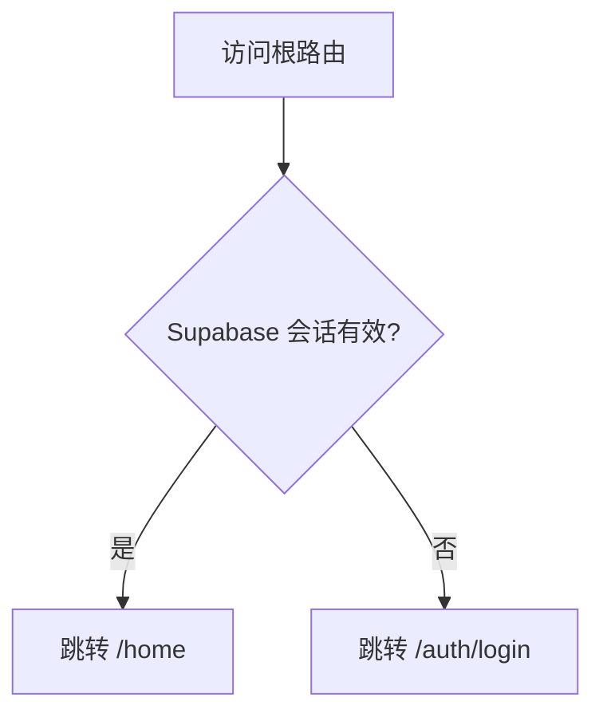
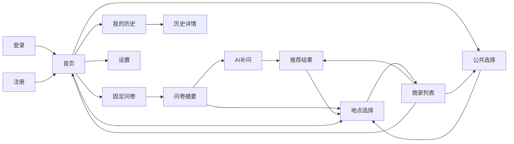

# EatWhat 信息架构与页面清单

> ⚠️ **历史版本提示（2026-07-23）**：本文已由 `03_EatWhat_信息架构与页面状态_v1.1_权威基线.md` 替代，仅保留用于追溯。实现时不得继续沿用其中的旧登录边界、固定问卷、单次补问和三候选页面状态。

> 文档状态：第二阶段正式交付物  
> 依据文档：  
> `01_EatWhat_PRD_产品需求文档_v1.1_需求冻结版.md`  
> `02_EatWhat_用户流程.md`  
> 产品版本：v1.0 MVP  
> 文档日期：2026-07-21

---

# 1. 文档目的

本文档定义 EatWhat 网页的：

- 页面组成；
- 页面层级；
- URL 路由；
- 登录访问权限；
- 页面之间的跳转；
- 全局导航；
- 页面核心内容；
- 页面状态；
- 电脑端和手机端的信息优先级；
- v1.1 预留页面。

它是低保真原型、前端路由、API 数据需求和测试范围的共同依据。

---

# 2. 信息架构原则

## 2.1 核心任务优先

用户进入首页后，应最快看到：

1. 今天吃什么；
2. 开始我的推荐；
3. 今日剩余次数；
4. 今日活动；
5. 今天大家都在吃什么。

“开始我的推荐”始终是首页最高优先级操作。

## 2.2 减少首页信息堆积

首页不直接放入：

- 完整历史列表；
- 完整公共统计；
- 详细问卷；
- 长篇免责声明；
- 复杂账户设置。

首页只提供摘要和入口。

## 2.3 电脑端与手机端共用信息架构

两端共用：

- 相同页面；
- 相同路由；
- 相同数据；
- 相同业务流程。

只调整：

- 排列方式；
- 显示数量；
- 导航形式；
- 卡片宽度；
- 操作入口位置。

## 2.4 功能降级不能改变主导航

即使 AI 或地图服务不可用：

- 首页仍可进入；
- 历史仍可查看；
- 自主选择仍可使用；
- 页面只改变状态和提示，不创建另一套导航。

---

# 3. 网站总体结构

```text
EatWhat
├── 公共区域
│   ├── 登录
│   ├── 注册
│   ├── 项目介绍
│   ├── 免责声明
│   └── 隐私说明
│
├── 登录后主区域
│   ├── 首页
│   │   ├── 今日活动横幅
│   │   ├── 欢迎区
│   │   ├── 开始我的推荐
│   │   ├── 今天大家都在吃什么
│   │   └── 今日剩余次数
│   │
│   ├── 推荐流程
│   │   ├── 固定问卷
│   │   ├── 问卷摘要
│   │   ├── AI 补充问题
│   │   ├── AI 推荐结果
│   │   ├── 地点选择
│   │   └── 附近商家
│   │
│   ├── 公共选择
│   │   └── 今天大家都在吃什么完整页
│   │
│   ├── 个人数据
│   │   ├── 我的推荐历史
│   │   └── 历史详情
│   │
│   └── 个人设置
│       ├── 账户信息
│       ├── 数据管理
│       ├── 隐私与免责声明
│       └── 退出登录
│
└── v1.1 预留
    ├── 邮箱验证
    ├── 忘记密码
    ├── 重置密码
    └── 注销账户
```

---

# 4. 路由总表

## 4.1 v1.0 正式路由

| 页面编号 | 路由 | 页面名称 | 访问权限 |
|---|---|---|---|
| P01 | `/` | 根路由 | 自动判断 |
| P02 | `/auth/login` | 登录页 | 公开 |
| P03 | `/auth/register` | 注册页 | 公开 |
| P04 | `/home` | 首页 | 登录 |
| P05 | `/recommend` | 推荐流程入口 | 登录 |
| P06 | `/recommend/questionnaire` | 固定问卷 | 登录 |
| P07 | `/recommend/summary` | 问卷摘要 | 登录 |
| P08 | `/recommend/follow-up` | AI 补充问题 | 登录 |
| P09 | `/recommend/result/:id` | 食物推荐结果 | 登录 |
| P10 | `/location/select` | 地点选择 | 登录 |
| P11 | `/restaurants` | 附近商家列表 | 登录 |
| P12 | `/community` | 今天大家都在吃什么 | 登录 |
| P13 | `/history` | 我的推荐历史 | 登录 |
| P14 | `/history/:id` | 推荐历史详情 | 登录 |
| P15 | `/settings` | 个人设置 | 登录 |
| P16 | `/about` | 项目介绍 | 公开 |
| P17 | `/disclaimer` | 免责声明 | 公开 |
| P18 | `/privacy` | 隐私说明 | 公开 |
| P19 | `*` | 404 页面 | 公开 |

## 4.2 v1.1 预留路由

| 路由 | 页面 |
|---|---|
| `/auth/verify-email` | 邮箱验证 |
| `/auth/forgot-password` | 忘记密码 |
| `/auth/reset-password` | 重置密码 |
| `/settings/delete-account` | 注销账户 |

v1.0 不应提供看似可用但实际无功能的按钮。预留路由只记录在文档与代码结构规划中。

---

# 5. 根路由规则

访问 `/`：



---

# 6. 访问控制

## 6.1 公开页面

- 登录；
- 注册；
- 项目介绍；
- 免责声明；
- 隐私说明；
- 404。

## 6.2 登录页面保护

已登录用户访问登录或注册页时：

```text
已有有效会话
→ 跳转首页
```

## 6.3 受保护页面

未登录用户访问：

- 首页；
- 推荐流程；
- 商家；
- 公共选择；
- 历史；
- 设置；

系统保存目标路由后跳转登录页。

## 6.4 推荐流程状态保护

用户不能直接跳到 AI 补问页而没有问卷数据。

示例：

```text
直接访问 /recommend/follow-up
→ 检查当前推荐草稿
→ 无草稿
→ 返回 /recommend/questionnaire
```

---

# 7. 全局布局

## 7.1 公共页面布局

适用于：

- 登录；
- 注册；
- 项目介绍；
- 免责声明；
- 隐私说明。

包含：

- 简化 Logo；
- 主内容；
- 底部链接。

不显示登录后的完整导航。

## 7.2 登录后主布局

包含：

```text
顶部导航
主内容区域
全局状态提示
页脚
```

## 7.3 全局状态提示

可以展示：

- Live/Mock 模式；
- AI 服务暂不可用；
- 今日额度用完；
- 当前使用演示地点；
- 网络断开。

提示应简短，不长期占据大量页面空间。

---

# 8. 全局导航

## 8.1 电脑端导航

建议顶部导航：

```text
EatWhat Logo
首页
我的历史
免责声明
今日剩余次数
用户菜单
```

用户菜单包含：

- 当前邮箱；
- 个人设置；
- 退出登录。

## 8.2 手机端导航

建议采用：

- 顶部简化栏；
- 右上角用户菜单；
- 或底部导航。

推荐 v1.0 使用底部导航：

```text
首页
开始推荐
我的历史
我的
```

活动和公共选择从首页进入，不单独占用底部栏。

## 8.3 推荐流程中的导航

填写问卷时：

- 隐藏大部分主导航；
- 保留 Logo 或返回首页；
- 显示问卷进度；
- 防止用户误触跳出。

---

# 9. 页面清单总览

| 页面 | 主要目标 | 核心操作 |
|---|---|---|
| 登录 | 建立会话 | 登录、演示账户、前往注册 |
| 注册 | 创建账户 | 注册、同意协议 |
| 首页 | 聚合核心入口 | 活动、推荐、公共选择 |
| 固定问卷 | 收集偏好 | 选择、上一步、下一步 |
| 问卷摘要 | 最终确认 | 修改、提交 |
| AI 补问 | 补齐偏好 | 回答并提交 |
| 推荐结果 | 展示三种食物 | 查商家、更多推荐 |
| 地点选择 | 确定查询位置 | 定位、手动、演示 |
| 商家列表 | 展示附近结果 | 地图打开、查看更多 |
| 公共选择 | 查看更多公共项 | 点击食物查商家 |
| 我的历史 | 管理个人记录 | 查看、删除、清空 |
| 历史详情 | 查看一次完整记录 | 再次查看、删除 |
| 设置 | 管理账户与数据 | 清空、退出 |
| 免责声明 | 说明风险 | 阅读 |
| 隐私说明 | 说明数据使用 | 阅读 |

---

# 10. P02 登录页

## 10.1 页面目标

让用户使用正式账户或演示账户建立会话。

## 10.2 核心内容

- EatWhat Logo；
- 欢迎文案；
- 邮箱输入框；
- 密码输入框；
- 登录按钮；
- 使用演示账户；
- 前往注册；
- 免责声明与隐私链接；
- v1.1 忘记密码说明。

## 10.3 页面状态

- 默认；
- 输入错误；
- 登录中；
- 认证失败；
- 网络失败；
- 演示账户提示。

## 10.4 电脑端

登录卡片居中，旁边可展示简短产品介绍或插图。

## 10.5 手机端

单列布局，主要按钮宽度充足，不展示复杂侧边介绍。

---

# 11. P03 注册页

## 11.1 页面目标

创建邮箱密码账户。

## 11.2 核心内容

- 邮箱；
- 密码；
- 确认密码；
- 同意协议和隐私；
- 注册按钮；
- 返回登录；
- 使用演示账户。

## 11.3 页面状态

- 字段错误；
- 邮箱已注册；
- 注册中；
- 注册成功；
- 服务错误。

## 11.4 默认跳转

注册成功自动登录并进入 `/home`。

---

# 12. P04 首页

## 12.1 页面目标

让用户快速选择以下三条主路径：

1. 点击活动；
2. 参考大家的选择；
3. 开始自己的推荐。

## 12.2 内容优先级

```text
一级：欢迎词 + 开始推荐
二级：今日活动
三级：今天大家都在吃什么
四级：历史与设置
```

## 12.3 核心模块

### 顶部导航

- Logo；
- 今日剩余次数；
- 我的历史；
- 用户菜单。

### 活动横幅

- 人工配置；
- 支持轮播；
- 点击进入品牌门店查询；
- 附带统一活动免责声明。

### 欢迎区

```text
今天吃什么？
是啊，吃什么。
[开始我的推荐]
```

### 今天大家都在吃什么

- 电脑端最多五项；
- 手机端最多三项；
- 真实项可显示真实人数；
- 默认热门项不显示虚构人数；
- 查看更多。

## 12.4 电脑端布局建议

```text
活动横幅
────────────────────────
公共选择摘要 | 欢迎与开始推荐
```

“开始我的推荐”区域视觉权重应高于公共选择。

## 12.5 手机端布局建议

```text
顶部栏
活动横幅
欢迎与开始推荐
今天大家都在吃什么
其他入口
```

## 12.6 页面状态

- 正常；
- 活动加载失败；
- 公共数据加载失败；
- 额度读取失败；
- AI 额度用完；
- Mock 模式。

---

# 13. P05 推荐流程入口

`/recommend` 是逻辑入口，不一定需要独立页面。

进入后：

```text
检查是否存在未完成问卷
→ 有：询问继续或重新开始
→ 无：进入固定问卷
```

---

# 14. P06 固定问卷页

## 14.1 页面目标

以低负担方式收集基础偏好。

## 14.2 页面结构

- 返回首页；
- 进度；
- 问题标题；
- 辅助说明；
- 选择项；
- 上一步；
- 下一步。

## 14.3 问题顺序

1. 用餐时间段；
2. 胃口；
3. 忌口；
4. 口味；
5. 预算；
6. 距离；
7. 食物类型候选。

## 14.4 电脑端

- 问卷卡片居中；
- 可以显示左侧进度步骤；
- 选项可多列。

## 14.5 手机端

- 一页一题；
- 选项单列或两列；
- 上一步和下一步固定在内容下方；
- 不同时展示过多说明。

## 14.6 页面状态

- 未选择必填项；
- 保存中；
- 恢复草稿；
- 额度为零提示；
- 用户确认退出。

---

# 15. P07 问卷摘要页

## 15.1 页面目标

让用户在提交 AI 前检查答案。

## 15.2 核心内容

- 用餐时间；
- 胃口；
- 忌口；
- 口味；
- 预算；
- 距离；
- 是否已有明确食物类型；
- 修改按钮；
- 提交按钮。

## 15.3 分流

```text
有明确类型
→ 地点选择

无明确类型
→ 检查 AI 额度
→ AI 补问或最终推荐
```

---

# 16. P08 AI 补充问题页

## 16.1 页面目标

展示 AI 根据已答内容生成的最多两个问题。

## 16.2 核心内容

- “再确认一点”提示；
- 1–2 个问题；
- 选择项；
- 提交；
- 返回问卷摘要。

## 16.3 状态

- AI 生成中；
- AI 失败；
- 使用规则问题；
- 无需补问，自动跳转；
- 提交最终推荐中。

---

# 17. P09 推荐结果页

## 17.1 页面目标

降低选择压力，先展示一个首选。

## 17.2 默认内容

- 推荐完成提示；
- 首选食物名称；
- 推荐理由；
- 查看附近商家；
- 我想要更多推荐；
- 今日剩余次数；
- 返回修改问卷。

## 17.3 展开更多推荐

显示：

- 备选一；
- 备选二。

每个备选都有：

- 名称；
- 理由；
- 查看附近商家。

## 17.4 商家查询后返回

从商家页返回时，应保留三种推荐，不重复调用 AI。

## 17.5 推荐完成后附加区域

- 匿名共享；
- 满意度反馈；
- 查看我的历史。

## 17.6 状态

- AI 推荐中；
- 规则推荐降级；
- 额度扣除失败；
- 结果恢复；
- 推荐记录保存失败。

---

# 18. P10 地点选择页

## 18.1 页面目标

让用户从三种方式选择查询地点。

## 18.2 页面内容

### 当前会话地点

已有地点时显示：

- 地点名称；
- 继续使用；
- 重新选择。

### 使用当前位置

- 用途说明；
- 定位按钮。

### 手动搜索

- 地点关键词；
- 搜索结果；
- 选择地点。

### 演示地点

- 预设地点卡片。

## 18.3 页面状态

- 定位请求中；
- 定位拒绝；
- 定位超时；
- 地点搜索中；
- 无搜索结果；
- 地图服务失败；
- 当前使用演示地点。

## 18.4 返回规则

返回推荐结果、活动入口或公共选择来源页面。

可通过 URL 参数或会话状态记录来源。

---

# 19. P11 附近商家列表

## 19.1 页面目标

展示某个食物类型或品牌附近的实际 POI。

## 19.2 页头

- 当前食物类型/品牌；
- 当前地点；
- 当前搜索半径；
- 修改地点；
- 修改距离。

## 19.3 商家卡片

- 商家名称；
- 类型；
- 距离；
- 地址；
- 打开地图；
- 数据来源提示。

## 19.4 结果数量

- 首次五家；
- 查看更多；
- 后续具体分页方式在 API 文档确定。

## 19.5 状态

- 查询中；
- 正常结果；
- 无结果；
- POI 失败；
- Mock 结果；
- 超出搜索范围。

## 19.6 页面底部

根据来源显示：

- 返回活动；
- 返回公共选择；
- 返回 AI 推荐；
- 返回自主选择结果。

---

# 20. P12 今天大家都在吃什么完整页

## 20.1 页面目标

提供比首页更多的公共食物参考。

## 20.2 内容

- 当前用餐时间段；
- 可切换时间段；
- 真实热门项；
- 历史同星期参考；
- 默认热门项；
- 食物卡片；
- 搜索或简单分类筛选（可选）。

## 20.3 展示原则

页面可以扩大数量，但仍需：

- 真实数据优先；
- 至少三条才显示人数；
- 默认热门项不虚构人数；
- 不显示影响观感的“假设数据”标签。

## 20.4 点击行为

点击任何食物卡片进入地点选择。

---

# 21. P13 我的推荐历史

## 21.1 页面目标

查看和管理个人过去的选择。

## 21.2 筛选

v1.0 建议提供：

- 全部；
- AI 推荐；
- 自主选择；
- 活动；
- 公共选择。

时间筛选可后续增加。

## 21.3 列表项

- 时间；
- 用餐时段；
- 最终食物；
- 来源；
- 满意度；
- 是否共享；
- 查看详情；
- 删除。

## 21.4 空状态

> 还没有推荐记录，去决定今天吃什么吧。

按钮：

> 开始推荐

## 21.5 清空

放在页面次要位置，并要求二次确认。

---

# 22. P14 历史详情页

## 22.1 内容

- 推荐时间；
- 推荐来源；
- 问卷回答；
- AI 补问；
- 三个 AI 推荐；
- 最终选择；
- 查看过的商家；
- 是否共享；
- 满意度。

## 22.2 操作

- 删除；
- 再次查看同类型附近商家；
- 返回历史列表。

“再次查看商家”使用当前地点，不应直接复用旧精确坐标。

---

# 23. P15 个人设置

## 23.1 v1.0 页面分区

### 账户信息

- 当前邮箱；
- 账户类型；
- 今日剩余次数。

### 数据管理

- 清空推荐历史；
- 匿名共享说明。

### 说明

- 免责声明；
- 隐私说明；
- 项目介绍。

### 会话

- 退出登录。

## 23.2 v1.1 预留

- 验证邮箱；
- 重置密码；
- 注销账户。

v1.0 可显示“后续版本计划”，但不应放置可误点击的伪按钮。

---

# 24. P16 项目介绍页

内容：

- EatWhat 解决什么问题；
- 产品边界；
- GitHub 项目性质；
- AI 和地图的作用；
- Mock/Live 模式说明；
- GitHub 仓库入口（部署后）。

---

# 25. P17 免责声明页

至少包括：

- 忌口与过敏；
- AI 推荐；
- 商家数据；
- 品牌活动；
- 用户自行判断责任边界。

该页从：

- 登录/注册；
- 问卷忌口题；
- 活动横幅；
- 商家列表；
- 设置页；

均可进入。

---

# 26. P18 隐私说明页

至少解释：

- 账户数据；
- 位置权限；
- 精确位置默认不保存；
- 推荐历史；
- 匿名共享字段；
- 第三方服务；
- v1.1 账户注销规划。

---

# 27. P19 404 页面

内容：

- 页面不存在；
- 返回首页；
- 未登录时返回登录页。

---

# 28. 全局组件清单

## 28.1 导航组件

- Logo；
- 顶部导航；
- 手机底部导航；
- 用户菜单；
- 剩余额度徽标。

## 28.2 业务组件

- 活动横幅；
- 公共食物卡片；
- 默认热门食物卡片；
- 问卷选项；
- 问卷进度；
- 推荐食物卡片；
- 地点选择器；
- 商家卡片；
- 历史卡片；
- 满意度组件；
- 匿名共享组件。

## 28.3 状态组件

- 加载骨架；
- 空状态；
- 错误提示；
- 降级模式提示；
- 额度用完；
- 定位被拒绝；
- 网络中断。

## 28.4 说明组件

- 活动免责声明；
- 忌口免责声明；
- 商家数据说明；
- Mock/Live 状态。

---

# 29. 页面数据依赖

| 页面 | 主要数据 |
|---|---|
| 首页 | 用户资料、剩余额度、活动、公共统计、默认热门项 |
| 问卷 | 固定问题、当前草稿、时间段 |
| AI 补问 | 问卷答案、AI 问题 |
| 推荐结果 | 三种推荐、剩余额度、历史记录 ID |
| 地点选择 | 会话地点、地点搜索结果、演示地点 |
| 商家列表 | 类型、位置、距离、POI 结果 |
| 公共选择 | 真实聚合、历史参考、默认热门项 |
| 历史 | 用户推荐记录 |
| 设置 | 用户资料、额度、数据管理状态 |

---

# 30. 页面跳转关系



---

# 31. 响应式内容优先级

## 31.1 首页

| 优先级 | 电脑端 | 手机端 |
|---|---|---|
| 1 | 开始推荐 | 开始推荐 |
| 2 | 活动横幅 | 活动横幅 |
| 3 | 公共选择 5 项 | 公共选择 3 项 |
| 4 | 历史快捷入口 | 底部导航历史 |
| 5 | 设置 | 用户菜单 |

## 31.2 推荐页

电脑端可增加：

- 左侧进度；
- 右侧问题卡片；
- 更丰富的摘要。

手机端：

- 一页一题；
- 减少辅助文案；
- 单列按钮。

## 31.3 商家页

电脑端：

- 宽卡片；
- 可选列表与地图区域预留。

手机端：

- 单列列表；
- 不在 v1.0 强制嵌入复杂地图；
- “在地图中打开”作为主要入口。

---

# 32. 页面状态矩阵

| 状态 | 首页 | 问卷 | AI结果 | 地点 | 商家 | 历史 |
|---|---|---|---|---|---|---|
| 加载中 | 是 | 恢复草稿 | 是 | 是 | 是 | 是 |
| 空数据 | 默认热门 | 不适用 | 不适用 | 无演示地点 | 无商家 | 无历史 |
| 网络错误 | 保留主入口 | 保留答案 | 可重试 | 可选演示 | 保留食物结果 | 可重试 |
| AI 不可用 | 提示 | 可继续 | 规则降级 | 不影响 | 不影响 | 不影响 |
| POI 不可用 | 不影响 | 不影响 | 保留结果 | 提供演示 | Mock/重试 | 不影响 |
| 额度用完 | 显示 | 仍可答题 | 不允许 AI | 不影响 | 不影响 | 不影响 |
| 未登录 | 跳登录 | 跳登录 | 跳登录 | 跳登录 | 跳登录 | 跳登录 |

---

# 33. 原型阶段必须重点验证

## 33.1 首页

- 活动横幅是否过高；
- 欢迎区是否足够突出；
- 公共模块是否造成视觉拥挤；
- 默认热门项无人数时是否与真实卡片协调；
- 手机端是否需要底部导航。

## 33.2 问卷

- 六个基础维度是否过长；
- 预算和距离放在明确食物候选前是否自然；
- 多选忌口是否易操作；
- 问卷摘要是否必要且不显冗余。

## 33.3 推荐结果

- 首选与更多推荐是否层级明确；
- 查看商家按钮是否比“更多推荐”更突出；
- 共享和满意度是否放在正确位置。

## 33.4 地点和商家

- 三种地点方式是否同时展示会造成复杂；
- 当前地点复用提示是否清楚；
- 商家卡片字段是否足够；
- 返回来源页面是否自然。

---

# 34. 页面验收标准

## 34.1 架构完整

- PRD 中每个 v1.0 功能都有页面或组件承载；
- 页面无明显重复；
- 路由权限明确；
- v1.1 页面已预留但未伪装实现。

## 34.2 导航清楚

- 用户从任何核心页面都能回到首页；
- 推荐流程中返回路径明确；
- 商家页能返回来源；
- 手机端核心入口不超过四个。

## 34.3 信息层级

- 开始推荐是首页最重要入口；
- 活动和公共选择不会抢占全部首屏；
- 免责声明容易找到但不阻断操作；
- 默认热门数据不伪造人数。

## 34.4 响应式

- 页面结构支持单列和多列；
- 手机端不依赖悬停；
- 按钮适合触控；
- 不需要维护两套业务代码。

---

# 35. 下一步

信息架构确认后，进入：

```text
04_EatWhat_电脑端与手机端低保真原型.md
```

低保真原型至少覆盖：

1. 登录；
2. 注册；
3. 首页；
4. 固定问卷；
5. AI 补问；
6. 推荐结果；
7. 地点选择；
8. 商家列表；
9. 公共选择完整页；
10. 我的历史；
11. 设置；
12. 免责声明；
13. 关键异常状态。
