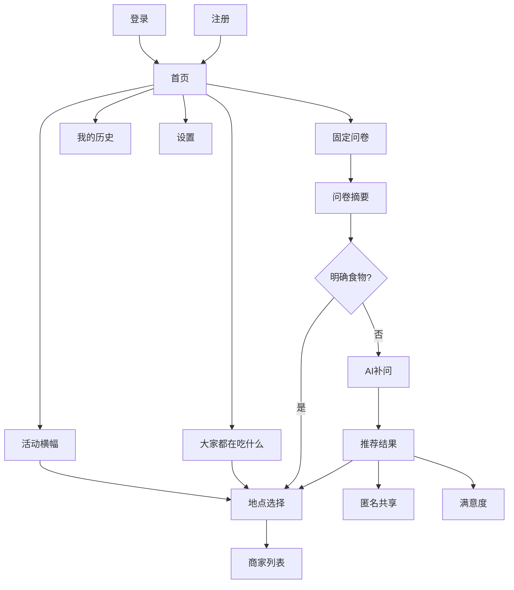

# EatWhat 文字版低保真原型与页面交互说明

> ⚠️ **历史版本提示（2026-07-23）**：本文已由 `04_EatWhat_响应式交互原型说明_v1.1.md` 与仓库内可运行原型替代，仅保留用于追溯。旧版 ASCII 布局和旧业务参数不再作为实现依据。

> 文档状态：第二阶段正式交付物  
> 依据文档：`01_EatWhat_PRD_产品需求文档_v1.1_需求冻结版.md`、`02_EatWhat_用户流程.md`、`03_EatWhat_信息架构与页面清单.md`  
> 产品版本：v1.0 MVP  
> 文档日期：2026-07-21  
> 原型形式：ASCII 文字线框 + 页面内容说明 + 交互状态说明

---

# 1. 文档目的

本文件不负责正式配色、字体、插图和动画，而是冻结：

- 页面中必须出现的内容；
- 信息优先级；
- 电脑端和手机端布局；
- 主要按钮和跳转；
- 加载、空数据、错误和降级状态；
- 后续前端页面需要的数据。

它可以直接作为 Figma 视觉稿、React 页面开发、API 设计和测试用例的输入。

---

# 2. 全局布局原则

## 2.1 响应式网页

EatWhat 只维护一套页面和业务代码：

```text
手机：单列、底部导航、一次突出一个任务
电脑：多列、顶部导航、可同时展示更多摘要
```

建议断点：

- 手机：小于 768px；
- 平板：768px–1023px；
- 电脑：1024px 及以上。

## 2.2 页面优先级

首页内容优先级：

1. 开始我的推荐；
2. 今日活动；
3. 今天大家都在吃什么；
4. 我的历史与设置。

## 2.3 公共数据冷启动

- 真实数据优先；
- 真实记录达到 3 条后才显示人数；
- 数据不足时使用默认热门项补足；
- 默认热门项不显示“演示数据”等标签；
- 默认热门项不显示虚构人数。

---

# 3. 登录页

## 3.1 电脑端

```text
┌──────────────────────────────────────────────────────┐
│ EatWhat                                              │
├────────────────────────┬─────────────────────────────┤
│ 今天吃什么？           │ 登录 EatWhat                │
│ 是啊，吃什么。         │                             │
│                        │ 邮箱 [__________________]    │
│ 用几个简单问题，       │ 密码 [__________________]    │
│ 帮你快速做决定。       │                             │
│                        │ [        登录        ]       │
│                        │ [ 使用演示账户体验 ]         │
│                        │ 没有账号？立即注册            │
│                        │ 隐私说明 · 免责声明           │
└────────────────────────┴─────────────────────────────┘
```

## 3.2 手机端

```text
┌────────────────────────┐
│        EatWhat         │
│ 今天吃什么？           │
│ 是啊，吃什么。         │
│                        │
│ 邮箱 [______________]  │
│ 密码 [______________]  │
│                        │
│ [      登录      ]     │
│ [ 使用演示账户 ]       │
│                        │
│ 没有账号？立即注册     │
│ 隐私说明 · 免责声明    │
└────────────────────────┘
```

## 3.3 状态

- 登录中：按钮显示“登录中……”并防止重复点击；
- 错误密码：保留邮箱，显示明确错误；
- 网络失败：保留输入，允许重试；
- 演示账户：登录前提示其为公共账户，历史会定期清理。

---

# 4. 注册页

## 4.1 电脑端

```text
┌──────────────────────────────────────────────────────┐
│ EatWhat                                              │
├────────────────────────┬─────────────────────────────┤
│ 每天 3 次智能推荐机会  │ 创建账号                    │
│                        │ 邮箱 [__________________]    │
│                        │ 密码 [__________________]    │
│                        │ 确认 [__________________]    │
│                        │ □ 同意隐私说明和协议         │
│                        │ [        注册        ]       │
│                        │ 已有账号？返回登录           │
└────────────────────────┴─────────────────────────────┘
```

## 4.2 手机端

表单单列排列，主按钮占满可用宽度。

## 4.3 交互

- 注册成功后自动登录并进入首页；
- 邮箱重复时提示前往登录；
- 密码不一致时就地提示；
- 未同意协议时不能注册；
- v1.1 的邮箱验证、找回密码暂不显示为可用按钮。

---

# 5. 首页

## 5.1 电脑端

```text
┌────────────────────────────────────────────────────────────┐
│ EatWhat   首页   我的历史        今日剩余3次   用户菜单     │
├────────────────────────────────────────────────────────────┤
│ [ 周四 · 肯德基疯狂星期四 · 查看附近门店              > ] │
│ 活动内容及参与门店以品牌和门店实际情况为准                │
├───────────────────────────┬────────────────────────────────┤
│ 今天午餐大家都在吃什么    │ 今天吃什么？                   │
│                           │ 是啊，吃什么。                 │
│ 麻辣烫              8人  │                                │
│ 汉堡                      │ 当前准备：午餐 [修改]          │
│ 小碗菜                    │                                │
│ 黄焖鸡                    │ [      开始我的推荐      ]     │
│ 烧烤                      │                                │
│ [查看更多]                │ 你今天还有 3 次智能推荐机会    │
└───────────────────────────┴────────────────────────────────┘
```

## 5.2 手机端

```text
┌────────────────────────┐
│ EatWhat   剩余3次 头像 │
├────────────────────────┤
│ [ 今日活动横幅      > ]│
│ 活动以门店实际为准     │
├────────────────────────┤
│ 今天吃什么？           │
│ 是啊，吃什么。         │
│ 当前：午餐 [修改]      │
│ [  开始我的推荐  ]     │
├────────────────────────┤
│ 今天午餐大家都在吃什么 │
│ 麻辣烫            8人  │
│ 汉堡                   │
│ 小碗菜                 │
│ [查看更多]             │
├────────────────────────┤
│ 首页  推荐  历史  我的 │
└────────────────────────┘
```

## 5.3 公共食物卡片

真实数据：

```text
麻辣烫
今天午餐有 8 人选择
```

默认热门项：

```text
汉堡
今天来点轻松快捷的？
```

外观保持一致，但默认项不显示人数。

## 5.4 首页异常状态

- 活动加载失败：隐藏横幅；
- 公共接口失败：展示默认热门项；
- 额度读取失败：显示“暂时无法读取”，提交时由后端重新校验；
- AI 额度用完：主入口仍可进入自主选择流程。

---

# 6. 固定问卷页

## 6.1 电脑端

```text
┌────────────────────────────────────────────────────────────┐
│ EatWhat                         问卷进度：3 / 7   退出问卷 │
├──────────────┬─────────────────────────────────────────────┤
│ 1 用餐时间   │ 今天想吃什么口味？                          │
│ 2 胃口       │                                             │
│ 3 忌口       │ [酸] [甜] [辣] [咸香]                      │
│ 4 口味 ●     │ [清淡] [大众稳妥] [都可以]                 │
│ 5 预算       │                                             │
│ 6 距离       │ [上一步]                       [下一步]     │
│ 7 食物类型   │                                             │
└──────────────┴─────────────────────────────────────────────┘
```

## 6.2 手机端

```text
┌────────────────────────┐
│ ← 返回        3 / 7    │
├────────────────────────┤
│ 今天想吃什么口味？     │
│                        │
│ [酸]                   │
│ [甜]                   │
│ [辣]                   │
│ [咸香]                 │
│ [清淡]                 │
│ [大众稳妥]             │
│ [都可以]               │
│                        │
│ [上一步] [下一步]      │
└────────────────────────┘
```

## 6.3 问题顺序

1. 用餐时间段；
2. 胃口；
3. 忌口；
4. 口味；
5. 预算；
6. 距离；
7. 系统生成的食物候选。

## 6.4 食物候选题

```text
下面有你今天想吃的吗？

[麻辣烫] [小碗菜]
[黄焖鸡] [盖浇饭]
[汉堡]   [面]
[都没有]
```

用户选择明确类型后：

```text
你选择了：麻辣烫

本次将直接查找附近商家，
不会消耗 AI 推荐次数。

[确认并继续]
[返回修改]
```

---

# 7. 问卷摘要页

```text
确认一下你的选择

用餐时间：午餐          [修改]
胃口：正常              [修改]
忌口：海鲜、油腻        [修改]
口味：辣、咸香          [修改]
预算：20–40元           [修改]
距离：2公里             [修改]
明确食物：没有          [修改]

今日剩余 AI 推荐：3 次

[提交并继续]
```

用途：

- 让用户确认最终输入；
- 明确是否即将调用 AI；
- 集中提供修改入口；
- 防止因为误选浪费次数。

---

# 8. AI 补充问题页

## 8.1 加载

```text
正在根据你的选择准备最后几个问题……
```

## 8.2 正常状态

```text
再确认一点

1. 今天更想吃哪种形式？
○ 汤汤水水
○ 干饭正餐
○ 小吃快餐
○ 都可以

2. 今天更想要哪种感觉？
○ 熟悉稳妥
○ 尝试新口味
○ 热乎满足
○ 清爽简单

[提交并生成推荐]
```

## 8.3 降级

```text
智能问题暂时不可用。

我们将根据基础答案继续推荐，
本次不会消耗 AI 次数。

[继续基础推荐]
```

---

# 9. 推荐结果页

## 9.1 默认状态

```text
┌──────────────────────────────────────────────┐
│ 推荐完成                         剩余2次     │
├──────────────────────────────────────────────┤
│                 首选推荐                     │
│                                              │
│                   麻辣烫                     │
│                                              │
│ 符合你想吃辣、预算适中、想吃热食的偏好。   │
│                                              │
│ [        查看附近麻辣烫        ]            │
│                                              │
│ [我想要更多推荐]  [返回修改问卷]            │
└──────────────────────────────────────────────┘
```

## 9.2 展开更多推荐

```text
首选：麻辣烫
[查看附近商家]

备选一：黄焖鸡
稳妥正餐，符合预算。
[查看附近商家]

备选二：小碗菜
选择灵活，方便避开忌口。
[查看附近商家]
```

## 9.3 降级推荐

```text
当前使用基础推荐模式

推荐：小碗菜

智能服务暂时不可用，
本次不会扣除 AI 推荐次数。
```

## 9.4 交互原则

- 展开备选不再次调用 AI；
- 刷新页面不重复扣次数；
- 返回商家页后保留推荐结果；
- 只在用户点击某种食物后查询该类型商家。

---

# 10. 地点选择页

## 10.1 电脑端

```text
┌────────────────────────────────────────────────────────────┐
│ ← 返回推荐结果                    选择查找商家的地点       │
├────────────────────────────────────────────────────────────┤
│ 当前地点：光谷广场附近       [继续使用] [重新选择]        │
├──────────────────┬──────────────────┬──────────────────────┤
│ 使用当前位置     │ 手动搜索地点     │ 使用演示地点         │
│                  │                  │                      │
│ [获取当前位置]   │ [输入地点____]   │ [光谷广场]           │
│                  │ [搜索]           │ [江汉路]             │
│                  │                  │ [楚河汉街]           │
└──────────────────┴──────────────────┴──────────────────────┘
```

## 10.2 手机端

三个方式纵向排列。

## 10.3 定位被拒绝

```text
无法获取当前位置

你可以：
[手动搜索地点]
[选择演示地点]
[暂时只查看食物推荐]
```

## 10.4 手动搜索结果

```text
搜索“武汉工程大学”

○ 武汉工程大学流芳校区
  武汉市江夏区

○ 武汉工程大学武昌校区
  武汉市洪山区
```

---

# 11. 附近商家列表

## 11.1 页面结构

```text
← 返回推荐     麻辣烫 · 光谷广场附近
搜索范围：2公里 [修改地点] [修改距离]

1. 张亮麻辣烫
   麻辣烫 / 快餐
   距离 420 米
   珞喻路示例地址
   [在地图中打开]

2. 杨国福麻辣烫
   距离 680 米
   [在地图中打开]

3. ……

[查看更多]

商家信息来自地图开放平台，实际情况可能变化。
```

## 11.2 手机端

单列商家卡片，每张卡片包含：

- 名称；
- 类型；
- 距离；
- 地址；
- 地图按钮。

## 11.3 无结果

```text
附近暂时没有找到“麻辣烫”

[扩大到3公里]
[重新选择地点]
[查看其他推荐]
```

## 11.4 地图服务失败

```text
附近商家暂时无法加载

你的食物推荐仍然保留：麻辣烫

[重试]
[使用演示商家]
[返回推荐结果]
```

---

# 12. “今天大家都在吃什么”完整页

```text
今天大家都在吃什么
当前：午餐 [修改]

麻辣烫      今天8人选择       [看看附近]
汉堡        快捷方便           [看看附近]
小碗菜      清淡灵活           [看看附近]
黄焖鸡      稳妥正餐           [看看附近]
烧烤        适合多人           [看看附近]
……
```

规则：

- 有真实人数时显示；
- 默认热门项显示自然文案；
- 不标记“假设数据”；
- 不虚构人数；
- 点击后进入地点选择，不调用 AI。

---

# 13. 我的推荐历史

## 13.1 电脑端

```text
我的推荐历史                              [清空全部]

筛选：[全部] [AI推荐] [自主选择] [活动] [公共选择]

2026-07-21 · 午餐
麻辣烫
来源：AI推荐   已共享   有帮助
[查看详情] [删除]

2026-07-20 · 晚餐
汉堡
来源：活动
[查看详情] [删除]
```

## 13.2 手机端

使用单列卡片，不使用宽表格。

## 13.3 空状态

```text
还没有推荐记录

你的第一次选择会显示在这里。

[开始我的推荐]
```

## 13.4 删除确认

```text
确定删除这条记录吗？

删除后无法恢复。
已匿名共享的统计数据不会重新关联到你。

[取消] [确认删除]
```

---

# 14. 历史详情页

```text
2026-07-21 · 午餐

最终选择：麻辣烫
来源：AI推荐

你的回答
胃口：正常
忌口：海鲜
口味：辣
预算：20–40元
距离：2公里

推荐结果
1. 麻辣烫
2. 黄焖鸡
3. 小碗菜

查看过的商家
张亮麻辣烫
杨国福麻辣烫

满意度：有帮助
匿名共享：是

[再次查看附近麻辣烫]
[删除记录]
```

再次查看时重新确认当前地点，不复用旧精确坐标。

---

# 15. 个人设置页

```text
账户信息
邮箱：demo@eatwhat.example
今日剩余：3次

数据管理
[清空我的推荐历史]

说明
[隐私说明]
[免责声明]
[关于 EatWhat]

账户
[退出登录]

后续版本
邮箱验证、密码找回和账户注销将在 v1.1 提供。
```

v1.1 功能只作为说明，不放置无效按钮。

---

# 16. 免责声明页

内容分区：

1. 食物推荐；
2. 忌口与过敏；
3. 商家信息；
4. 品牌活动；
5. AI 推荐；
6. 位置数据。

重点文案：

> EatWhat 的忌口选项仅用于日常选择，不构成医疗或过敏安全建议。存在过敏或疾病饮食限制的用户，应自行向商家确认配料和加工环境。

该页面可从注册、问卷、活动、商家和设置页进入。

---

# 17. 匿名共享模块

```text
愿意匿名分享这次选择吗？

会分享：
午餐、武汉市洪山区、问卷选项、最终食物类型

不会分享：
邮箱、精确位置、具体门店、完整AI对话

[不用了] [匿名分享]
```

分享失败不影响推荐结果。

---

# 18. 满意度模块

```text
这次推荐有帮助吗？

[👍 有帮助] [👎 没帮助]

[填写更多建议]
```

详细反馈：

- 推荐是否符合胃口；
- 是否解决选择困难；
- 附近是否有合适商家；
- 改进建议。

不强制，不使用打断式弹窗。

---

# 19. 关键状态

## 19.1 每日额度用完

```text
今天的 3 次 AI 推荐已用完

明天北京时间 00:00 恢复。

你仍然可以：
[直接选择食物]
[看看今天大家吃什么]
[查看今日活动]
```

## 19.2 AI 服务不可用

```text
智能推荐暂时不可用

我们可以根据基础答案提供规则推荐，
本次不会消耗 AI 次数。

[继续基础推荐]
[稍后重试]
```

## 19.3 公共数据为空

直接使用默认热门项，不显示空白页面，也不显示“暂无真实数据”。

## 19.4 网络中断

```text
网络连接已断开

你的问卷答案已暂时保留。

[重试连接]
```

## 19.5 未完成问卷恢复

```text
发现一份未完成的问卷

[继续填写]
[重新开始]
```

## 19.6 Live 模式关闭

可以显示全局提示：

> 当前使用演示模式体验核心流程。

该提示针对整个系统模式，不需要在每个默认热门卡片上重复标注。

---

# 20. 导航设计

## 20.1 手机端底部导航

```text
首页
推荐
历史
我的
```

问卷和 AI 生成过程中可以隐藏底部导航，避免误触。

## 20.2 电脑端顶部导航

```text
EatWhat
首页
我的历史
免责声明
今日剩余次数
用户菜单
```

---

# 21. 页面跳转总览



---

# 22. 本阶段确认结论

文字版原型已经确定：

- 登录和注册页面结构；
- 首页电脑端与手机端布局；
- 活动、公共数据和开始推荐的优先级；
- 固定问卷每页的基本结构；
- AI 补问和推荐结果的层级；
- 三种地点选择方式；
- 商家列表字段；
- 历史、共享、反馈和免责声明的位置；
- 关键异常与降级状态；
- 手机端底部导航和电脑端顶部导航。

后续允许在视觉设计或开发阶段调整：

- 配色；
- 字体；
- Logo；
- 插图；
- 图标；
- 圆角；
- 阴影；
- 动画；
- 精确尺寸；
- 活动图片。

这些调整不得改变已冻结的业务流程和信息优先级。

---

# 23. 下一阶段

第二阶段完成后，进入：

```text
阶段三：系统与技术设计
```

优先交付：

1. `05_EatWhat_系统架构设计.md`
2. `06_EatWhat_数据库设计.md`

随后交付：

3. `07_EatWhat_API接口设计.md`
4. `08_EatWhat_AI推荐系统设计.md`
5. `09_EatWhat_隐私安全与免责声明.md`
