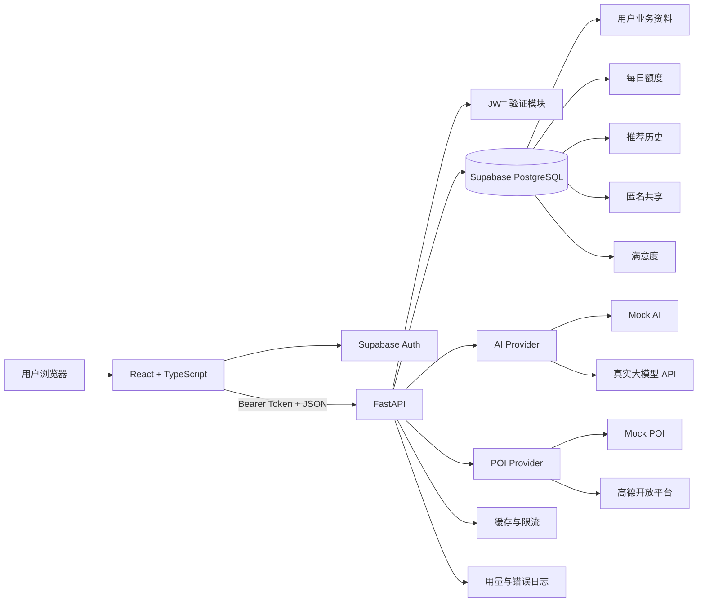
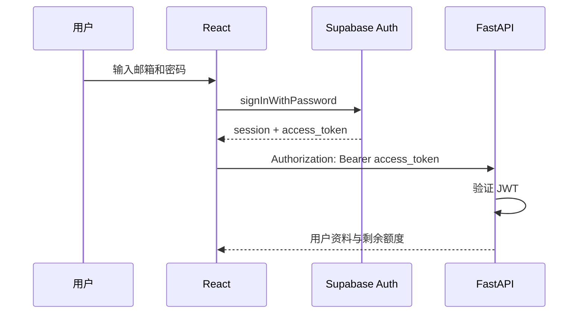
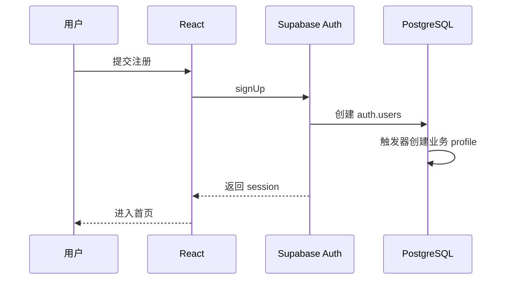
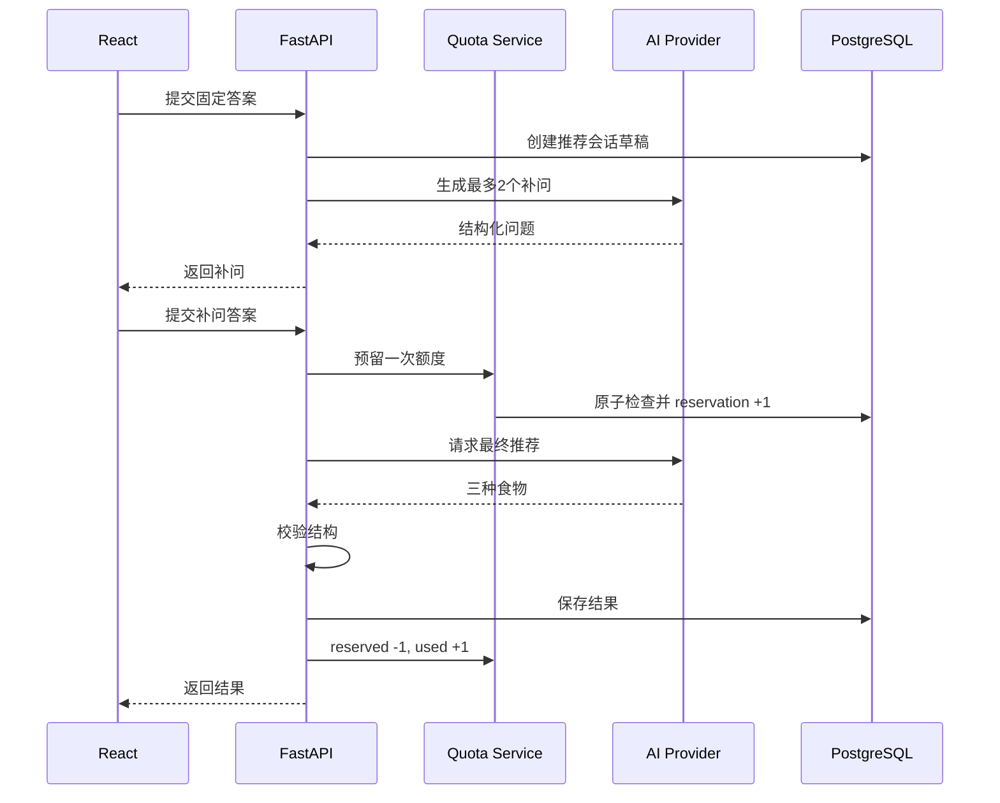
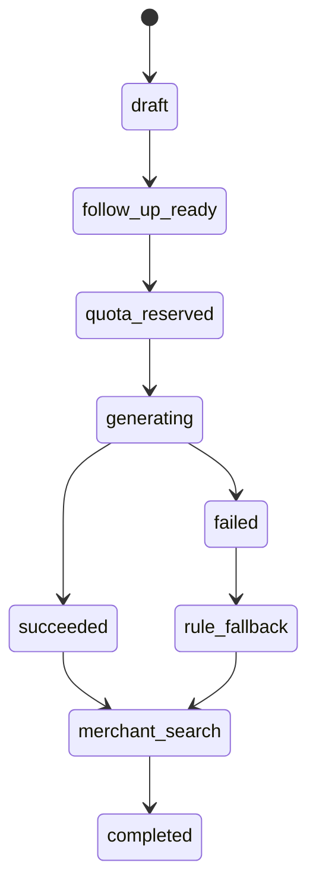
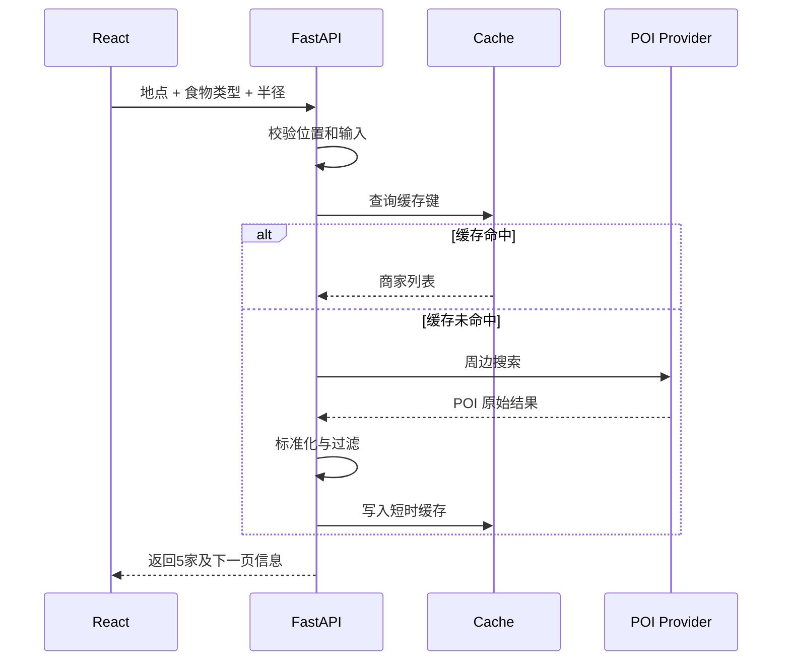
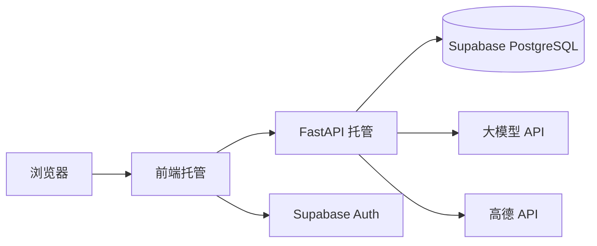

# EatWhat 系统架构设计

> 2026-07-27 预算勘误：预算档位、食物预算匹配和商家价格兑现边界，以《16_EatWhat_预算档位与商家价格契约_v1.0》为准；本文中的旧预算示例不再作为实现依据。  
> 2026-08-03 P0-07 勘误：本文与 PRD v1.2/名词表/专项契约冲突处以《22_EatWhat_P0-07_技术文档收敛清单_v1.0》为准（候选数、逐题追问、状态机、匿名共享、阈值等）。  
>
> 文档状态：第三阶段正式交付物  
> 依据文档：PRD v1.1 需求冻结版、用户流程、信息架构、文字版低保真原型  
> 产品版本：v1.0 MVP  
> 文档日期：2026-07-21  
> 架构类型：前后端分离的模块化单体

---

# 1. 文档目的

本文档定义 EatWhat v1.0 的整体技术结构，包括：

- React 前端；
- FastAPI 后端；
- Supabase Auth；
- Supabase PostgreSQL；
- AI Provider；
- POI Provider；
- Mock/Live 双模式；
- 每日额度；
- 缓存、限流、日志和降级；
- 本地开发与云端部署；
- v1.1 账户功能预留。

本文档重点回答：

1. 每个系统组件负责什么；
2. 用户登录后请求如何流动；
3. 后端如何验证 Supabase Token；
4. AI 和地图服务如何接入；
5. 为什么浏览器不直接访问业务数据库；
6. 每日三次额度如何避免重复扣除；
7. 第三方服务失败时如何继续运行；
8. 后续代码目录如何组织。

---

# 2. 架构结论

EatWhat v1.0 采用：

```text
React + TypeScript + Vite
            ↓ HTTPS / JSON
Python + FastAPI 模块化单体
            ↓
Supabase PostgreSQL
            ↓
AI Provider / POI Provider
```

认证独立交给：

```text
Supabase Auth
```

完整分工：

| 组件 | 核心职责 |
|---|---|
| React 前端 | 页面、问卷、会话展示、定位权限、调用后端 |
| Supabase Auth | 注册、登录、退出、会话和用户 JWT |
| FastAPI | 业务规则、权限、额度、推荐、历史、共享、反馈 |
| PostgreSQL | 用户业务数据、额度、推荐历史、日志 |
| AI Provider | AI 补问和食物类型推荐 |
| POI Provider | 地点搜索、反向地理编码、附近商家 |
| Mock Provider | 无 Key 或服务失败时提供可演示结果 |

---

# 3. 为什么采用模块化单体

## 3.1 定义

模块化单体表示：

- 整个后端是一个 FastAPI 应用；
- 业务按模块拆分；
- 统一部署；
- 使用同一个数据库；
- 不拆分成多个微服务。

## 3.2 适合本项目的原因

EatWhat 当前是：

- 首个完整全栈项目；
- 小流量 GitHub 演示；
- 功能模块相互关联；
- 开发者人数少；
- 不需要独立扩缩容多个服务。

如果一开始使用微服务，会额外增加：

- 多服务部署；
- 服务发现；
- 分布式日志；
- 分布式事务；
- 网络故障；
- 多仓库或复杂目录；
- 更高学习成本。

因此 v1.0 使用模块化单体最合理。

## 3.3 后续扩展

未来确有规模需求时，可优先拆分：

1. AI 调用服务；
2. POI 查询服务；
3. 数据统计任务；
4. 邮件和短信任务。

v1.0 不提前拆分。

---

# 4. 总体架构图



---

# 5. 系统边界

## 5.1 EatWhat 自己控制

- 前端代码；
- FastAPI 代码；
- 数据库结构；
- Prompt；
- Mock 数据；
- 食物分类；
- 规则推荐；
- 活动配置；
- 默认热门项；
- 限流与额度；
- 日志；
- 页面提示。

## 5.2 第三方负责

### Supabase

- 邮箱密码认证；
- 会话；
- JWT；
- PostgreSQL 托管。

### 大模型提供商

- 根据结构化输入生成补问；
- 推荐三个食物类型。

### 高德开放平台

- 地点搜索；
- 经纬度对应地点摘要；
- 周边餐饮 POI。

## 5.3 不依赖的内容

- 美团私有 API；
- 商家真实评论；
- 实时排队；
- 实时活动确认；
- 导航服务；
- 支付系统。

---

# 6. 前端架构

## 6.1 技术方向

```text
React
TypeScript
Vite
React Router
请求客户端
Supabase JavaScript Client
```

具体 UI 组件库在开发计划阶段决定。

## 6.2 前端职责

前端负责：

- 注册和登录表单；
- 保存 Supabase 会话；
- 将访问令牌发送给 FastAPI；
- 页面路由；
- 问卷状态；
- 调用浏览器定位；
- 地点选择；
- 展示推荐；
- 展示商家；
- 历史和设置；
- 加载和错误反馈。

前端不负责：

- 保存数据库密码；
- 保存 AI Key；
- 保存高德服务端 Key；
- 判断每日额度是否真的可用；
- 直接扣除额度；
- 自己信任 Token 中未经验证的用户信息；
- 直接访问高权限数据库。

## 6.3 前端模块建议

```text
frontend/src/
├── app/
│   ├── router/
│   ├── providers/
│   └── guards/
├── pages/
│   ├── auth/
│   ├── home/
│   ├── questionnaire/
│   ├── recommendation/
│   ├── location/
│   ├── restaurants/
│   ├── community/
│   ├── history/
│   └── settings/
├── components/
│   ├── layout/
│   ├── questionnaire/
│   ├── recommendation/
│   ├── restaurant/
│   ├── feedback/
│   └── common/
├── services/
│   ├── api/
│   ├── auth/
│   └── location/
├── stores/
│   ├── auth/
│   ├── questionnaire/
│   └── location/
├── types/
├── utils/
└── mocks/
```

## 6.4 前端状态分类

### 服务器状态

来自后端：

- 剩余额度；
- 活动；
- 推荐记录；
- 公共数据；
- 商家结果；
- 用户历史。

### 页面临时状态

仅当前会话使用：

- 未完成问卷；
- 当前页面步骤；
- 是否展开更多推荐；
- 当前选择的地点；
- 当前商家查询条件。

### 不应持久化的状态

- 精确经纬度；
- API Key；
- 服务端数据库凭据；
- 完整内部 Prompt。

---

# 7. Supabase Auth 架构

## 7.1 v1.0 认证方式

```text
邮箱 + 密码
```

v1.0 关闭强制邮箱确认，以便注册成功后直接获得会话。

v1.1 再启用：

- 邮箱验证；
- 忘记密码；
- 重置密码；
- 注销账户。

## 7.2 登录流程



## 7.3 注册流程



## 7.4 FastAPI 验证 Token

每个受保护请求：

```text
Authorization: Bearer <Supabase access token>
```

FastAPI 必须：

1. 读取 Bearer Token；
2. 验证签名；
3. 验证过期时间；
4. 验证签发方和项目；
5. 提取 `sub` 作为 Supabase `user_id`；
6. 将用户上下文注入业务服务。

不能只做：

```text
Base64 解码 Token
→ 直接相信其中 user_id
```

## 7.5 用户 ID 规则

所有业务数据统一使用：

```text
auth.users.id
```

作为用户主标识。

不能使用邮箱作为业务主键，因为邮箱未来可能：

- 验证；
- 修改；
- 重置；
- 被账户注销流程处理。

---

# 8. 前端与后端的认证边界

## 8.1 前端可持有

- Supabase 项目公开配置；
- 用户 Access Token；
- Refresh Token；
- 当前登录会话。

## 8.2 前端不可持有

- Supabase Secret/Service Role Key；
- PostgreSQL 连接串；
- AI API Key；
- 高德服务端 Key；
- JWT 签名私钥；
- 后端管理凭据。

## 8.3 业务请求

前端请求示例：

```http
POST /api/v1/recommendations
Authorization: Bearer <access_token>
Content-Type: application/json
```

FastAPI 以 Token 中的用户身份为准，不接受前端自行提交的 `user_id` 作为权限依据。

---

# 9. 后端架构

## 9.1 后端职责

FastAPI 负责：

- Token 验证；
- 用户资料；
- 每日额度；
- 固定问卷配置；
- 规则推荐；
- AI 补问；
- AI 最终推荐；
- 地点和 POI；
- 历史；
- 公共共享；
- 满意度；
- 活动与默认热门项；
- 限流；
- 缓存；
- 日志；
- 异常降级。

## 9.2 后端目录建议

```text
backend/
├── app/
│   ├── main.py
│   ├── api/
│   │   └── v1/
│   │       ├── auth_context.py
│   │       ├── users.py
│   │       ├── questionnaire.py
│   │       ├── recommendations.py
│   │       ├── locations.py
│   │       ├── restaurants.py
│   │       ├── community.py
│   │       ├── history.py
│   │       ├── feedback.py
│   │       └── system.py
│   ├── core/
│   │   ├── config.py
│   │   ├── security.py
│   │   ├── logging.py
│   │   └── exceptions.py
│   ├── schemas/
│   ├── models/
│   ├── repositories/
│   ├── services/
│   │   ├── auth/
│   │   ├── quota/
│   │   ├── questionnaire/
│   │   ├── recommendation/
│   │   ├── ai/
│   │   ├── poi/
│   │   ├── community/
│   │   ├── history/
│   │   └── feedback/
│   ├── providers/
│   │   ├── ai/
│   │   └── poi/
│   ├── data/
│   │   ├── activities.json
│   │   ├── default_foods.json
│   │   └── demo_locations.json
│   └── db/
│       ├── session.py
│       └── migrations/
└── tests/
```

## 9.3 分层职责

### API 层

- 接收 HTTP；
- 校验输入；
- 调用服务；
- 返回统一响应；
- 不写复杂业务逻辑。

### Service 层

- 执行业务规则；
- 决定是否调用 AI；
- 决定是否扣额度；
- 决定是否降级；
- 组合多个 Repository 和 Provider。

### Repository 层

- 只负责数据库读写；
- 不调用第三方 API；
- 不决定业务流程。

### Provider 层

- 隔离具体 AI 和地图服务；
- 将外部格式转换成内部格式。

---

# 10. 数据库访问架构

## 10.1 推荐方式

浏览器只使用 Supabase Auth。

业务表统一由 FastAPI 访问：

```text
浏览器
→ FastAPI
→ PostgreSQL
```

不采用：

```text
浏览器
→ 直接读写业务表
```

## 10.2 原因

- 每日额度必须由后端控制；
- 共享数据需要过滤；
- 推荐历史需要权限检查；
- AI 和地图调用要记录用量；
- 业务逻辑集中更容易测试；
- 避免前端绕过规则直接写数据库。

## 10.3 连接方式

FastAPI 使用服务端环境变量中的 PostgreSQL 连接串。

根据部署方式选择：

- 长期运行容器：Session Pooler 或合适的持久连接；
- Serverless/短连接：Transaction Pooler；
- 数据库迁移：Direct Connection 或官方推荐连接。

连接串绝不能进入前端或 GitHub。

## 10.4 数据库安全

即使业务只经过 FastAPI，也建议：

- 业务表启用 RLS 或限制 Data API 权限；
- 匿名角色默认无业务表权限；
- 前端不使用高权限 Key；
- 数据库用户采用最小权限；
- 高权限凭据仅存在服务端；
- 删除和管理操作由后端统一检查。

---

# 11. Provider 架构

## 11.1 AI Provider

统一接口示意：

```python
class AIProvider:
    async def generate_follow_up_questions(...):
        ...

    async def generate_food_recommendations(...):
        ...
```

实现：

```text
MockAIProvider
LiveAIProvider
```

后续可扩展：

```text
DeepSeekProvider
GeminiProvider
OpenAIProvider
```

业务层不直接依赖某一家模型。

## 11.2 POI Provider

统一接口：

```python
class POIProvider:
    async def search_location(...):
        ...

    async def reverse_geocode(...):
        ...

    async def search_nearby_restaurants(...):
        ...
```

实现：

```text
MockPOIProvider
AmapPOIProvider
```

## 11.3 Provider 返回内部模型

第三方响应必须先转换成项目内部结构。

例如商家统一为：

```json
{
  "provider": "amap",
  "poi_id": "B000...",
  "name": "示例餐厅",
  "category": ["麻辣烫"],
  "distance_m": 420,
  "address": "示例地址"
}
```

前端不需要理解高德原始字段。

---

# 12. Mock/Live 双模式

## 12.1 模式配置

```env
APP_MODE=mock
AI_PROVIDER=mock
POI_PROVIDER=mock
```

或：

```env
APP_MODE=live
AI_PROVIDER=deepseek
POI_PROVIDER=amap
```

## 12.2 Mock 模式

提供：

- 固定用户流程；
- Mock 补问；
- Mock 推荐；
- Mock 地点；
- Mock 商家；
- 默认活动；
- 默认公共热门项。

## 12.3 Live 模式

使用：

- Supabase Auth；
- PostgreSQL；
- 真实 AI；
- 高德；
- 浏览器定位。

## 12.4 混合模式

允许：

```text
真实 Auth + 真实数据库
Mock AI
真实 POI
```

或：

```text
真实 Auth + 真实数据库
真实 AI
Mock POI
```

便于单独调试和控制成本。

---

# 13. 固定问卷与规则引擎

## 13.1 固定问卷来源

基础问题不需要每次从 AI 生成。

建议保存在：

- 后端配置；
- 或版本化 JSON；
- 后续也可放数据库配置表。

v1.0 优先使用版本化配置，便于 GitHub 查看和测试。

## 13.2 规则引擎职责

根据：

- 胃口；
- 忌口；
- 口味；
- 预算；
- 用餐时段；

筛选出 6–10 个食物候选。

用户选中后直接进入商家流程。

## 13.3 AI 触发条件

只有用户选择：

```text
都没有 / 仍不确定
```

才进入 AI 流程。

---

# 14. AI 调用数据流



---

# 15. 每日额度架构

## 15.1 为什么不能只在前端计数

前端计数容易被：

- 修改 LocalStorage；
- 清除缓存；
- 修改请求；
- 多设备绕过。

因此额度必须由数据库决定。

## 15.2 日期规则

额度按：

```text
Asia/Shanghai
```

自然日计算。

不需要每天创建定时任务重置所有用户。

只需要查询或创建：

```text
user_id + usage_date
```

对应记录。

新的一天自然形成新记录。

## 15.3 并发问题

如果用户同时提交多个请求，只在 AI 成功后简单 `used_count + 1`，可能出现三个以上并发请求都通过检查。

因此采用：

```text
used_count
reserved_count
```

## 15.4 额度预留

开始最终 AI 推荐前：

```text
used_count + reserved_count < 3
```

满足后：

```text
reserved_count + 1
```

AI 成功：

```text
reserved_count - 1
used_count + 1
```

AI 失败：

```text
reserved_count - 1
used_count 不变
```

## 15.5 幂等性

每次最终推荐请求携带：

```text
idempotency_key
```

同一个 Key：

- 只创建一个请求；
- 只预留一次；
- 只扣除一次；
- 刷新和网络重试不重复扣费。

## 15.6 过期预留

若服务异常退出，可能留下 `reserved_count`。

处理方式：

- 推荐请求记录 `reserved_at`；
- 定期或请求时清理超时预留；
- 例如超过 5 分钟且仍为处理中，标记失败并释放。

---

# 16. 推荐会话状态机



建议状态：

```text
draft
follow_up_ready
quota_reserved
generating
succeeded
failed
rule_fallback
completed
cancelled
```

状态变更由后端负责，前端不能直接指定“成功”。

---

# 17. POI 查询数据流



## 17.1 一次查询原则

一次用户选择只查询：

```text
一个食物类型 + 一个位置 + 一个半径
```

不一次查询 AI 的三个推荐。

## 17.2 缓存键

建议：

```text
位置网格 + 食物类别 + 半径 + 页码
```

不直接用完整精确坐标作为日志文本。

## 17.3 缓存时间

建议初始：

```text
15–30 分钟
```

具体在开发测试后调整。

## 17.4 v1.0 缓存实现

第一版可使用：

- 进程内 TTL 缓存。

限制：

- 服务重启后清空；
- 多实例不共享。

后续可升级 Redis。

---

# 18. 活动与默认热门项

## 18.1 v1.0 存储方式

人工配置文件：

```text
backend/app/data/activities.json
backend/app/data/default_foods.json
```

## 18.2 原因

- 无管理后台；
- 改动频率低；
- 可以版本管理；
- 易于 Mock；
- 易于审核。

## 18.3 活动点击

活动配置只负责：

- 标题；
- 品牌；
- 星期；
- 搜索关键词；
- 图片；
- 是否启用。

点击后仍通过 POI Provider 搜索附近品牌门店。

---

# 19. 公共选择架构

## 19.1 数据来源

```text
用户完成选择
→ 主动同意匿名共享
→ 后端保存结构化共享记录
```

## 19.2 首页接口只返回聚合结果

前端不能读取单条共享记录。

后端负责：

- 按日期；
- 用餐时段；
- 星期；
- 食物类型；
- 城市/区域；

进行聚合。

## 19.3 阈值

```text
count >= 3
```

才返回人数。

## 19.4 冷启动

真实结果不足时，后端将：

```text
真实聚合
+ 同星期参考
+ 默认热门配置
```

组装成统一卡片结构。

默认热门项不携带虚构人数。

---

# 20. 推荐历史架构

## 20.1 个人历史必须按用户隔离

所有查询都需要：

```text
WHERE user_id = 当前验证用户
```

用户不能通过修改 URL 查看其他人的记录。

## 20.2 历史保存快照

保存：

- 当时问卷；
- 当时推荐；
- 当时查看过的商家；
- 当时满意度。

商家数据使用快照，避免以后第三方数据变化导致旧记录无法理解。

## 20.3 不保存精确坐标

历史记录可以保存：

- 城市；
- 区域；
- 地点显示名。

不保存：

- 精确纬度；
- 精确经度。

---

# 21. 限流设计

## 21.1 业务额度

- 每用户每天 3 次成功 AI 推荐。

## 21.2 API 限流

建议：

```text
单用户每分钟请求上限
单 IP 每小时上限
全站每日 AI 上限
全站每日 POI 上限
```

## 21.3 v1.0 实现

- 用户日额度：PostgreSQL 强制；
- 简单短时请求限流：后端内存；
- 全局硬开关：环境变量；
- 第三方用量：数据库日志和提供商后台双重观察。

## 21.4 后续

多实例部署时升级为 Redis 或统一限流服务。

---

# 22. 日志与可观测性

## 22.1 应记录

- 请求 ID；
- 用户 ID 的内部标识；
- API 路径；
- 响应状态；
- 耗时；
- AI Provider；
- Token 数量；
- POI Provider；
- 是否缓存；
- 错误码；
- 是否降级。

## 22.2 不记录

- 密码；
- Access Token；
- Refresh Token；
- API Key；
- 完整精确坐标；
- 完整用户 Prompt；
- 完整邮箱日志；
- 第三方 Secret。

## 22.3 关联 ID

建议每次请求拥有：

```text
request_id
```

每次智能推荐拥有：

```text
recommendation_id
idempotency_key
```

方便排查重复扣次和第三方调用。

---

# 23. 错误处理架构

## 23.1 统一错误响应

建议格式：

```json
{
  "error": {
    "code": "AI_PROVIDER_UNAVAILABLE",
    "message": "智能推荐暂时不可用",
    "request_id": "..."
  }
}
```

## 23.2 错误分类

- 认证错误；
- 权限错误；
- 输入错误；
- 额度错误；
- AI 错误；
- POI 错误；
- 数据库错误；
- 网络超时；
- 系统错误。

## 23.3 前端只展示用户可理解信息

详细异常只进入服务端日志。

不能把：

- SQL；
- 堆栈；
- Secret；
- 第三方原始错误；

直接显示给用户。

---

# 24. 隐私架构

## 24.1 精确位置

精确位置只用于当前查询：

```text
浏览器 → FastAPI → POI Provider
```

默认不写入数据库。

## 24.2 匿名共享

只保存粗略：

- 城市；
- 区域；
- 时间段；
- 食物类型；
- 一般问卷选项。

## 24.3 账户注销预留

v1.1：

```text
删除 auth 用户
→ 删除个人资料和历史
→ 删除额度和日志中的可关联字段
→ 共享数据 user_id 置空
→ 保留无法关联到个人的匿名统计
```

---

# 25. 安全设计

## 25.1 环境变量

服务端保存：

```text
DATABASE_URL
SUPABASE_URL
SUPABASE_JWKS_URL 或验证配置
SUPABASE_SECRET_KEY（如确有需要）
AI_API_KEY
AMAP_API_KEY
JWT_ISSUER
```

GitHub 仅上传 `.env.example`。

## 25.2 CORS

只允许：

- 本地开发前端地址；
- 正式前端域名。

不在生产环境使用任意来源 `*`。

## 25.3 输入校验

FastAPI/Pydantic 校验：

- 字符长度；
- 选项枚举；
- 坐标范围；
- 半径；
- 页码；
- 食物分类；
- 请求 ID。

## 25.4 第三方超时

AI 和 POI 请求必须设置：

- 连接超时；
- 总超时；
- 最大重试次数；
- 熔断或临时禁用能力。

---

# 26. 本地开发架构

```text
React 本地开发服务器
FastAPI 本地服务
Supabase 云端开发项目
Mock AI / Mock POI
```

第一条垂直切片可以完全使用：

```text
Mock Auth（或临时开发用户）
Mock AI
Mock POI
本地/测试数据库
```

之后逐步接入真实 Supabase。

---

# 27. 云端部署架构



部署平台在第四阶段最终决定。

要求：

- HTTPS；
- 服务端环境变量；
- CORS 白名单；
- 数据库连接池；
- 健康检查；
- Mock/Live 开关；
- AI/POI 全局关闭开关。

---

# 28. 健康检查

建议接口：

```text
GET /health/live
GET /health/ready
```

`live`：

- 应用进程是否运行。

`ready`：

- 数据库是否可访问；
- 必要配置是否存在；
- 不必每次实际调用 AI 和地图。

Provider 状态另设管理/调试接口，不对普通用户暴露敏感详情。

---

# 29. 配置管理

## 29.1 环境配置

```text
development
test
production
```

## 29.2 功能开关

```env
ENABLE_LIVE_AI=true
ENABLE_LIVE_POI=true
ENABLE_COMMUNITY=true
ENABLE_ACTIVITY_BANNERS=true
```

## 29.3 限额配置

```env
AI_DAILY_USER_LIMIT=3
AI_GLOBAL_DAILY_LIMIT=100
AI_MAX_RETRIES=1
POI_CACHE_TTL_SECONDS=1200
```

业务中的“每日 3 次”仍应在数据库层有约束，不能只依赖环境变量。

---

# 30. 测试架构

## 30.1 单元测试

- 问卷规则；
- 食物候选；
- 额度；
- 状态机；
- 公共聚合；
- 匿名化；
- Provider 转换。

## 30.2 集成测试

- FastAPI + 测试数据库；
- Token 验证；
- 额度并发；
- 历史权限；
- 共享阈值；
- AI/POI Mock。

## 30.3 端到端测试

- 注册登录；
- 自主选择；
- AI 推荐；
- 位置拒绝；
- 商家无结果；
- 历史；
- 额度用完。

---

# 31. 技术风险与处理

| 风险 | 处理 |
|---|---|
| AI Key 被刷 | 后端调用、用户额度、IP 限流、全局开关 |
| 高德调用过多 | 单次查询、缓存、Mock |
| 并发超出 3 次 | reserved_count + 数据库事务 |
| 重试重复扣次数 | idempotency_key |
| Token 被伪造 | 后端验证签名和声明 |
| 用户查看他人历史 | 后端 user_id 权限过滤 |
| 精确位置泄露 | 不持久化、不写日志 |
| 冷启动无公共数据 | 默认热门项补足 |
| 外部服务故障 | Provider 降级 |
| 项目复杂度过高 | 模块化单体、分阶段接入 |

---

# 32. v1.1 架构预留

## 32.1 邮箱验证

- 开启 Supabase Confirm Email；
- 增加验证提示页面；
- 未验证用户权限策略。

## 32.2 忘记密码

- Supabase 发送重置邮件；
- 增加回调页面；
- 增加重置密码页。

## 32.3 账户注销

- 后端创建注销流程；
- 删除个人业务数据；
- 共享记录解除用户关联；
- 删除 Supabase Auth 用户；
- 写入安全审计日志。

## 32.4 预留原则

v1.0：

- 使用稳定 user_id；
- 外键删除策略明确；
- 共享表允许 user_id 置空；
- 不以邮箱建立业务关系。

---

# 33. 本阶段架构决策汇总

| 决策 | 结论 |
|---|---|
| 后端形态 | FastAPI 模块化单体 |
| 认证 | Supabase Auth |
| 业务数据库访问 | 统一经 FastAPI |
| 浏览器直连业务表 | 不采用 |
| 数据库 | Supabase PostgreSQL |
| AI | Provider 抽象 |
| 地图 | Provider 抽象 |
| 演示 | Mock/Live 双模式 |
| 配额 | 数据库原子预留与扣除 |
| 缓存 | v1.0 进程内 TTL |
| 多实例缓存 | 后续 Redis |
| 精确位置 | 只用于实时查询，不持久化 |
| 活动 | 版本化 JSON |
| 默认热门项 | 版本化 JSON |
| 架构类型 | 模块化单体，不采用微服务 |

---

# 34. 下一步

本文件将与数据库设计一起，作为以下文档输入：

```text
06_EatWhat_数据库设计.md
07_EatWhat_API接口设计.md
08_EatWhat_AI推荐系统设计.md
09_EatWhat_隐私安全与免责声明.md
10_EatWhat_MVP开发计划.md
```
