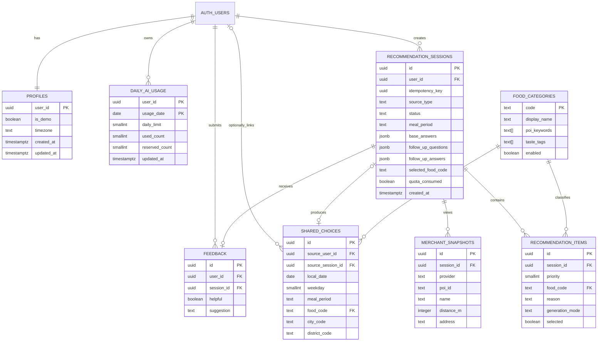

# EatWhat 数据库设计

> 2026-07-27 预算勘误：预算档位、食物预算匹配和商家价格兑现边界，以《16_EatWhat_预算档位与商家价格契约_v1.0》为准；本文中的旧预算字段或示例须在 P0-07 同步。  
> 2026-08-03 P0-07 勘误：本文与 PRD v1.2/名词表/专项契约冲突处以《22_EatWhat_P0-07_技术文档收敛清单_v1.0》为准（shared_choices 无回链字段、推荐项 5 个、source_type/status 枚举、预算档位字段、阈值配置化等）。  
>
> 文档状态：第三阶段正式交付物  
> 依据文档：系统架构设计及此前全部冻结需求  
> 产品版本：v1.0 MVP  
> 文档日期：2026-07-21  
> 数据库：Supabase PostgreSQL  
> 迁移工具建议：Alembic

---

# 1. 文档目的

本文档定义 EatWhat v1.0 的：

- 数据库边界；
- Schema 规划；
- 核心数据表；
- 表之间的关系；
- 主键、外键和唯一约束；
- 每日 AI 额度；
- 推荐历史；
- 商家快照；
- 匿名共享；
- 公共统计；
- 满意度；
- AI 和 POI 用量日志；
- 索引；
- 删除与匿名化；
- v1.1 账户功能预留。

本文件是后续：

- SQLAlchemy Model；
- Alembic Migration；
- API；
- 权限；
- 测试；
- 账户注销；

的统一设计依据。

---

# 2. 数据库设计原则

## 2.1 认证数据与业务数据分离

Supabase 管理：

```text
auth.users
```

EatWhat 管理：

```text
用户业务资料
每日额度
推荐记录
共享记录
反馈
日志
```

业务表使用 `auth.users.id` 作为用户外键，不复制密码，也不使用邮箱作为业务主键。

## 2.2 服务端统一访问

业务数据只由 FastAPI 访问。

浏览器：

- 不直接写推荐记录；
- 不直接扣额度；
- 不直接读单条共享记录；
- 不直接使用高权限数据库连接。

## 2.3 精确位置最小化

数据库默认不保存：

- 纬度；
- 经度；
- 详细家庭或工作地址。

可以保存：

- 城市；
- 区域；
- 用户可理解的地点摘要；
- 商家地址快照。

## 2.4 结构化字段与 JSONB 结合

适合关系字段的内容单独列出，例如：

- user_id；
- created_at；
- selected_food_code；
- status；
- source_type。

变化较多的问卷内容使用 JSONB，例如：

- 固定答案；
- AI 补问；
- 补问答案。

这样既能查询关键字段，也能保留问卷扩展性。

## 2.5 所有重要操作可追踪

智能推荐需要记录：

- request_id；
- idempotency_key；
- 状态；
- Provider；
- 是否消耗额度；
- 成功或错误。

---

# 3. Schema 规划

## 3.1 Supabase 管理 Schema

```text
auth
```

其中 `auth.users` 由 Supabase Auth 管理。

应用不得：

- 自己保存用户密码；
- 直接修改密码字段；
- 把 `auth.users` 当普通业务表使用。

## 3.2 EatWhat 业务 Schema

建议创建：

```text
app
```

放置全部 EatWhat 业务表。

建议不把 `app` Schema 加入浏览器可直接访问的 Data API 暴露范围。

FastAPI 使用服务端 PostgreSQL 连接访问。

## 3.3 配置文件而非数据表

v1.0 以下数据优先保存在 Git 仓库中的 JSON：

```text
activities.json
default_foods.json
demo_locations.json
```

原因：

- 无管理后台；
- 需要版本控制；
- 更新频率低；
- 易于 Mock；
- 不需要数据库 CRUD。

---

# 4. 核心 ER 图



---

# 5. 表清单

| 表 | 用途 | v1.0 |
|---|---|---|
| `app.profiles` | 用户业务资料 | 必须 |
| `app.daily_ai_usage` | 每日额度与预留 | 必须 |
| `app.food_categories` | 食物分类与搜索关键词 | 必须 |
| `app.recommendation_sessions` | 一次完整推荐会话 | 必须 |
| `app.recommendation_items` | 三个 AI/规则推荐项 | 必须 |
| `app.merchant_snapshots` | 用户查看过的商家快照 | 必须 |
| `app.shared_choices` | 匿名共享选择 | 必须 |
| `app.feedback` | 满意度与建议 | 必须 |
| `app.api_usage_logs` | AI/POI 调用日志 | 必须 |
| `app.provider_daily_usage` | 全站第三方日用量汇总 | 建议 |
| `app.audit_events` | 账户删除等安全审计 | v1.1 建议 |

---

# 6. `app.profiles`

## 6.1 用途

保存 Supabase Auth 之外的 EatWhat 用户业务属性。

## 6.2 字段

| 字段 | 类型 | 约束 | 说明 |
|---|---|---|---|
| `user_id` | uuid | PK, FK | 对应 `auth.users.id` |
| `is_demo` | boolean | NOT NULL, default false | 是否公共演示账户 |
| `timezone` | text | NOT NULL | 默认 `Asia/Shanghai` |
| `created_at` | timestamptz | NOT NULL | 创建时间 |
| `updated_at` | timestamptz | NOT NULL | 更新时间 |

## 6.3 不保存

- 密码；
- 密码哈希；
- Access Token；
- Refresh Token。

## 6.4 创建方式

当 `auth.users` 新增用户时，由数据库触发器创建 profile。

触发器函数应：

- 使用固定 `search_path`；
- 使用完整表名；
- 只插入必要字段；
- 避免依赖用户可控元数据。

## 6.5 删除规则

```text
auth.users 删除
→ profiles ON DELETE CASCADE
```

---

# 7. `app.daily_ai_usage`

## 7.1 用途

实现每个用户每天三次 AI 推荐，并解决并发请求。

## 7.2 字段

| 字段 | 类型 | 约束 |
|---|---|---|
| `user_id` | uuid | PK, FK |
| `usage_date` | date | PK |
| `daily_limit` | smallint | default 3 |
| `used_count` | smallint | default 0 |
| `reserved_count` | smallint | default 0 |
| `updated_at` | timestamptz | NOT NULL |

复合主键：

```text
(user_id, usage_date)
```

## 7.3 Check 约束

```text
daily_limit >= 0
used_count >= 0
reserved_count >= 0
used_count <= daily_limit
used_count + reserved_count <= daily_limit
```

## 7.4 日期计算

`usage_date` 以：

```text
Asia/Shanghai
```

自然日计算。

数据库时间字段仍使用 UTC `timestamptz`。

## 7.5 无需全量重置

不需要每天 00:00 执行：

```text
UPDATE 所有用户 SET used_count = 0
```

只需新日期首次请求时创建新行。

## 7.6 删除规则

账户删除时：

```text
ON DELETE CASCADE
```

---

# 8. AI 额度事务

## 8.1 预留事务

最终 AI 调用前：

```sql
BEGIN;

SELECT *
FROM app.daily_ai_usage
WHERE user_id = :user_id
  AND usage_date = :usage_date
FOR UPDATE;
```

若无记录则创建。

判断：

```text
used_count + reserved_count < daily_limit
```

满足后：

```text
reserved_count = reserved_count + 1
```

提交事务。

## 8.2 成功事务

AI 结果通过校验后：

```text
reserved_count = reserved_count - 1
used_count = used_count + 1
quota_consumed = true
```

## 8.3 失败事务

AI 失败：

```text
reserved_count = reserved_count - 1
used_count 不变
```

## 8.4 超时预留

推荐会话记录：

```text
quota_reserved_at
```

超过约定时间仍处于处理中时：

- 将会话标记失败；
- 释放 reserved_count；
- 记录错误。

## 8.5 幂等

`recommendation_sessions` 使用：

```text
UNIQUE(user_id, idempotency_key)
```

网络重试时返回已有请求状态，不重新预留和扣除。

---

# 9. `app.food_categories`

## 9.1 用途

建立稳定的食物分类词典，供：

- 固定问卷候选；
- 规则推荐；
- AI 输出校验；
- 高德关键词映射；
- 公共统计；
- 推荐历史。

## 9.2 字段

| 字段 | 类型 | 说明 |
|---|---|---|
| `code` | text PK | 稳定代码，例如 `malatang` |
| `display_name` | text | 麻辣烫 |
| `aliases` | text[] | 别名 |
| `poi_keywords` | text[] | 地图搜索关键词 |
| `taste_tags` | text[] | 辣、咸香等 |
| `appetite_tags` | text[] | 清淡、丰盛等 |
| `avoidance_tags` | text[] | 与忌口冲突标签 |
| `meal_periods` | text[] | 适用时段 |
| `budget_min` | integer nullable | 建议最低预算 |
| `budget_max` | integer nullable | 建议最高预算 |
| `sort_order` | integer | 显示顺序 |
| `enabled` | boolean | 是否启用 |
| `created_at` | timestamptz | 创建 |
| `updated_at` | timestamptz | 更新 |

## 9.3 设计意义

AI 不能自由返回任何文本。

AI 返回：

```text
food_code
```

后端检查它必须存在于启用的分类表中。

## 9.4 初始数据

通过 Migration 或 Seed 插入：

- 麻辣烫；
- 小碗菜；
- 黄焖鸡；
- 鸡公煲；
- 汉堡；
- 烧烤；
- 炸串；
- 盖浇饭；
- 面；
- 粉；
- 饺子；
- 火锅；
- 日料；
- 快餐；
- 其他首批分类。

---

# 10. `app.recommendation_sessions`

## 10.1 用途

表示一次用户选择流程，无论来源是：

- AI 推荐；
- 用户自主选择；
- 点击公共选择；
- 点击活动；
- 规则降级。

## 10.2 主要字段

| 字段 | 类型 | 说明 |
|---|---|---|
| `id` | uuid PK | 推荐会话 ID |
| `user_id` | uuid FK | 所属用户 |
| `idempotency_key` | uuid | 前端生成或后端分配 |
| `source_type` | text | 来源 |
| `status` | text | 状态机 |
| `meal_period` | text | 早餐等 |
| `questionnaire_version` | text | 问卷版本 |
| `base_answers` | jsonb | 固定问卷答案 |
| `follow_up_questions` | jsonb | AI 补问 |
| `follow_up_answers` | jsonb | 用户答案 |
| `selected_food_code` | text nullable | 最终选择 |
| `location_label` | text nullable | 粗略地点名 |
| `city_code` | text nullable | 城市代码 |
| `district_code` | text nullable | 区域代码 |
| `ai_provider` | text nullable | Provider |
| `ai_model` | text nullable | 模型 |
| `generation_mode` | text | ai/rule/direct |
| `quota_usage_date` | date nullable | 消耗日期 |
| `quota_reserved_at` | timestamptz nullable | 预留时间 |
| `quota_consumed` | boolean | 是否扣次 |
| `created_at` | timestamptz | 创建 |
| `updated_at` | timestamptz | 更新 |
| `completed_at` | timestamptz nullable | 完成 |

## 10.3 `source_type`

允许值：

```text
ai_recommended
user_selected
community_selected
activity_selected
rule_fallback
```

## 10.4 `status`

允许值：

```text
draft
follow_up_ready
quota_reserved
generating
succeeded
failed
rule_fallback
merchant_search
completed
cancelled
```

## 10.5 唯一约束

```text
UNIQUE(user_id, idempotency_key)
```

## 10.6 外键

```text
user_id → auth.users.id ON DELETE CASCADE
selected_food_code → app.food_categories.code
```

## 10.7 不保存

- 精确经纬度；
- Access Token；
- AI Key；
- 模型系统 Prompt 全文。

---

# 11. `base_answers` JSONB 结构

示例：

```json
{
  "meal_period": "lunch",
  "appetite": "normal",
  "avoidances": ["seafood", "greasy"],
  "tastes": ["spicy", "savory"],
  "budget": "20_40",
  "max_distance_m": 2000,
  "explicit_food_code": null
}
```

## 11.1 校验

虽然数据库保存 JSONB，FastAPI 仍必须使用 Pydantic Schema 校验。

## 11.2 版本

记录：

```text
questionnaire_version = "v1"
```

以后问卷变化时，历史仍可解释。

---

# 12. `app.recommendation_items`

## 12.1 用途

保存 AI 或规则生成的最多三个食物推荐。

## 12.2 字段

| 字段 | 类型 | 说明 |
|---|---|---|
| `id` | uuid PK | ID |
| `session_id` | uuid FK | 推荐会话 |
| `priority` | smallint | 1–3 |
| `food_code` | text FK | 食物分类 |
| `reason` | text | 推荐理由 |
| `generation_mode` | text | ai/rule |
| `selected` | boolean | 用户是否最终选择 |
| `created_at` | timestamptz | 创建 |

## 12.3 约束

```text
priority BETWEEN 1 AND 3
UNIQUE(session_id, priority)
UNIQUE(session_id, food_code)
```

## 12.4 删除

会话删除：

```text
ON DELETE CASCADE
```

---

# 13. `app.merchant_snapshots`

## 13.1 用途

保存用户在某次推荐中查看过的商家快照。

## 13.2 字段

| 字段 | 类型 | 说明 |
|---|---|---|
| `id` | uuid PK | ID |
| `session_id` | uuid FK | 推荐会话 |
| `provider` | text | amap/mock |
| `poi_id` | text | 第三方 POI ID |
| `name` | text | 商家名称 |
| `category_text` | text | 分类快照 |
| `distance_m` | integer nullable | 当时距离 |
| `address` | text nullable | 地址快照 |
| `city_name` | text nullable | 城市 |
| `district_name` | text nullable | 区域 |
| `opened_map` | boolean | 是否点击地图 |
| `viewed_at` | timestamptz | 查看时间 |

## 13.3 唯一约束

```text
UNIQUE(session_id, provider, poi_id)
```

## 13.4 隐私说明

商家地址不是用户精确位置。

表中不保存用户查询坐标。

---

# 14. `app.shared_choices`

## 14.1 用途

保存用户明确同意共享的结构化匿名选择。

## 14.2 字段

| 字段 | 类型 | 说明 |
|---|---|---|
| `id` | uuid PK | ID |
| `source_user_id` | uuid nullable FK | 内部关联 |
| `source_session_id` | uuid nullable FK | 来源会话 |
| `local_date` | date | 北京时间日期 |
| `weekday` | smallint | 1–7 |
| `meal_period` | text | 用餐时段 |
| `food_code` | text FK | 最终食物 |
| `source_type` | text | 来源 |
| `city_code` | text nullable | 粗略城市 |
| `city_name` | text nullable | 城市显示名 |
| `district_code` | text nullable | 区域 |
| `district_name` | text nullable | 区域显示名 |
| `appetite` | text nullable | 胃口 |
| `tastes` | text[] | 口味 |
| `avoidances` | text[] | 一般忌口 |
| `helpful` | boolean nullable | 满意度 |
| `is_active` | boolean | 是否计入统计 |
| `created_at` | timestamptz | 创建 |

## 14.3 唯一约束

一个推荐会话最多共享一次：

```text
UNIQUE(source_session_id)
```

## 14.4 删除策略

```text
source_user_id → auth.users.id ON DELETE SET NULL
source_session_id → recommendation_sessions.id ON DELETE SET NULL
```

这样用户注销或删除个人历史后：

- 共享统计可保留；
- 账户关联被解除；
- 数据不能重新指向用户。

## 14.5 不保存

- 邮箱；
- 经度；
- 纬度；
- 详细地址；
- 具体门店；
- 完整 AI 对话。

---

# 15. 公共统计查询

## 15.1 当天真实统计

聚合维度：

```text
local_date
meal_period
food_code
可选 city_code / district_code
```

## 15.2 人数阈值

SQL 逻辑：

```sql
GROUP BY food_code
HAVING COUNT(*) >= 3
```

只有达到阈值才返回真实人数。

## 15.3 历史同星期参考

条件：

- 相同 weekday；
- 相同 meal_period；
- 过去若干周；
- 仍需满足最小人数阈值。

## 15.4 默认热门项

不来自 `shared_choices`。

由：

```text
default_foods.json
```

补足页面。

## 15.5 视图

可建立普通 View：

```text
app.community_food_counts
```

v1.0 数据量较小，不必使用物化视图。

---

# 16. `app.feedback`

## 16.1 用途

保存一次推荐的满意度。

## 16.2 字段

| 字段 | 类型 | 说明 |
|---|---|---|
| `id` | uuid PK | ID |
| `user_id` | uuid FK | 用户 |
| `session_id` | uuid FK, UNIQUE | 推荐会话 |
| `helpful` | boolean nullable | 有帮助/没帮助 |
| `taste_match` | text nullable | 符合程度 |
| `choice_solved` | text nullable | 是否解决选择困难 |
| `merchant_available` | text nullable | 是否找到商家 |
| `suggestion` | text nullable | 建议 |
| `created_at` | timestamptz | 创建 |
| `updated_at` | timestamptz | 更新 |

## 16.3 规则

一个推荐会话一条反馈：

```text
UNIQUE(session_id)
```

用户重复提交时更新已有记录。

## 16.4 文本限制

`suggestion` 应限制最大长度，例如：

```text
1000 字符
```

---

# 17. `app.api_usage_logs`

## 17.1 用途

记录 AI 和 POI 调用情况，用于：

- 成本；
- 错误；
- 延迟；
- 调试；
- 全站限额。

## 17.2 字段

| 字段 | 类型 | 说明 |
|---|---|---|
| `id` | bigint/uuid PK | ID |
| `request_id` | uuid | 请求关联 |
| `recommendation_session_id` | uuid nullable | 推荐关联 |
| `user_id` | uuid nullable | 内部关联 |
| `operation` | text | follow_up/recommend/poi 等 |
| `provider` | text | deepseek/amap/mock |
| `model` | text nullable | AI 模型 |
| `success` | boolean | 成功 |
| `cached` | boolean | 是否缓存 |
| `input_tokens` | integer nullable | 输入 Token |
| `output_tokens` | integer nullable | 输出 Token |
| `estimated_cost` | numeric nullable | 估算成本 |
| `latency_ms` | integer nullable | 耗时 |
| `error_code` | text nullable | 统一错误码 |
| `created_at` | timestamptz | 时间 |

## 17.3 禁止字段

不保存：

- Key；
- Token；
- 完整精确坐标；
- 完整原始 Prompt；
- 密码。

## 17.4 保留周期

v1.0 建议：

```text
30–90 天
```

具体在隐私与部署文档确定。

---

# 18. `app.provider_daily_usage`

## 18.1 用途

快速判断全站每日 AI/POI 使用量。

## 18.2 字段

| 字段 | 类型 |
|---|---|
| `usage_date` | date |
| `provider` | text |
| `operation` | text |
| `request_count` | integer |
| `success_count` | integer |
| `input_tokens` | bigint |
| `output_tokens` | bigint |
| `estimated_cost` | numeric |
| `updated_at` | timestamptz |

复合主键：

```text
(usage_date, provider, operation)
```

## 18.3 使用方式

每次 Provider 调用后原子累加。

全站达到环境变量限制后：

- 关闭 Live Provider；
- 切换 Mock 或规则模式。

---

# 19. `app.audit_events`（v1.1 建议）

## 19.1 用途

记录安全相关事件：

- 账户注销请求；
- 数据清除；
- 管理员操作；
- 共享数据匿名化。

## 19.2 不记录敏感原文

只记录：

- event_type；
- internal actor ID；
- target ID；
- 时间；
- 结果；
- request_id。

---

# 20. 数据删除关系

## 20.1 用户删除个人历史

删除：

- recommendation_sessions；
- recommendation_items；
- merchant_snapshots；
- feedback。

共享记录：

- `source_session_id` 置空；
- 保持匿名聚合。

## 20.2 用户清空历史

批量执行相同规则，不删除账户和额度。

## 20.3 v1.1 账户注销

建议顺序：

```text
1. 验证当前用户
2. 锁定账户注销流程
3. 将 shared_choices.source_user_id 置空
4. 删除推荐历史和反馈
5. 删除 daily_ai_usage
6. 删除 profiles
7. 删除 auth.users
8. 写审计事件
```

## 20.4 演示账户

演示账户不允许普通体验者注销。

可由维护脚本定期：

- 清空历史；
- 清空反馈；
- 重置异常状态；
- 保留账户。

---

# 21. RLS 与权限

## 21.1 推荐策略

`app` Schema 不直接暴露给浏览器。

仍建议：

- 禁止 `anon` 访问；
- 禁止 `authenticated` 直接操作业务表；
- 只授予后端数据库角色必要权限；
- 所有后端查询仍按当前 user_id 过滤。

## 21.2 为什么仍要后端鉴权

数据库权限不能替代：

- FastAPI Token 验证；
- URL 资源所属检查；
- 额度业务规则；
- 共享阈值；
- 日志脱敏。

## 21.3 高权限凭据

高权限数据库连接和 Supabase Secret：

- 仅后端使用；
- 不进入浏览器；
- 不进入 GitHub；
- 定期轮换。

---

# 22. 索引设计

## 22.1 推荐历史

```text
recommendation_sessions(user_id, created_at DESC)
recommendation_sessions(user_id, source_type, created_at DESC)
```

## 22.2 幂等

唯一索引：

```text
recommendation_sessions(user_id, idempotency_key)
```

## 22.3 公共统计

```text
shared_choices(local_date, meal_period, food_code)
shared_choices(weekday, meal_period, food_code)
shared_choices(city_code, district_code, local_date)
```

可添加条件：

```text
WHERE is_active = true
```

## 22.4 API 日志

```text
api_usage_logs(created_at)
api_usage_logs(provider, operation, created_at)
api_usage_logs(user_id, created_at)
api_usage_logs(request_id)
```

## 22.5 商家快照

唯一索引：

```text
merchant_snapshots(session_id, provider, poi_id)
```

---

# 23. Check 约束

建议数据库层校验：

## 23.1 推荐优先级

```text
priority BETWEEN 1 AND 3
```

## 23.2 星期

```text
weekday BETWEEN 1 AND 7
```

## 23.3 距离

```text
distance_m >= 0
```

## 23.4 Token 数

```text
input_tokens >= 0
output_tokens >= 0
```

## 23.5 额度

```text
used_count >= 0
reserved_count >= 0
used_count + reserved_count <= daily_limit
```

---

# 24. 枚举实现选择

PostgreSQL 原生 ENUM 修改不够灵活。

v1.0 建议使用：

```text
text + CHECK
```

适合：

- source_type；
- status；
- meal_period；
- generation_mode；
- feedback 选项。

食物类型使用独立词典表。

---

# 25. 时间设计

## 25.1 时间戳

全部业务时间：

```text
timestamptz
```

按 UTC 存储。

## 25.2 用户显示

前端按：

```text
Asia/Shanghai
```

显示。

## 25.3 业务日期

以下字段单独使用 `date`：

- daily_ai_usage.usage_date；
- shared_choices.local_date；
- provider_daily_usage.usage_date。

日期由后端使用北京时间计算，避免服务器时区不同导致额度错误。

---

# 26. `updated_at` 处理

需要统一自动更新时间。

可使用：

- SQLAlchemy 代码；
- 数据库 Trigger。

建议数据库 Trigger 作为兜底，避免不同入口漏更新。

---

# 27. Migration 与 Seed

## 27.1 Migration

使用 Alembic 管理：

- Schema；
- 表；
- 外键；
- 索引；
- Check；
- Trigger；
- View。

不把 Supabase Dashboard 手工修改作为唯一来源。

## 27.2 Seed

Seed 内容：

- food_categories；
- 测试推荐数据；
- Mock 公共选择；
- 本地演示数据。

## 27.3 演示账户

演示账户密码不能写入普通数据库 Migration。

使用：

- 安全部署脚本；
- Supabase 管理操作；
- CI/部署 Secret。

README 可以提供演示账号，但不提供其他高权限凭据。

---

# 28. 数据备份和恢复

v1.0 至少需要：

- 数据库 Migration 可重建结构；
- Seed 可重建基础词典；
- Mock 数据可重建演示；
- 重要环境变量有安全备份；
- 上线前测试数据库恢复流程。

---

# 29. 数据保留建议

| 数据 | 建议 |
|---|---|
| 个人推荐历史 | 用户删除前保留 |
| 未完成草稿 | 例如 24 小时后清理 |
| 失败推荐请求 | 30 天 |
| API 用量日志 | 30–90 天 |
| 匿名共享统计 | 可长期保留 |
| 精确位置 | 不持久化 |
| 演示账户历史 | 定期清理 |
| Provider 日汇总 | 长期或按年度归档 |

---

# 30. API 数据模型对应关系

| API 业务 | 主要表 |
|---|---|
| 获取用户首页资料 | profiles, daily_ai_usage |
| 固定问卷 | food_categories + 配置 |
| 创建推荐 | recommendation_sessions |
| 返回三种推荐 | recommendation_items |
| 查询商家 | 实时 Provider + merchant_snapshots |
| 我的历史 | recommendation_sessions + items |
| 匿名分享 | shared_choices |
| 公共统计 | shared_choices 聚合 |
| 满意度 | feedback |
| 成本与故障 | api_usage_logs |
| 全局额度 | provider_daily_usage |

---

# 31. 并发与事务测试

数据库阶段必须测试：

1. 同一用户同时发送 4 个 AI 请求；
2. 同一个 idempotency_key 重复请求；
3. AI 成功后数据库写入失败；
4. AI 失败时释放预留；
5. 服务进程在预留后崩溃；
6. 用户删除历史时共享记录仍匿名保留；
7. 两个用户不能读取彼此历史；
8. 同一会话不能分享两次；
9. 同一会话只能有一个优先级 1。

---

# 32. 数据库验收标准

## 32.1 账户

- profile 与 auth.users 一一对应；
- 业务表只使用 user_id；
- 不存密码。

## 32.2 额度

- 单日不超过 3；
- 并发不绕过；
- AI 失败不扣；
- 幂等重试不重复扣；
- 次日自动使用新日期记录。

## 32.3 历史

- 用户只能读写自己的记录；
- 三条推荐顺序稳定；
- 商家快照可恢复；
- 精确位置不入库。

## 32.4 公共统计

- 共享需用户主动同意；
- 单会话只能分享一次；
- 计数阈值至少 3；
- 删除用户后共享记录无法关联账户；
- 默认热门项不进入真实统计表。

## 32.5 日志

- 能统计 AI/POI 用量；
- 不记录 Key、密码和精确位置；
- 可通过 request_id 排查问题。

---

# 33. 仍需在 API 文档确定

- 每个字段的最终 API 名称；
- JSON 日期格式；
- 分页方式；
- 历史详情返回粒度；
- 商家快照写入时机；
- 公共统计的城市过滤规则；
- Provider 日用量更新方式；
- 错误码；
- 管理脚本接口。

这些不改变本数据库的核心关系。

---

# 34. 下一步

系统架构和数据库设计完成后，继续：

```text
07_EatWhat_API接口设计.md
08_EatWhat_AI推荐系统设计.md
09_EatWhat_隐私安全与免责声明.md
```
