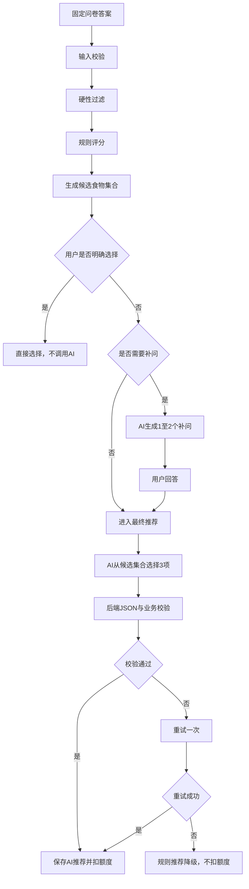
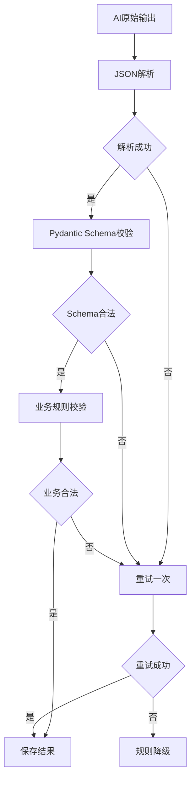

# EatWhat AI 推荐系统设计

> 2026-07-27 预算勘误：预算仅是食物方向的软偏好，不是商家价格承诺；档位和判断依据以《16_EatWhat_预算档位与商家价格契约_v1.0》为准，本文中的旧预算权重/示例须在 P0-07 同步。  
> 2026-08-03 P0-07 勘误：本文与 PRD v1.2/名词表/专项契约冲突处以《22_EatWhat_P0-07_技术文档收敛清单_v1.0》为准（逐题追问最多 3 轮、固定 5 候选、预算档位软匹配、推荐差异化等）。  
>
> 文档状态：第三阶段正式交付物  
> 产品版本：v1.0 MVP  
> 文档日期：2026-07-21  
> 推荐类型：规则系统 + 大模型的混合推荐  
> AI 输出对象：食物类型，不是具体商家

---

# 1. 文档目的

本文档定义 EatWhat 的 AI 推荐系统，包括：

- AI 的职责边界；
- 为什么不能让 AI 自由推荐商家；
- 固定问卷；
- 食物分类词典；
- 硬性过滤；
- 规则评分；
- AI 补充问题；
- AI 最终推荐；
- Prompt；
- JSON Schema；
- 输出校验；
- 失败重试；
- 规则降级；
- 多样性；
- 隐私；
- 成本；
- 评测；
- Provider 抽象。

---

# 2. 推荐系统的核心定位

EatWhat 的 AI 不是：

- 负责搜索真实商家；
- 判断哪家店最好吃；
- 判断商家是否营业；
- 判断用户过敏是否安全；
- 自由生成无限食物名称；
- 替代地图服务。

AI 负责：

1. 判断固定答案是否仍存在明显不确定性；
2. 生成最多 1–2 个补充选择题；
3. 在系统给定的合法食物候选中选择三个；
4. 给出简短、可理解的推荐理由；
5. 保持三个推荐之间有一定差异。

真实商家由 POI Provider 查询。

---

# 3. 总体推荐流程



---

# 4. 混合推荐而非纯 AI 推荐

## 4.1 纯 AI 的问题

如果直接发送：

> 用户想吃辣，推荐三个食物。

模型可能：

- 返回数据库中不存在的类别；
- 重复返回相似类别；
- 推荐与忌口冲突；
- 输出格式变化；
- 推荐过于宽泛；
- 编造商家；
- 给出过长解释；
- 每次结果差异过大。

## 4.2 混合方案

EatWhat 使用：

```text
规则负责约束
+
AI负责理解和排序
```

规则系统先完成：

- 忌口过滤；
- 时段过滤；
- 预算适配；
- 胃口适配；
- 基础口味匹配；
- 候选食物生成。

AI 只能从合法候选中选择。

---

# 5. 食物分类词典

## 5.1 稳定代码

每个食物类型具有稳定 `food_code`：

```text
malatang
small_bowl_dishes
braised_chicken_rice
burger
barbecue
fried_skewers
noodles
dumplings
hotpot
```

前端展示中文名称，后端和 AI 使用稳定代码。

## 5.2 分类属性

每个类别可以包含：

```json
{
  "code": "malatang",
  "display_name": "麻辣烫",
  "taste_tags": ["spicy", "savory"],
  "appetite_tags": ["normal", "large"],
  "meal_periods": ["lunch", "dinner", "late_night"],
  "budget_min": 15,
  "budget_max": 45,
  "avoidance_tags": ["spicy", "greasy"],
  "poi_keywords": ["麻辣烫"]
}
```

## 5.3 AI 输出限制

AI 必须返回：

```text
food_code
```

后端根据词典补充：

- 中文名称；
- 地图关键词；
- 卡片图标；
- 统计类别。

---

# 6. 用户输入模型

## 6.1 固定答案

```json
{
  "meal_period": "lunch",
  "appetite": "normal",
  "avoidances": ["seafood", "greasy"],
  "tastes": ["spicy", "savory"],
  "budget": "20_40",
  "max_distance_m": 2000,
  "explicit_food_code": null
}
```

## 6.2 AI 不接收的内容

- 用户邮箱；
- 用户密码；
- Access Token；
- 精确经纬度；
- 具体家庭或工作地址；
- user_id；
- 其他用户记录；
- 商家原始数据；
- 数据库连接信息。

## 6.3 自由文本

v1.0 固定问卷和 AI 补问尽量使用选择题。

除满意度建议外，推荐流程不要求用户输入自由文本。

这样可以降低：

- Prompt 注入；
- 隐私输入；
- 内容审核；
- 输出不稳定；
- 输入 Token 成本。

---

# 7. 硬性过滤

## 7.1 定义

硬性过滤表示：

> 不满足时直接从候选集合移除，而不是仅降低分数。

## 7.2 v1.0 建议硬过滤

### 明确忌口冲突

用户选择：

```text
不想吃辣
```

明显依赖辣味的类别可以移除或显著限制。

### 用餐时段明显不适配

例如早餐候选不优先出现重型夜宵类别。

### 类别停用

`food_categories.enabled = false` 的类别必须移除。

### 地区完全不可检索

未来若某类别在地图关键词中不可用，可以停用。

## 7.3 忌口不是过敏保证

硬过滤只根据通用标签。

不能保证：

- 某家商家没有相关食材；
- 没有交叉污染；
- 实际配料符合要求。

页面必须继续展示免责声明。

---

# 8. 规则评分

## 8.1 目的

规则评分用于：

- 生成第七题的食物候选；
- AI 不可用时降级；
- 限制 AI 最终候选范围；
- 验证 AI 推荐是否明显不合理。

## 8.2 建议评分项

总分可归一化为 0–100：

```text
口味匹配        30%
胃口匹配        20%
用餐时段        15%
预算匹配        15%
忌口安全余量    10%
类别多样性      10%
```

该权重是项目初始设计值，后续可根据反馈调整。

## 8.3 示例

用户：

```text
午餐
正常胃口
想吃辣和咸香
预算20–40元
不想吃海鲜和过于油腻
```

麻辣烫：

```text
口味匹配：高
胃口匹配：高
午餐适配：高
预算适配：高
油腻冲突：中
```

小碗菜：

```text
口味匹配：中
胃口匹配：高
午餐适配：高
预算适配：高
忌口灵活：高
```

## 8.4 候选数量

最终传给 AI 的候选建议：

```text
8–15 个
```

太少：

- 多样性不足。

太多：

- Token 增加；
- 模型容易偏离；
- 输出更不稳定。

---

# 9. 第七题动态食物候选

## 9.1 生成方式

第七题不调用 AI。

由规则引擎从评分最高的类别中选择：

```text
6–10 个
```

## 9.2 多样性约束

不能全部是：

- 米饭类；
- 辣味类；
- 快餐类。

建议至少覆盖 2–3 种形式：

- 米饭正餐；
- 面/粉；
- 小吃快餐；
- 汤锅；
- 清淡组合。

## 9.3 用户选择后

一旦明确选择：

```text
直接查商家
不调用 AI
不消耗次数
```

---

# 10. 是否需要 AI 补问

## 10.1 需要补问的情况

- 用户大量选择“都可以”；
- 规则前几名分数接近；
- 胃口、口味和食物形式仍冲突；
- 候选范围过宽；
- 用户没有明确偏好。

## 10.2 不需要补问

- 固定答案已经非常明确；
- 候选前三名差距足够；
- AI 补问服务不可用；
- 用户已选择具体类型；
- 用户额度为 0。

## 10.3 补问数量

```text
0–2 个
```

禁止多轮无限追问。

---

# 11. AI 补问设计

## 11.1 补问目标

补问必须能真正区分候选。

好的问题：

> 今天更想吃汤汤水水，还是干饭正餐？

不好的问题：

> 你还有其他要求吗？

## 11.2 问题限制

每个问题：

- 3–6 个选项；
- 单选为主；
- 不重复固定问卷；
- 不询问医疗信息；
- 不询问身份；
- 不要求自由文本；
- 不出现商家；
- 不出现模型或系统信息。

## 11.3 输入给 AI 的内容

```json
{
  "task": "generate_follow_up_questions",
  "questionnaire_answers": {},
  "candidate_foods": [
    {
      "food_code": "malatang",
      "display_name": "麻辣烫",
      "tags": ["spicy", "soup"]
    }
  ],
  "constraints": {
    "min_questions": 0,
    "max_questions": 2,
    "options_per_question": [3, 6]
  }
}
```

## 11.4 补问输出 Schema

```json
{
  "questions": [
    {
      "id": "meal_form",
      "title": "今天更想吃哪种形式？",
      "type": "single_select",
      "options": [
        {
          "value": "soup",
          "label": "汤汤水水"
        },
        {
          "value": "rice_meal",
          "label": "干饭正餐"
        }
      ]
    }
  ]
}
```

## 11.5 后端校验

- 数量 0–2；
- ID 只允许安全字符；
- 标题长度限制；
- 选项 3–6；
- 选项 value 不重复；
- 无自由文本类型；
- 不包含敏感字段；
- 不包含固定问题重复项。

---

# 12. 补问 System Prompt 初稿

```text
你是 EatWhat 的饮食选择澄清模块。

你的任务不是直接推荐商家，也不是提供医疗或过敏建议。
你只能根据给定的固定问卷答案和候选食物，判断是否需要
0到2个补充选择题。

规则：
1. 不重复已经问过的问题。
2. 每个问题必须有3到6个简短选项。
3. 只生成与本次吃什么直接相关的问题。
4. 不询问姓名、联系方式、精确位置、健康诊断或隐私。
5. 不生成自由文本问题。
6. 不提及任何具体商家。
7. 只输出符合指定JSON Schema的内容。
8. 若固定信息已经足够，返回空questions。
```

---

# 13. 最终推荐任务

## 13.1 输入

后端发送：

- 固定答案；
- 补问和答案；
- 合法候选食物；
- 候选的规则分数摘要；
- 输出约束。

不发送：

- 商家列表；
- 经纬度；
- 用户身份；
- 其他用户数据。

## 13.2 输出

必须返回：

```text
正好 3 个不同的 food_code
```

每项：

- priority；
- food_code；
- reason。

## 13.3 输出 Schema

```json
{
  "recommendations": [
    {
      "priority": 1,
      "food_code": "malatang",
      "reason": "符合你想吃辣、预算适中和偏好热食的选择。"
    },
    {
      "priority": 2,
      "food_code": "braised_chicken_rice",
      "reason": "属于稳妥的午餐正餐，预算也比较合适。"
    },
    {
      "priority": 3,
      "food_code": "small_bowl_dishes",
      "reason": "搭配灵活，更方便避开今天不想吃的食材。"
    }
  ]
}
```

---

# 14. 最终推荐 System Prompt 初稿

```text
你是 EatWhat 的食物类型推荐模块。

你只能从系统提供的 candidate_foods 中选择食物类型。
你不能创造新的 food_code，不能推荐具体商家，
不能保证食物过敏安全，也不能提供医疗建议。

请根据用户的当前用餐时间、胃口、一般忌口、口味、
预算和补充答案，选择正好3个不同的食物类型。

要求：
1. priority 必须依次为1、2、3。
2. food_code 必须来自 candidate_foods。
3. 三个结果不能重复。
4. 首选应最符合当前偏好。
5. 备选应保持一定差异，不能只是同类食物的同义词。
6. reason 使用简短中文，不超过60个汉字。
7. 不提及不存在的评分、价格、商家或距离。
8. 不声称“最健康”“一定安全”“最好吃”。
9. 只输出符合指定JSON Schema的内容。
```

---

# 15. AI 请求示例

```json
{
  "questionnaire": {
    "meal_period": "lunch",
    "appetite": "normal",
    "avoidances": ["seafood", "greasy"],
    "tastes": ["spicy", "savory"],
    "budget": "20_40"
  },
  "follow_up_answers": {
    "meal_form": "rice_meal"
  },
  "candidate_foods": [
    {
      "food_code": "malatang",
      "display_name": "麻辣烫",
      "rule_score": 82
    },
    {
      "food_code": "braised_chicken_rice",
      "display_name": "黄焖鸡",
      "rule_score": 79
    },
    {
      "food_code": "small_bowl_dishes",
      "display_name": "小碗菜",
      "rule_score": 76
    }
  ]
}
```

---

# 16. 结构化输出策略

## 16.1 Provider 支持 JSON Schema

优先使用模型提供商的结构化输出能力。

配置：

- 指定 JSON Schema；
- 禁止额外字段；
- 限制数组长度；
- 限制枚举和字段类型。

## 16.2 Provider 不支持严格 Schema

采用：

```text
要求输出JSON
→ 提取JSON
→ Pydantic校验
→ 业务校验
→ 失败重试一次
```

## 16.3 不直接信任“合法 JSON”

即使语法合法，也要检查：

- food_code 是否存在；
- 是否重复；
- priority 是否为 1–3；
- 是否与硬性忌口冲突；
- reason 是否过长；
- 是否出现具体商家；
- 是否出现医疗保证。

---

# 17. 输出校验链



---

# 18. 重试策略

## 18.1 最大次数

```text
首次调用 + 最多1次修复重试
```

不无限重试。

## 18.2 修复重试 Prompt

只说明：

- 上次违反了哪个 Schema；
- 必须只返回合法结构；
- 不把完整内部错误透露给用户。

## 18.3 超时

建议配置：

- 连接超时；
- 总超时；
- 取消请求；
- 超时释放额度预留。

具体秒数在真实 Provider 测试后确定。

---

# 19. 规则降级推荐

## 19.1 触发

- AI 超时；
- AI 无响应；
- Schema 两次无效；
- Provider 被关闭；
- 全站额度达到上限；
- 用户当日 AI 额度已用完。

## 19.2 生成

取规则评分最高的候选，并应用多样性约束：

```text
首选：最高分
备选一：不同食物形式中的高分项
备选二：另一种不同形式的高分项
```

## 19.3 扣费

规则降级：

```text
不消耗 AI 次数
```

## 19.4 页面提示

> 当前使用基础推荐模式，本次未消耗 AI 推荐次数。

---

# 20. 多样性规则

## 20.1 问题

若前三名全部是：

- 盖浇饭；
- 黄焖鸡米饭；
- 鸡公煲米饭；

用户仍然感觉选择相似。

## 20.2 类别族

食物分类增加：

```text
format_family
```

例如：

- rice_meal；
- noodles；
- soup_hotpot；
- snack_fastfood；
- light_combo；
- barbecue。

## 20.3 推荐约束

三个推荐中：

- 至少来自两个类别族；
- 首选不因多样性被强行替换；
- 备选优先提供不同形式。

---

# 21. 推荐理由设计

## 21.1 理由只能引用已知输入

允许：

> 符合你想吃辣和热食的偏好。

不允许：

> 这家店评分很高。

因为 AI 没有商家数据。

## 21.2 理由长度

建议：

```text
15–60 个汉字
```

## 21.3 理由风格

- 简洁；
- 口语化；
- 不夸张；
- 不使用医疗判断；
- 不承诺价格；
- 不声称最好。

---

# 22. Prompt 注入防护

## 22.1 v1.0 天然降低风险

推荐输入主要是枚举选项，而不是自由文本。

## 22.2 输入分层

系统消息：

- 定义规则；
- 优先级最高。

应用数据：

- 使用 JSON；
- 明确标记为数据；
- 不拼接成用户指令。

## 22.3 输出限制

- 严格 Schema；
- food_code 枚举；
- 无工具调用；
- 无数据库访问；
- 无商家搜索；
- 无外部网页访问。

## 22.4 满意度建议不进入推荐 Prompt

用户在反馈中输入的自由文本：

```text
只用于反馈分析
```

不能直接放入下一次 AI 推荐上下文。

---

# 23. 隐私设计

AI 请求不包含：

- email；
- user_id；
- 经纬度；
- 具体地址；
- 具体商家；
- Access Token；
- 推荐历史全文。

可以包含：

- 当前用餐时段；
- 枚举化胃口；
- 一般忌口代码；
- 口味；
- 预算；
- 候选食物。

服务端日志不记录完整 Prompt。

调试环境需要 Prompt 日志时：

- 默认关闭；
- 使用脱敏测试数据；
- 不在生产长期保存。

---

# 24. Provider 接口

```python
from typing import Protocol

class AIProvider(Protocol):
    async def generate_follow_up_questions(
        self,
        request: "FollowUpRequest",
    ) -> "FollowUpResponse":
        ...

    async def generate_recommendations(
        self,
        request: "RecommendationRequest",
    ) -> "RecommendationResponse":
        ...
```

实现：

```text
MockAIProvider
LiveAIProvider
```

可选后续实现：

```text
OpenAIProvider
DeepSeekProvider
GeminiProvider
```

业务层不直接调用特定 SDK。

---

# 25. Mock AI Provider

## 25.1 用途

- 本地开发；
- CI；
- 无 Key 演示；
- Provider 故障；
- 固定测试。

## 25.2 确定性

Mock Provider 根据输入固定返回。

例如：

```text
spicy + lunch
→ 麻辣烫、黄焖鸡、小碗菜
```

同一输入应得到稳定结果，便于截图和测试。

## 25.3 模拟错误

支持配置：

```text
正常
超时
非法JSON
重复food_code
Provider不可用
```

用于测试降级流程。

---

# 26. 模型参数建议

## 26.1 温度

推荐较低随机性：

```text
0.2–0.4
```

目的：

- 格式稳定；
- 推荐一致；
- 降低无关创意。

具体取值由 Provider 能力和评测决定。

## 26.2 输出 Token

设置较小上限，因为：

- 补问短；
- 推荐只有三个；
- 理由短。

## 26.3 不需要流式输出

v1.0 不建议流式返回结构化推荐。

原因：

- 需要完整 JSON 校验；
- 输出较短；
- 流式增加前后端复杂度。

页面使用加载动画即可。

---

# 27. 成本控制

## 27.1 减少调用

- 用户明确选择时不调用 AI；
- 固定问卷不调用 AI；
- 动态候选由规则生成；
- 只在仍不明确时调用；
- 补问最多一次；
- 最终推荐只调用一次；
- 重试最多一次。

## 27.2 控制上下文

不发送：

- 长篇产品说明；
- 完整分类数据库；
- 用户全部历史；
- 商家列表。

只发送当前需要的 8–15 个候选。

## 27.3 用量日志

记录：

- Provider；
- 模型；
- 输入 Token；
- 输出 Token；
- 延迟；
- 估算成本；
- 成功或失败；
- 是否降级。

## 27.4 全站开关

达到全局预算时：

```text
关闭 Live AI
→ 自动使用规则模式
```

---

# 28. 缓存策略

AI 最终推荐包含个体答案，一般不跨用户共享缓存。

可以缓存：

- 相同公共问卷组合的规则候选；
- 食物分类；
- Prompt 模板；
- Provider 可用状态。

不建议直接缓存和复用：

- 某个用户完整 AI 推荐；
- 包含用户细节的 Prompt。

---

# 29. Prompt 版本管理

每次 Prompt 调整需要版本号：

```text
follow_up_prompt_v1
recommendation_prompt_v1
```

推荐会话记录：

- prompt_version；
- questionnaire_version；
- provider；
- model。

这样后续能比较：

- 哪一版结果更好；
- 哪一版非法输出更多；
- 哪一版成本更低。

不需要把完整 System Prompt 保存到每条历史中。

---

# 30. AI 评测数据集

## 30.1 场景集

至少准备：

- 清淡午餐；
- 辣味晚餐；
- 小预算；
- 大胃口；
- 夜宵；
- 多项忌口；
- 全部都可以；
- 用户明确选择；
- 候选不足；
- Provider 错误。

## 30.2 每个场景包含

```json
{
  "case_id": "lunch_spicy_001",
  "answers": {},
  "expected_allowed_foods": [],
  "forbidden_foods": [],
  "expected_need_follow_up": true
}
```

## 30.3 自动评测

- JSON 有效率；
- food_code 合法率；
- 推荐不重复率；
- 忌口冲突率；
- 三项多样性；
- 理由长度；
- 额度扣除正确率；
- 降级成功率。

## 30.4 人工评测

用户或开发者评分：

- 是否符合当前想法；
- 是否帮助缩小选择；
- 首选是否合理；
- 备选是否有差异；
- 理由是否自然。

---

# 31. 核心质量指标

v1.0 建议目标：

| 指标 | 目标 |
|---|---:|
| 结构化输出通过率 | ≥ 98%（含一次重试） |
| 非法 food_code | 0%（后端拦截） |
| 推荐重复 | 0%（后端拦截） |
| 超出3次额度 | 0 |
| AI失败后可降级 | 100% |
| 精确位置进入AI请求 | 0 |
| 具体商家被AI编造 | 0 |
| 单次补问数量 | 0–2 |
| 最终推荐数量 | 正好3 |

这些是项目目标值，需要通过测试验证，不是现有结果。

---

# 32. 失败场景

## 32.1 Provider 超时

```text
取消请求
→ 释放额度预留
→ 使用规则降级
→ 不扣AI次数
```

## 32.2 JSON 无法解析

```text
重试一次
→ 仍失败
→ 规则降级
```

## 32.3 返回不存在 food_code

```text
业务校验失败
→ 重试一次
→ 仍失败
→ 规则降级
```

## 32.4 三项重复

同上。

## 32.5 与硬性忌口冲突

- 拒绝该结果；
- 重试；
- 失败后规则降级。

## 32.6 模型拒答

当作 Provider 无有效结果处理。

---

# 33. 食物推荐与商家搜索的边界

```text
AI：
麻辣烫、黄焖鸡、小碗菜

POI：
张亮麻辣烫、杨国福麻辣烫……
```

AI 结果必须先由用户选择一种食物。

然后后端使用该类型的 `poi_keywords` 调用高德。

禁止：

```text
AI虚构商家
→ 直接展示给用户
```

---

# 34. 后续增强方向

v1.0 不实现：

- 根据长期用户画像个性化；
- 学习用户历史；
- 协同过滤；
- 商家排序模型；
- 向量数据库；
- RAG；
- 多轮聊天；
- 图片识别；
- 营养模型。

未来可逐步增加，但必须先有足够真实反馈数据。

---

# 35. AI 系统验收标准

## 35.1 补问

- 最多两个；
- 每题 3–6 个选项；
- 无自由文本；
- 不重复固定问题；
- 不询问敏感信息。

## 35.2 最终推荐

- 正好三个；
- food_code 全部合法；
- 不重复；
- 理由简短；
- 不出现商家；
- 不进行过敏保证；
- 推荐具有差异。

## 35.3 额度

- AI成功才扣；
- 规则推荐不扣；
- 重试不重复扣；
- 网络刷新不重复扣。

## 35.4 隐私

- AI 请求无身份；
- 无精确坐标；
- 无 Token；
- 日志无完整 Prompt。

## 35.5 降级

- Provider关闭时仍可完成推荐；
- Mock模式可稳定演示；
- 错误不会使页面完全不可用。

---

# 36. 开发顺序

1. 食物分类词典；
2. 固定问卷；
3. 规则硬过滤；
4. 规则评分；
5. 动态候选；
6. Mock 补问；
7. Mock 最终推荐；
8. JSON Schema；
9. 输出校验；
10. 规则降级；
11. 真实 Provider；
12. Prompt 评测；
13. 成本与日志；
14. 用户反馈分析。

---

# 37. 下一步

本文件与 API、数据库一起为以下文档提供输入：

```text
09_EatWhat_隐私安全与免责声明.md
10_EatWhat_MVP开发计划.md
11_EatWhat_测试与验收计划.md
```
