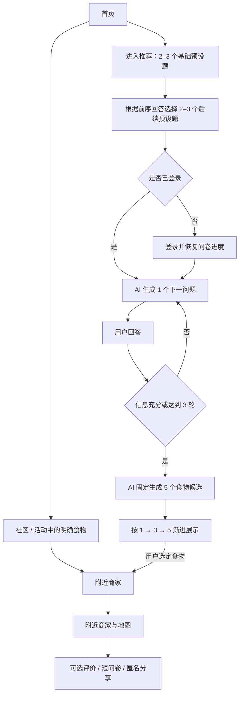

# EatWhat 设计审计与原型改进方案 v1.0

> 审计日期：2026-07-22  
> 审计范围：完整交流记录、01–13 号设计文档、总体规划与进度文档，以及当前项目目录。  
> 当前事实：项目仍处于设计阶段；工作区内尚无可审查的前后端代码、数据库迁移、自动化测试或部署配置。

## 0. 结论先行

EatWhat 的核心想法成立，技术上也可以实现；但“13 份文档已经冻结、可以直接按计划编码”这个结论过于乐观。

真正值得保留的产品内核是：**帮助用户更快结束“吃什么”的犹豫，先做出食物类型决定，再用真实地图数据帮助落地到附近餐厅。** 当前方案的主要问题不是技术栈错误，而是：

1. 以“减少选择”为目标，却设计了 7 步问卷、确认页、最多 2 个追问、3 个推荐和 5 家餐厅，重新制造了选择疲劳。
2. 把登录、AI、社区、活动、反馈、配额、分享等同时塞进 v1.0，MVP 过大，不适合第一个全栈项目的风险控制。
3. “AI 选餐厅”与“AI 只选食物类型”的历史结论发生过变化，旧结论仍残留在文档中。
4. 匿名分享、M1 是否包含 POI、公开字段、数据库隐私边界等仍有相互矛盾的描述。
5. ASCII 原型完成了页面清单，却没有完成可用性验证；它不能证明信息层级、真实内容密度、移动端触控和流程长度合理。
6. 中国大陆公开部署所涉及的 Supabase 海外区域、定位敏感个人信息、账户删除、地图坐标转换和地图调用成本，尚未被纳入真正的发布门槛。

因此，本审计建议：**不要立即照着原 M0–M12 全量开工。先用一个短流程可交互原型重新确认核心体验，再按“规则闭环 → 地图落地 → 登录与历史 → AI 增强 → 社区扩展”的顺序实现。**

### 0.1 2026-07-23 用户反馈与审计校正

用户不接受“两步问卷”作为主流程，理由是两步信息不足以判断用户想吃什么，容易退化为盲目推荐；用户认为 01–13 号文档描述的总体流程更接近真实意图。这个反驳成立。

因此，本审计中“用两步问卷替换七步问卷”的建议不再作为当前产品基线。后续应当：

- 保留时间、食量、忌口、口味、预算、距离、食物候选等多维输入，保证推荐具有可追溯依据。
- 区分“信息维度”和“页面数量”：是否合并页面、自动带入默认值或条件跳过，必须在不损失推荐信息的前提下由用户确认。
- 继续保留对长流程认知负担的审计，但解决办法改为优化问题顺序、进度反馈、返回修改、选项文案和推荐理由，而不是直接删减为两问。
- 两步可点击原型只作为一次未采纳的对照实验；其中主次动作、备选折叠和定位说明仍可作为表现层参考。

本校正覆盖本文第 3.1、5.2、5.3、6.2、6.3 和 7.1 中所有把“两步短流程”当作默认落地方案的描述；其他架构、文档一致性、隐私和外部服务审计结论不受影响。

### 0.2 2026-07-23 用户决策补充

用户进一步确认：

- 保留七个问卷信息维度，但不要求七个独立页面。
- AI 可以且最好根据上一轮回答动态生成下一轮问题；人工题库不作为默认限制。
- 使用 AI 必须登录；未登录可使用其他非 AI 功能，并可在登录后恢复此前问卷进度。
- 社区“大家今天吃什么”和活动模块必须进入首个版本，不能被审计建议移出首版。
- 第一阶段仅个人使用，后续考虑将项目放到 GitHub；当前不按公众长期运营场景发布。
- 分享数据与原用户和原会话彻底断开关联。

这些用户决策覆盖本文中“AI 只从人工题库选题”“社区/活动移出核心 MVP”“第一阶段按公众服务准备”等相反建议。仍然有效的审计约束包括：动态问题必须使用严格结构、轮数和敏感主题边界；社区冷启动不得伪造群体人数；活动必须有来源与有效期；不可回链分享必须在操作前说明其不可按账户撤回的后果。

### 0.3 2026-07-23 权威主流程补充

用户给出的当前主流程为：

1. 进入首页。
2. 如果用户从“大家都在吃什么”或活动条幅中选择了明确食物类型，跳过推荐和 AI，直接进入附近商家。
3. 如果用户进入推荐，先回答 2–3 个基础预设题；系统再根据这些回答决定后续 2–3 个预设题，整体覆盖七个信息维度。
4. 准备调用 AI 时检查登录；未登录用户登录后恢复问卷进度。
5. AI 基于全部预设问卷生成 2–3 个追问，再基于所有回答生成最终食物候选。
6. 最终生成 3–5 个候选，但初始只显示 1 个；用户点击“更多推荐”时每次增加 2 个。
7. 用户选定食物后进入附近商家。
8. 完成后可自愿评价、填写短问卷或选择匿名分享；全部可跳过，不属于强制主流程。

三个实现参数已于 2026-07-23 确认：后续预设题由后端规则引擎从题库选择；AI 逐题生成、最多 3 轮且可提前结束；最终固定生成 5 个候选并按 1→3→5 展示。

### 0.4 问卷决策引擎与 next API 结论

需要新增后端问卷决策能力，但更准确的名称是 **Questionnaire Decision Engine**，不建议实现成一棵硬编码问题树。原因是多个答案会共同影响下一题，不同分支还可能重新汇合，实际结构更接近“版本化问题库 + 条件表 + 确定性决策图/DAG”。

建议保留现有 `GET /api/v1/questionnaire?version=...` 作为版本元数据/初始题入口，并新增公开、无 AI 的：

```http
POST /api/v1/questionnaire/next
```

请求提交完整答案快照，而不是只提交最后一个答案：

```json
{
  "questionnaire_version": "v2",
  "answers_so_far": [
    { "question_id": "meal_period", "value": "dinner" },
    { "question_id": "appetite", "value": "light" }
  ]
}
```

建议响应：

```json
{
  "data": {
    "questionnaire_version": "v2",
    "next_questions": [],
    "is_complete": false,
    "covered_dimensions": ["meal_period", "appetite"],
    "invalidated_answer_ids": [],
    "progress": {
      "answered": 2,
      "estimated_remaining_min": 2,
      "estimated_remaining_max": 3
    },
    "next_action": "answer_questions"
  }
}
```

每次请求都由后端根据“版本 + 完整答案”从头确定性重算路径。这样用户修改前面的答案时，后端可返回 `invalidated_answer_ids`，前端清除已不适用的后续回答。该接口不创建 AI 会话、不扣额度；问卷完成且用户准备调用 AI 时才检查登录、创建 recommendation_session 并重新校验答案快照。

## 1. 我对项目历史和用户意图的理解

### 1.1 思路如何诞生

项目最初不是从 EatWhat 功能列表开始，而是从“一个完整 App 到底怎样从想法走到上线”开始。讨论先后覆盖 Android、iOS 和网页端完整流程，期间逐渐形成几项关键认识：

- 代码不是第一步，需求、流程、架构、数据和接口应先形成可以互相校验的设计。
- JSON 适合配置、Mock 和数据交换，不应被当作正式数据库。
- 第一个项目应使用模块化单体，而不是为了显得专业就采用微服务。
- 密钥必须放在服务端和环境变量中，不能写进前端或仓库。
- 在 Windows 环境、初学者背景和主要依赖 Codex 协作的条件下，响应式 Web 比原生 iOS/Android 更容易形成完整闭环和 GitHub 作品。

EatWhat 随后从一个真实、具体的生活问题中出现：用户并不是缺少餐厅列表，而是在“今天到底吃什么”这一刻难以做决定。产品应承担的是替用户缩小选择、给出理由、再把决定落到真实可去的地方。

### 1.2 需求如何演进

历史方案经历了两个不同的推荐模型：

1. 早期模型：固定问卷 → AI 可选追问 → 获取位置 → 搜索较宽的真实 POI 集合 → AI 从真实 `poi_id` 中选 3 家餐厅。
2. 当前冻结模型：规则筛选食物候选 → 用户若未直接选择则 AI 选 3 种食物类型 → 用户选定一种 → 地图服务查询并展示 5 家真实商户。

第二种模型明显更安全：AI 不再创造商户，也不负责判断地图事实，能降低幻觉、成本和接口耦合。但它改变了产品承诺：EatWhat 的核心产出从“替我挑一家店”变成了“替我先定一种吃法，然后协助找店”。这项改变是合理的，却必须在 PRD、首页文案、成功指标和测试中统一表达。

### 1.3 用户真正重视的东西

从交流记录中可以提炼出以下稳定意图：

- 这是一个真实可用的产品，不是只为了练习而拼出的技术展示。
- 同时希望它成为第一个结构完整、可解释、可维护的全栈 GitHub 项目。
- 希望 AI 是有实际价值的组成部分，但不能靠 AI 编造餐厅、活动或虚假社区数据。
- 重视冷启动时页面是否“像一个完整产品”，但不希望用明显的“演示数据”标签破坏体验。
- 重视隐私：定位只在需要时获取，敏感问卷信息不应进入公开分享。
- 需要文档能帮助一个初学者与 Codex 长期协作，而不是只产生看起来完整、实际上相互矛盾的大量文字。
- 对 GPT 生成图形原型的能力不放心，希望设计能被真正看见、点击和验证。

这些意图本身没有问题。需要调整的是实现它们的顺序和产品机制。

## 2. 文档体系审计

### 2.1 审计评价

| 维度 | 评价 | 说明 |
|---|---:|---|
| 核心问题价值 | 良好 | “结束吃什么的犹豫”真实、频繁、容易验证 |
| 产品定位清晰度 | 中等 | 食物类型推荐与餐厅推荐的主承诺仍需统一 |
| 用户流程 | 偏弱 | 流程完整，但完成一次决定所需交互过多 |
| 技术架构可行性 | 良好 | React + FastAPI + PostgreSQL + Provider 抽象可实现 |
| MVP 范围控制 | 较弱 | v1 同时包含过多非核心模块和公共风险 |
| 数据与隐私设计 | 中等 | 有明确意识，但公开分享、定位和删除权仍有缺口 |
| API/数据库一致性 | 中等 | 主体完整，仍有来源伪造、归属一致性和回退结果问题 |
| 测试计划 | 良好但超前 | 覆盖充分，对尚无代码的首个项目而言一次性负担过重 |
| 原型可信度 | 较弱 | 是页面与状态说明，不是可用性原型 |
| 直接开工准备度 | 不通过 | 需先完成产品决策门和文档收敛 |

### 2.2 做得正确、应该保留的设计

以下内容合理且具备可实现性：

- 响应式 Web 作为首个平台，与当前 Windows 开发环境和学习目标匹配。
- 模块化单体足以支撑 v1，避免微服务复杂度。
- AIProvider、POIProvider 的 Mock/Live 切换便于先做可控闭环再接第三方服务。
- 食物类型使用稳定 `food_code`，AI 只返回允许集合中的代码，而不是自由生成商户。
- 地图密钥只在后端持有，前端不直接调用需要保密密钥的 Web Service。
- 推荐请求具有幂等键；配额消耗与成功结果绑定，而不是点击按钮即扣除。
- 浏览器定位、手动选择区域和演示位置三种路径，覆盖了拒绝授权和本地开发场景。
- 推荐历史保存“当时显示内容”的快照，而不是完全依赖以后会变化的文案。
- 测试计划覆盖了主流程、失败状态、隐私和响应式布局，方向正确。
- 使用 GitHub 规范、决策记录和里程碑管理长期协作，适合 Codex 参与的开发方式。

### 2.3 必须在编码前解决的冲突

| 优先级 | 冲突或错误 | 影响 | 建议结论 |
|---|---|---|---|
| P0 | PRD/历史中既有“AI 选真实商户”，又有“AI 只选食物类型” | 产品承诺、API、数据模型和测试目标不同 | 以“先定食物类型，后查地图”为唯一主线；历史模型标记为已废弃 |
| P0 | `M1` 在交接文档和正式计划中“不接 POI”，总体进度文档却写入 Mock POI | 第一阶段边界不清，容易把切片做大 | M1 只完成规则食物推荐；POI 独立为下一里程碑 |
| P0 | 旧文档允许公开分享问卷/偏好，交接结论已禁止 | 可能把饮食、忌口和预算等公开 | 以交接文档的最小公开字段为准，同时修订 01、06、07、09 |
| P0 | “匿名分享”仍可保留 `source_user_id` / `source_session_id` | 只能算去标识或假名化，不能轻率声称匿名 | 若保留内部链接，统一称“去标识分享”；真正匿名则不保留可回链字段 |
| P0 | 当前核心流程强制登录，而早期方案和核心价值都适合先体验 | 首次使用前摩擦最大，用户无法先验证价值 | 已确认未登录可使用非 AI 功能；只有真正调用 AI 时登录，并恢复此前问卷进度 |
| P0 | `POST /recommendations` 允许客户端提交 `source_type` | 客户端可把规则结果伪装成 AI，污染历史、分享和配额语义 | 来源必须由服务端根据执行路径生成 |
| P0 | 规则回退示例返回空 `recommendations` | 外部 AI 失败时主流程断裂，违反“可降级”承诺 | 规则引擎必须始终返回 1 个主推荐和最多 2 个备选 |
| P0 | 公开部署收集邮箱和历史，却把账号删除放到 v1.1 | 用户无法闭环行使删除权，公开发布风险过高 | 公开发布前至少提供删除入口和数据删除策略；否则只做受控演示 |
| P1 | `feedback.user_id` 和 `session_id` 可由请求产生不一致 | 用户可引用不属于自己的会话，数据归属错误 | 后端从会话派生用户；数据库/服务层验证所有权，不接受客户端 user_id |
| P1 | 保存五家浏览过的商户地址、距离快照 | 结合时间和历史可能推断用户位置，且大部分数据无业务价值 | 默认只保存食物决定；用户明确打开/收藏商户后才保存最小商户快照 |
| P1 | 删除历史使用带确认 body 的 `DELETE` | 某些代理、客户端和生成器对 DELETE body 支持不一致 | 确认只属于 UI；接口改为幂等删除，批量操作使用明确 action endpoint |
| P1 | 动态 AI 追问可以自由生成问题与选项 | 难测试、可能越界、重复或循环，但这是用户明确要求的 AI 核心价值 | 允许动态生成内容；服务端强制多选 schema、轮数/长度/敏感主题边界、逐轮校验与失败回退 |
| P1 | 内存缓存和限流被写成通用方案 | 多实例或 Serverless 环境不共享状态 | 明确只支持单实例；扩容前切换共享缓存/限流存储 |
| P1 | Alembic 与 Supabase SQL 都可能成为迁移入口 | 两套迁移历史会漂移 | 指定唯一迁移真源，建议应用 schema 统一由 Alembic 管理 |
| P2 | PRD 文件名为 v1.1，正文标题/若干引用仍写 v1.0 | 评审和变更追踪混乱 | 下一次收敛统一版本号、状态和变更记录 |

## 3. 产品合理性审计

### 3.1 最大的体验矛盾：替用户减少选择，却要求用户连续选择

现有标准路径大致为：

`登录 → 7 步问卷 → 汇总确认 → 可能再答 0–2 个追问 → 看 3 个食物类型 → 选一个 → 定位 → 看 5 家商户`

即使每一步都实现正确，用户仍需作出大量微小决定。产品完成的是“结构化地让用户继续选择”，而不是“替用户更快做决定”。

建议把核心路径压缩为：

`开始 → 选择今天的感觉 → 排除绝对不想吃的东西 → 得到 1 个主答案 → 确认后再找附近`

时间段可自动推断并允许修改；距离应在定位阶段询问；预算只在确实能改变候选食物或商户筛选时出现；口味、食量等不应全部成为固定必答题。

### 3.2 AI 的位置需要后移，而不是删除

当前规则已经完成候选筛选和评分。如果 LLM 只是在同一小集合中重新排序并写三段理由，它的边际价值有限，却会引入：

- 网络失败和延迟；
- 配额、预留、清理和幂等复杂度；
- 输出结构校验与降级；
- 成本与滥用控制；
- AI 生成内容说明和合规评估。

更稳妥的顺序是：

1. 先让规则引擎独立完成可用的决定闭环。
2. 记录哪些情况下规则的前两名差距小、用户频繁点击“换一个”。
3. AI 只在这些高不确定场景选择一个人工追问题，或对规则结果做受约束的解释增强。
4. 用完成率、决策时间和换选率证明 AI 是否真的改善体验。

这不是否定 AI，而是让 AI 有可测量的工作，而不是作为产品标签存在。

### 3.3 强制登录不适合作为第一道门

用户在注册前还不知道 EatWhat 是否真的能帮他决定。建议：

- 访客可使用规则推荐、演示位置和一次性附近搜索。
- 浏览器定位前单独说明目的，并在用户主动点击后请求权限。
- 保存历史、跨设备同步和个性化需要登录。
- 实时 AI 若确有成本，可要求登录并计算额度。
- 公共演示账号不接受真实输入、不保留历史，或者每次会话完全隔离并定期重置。

### 3.4 社区与活动增加首版复杂度，但已被确认为首版组成

“大家今天吃什么”和活动入口会同时引入冷启动、匿名统计、阈值、活动真实性、过期管理、第三方素材和内容审核问题。用户已明确要求它们进入首个版本，因此不再讨论是否删除，只控制实现顺序和发布门槛。

建议：

- 先完成核心：多维问卷 + 规则推荐 + 地图落地。
- 再完成账户、历史、动态 AI 与配额。
- 首版发布前完成社区、活动和反馈；个人使用阶段没有群体样本时显示明确来源的冷启动内容，不伪造人数。
- 活动只有在具备可靠来源、有效期和核验机制时才显示。

### 3.5 冷启动展示不能让用户误以为是实时群体数据

“不显示假人数”仍不足以解决误导问题，因为与真实统计完全相同的卡片样式和“大家在吃”的区块标题仍会产生群体背书暗示。

建议按来源分层：

- 没有达到统计阈值时，标题改为“没想法？试试这些”，内容来自稳定编辑/规则推荐。
- 有足够真实样本时，单独出现“今天附近更多人选择”，并显示统计时间范围和粗粒度区域。
- 不把默认内容混入真实排行，也不补齐伪造数量。
- 面向小区域时采用更高匿名阈值；`k=3` 对“日期 × 餐段 × 区县”过低。MVP 更适合城市级、固定时间窗口，并考虑 `k>=10` 或更高阈值。

## 4. 技术可实现性与外部条件

### 4.1 总体判断

React/TypeScript/Vite + FastAPI + PostgreSQL + Supabase Auth + 高德 Web Service 的组合可以实现本项目。对于初学者，真正的风险不是“框架做不到”，而是一次承担过多边界：认证、海外托管、第三方地图、AI、配额、隐私聚合、响应式 UI、测试和部署。

建议在初始化项目时锁定实际版本和 `engines`，不要把文档中的“最新版”当作永久事实。到 2026-07，Node 24 仍处于 LTS，Vite 8 要求 Node 20.19+ 或 22.12+，因此原计划使用 Node 24 与 Vite 8 在版本条件上可行；正式脚手架应以创建当天的锁文件为准。参考：[Node.js Releases](https://nodejs.org/en/about/previous-releases)、[Vite 8 发布说明](https://vite.dev/blog/announcing-vite8)。

### 4.2 Supabase 的大陆公开部署问题

Supabase 托管区域列表当前没有中国大陆区域，靠近大陆的可选区域包括新加坡、东京和首尔。用它做个人作品和受控演示在技术上可行，但面向中国大陆公众时需要单独评估延迟、可用性、个人信息跨境和备案/部署形态，不能只留一句“以后评估”。参考：[Supabase 可用区域](https://supabase.com/docs/guides/platform/regions)。

建议设置明确发布门：

- 仅作品演示：限制真实用户数据，写清部署区域与用途，尽量减少收集。
- 面向公众：在接入真实邮箱、历史和定位相关数据前，完成托管区域与合规方案决策；必要时改用境内部署或自托管方案。

Supabase JWT 验证也应按当前推荐方案使用非对称签名密钥和 JWKS，而不是把旧的共享 JWT secret 方案写死。参考：[Supabase Signing Keys](https://supabase.com/docs/guides/auth/signing-keys)、[Supabase JWT 文档](https://supabase.com/docs/guides/auth/jwts)。

### 4.3 高德地图缺少的两项实现约束

1. 浏览器 Geolocation 通常产生 WGS84 坐标，而高德服务使用 GCJ-02。非高德坐标在用于周边搜索前需要转换；当前文档没有把这一步及其失败/调用成本纳入流程。参考：[高德坐标转换 API](https://lbs.amap.com/api/webservice/guide/api/convert)、[高德坐标系说明](https://lbs.amap.com/api/javascript-api-v2/guide/transform/convertfrom)。
2. 高德基础服务目前按月配额与超量计费管理，不能继续笼统假设“开发阶段免费额度一定足够”。周边搜索半径、分页和缓存策略应根据实际控制台权益设计。参考：[高德基础服务价格](https://lbs.amap.com/pages/base_service_price)、[高德搜索 API](https://lbs.amap.com/api/webservice/guide/api/search/)。

推荐链路应明确为：

`浏览器定位（WGS84） → 后端短期位置上下文 → 坐标转换/统一 → 高德周边搜索 → 最小字段归一化 → 返回前端`

其中位置上下文必须短期、不可篡改、与当前用户或访客会话绑定；不要把精确经纬度写入日志、历史或公开分享。

### 4.4 隐私和公开发布边界

中国《个人信息保护法》把行踪轨迹等列为敏感个人信息，处理敏感个人信息需要特定目的、充分必要性、严格保护措施，并履行相应告知与单独同意要求。EatWhat 虽然只需一次性附近定位，不等同于持续轨迹，但仍应按高敏感度处理精确坐标。参考：[工信部公布的《个人信息保护法》文本](https://www.miit.gov.cn/jgsj/zfs/fl/art/2022/art_515a4b20c12f430eab54bb4f56d89f56.html)。

同时，面向公众提供生成式 AI 内容时，应在上线前评估适用的生成式 AI 与 AI 生成合成内容标识要求。当前界面写明“AI 推荐”方向正确，但不能代替完整适用性审查。参考：[生成式人工智能服务管理暂行办法](https://www.cac.gov.cn/2023-07/13/c_1690898327029107.htm)、[人工智能生成合成内容标识办法](https://www.cac.gov.cn/2025-03/14/c_1743654684782215.htm)。

本节只用于发现工程与产品风险，不构成法律意见。

## 5. 推荐的新产品基线

### 5.1 一句话定位

> EatWhat 用最少的问题，先替你定下一种今天愿意吃的食物，再用真实地图信息帮你就近落实。

### 5.2 核心成功标准

主指标不应是“调用 AI 成功”，而应是用户是否更快结束犹豫：

- 从点击开始到接受一个食物答案的中位时间；首个原型目标可设为 60 秒以内。
- 核心路径所需主动决策次数；目标不超过 4 次。
- 推荐完成率和“就吃这个”确认率。
- 点击“换一个”或重新开始的比例。
- 从食物答案继续查看附近商户的比例。
- 用户反馈“最终是否真的决定了”，而不仅是喜欢/不喜欢推荐文案。

### 5.3 推荐范围

#### 核心实现切片（先证明推荐链路）

- 响应式首页与快速开始。
- 七个信息维度的问卷；页面可合并，但字段不能因简化而丢失。
- 稳定食物字典和可解释规则评分。
- 1 个主推荐，最多 2 个折叠备选。
- Mock 位置和 Mock POI 完成可重复闭环。
- 浏览器位置授权与手动区域兜底。
- 真实高德查询、来源说明和地图跳转。
- 错误、空结果、拒绝定位、超时和重试状态。
- 基础埋点：开始、得到答案、接受、换选、查看附近。

#### AI 与账户切片

- Supabase 登录、个人历史和删除能力。
- 根据固定问卷和上一轮回答动态生成的 AI 多选追问，并受服务端结构与安全边界约束。
- 配额与防滥用，仅在实时 AI 启用时实现。
- 反馈与可观察性。

#### 首版发布前继续完成

- “大家今天吃什么”聚合及无真实样本时的冷启动状态。
- 有来源、有效期和核验机制的活动入口。
- 复杂个性化、跨设备偏好学习。
- 多城市内容运营或商户质量排名。

## 6. 更好的原型与交互设计

### 6.1 原型目标

原型不是为了证明“所有页面都画过”，而是验证四件事：

1. 用户能否在不理解系统规则的情况下开始。
2. 用户回答几个问题后开始不耐烦。
3. 一个主答案是否比同时给三个答案更能促成决定。
4. 定位请求放在哪一刻最自然、最容易获得授权。

### 6.2 推荐流程



### 6.3 屏幕级设计

#### 首页

- “帮我决定”是进入推荐的清晰入口。
- “大家都在吃什么”和活动条幅属于首版入口；卡片必须携带稳定 food_code，用户选定后直接进入附近商家。
- 社区/活动入口与推荐入口需要视觉分层，既不能隐藏首版功能，也不能让首页失去核心任务焦点。
- 历史、登录和设置使用低权重入口；MVP 不需要四项固定底部导航。

#### 基础预设题

首先提供 2–3 个稳定、容易理解且信息增益高的问题。它们不是全部问卷，而是用于决定后续问题路径。题目应覆盖多个基础信号，例如餐段、食量/状态、强排除项等，具体组合由 PRD 确认。

#### 自适应预设题

根据基础题回答，再选择 2–3 个预设问题，补齐口味、预算、距离、食物候选等尚未充分表达的信息。七个维度必须在进入 AI 前形成结构化上下文，但不要求每个维度独占一个页面或问题。

#### AI 追问

AI 基于预设问卷和已有 AI 回答，每次生成 1 个有针对性的多选追问；通常追问 2–3 轮，信息已经充分时可提前结束，绝不超过 3 轮。使用 AI 前必须登录；如果用户在问卷后才登录，成功后恢复原状态。AI 不得重复已获得的信息，也不得询问与选餐无关的身份或敏感信息。

#### AI 等待反馈

- 用户提交答案后立即锁定本次提交，保留上一题和已选答案摘要，避免页面突然空白。
- 响应很快时直接切换下一题，避免强制播放加载动画；超过约 800ms 再出现问题骨架和 `正在生成下一题`。
- 最终生成阶段使用 `正在综合全部回答`、`正在准备推荐结果` 等真实状态文案，不显示虚假百分比，也不展示所谓 AI 思维过程。
- 等待较长时说明“你的回答已保存”，避免用户担心丢失；重复点击必须复用同一个幂等请求，不能产生第二次模型调用。
- 超时或断网后保留全部答案，提供“重试”以及在业务允许时“基于已有信息继续”；不能要求用户重新填写问卷。
- 状态文本使用 `aria-live="polite"`，骨架动画尊重减少动态效果设置。

#### 食物答案

- 首屏只给一个答案和一句真正使用了用户输入的理由。
- 主 CTA：“就吃这个，看附近”。
- AI 总共生成 3–5 个候选，但初始隐藏其余候选；“更多推荐”每次增加两个，直到全部显示。
- 不显示虚构置信度，也不把规则结果假装成 AI 洞察。
- AI 启用时明确标明 AI 参与了哪一部分；规则回退时使用同一可完成布局。

#### 位置与距离

- 只有在用户已经接受食物类型后才请求位置。
- 请求前先解释“仅用于本次附近搜索，不写入历史”。
- 问卷中的最大距离偏好可以提前收集，但精确位置只在用户选定食物并准备查询商家时请求。
- 提供“使用本次位置”“手动选择商圈”“演示位置”三条可理解的路径。

#### 商户结果

- 若只有距离和关键词数据，应称“最近匹配”，不要声称“最好吃”或“最推荐”。
- 先显示一家具名商户，其他四家折叠。
- 明确营业状态和信息来自地图服务；不确定时显示未知，不推断。
- “去地图查看”是主动作；地图页负责导航、最新营业信息和更多详情。

#### 非强制收尾

- 在用户完成食物/商家任务后提供独立的“评价、帮助改进、匿名分享”入口。
- 默认不弹出阻塞式长问卷；用户可直接结束。
- 评价、短问卷和匿名分享分别征求意愿，不能把一次同意扩展到另外两项。
- 分享前展示将公开的字段；断开账户关联后是否提供匿名撤回凭据，应在数据设计阶段明确。

### 6.4 必须纳入原型的状态

- 首次进入与再次进入。
- 未选择必答项。
- 用户拒绝定位。
- 浏览器不支持或非安全上下文导致定位不可用。
- 坐标转换失败。
- 地图零结果、超时、限额和第三方故障。
- AI 超时后规则无感回退。
- 登录前与登录后的保存历史差异。
- 真实统计不足时的冷启动文案。
- 320px 移动端、键盘操作、焦点顺序和屏幕阅读器标签。

### 6.5 原型验证任务

在视觉开发前，至少让 3–5 个未参与设计的人完成：

1. “你现在不知道晚餐吃什么，请让产品替你决定。”
2. “你不想吃辣，也不想吃冷的，找到一个可以接受的答案。”
3. “你已经想吃面，直接找附近的店。”
4. “拒绝定位后继续完成任务。”
5. “找到产品为什么推荐这个答案，以及商户信息来自哪里。”

记录完成时间、卡住位置、返回次数、是否接受主答案，以及用户是否能复述定位和 AI 的真实作用。不能只问“你觉得好不好看”。

## 7. 推荐的技术收敛方式

### 7.1 第一条垂直切片

第一条可运行切片应是：

`首页 → 2–3 个基础预设题 → 规则选择 2–3 个后续预设题 → 形成七维结构化上下文 → 到达 AI 登录边界`

它不需要 Live AI、地图或配额。未登录用户可以完成该切片，到达 AI 边界后再登录并恢复状态。该切片先证明自适应预设问卷的分支可复现、七个维度没有遗漏，同时建立 React、FastAPI、共享 schema、错误模型和测试的最小骨架。

### 7.2 第二条垂直切片

`已确认食物 → Mock 位置 → Mock POI → 一家主商户 + 其他折叠 → 地图跳转占位`

随后再把 Mock POI 替换为高德，并加入 WGS84/GCJ-02、超时、限额和降级处理。

### 7.3 登录、数据库与 AI 的接入顺序

1. 未登录可使用非 AI 功能和前置问卷；真正调用 AI 前必须登录，成功后恢复问卷进度。
2. 历史先保存食物决定，不默认保存精确位置或全部商户列表。
3. 账户删除与历史删除在公开发布前完成。
4. AI 最后接入，先做离线契约测试，再做 Live Provider。
5. 配额只围绕真实付费/有限资源构建，不为 Mock 或规则推荐制造复杂度。

## 8. 产品决策状态

截至 2026-07-23 已确认：保留七个信息维度但可灵活分屏；采用基础题、后端问卷决策引擎选择的自适应预设题，以及逐轮 AI 追问的混合流程；AI 最多追问 3 轮且可提前结束；最终固定生成 5 个候选并按 1→3→5 展示；AI 必须登录但非 AI 功能允许未登录使用；社区和活动进入首版并可直达附近商家；第一阶段个人使用、之后考虑 GitHub；分享与原用户/会话彻底断开；完成后的评价、调查和分享均为可跳过支线。

当前没有阻止 PRD 修订的产品决策。下一步是把这些结论写入权威 PRD，再同步更新流程、API、数据库、AI 和原型文档。

## 9. 文档修订建议

下一轮不要继续增加平行文档，而应将现有文档收敛：

1. 将本审计、实施计划和项目记忆设为当前入口。
2. 在 01 PRD 中先更新核心承诺、访客策略、MVP 范围和指标。
3. 再同步修改 02–04 的流程、页面和原型。
4. 产品决策稳定后修改 06–09 的数据/API/AI/隐私边界。
5. 最后重写 10–12 的计划、验收和路线图。
6. 旧结论不删除，使用“已废弃/被何项决策替代”标记，保留需求演进证据。

## 10. 最终审计判断

- **是否有误：有。** 主要是跨文档冲突、空规则回退、客户端可提交来源、匿名表述过度、M1 边界冲突，以及缺失坐标转换等。
- **是否合理：核心合理，范围和流程不够合理。** 产品动机、技术分层和 Provider 思路值得保留；强制登录、长问卷和同时上线所有模块需要调整。
- **是否可实现：可实现。** 当前技术栈没有根本障碍，但中国大陆公开部署、地图调用和个人信息处理需要独立发布决策。
- **有没有更好的方法：有。** 先用规则和短流程证明“更快做决定”，再按证据增加地图、账户、AI 和社区；用可点击原型和任务测试代替继续扩写静态页面描述。
- **是否应立即进入原 M0：不建议。** 应先完成产品决策门和短流程原型验证，然后以新的实施计划为准进入工程阶段。
