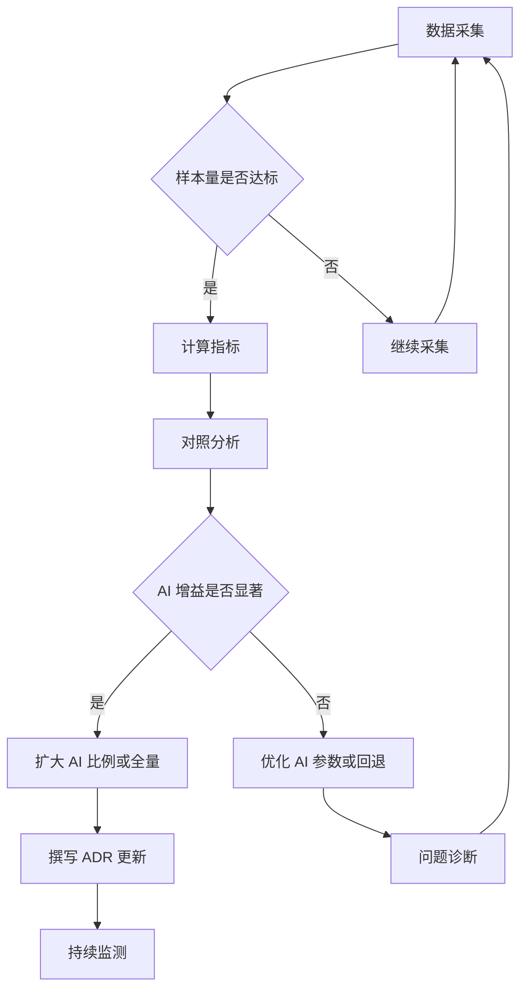

# ADR-001: AI 增益评估框架

> 日期：2026-08-24
> 状态：已采纳
> 关联：P5-06 AI 增益评估

---

## 1. 背景

EatWhat 的 AI 推荐系统已经实现，包括：
- 动态追问（最多 3 轮）
- AI 最终推荐（从食物字典中选择 5 个候选）
- 每日 3 次额度限制

但是我们还没有量化评估 AI 相比规则引擎的增益。本 ADR 定义 AI 增益的评估框架。

---

## 2. 决策

### 2.1 评估指标

| 指标 | 定义 | 采集方式 | 目标 |
|------|------|----------|------|
| **决策时间** | 从进入推荐流程到看到结果的时间 | 前端埋点（`time_to_result`） | AI ≤ 15s（当前 11-15s） |
| **接受率** | 用户点击"查附近商家"的比例 | 前端埋点（`click_nearby`） | AI > 规则引擎（+10%） |
| **换选率** | 用户返回修改答案重新生成的比例 | 前端埋点（`back_to_questionnaire`） | AI < 规则引擎（-20%） |
| **画像留存** | 用户保存偏好画像的比例 | 后端统计（`preference_saved`） | AI > 规则引擎（+5%） |

### 2.2 对照实验设计

**实验分组**：
- **对照组（Control）**：使用规则引擎生成推荐
- **实验组（Treatment）**：使用 AI 生成推荐

**分流策略**：
- 用户维度分流（同一用户始终在同一组）
- 分流比例：50/50（MVP 阶段）

**最小样本量**：
- 每组至少 200 次推荐
- 预计需要 2-4 周时间

### 2.3 触发 AI 增益标记的条件

当前已实现的 `final_reason` 标记：
- `ai_gain`：AI 生成成功
- `rule_engine_fallback_ai_fail`：AI 失败回退规则
- `legacy_rule_engine`：纯规则引擎

**后续需添加的标记**：
- `ai_gain_timeout`：AI 超时回退
- `ai_gain_low_confidence`：AI 置信度低（需评估）

### 2.4 数据采集

**前端埋点事件**：
```typescript
// 推荐结果页曝光
track('recommend.result_view', {
  final_reason: 'ai_gain' | 'rule_engine',
  time_to_result: 12345,  // ms
  ai_stage_count: 4,
  candidate_count: 5,
});

// 用户交互
track('recommend.click_nearby', { food_code: 'ramen' });
track('recommend.back_to_questionnaire');
track('recommend.expand_recommendations', { level: 3 | 5 });
track('recommend.save_preference', { source: 'auto' | 'manual' });
```

**后端日志字段**：
```json
{
  "ts_iso": "2026-08-24T15:30:00Z",
  "user_id_hash": "sha256:xxx",
  "session_id": "uuid",
  "ai_provider": "deepseek",
  "ai_mode": "auto",
  "final_reason": "ai_gain",
  "ai_response_time_ms": 11234,
  "schema_validation_passed": true,
  "candidate_count": 5,
  "user_used_quota": 1,
  "user_remaining_quota": 2,
}
```

### 2.5 评估流程



### 2.6 决策标准

**扩大 AI 比例**（从 50% 到 100%）的条件：
1. AI 接受率 > 规则引擎 + 10%
2. AI 换选率 < 规则引擎 - 20%
3. AI 决策时间中位数 ≤ 15s
4. AI 失败率 ≤ 5%

**回退到规则引擎**的条件：
1. AI 失败率 > 30%
2. AI 接受率 < 规则引擎
3. 用户反馈负面（通过 P6-04 反馈闭环收集）

---

## 3. 现状

### 3.1 已实现

- ✅ AI 动态追问（最多 3 轮）
- ✅ AI 最终推荐（5 个候选）
- ✅ 每日 3 次额度限制
- ✅ Schema 校验与规则降级
- ✅ 额度消耗/回滚机制

### 3.2 待实现

- [ ] 前端埋点完善（`time_to_result`、`ai_stage_count`）
- [ ] 后端日志字段规范化
- [ ] 数据分析脚本
- [ ] 周期性评估报告（建议每月一次）

---

## 4. 风险与缓解

| 风险 | 影响 | 缓解措施 |
|------|------|----------|
| API 延迟波动大 | AI 决策时间不稳定 | 已增加 15s 超时，回退规则引擎 |
| 用户样本量不足 | 无法统计显著差异 | MVP 阶段先做定性分析 |
| 分流作弊 | 用户可能清除 cookie 进入不同组 | 使用 user_id_hash 做后端分流 |

---

## 5. 后续步骤

1. **P5-06A**：完善前端埋点（2 天）
2. **P5-06B**：后端日志字段规范化（1 天）
3. **P5-06C**：编写数据分析脚本（1 天）
4. **P5-06D**：首次评估（采集 2 周数据后）

---

## 6. 参考

- [08_EatWhat_AI推荐系统设计.md](./08_EatWhat_AI推荐系统设计.md)
- [10_EatWhat_MVP开发计划.md](./10_EatWhat_MVP开发计划.md)
