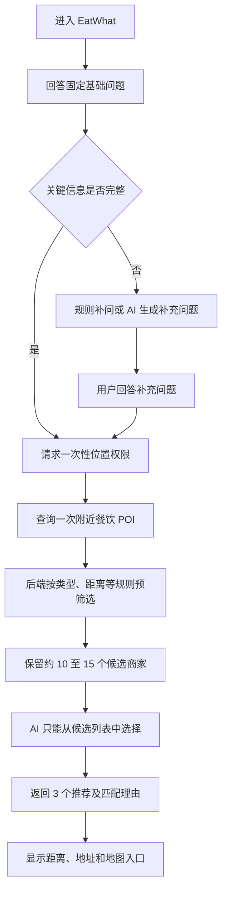
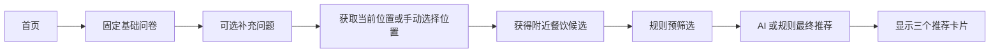
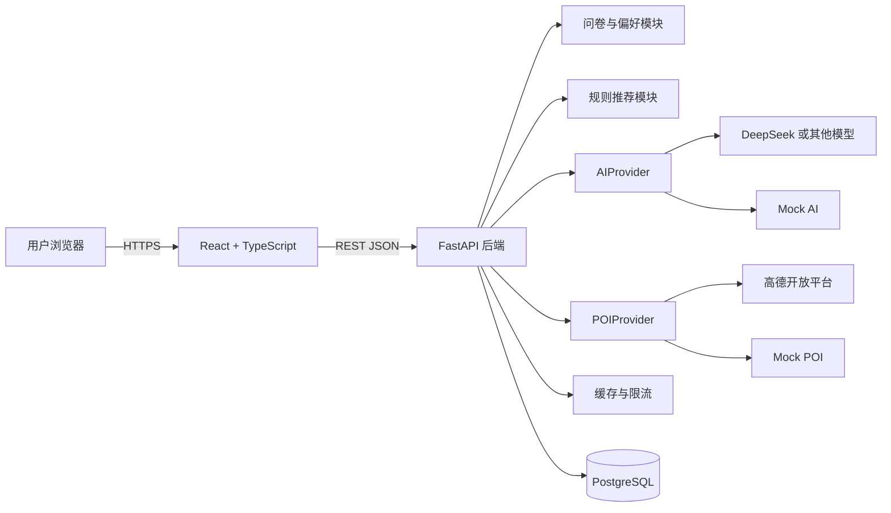
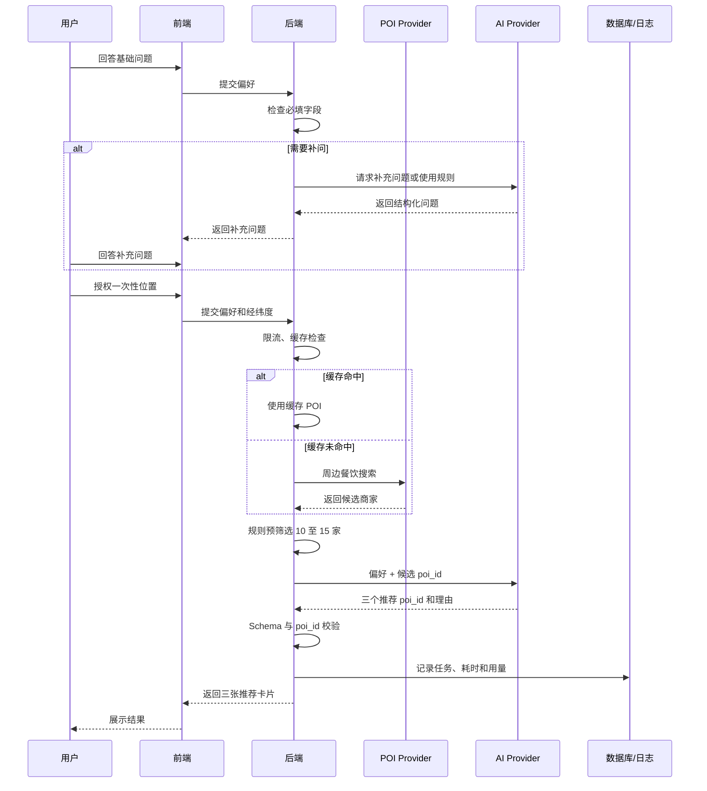
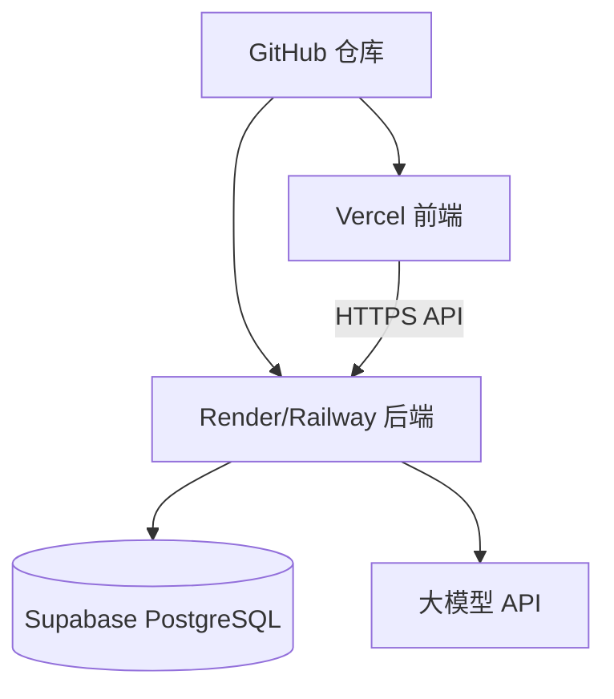
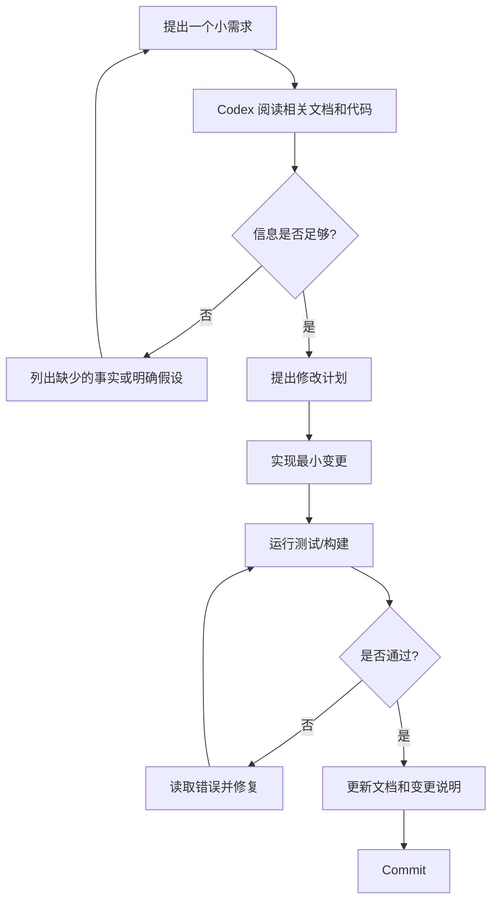

# EatWhat 完整交流记录、需求演进、最终结论与 Codex 交接文档 v2

> **文档用途**  
> 本文件用于把 EatWhat 项目截至 2026-07-22 的交流过程、用户需求、关键问答、决策依据、正式结论、技术实现方案、文档资产、当前进度和下一步开发任务统一整理到一个 Markdown 文件中。
>
> 将本文件放入 Codex、ChatGPT、Claude Code 或其他开发客户端的新对话后，对方应当能够理解：
>
> - 用户是谁、当前技术基础如何；
> - 为什么选择开发 EatWhat；
> - 需求是怎样一步步形成的；
> - 用户提出过哪些问题和修改意见；
> - 助手针对这些问题给出了什么回答；
> - 哪些方案被否定，哪些方案被确认；
> - 当前 v1.0 的功能和业务规则是什么；
> - 系统应该如何实现；
> - 已经完成了哪些设计文档；
> - 当前还没有写哪些代码；
> - Codex 接手后第一步应该做什么；
> - 哪些事情不能自行假设或擅自修改。
>
> **当前项目状态**：四个设计阶段已经完成，正式代码尚未开始。  
> **下一阶段**：M0——创建 GitHub 仓库、初始化 Monorepo、React、FastAPI、健康检查和 CI。  
> **项目定位**：用户的第一个完整 GitHub 全栈作品，可在 Windows 环境开发，可在线演示，同时适配电脑端和手机端。

---

# 0. 给新对话或 Codex 的阅读说明

## 0.1 先看这一节，避免被早期讨论误导

本文件同时包含：

1. **当前已经冻结的正式结论**；
2. **早期交流和需求演变过程**；
3. **曾经考虑但后来被替换的方案**。

因此必须遵守下面的优先级。

### 结论优先级

```text
本文件第1—15章的“当前权威结论”
        ↓
01_EatWhat_PRD_产品需求文档_v1.1_需求冻结版.md
        ↓
02—13号正式设计文档
        ↓
本文件后半部分的历史交流记录
        ↓
早期想法、示例和被否定方案
```

若历史讨论与当前结论冲突：

> **以当前权威结论为准，历史内容只用于理解为什么这样设计。**

## 0.2 不要把设计完成误认为代码完成

目前完成的是：

- 产品需求；
- 用户流程；
- 页面结构；
- 文字原型；
- 系统架构；
- 数据库；
- API；
- AI 推荐设计；
- 隐私安全；
- 开发计划；
- 测试计划；
- GitHub 规范。

目前尚未完成：

- GitHub 正式仓库；
- React 工程；
- FastAPI 工程；
- 数据库 Migration；
- Supabase 项目；
- 高德接入；
- AI 接入；
- 页面代码；
- 自动化测试代码；
- 在线部署。

Codex 不能看到设计文档后误称“项目已经开发完成”。

## 0.3 编码前必须统一的两处文档细节

在前期连续生成文档时，个别后续文档出现了与已经确认的交流结论不完全一致的字段。正式编码必须按以下规则修正。

### 修正一：匿名公共统计不保存问卷和忌口答案

用户此前已经确认：

> 匿名公共聚合只应包含食物类别、星期、用餐时段、粗略城市/区域和推荐来源，不应包含问卷、胃口、口味或忌口答案，因为这些内容可能较敏感，也不是“大家在吃什么”统计所必需的数据。

但 `06_数据库设计.md` 和 `09_隐私安全与免责声明.md` 的部分草稿字段仍列出了：

- appetite；
- tastes；
- avoidances。

正式实现时应删除这些公共共享字段。

**最终允许进入 `shared_choices` 的业务字段：**

```text
local_date
weekday
meal_period
food_code
source_type
city_code / city_name（可选、粗略）
district_code / district_name（可选、需要满足统计隐私要求）
created_at
source_user_id（内部可空关联）
source_session_id（内部可空关联）
is_active
```

不得公开或长期保存到公共共享表：

```text
base_answers
appetite
tastes
avoidances
budget
max_distance
AI补问答案
具体商家
精确坐标
邮箱
```

### 修正二：第一条垂直切片不提前接入 POI

部分总进度文档曾写成：

```text
固定问卷
→ React
→ FastAPI
→ Mock POI
→ 规则推荐
→ 三个结果
```

但开发计划和路线图中更合理、也更明确的 M1 是：

```text
固定问卷
→ React提交
→ FastAPI接收
→ Mock/规则推荐
→ 返回三个食物类型
→ 前端展示结果
```

M1 暂不包含：

- POI；
- 定位；
- Supabase Auth；
- 真实数据库；
- AI；
- 历史。

POI 和地点功能放到 M6，真实高德放到 M7。

---

# 1. 当前项目快照

## 1.1 项目名称

**EatWhat**

## 1.2 一句话说明

EatWhat 是一个面向中国大陆用户的响应式网页应用，通过固定问卷、可选 AI 补问、受约束的食物类型推荐和附近餐饮 POI 查询，帮助用户快速解决“今天吃什么”的选择困难。

## 1.3 当前阶段

```text
四个设计阶段：100%
正式编码与部署：0%

下一步：
M0 仓库与环境
```

## 1.4 项目目标

当前项目只考虑：

- 成为用户第一个完整 GitHub 全栈项目；
- 在 Windows 上完成主要开发；
- 可以在线演示；
- 同时适配电脑浏览器和手机浏览器；
- 展示 React、TypeScript、FastAPI、PostgreSQL、认证、AI、地图、测试、部署和 GitHub 工程化；
- 使用 Mock/Live 双模式，避免没有 Key 就无法运行；
- 控制 AI 和地图调用成本；
- 不追求当前阶段商业化、大规模用户和高并发。

## 1.5 最终技术方向

```text
React + TypeScript + Vite
            ↓
FastAPI 模块化单体
            ↓
Supabase Auth + Supabase PostgreSQL
            ↓
AIProvider：Mock + 真实模型
POIProvider：Mock + 高德
            ↓
GitHub + 云端部署
```

## 1.6 当前最重要的下一步

在确认 GitHub 账号和仓库可见性后：

```text
1. 创建 GitHub 仓库 eatwhat
2. 建立 Monorepo 根目录
3. 导入 docs
4. 创建 v0.1 Project Foundation Milestone
5. 创建 M0 第一批 Issues
6. 初始化 React + TypeScript + Vite
7. 初始化 FastAPI
8. 实现 GET /health/live
9. 建立前后端基础 CI
10. 完成 M0 验收
```

---

# 2. 用户背景、能力和协作方式

## 2.1 用户技术基础

用户目前属于编程初学者，但不是完全没有接触过代码。

已知情况：

- Python 基础语法较熟悉；
- 完成过 Python 入门课程；
- 曾借助 Codex 完成较完整的仿真和建模项目；
- 能表达业务想法，并让 AI 生成和修改代码；
- 对独立工程开发仍缺乏完整经验；
- C/C++ 只具备非常基础的阅读能力；
- 对指针、`vector`、现代 C++ 等缺少系统掌握；
- 对前后端、数据库、认证、部署、GitHub、CI 等正在建立整体认识。

## 2.2 开发环境

- 主要系统：Windows；
- 可使用 Chrome/Edge；
- 有 Android 手机；
- 有 iPhone；
- 没有把 Mac 作为当前主要开发环境；
- 希望尽量通过 Codex 辅助开发；
- 项目最终要上传 GitHub，并成为可展示的作品。

## 2.3 用户希望的讲解和执行方式

后续助手或 Codex 应当：

- 按初学者能够理解的方式解释；
- 不默认用户熟悉前后端工程；
- 每一步说明“为什么这样做”；
- 将大任务拆成明确的小任务；
- 给出可运行、可测试的代码；
- 不一次生成整个项目后让用户自行排错；
- 不擅自更改冻结需求；
- 遇到真正阻塞问题再询问；
- 每次修改后说明改了哪些文件、如何验证；
- 持续维护进度文档。

## 2.4 Codex 在项目中的角色

预期工作模式：

```text
用户：
提出需求、查看页面、反馈体验、决定产品方向

ChatGPT/规划助手：
需求整理、架构设计、任务拆分、审核和解释

Codex：
创建文件、编写代码、运行测试、读取报错、修改代码
```

Codex 不是产品决策者，不能自行添加功能或改变业务规则。

---

# 3. 需求形成的完整脉络

> 本章按时间和逻辑顺序记录需求怎样产生。部分早期表述为语义整理，不是聊天平台逐字逐句导出；关键近期消息保留了接近原话的表达。

## 3.1 最初问题：APP 到底如何完整开发

用户最初整理了一条 APP 开发流程：

```text
市场调研
→ 需求分析
→ 原型图设计
→ 前端开发
→ 后端架构设计
→ 后端开发
→ 服务启动
→ 模型接入
→ 登录系统
→ 云端部署
```

用户希望确认：

- 这个流程是否正确；
- 架构到底是什么；
- 前端和后端何时开始；
- 服务启动是什么意思；
- AI、登录和部署应该放在哪个阶段；
- 完整项目有哪些岗位。

助手指出最重要的问题：

> 架构、数据库和 API 不能等前端写完以后再设计，而应在正式开发前确定。

于是流程被调整为：

```text
用户与市场调研
→ 产品定位
→ 需求和优先级
→ 用户流程与原型
→ 架构
→ 数据库和API
→ 任务拆分
→ 前后端开发
→ 第三方服务接入
→ 联调
→ 测试与安全
→ 部署
→ 迭代
```

这一阶段形成的核心认识：

- JSON 只适合配置和 Mock，不适合所有数据；
- 用户、历史和额度应进入数据库；
- Secret 应进入环境变量；
- AI Key 必须放在后端；
- “前端静态、后端动态”不是严格定义；
- 首个项目应使用模块化单体，而不是微服务。

## 3.2 比较 Android、iOS 和网页

用户希望知道三类产品开发的区别，并结合自己的 Windows 环境判断难度。

结论：

```text
网页端 < Android < iOS（Windows为主）
```

原因不是简单地说某种语言更难，而是开发闭环不同：

网页：

```text
Codex写代码
→ Windows启动
→ 浏览器查看
→ 测试和报错
→ 继续修改
```

iOS 原生：

```text
Windows写代码
→ 仍需要Mac和Xcode编译、签名和真机测试
```

最终建议：

> 先做响应式网页，后续如果需要再复用后端做 Android 或 iOS 客户端。

这也是 EatWhat 最终选择网页端的基础原因。

## 3.3 将项目定位为第一个 GitHub 全栈作品

用户进一步询问：

- GitHub 是否必须公开前后端；
- Git、Commit、Push、Clone、PR、Release 是什么；
- 网页上线是否需要服务器和域名；
- AI API 费用由谁承担；
- 是否能获取位置和附近商家；
- 是否可以获取美团等平台数据；
- 完整开发需要哪些工具。

由此形成以下结论：

### GitHub

可以公开：

- 前端；
- 后端；
- 数据库结构和 Migration；
- 测试；
- 文档；
- Mock 数据；
- `.env.example`。

不能公开：

- 真实 `.env`；
- API Key；
- 数据库密码；
- JWT Secret；
- 真实用户数据；
- 生产凭据。

### 部署

第一版不必购买传统服务器和独立域名，可以采用：

```text
前端托管
+ Python后端托管
+ Supabase数据库和认证
```

### AI

必须经过自有后端：

```text
前端
→ FastAPI检查身份、额度和输入
→ FastAPI使用服务端Key调用模型
→ 校验结果
→ 返回前端
```

### 地图和商家

可以使用正式地图开放平台的 POI API。

不能默认：

- 抓取美团或点评私有接口；
- 绕过登录和反爬；
- 把第三方私有数据当作开放数据。

## 3.4 EatWhat 项目想法出现

用户提出开发一个帮助决定“今天吃什么”的项目。

早期设想是：

```text
基础问卷
→ AI追加问题
→ 获取位置
→ 查询附近商家
→ 把商家和偏好一起给AI
→ AI给出最终推荐
```

用户担心：

- 每个人使用都会消耗开发者 AI 额度；
- 每次地图搜索也可能产生大量费用；
- GitHub Demo 是否值得接真实服务。

助手将问题拆解后建议：

- 用户明确选择食物时不调用 AI；
- AI 只推荐食物类型；
- 真实商家交给地图；
- 不把三个 AI 候选全部拿去查地图；
- 用户点击具体类别后才查一次；
- 提供 Mock 模式；
- 设置每用户日额度和全站硬上限；
- 使用 Provider 抽象方便替换模型和地图。

由此确定 EatWhat 不是聊天机器人，也不是餐厅评价平台，而是：

> **一个减少选择数量的饮食决策辅助工具。**

---

# 4. 正式设计阶段的详细交互记录

## 4.1 用户要求先列四阶段计划

用户提出：

> “那就正式开始吧，你先列一个计划清单，核对一下目前要做的有哪些内容，下一次回答会完成哪些内容，还会剩余哪些内容。”

助手将项目设计划分为四个阶段：

```text
阶段一：产品需求与业务规则
阶段二：用户流程与原型
阶段三：系统与技术设计
阶段四：开发实施规划
```

为什么这样划分：

- 先回答“做什么”；
- 再回答“用户怎么操作”；
- 再回答“系统怎么实现”；
- 最后回答“代码按什么顺序写”。

这避免在需求未稳定时直接让 Codex 编码。

## 4.2 用户要求建立持续更新的总控文档

用户继续明确：

> “首先把整个四个阶段的具体内容，每个阶段干什么，也生成一份文档。这个文档也可以标注出当前完成了哪些、还剩哪些、下一步打算完成哪些，在整体完成前每次回答都更新一下；然后再完成第一阶段。”

助手据此创建：

- 项目总体规划与进度跟踪；
- PRD v1.0 初稿。

这一步形成了持续更新机制：

```text
每完成正式交付物
→ 更新当前阶段
→ 勾选完成项
→ 更新进度
→ 记录下一步
→ 更新版本记录
```

## 4.3 阶段一：PRD 初稿

PRD 初稿整理了：

- 产品目标；
- 目标用户；
- 功能范围；
- 登录与额度；
- 首页；
- 问卷；
- AI；
- 地点；
- 商家；
- 历史；
- 共享；
- 反馈；
- Mock/Live；
- 隐私；
- v1.1；
- 验收标准。

用户审核后只提出一个修改。

## 4.4 用户对“大家都在吃什么”冷启动提出修改

用户原话：

> “我觉得‘大家都在吃什么这个模块’，一开始肯定是没有任何数据的，所以我们要‘假设’出一些数据出来做展示。逻辑是基于真实数据的展示优先，但是没有的话就展示假设的数据，也不需要特意标注出来演示数据、假设数据之类的，观感不好。”

这条反馈的产品含义：

- 新项目没有用户共享数据；
- 如果页面显示“暂无数据”，观感差；
- 如果到处显示“演示数据”，同样破坏体验；
- 需要冷启动默认内容。

助手没有完全接受“伪装成真实统计”，而是给出折中规则：

```text
真实数据足够
→ 显示真实人数

真实数据不足
→ 默认热门食物补足
→ 不显示“演示/假设数据”标签
→ 不虚构“23人选择”之类人数
```

用户没有再提出异议，其他 PRD 内容也确认无问题。

为什么采用这一方案：

- 满足页面冷启动观感；
- 不用技术标签干扰用户；
- 避免制造虚假社会证明；
- 后续真实数据可以自然替换默认项。

PRD 随后更新为：

```text
01_EatWhat_PRD_产品需求文档_v1.1_需求冻结版.md
```

阶段一完成。

## 4.5 用户要求“进行下一步”

助手进入第二阶段，生成：

- 用户流程；
- 信息架构与页面清单。

这一阶段确定了：

- 注册成功后自动登录；
- 登录保护；
- 页面路由；
- 固定问卷流程；
- AI和自主选择分流；
- 位置流程；
- 商家流程；
- 历史、共享和反馈流程；
- 电脑端顶部导航；
- 手机端底部导航。

## 4.6 用户担心原型图不好设计

用户原话：

> “我感觉原型图你可能不是很好设计，要不先跳过或者给出一版文字性的描述？”

助手回答：

> 不建议完全跳过原型，因为页面内容、顺序、按钮和状态仍需提前确定；但可以把图形原型改成“文字版低保真原型”。

方案：

- ASCII 线框；
- 页面元素说明；
- 交互流程；
- 加载、错误、空数据和降级状态；
- 电脑端和手机端分别描述。

用户回答：

> “可以，那就这样吧。”

于是生成：

```text
04_EatWhat_文字版低保真原型与页面交互说明.md
```

为什么这个决定合理：

- 不需要当前阶段追求视觉设计；
- 已足够支持数据库、API和前端拆分；
- 后续可以让 Codex 根据文字原型生成真实页面；
- 在浏览器中实际调整比当前制作精细 Figma 更适合首个项目。

阶段二完成。

## 4.7 阶段三：系统架构和数据库

用户继续要求下一步。

助手确定：

```text
Supabase Auth负责身份
FastAPI负责所有业务
PostgreSQL保存业务数据
AIProvider和POIProvider隔离外部服务
```

关键架构结论：

- 模块化单体，不用微服务；
- React 直接使用 Supabase Auth 登录；
- React 获取 Access Token；
- 所有业务请求带 Bearer Token 访问 FastAPI；
- FastAPI 验证 Token；
- 浏览器不直接操作业务表；
- FastAPI 统一控制额度、历史、共享、日志和第三方调用。

数据库确定：

- profiles；
- daily_ai_usage；
- food_categories；
- recommendation_sessions；
- recommendation_items；
- merchant_snapshots；
- shared_choices；
- feedback；
- api_usage_logs；
- provider_daily_usage。

每日额度使用：

```text
used_count
reserved_count
```

防止并发绕过。

最终推荐请求使用：

```text
idempotency_key
```

防止网络重试重复扣次。

## 4.8 阶段三：API、AI 和隐私安全

用户继续要求下一步。

### API

采用：

```text
/api/v1
REST + JSON
Bearer Token
统一错误结构
Cursor分页
Idempotency-Key
```

注册登录不由 FastAPI 重复实现，而由 Supabase Auth 处理。

### AI

采用混合推荐：

```text
规则硬过滤
→ 规则评分
→ 生成合法候选
→ AI最多补问2题
→ AI只能从候选food_code选3项
→ 后端Schema和业务校验
→ 失败重试1次
→ 仍失败则规则降级
```

AI 不允许：

- 推荐具体商家；
- 编造评分；
- 自由创造类别；
- 进行过敏安全保证；
- 获取用户邮箱和精确位置。

### 隐私安全

确定：

- 精确坐标只用于当前查询，不进入历史；
- 共享默认关闭；
- 位置拒绝后有手动和演示地点；
- 日志不记录 Token、Key和精确坐标；
- AI结果标记“AI推荐”；
- 规则结果标记“基础推荐”；
- v1.1补齐账户注销和完整账户生命周期。

阶段三完成。

## 4.9 阶段四：开发计划和 ROADMAP

用户说“继续”。

助手把开发拆为：

```text
M0—M12
```

核心顺序：

```text
仓库
→ Mock问卷推荐闭环
→ 完整Mock页面
→ 数据库
→ Auth
→ 每日额度
→ 地点与Mock POI
→ 高德
→ AI
→ 公共模块
→ 测试
→ 部署
```

为什么不先接 AI、高德和 Supabase：

- 同时接多个真实服务，问题难定位；
- Mock可以先验证页面、API和业务；
- GitHub 项目无 Key 也可以运行；
- 第三方服务最后替换 Provider，不需要重写业务。

ROADMAP 版本：

```text
v0.1 仓库和环境
v0.2 第一条垂直切片
v0.3 完整Mock产品
v0.4 数据库和历史
v0.5 Supabase Auth
v0.6 每日额度与幂等
v0.7 地点和Mock POI
v0.8 高德Live
v0.9 AI Live与公共功能
v1.0 正式MVP
v1.1 完整账户生命周期
v1.2 体验和推荐优化
```

## 4.10 阶段四：测试和 GitHub 协作

用户说“开始吧”。

助手完成：

- 测试与验收计划；
- GitHub 仓库与协作规范。

测试重点：

- 额度并发；
- 幂等；
- 用户越权；
- AI非法输出；
- POI错误；
- 精确位置；
- Secret；
- 公共统计阈值；
- E2E；
- 响应式；
- 发布回滚。

GitHub 规范：

- Monorepo；
- `main`保护；
- Issue先行；
- 短生命周期分支；
- Conventional Commits；
- Draft PR；
- Squash Merge；
- CI通过后合并；
- Codex一次处理一个明确Issue；
- Secret不进入仓库；
- GitHub Actions最小权限。

至此四阶段设计完成。

---

# 5. 当前冻结的产品需求

## 5.1 产品定位

EatWhat 的目标不是展示无限商家，而是减少选择。

用户体验目标：

```text
回答少量问题
→ 获得一个首选食物类型
→ 必要时看两个备选
→ 选择一种
→ 查询附近商家
```

## 5.2 用户角色

### 未登录访客

可以：

- 登录；
- 注册；
- 查看说明；
- 使用演示账户入口。

不能使用个人历史和正式推荐流程。

### 正式用户

可以：

- 每日使用三次成功 AI 推荐；
- 使用不限次数的自主选择；
- 查看活动；
- 查看公共食物；
- 查询商家；
- 查看历史；
- 删除历史；
- 自愿匿名共享；
- 提交反馈。

### 公共演示账户

- 用于 GitHub 体验；
- 不保存真实个人资料；
- 显示公共账户警告；
- 历史定期清理；
- 不允许体验者注销；
- 每日额度可由维护逻辑重置。

## 5.3 认证

v1.0：

```text
Supabase Auth
邮箱 + 密码
```

包含：

- 注册；
- 登录；
- 退出；
- 会话保持；
- 演示账户。

注册成功后：

```text
自动登录并进入首页
```

v1.0 不做：

- 强制邮箱验证；
- 忘记密码；
- 重置密码；
- 注销账户；
- 手机验证码；
- 微信登录。

v1.1 必须实现或明确预留：

```text
/auth/verify-email
/auth/forgot-password
/auth/reset-password
/settings/delete-account
```

## 5.4 每日三次 AI 推荐

业务日期：

```text
Asia/Shanghai
每天00:00重置
```

只有下面的情况扣一次：

```text
用户未明确选择食物
→ 完成必要补问
→ 最终AI成功返回合法的三个推荐
```

不扣次数：

- 固定问卷；
- AI补问；
- 自主选择；
- 活动；
- 公共选择；
- 获取位置；
- 查询商家；
- 查看更多推荐；
- AI失败；
- POI失败；
- 规则降级；
- 刷新已有结果。

数据库必须保证：

```text
used_count + reserved_count <= 3
```

同一推荐生成使用幂等键。

## 5.5 首页

欢迎文案：

> 今天吃什么？

辅助文案：

> 是啊，吃什么。

核心入口：

> 开始我的推荐

首页模块：

- 顶部导航；
- 剩余次数；
- 活动横幅；
- 欢迎和开始推荐；
- 今天大家都在吃什么；
- 历史和设置入口。

手机公共项最多3个，电脑最多5个。

## 5.6 活动横幅

v1.0 使用人工配置：

```json
{
  "weekday": 4,
  "title": "疯狂星期四",
  "brand": "肯德基",
  "search_keyword": "肯德基",
  "image": "...",
  "enabled": true
}
```

点击：

```text
确认位置
→ 搜索附近品牌门店
→ 展示商家
```

不调用 AI，不扣次数。

固定提示：

> 活动内容及参与门店以品牌官方说明和门店实际情况为准。

不自动抓取外部网页，不保证门店参与活动。

## 5.7 今天大家都在吃什么

数据优先级：

```text
今天同用餐时段真实共享
→ 近几周同星期、同时间段真实参考
→ 默认热门项补足
```

真实人数：

```text
同食物至少3条匿名共享
```

不足3条：

- 不显示真实人数；
- 不暴露小样本；
- 用其他真实参考或默认热门项补足。

默认热门项：

- 不显示“演示数据”；
- 不显示“假设数据”；
- 不虚构人数；
- 可显示自然文案；
- 视觉上与真实卡片统一。

点击食物：

```text
选择地点
→ 查询附近商家
```

不调用 AI，不扣次数。

## 5.8 用餐时段

```text
05:00–10:00 早餐
10:00–14:30 午餐
14:30–17:00 下午茶
17:00–21:30 晚餐
21:30–05:00 夜宵
```

自动识别，但用户可以修改。

## 5.9 固定问卷

推荐顺序：

1. 用餐时段；
2. 胃口；
3. 忌口；
4. 口味；
5. 预算；
6. 最大距离；
7. 动态食物候选。

胃口：

- 清淡少量；
- 普通正餐；
- 丰盛；
- 不确定。

忌口：

- 辣；
- 海鲜；
- 牛羊肉；
- 香菜；
- 油腻；
- 生冷；
- 甜食；
- 暂无忌口。

口味：

- 酸；
- 甜；
- 辣；
- 咸香；
- 清淡；
- 大众稳妥；
- 都可以。

预算：

- 20以内；
- 20–40；
- 40–70；
- 70–120；
- 120以上；
- 不限。

距离：

- 500米；
- 1公里；
- 2公里；
- 3公里；
- 不限。

第七题由规则引擎生成6—10个候选。

用户选中具体食物：

```text
跳过AI
不扣次数
直接查商家
source_type = user_selected
```

## 5.10 AI 补问

触发：

- 用户没有明确选择；
- 当前信息仍有关键歧义；
- AI可用；
- 用户有额度。

数量：

```text
0—2题
```

每题：

- 3—6个选项；
- 选择题；
- 不重复固定问题；
- 不询问身份；
- 不询问医疗诊断；
- 不询问精确位置；
- 不出现具体商家。

补问成功不扣次数。

## 5.11 AI 最终推荐

AI只推荐：

```text
食物类型
```

不推荐商家。

返回正好3项：

1. 首选；
2. 备选一；
3. 备选二。

默认只显示首选。

“更多推荐”只展开已有结果，不再次调用 AI。

AI 必须从系统合法候选 `food_code` 中选择。

后端必须验证：

- JSON；
- Schema；
- 数量；
- priority；
- food_code；
- 不重复；
- 不与硬性忌口冲突；
- 理由长度；
- 不出现商家；
- 不做医疗或质量承诺。

失败：

```text
最多重试1次
→ 仍失败
→ 规则降级
→ 不扣额度
```

## 5.12 地点

三种方式同时存在：

1. 浏览器当前位置；
2. 手动搜索地点；
3. 预设演示地点。

位置只在用户准备查商家时请求。

不在首页进入时立即弹定位。

当前会话可复用地点。

拒绝定位：

- 手动搜索；
- 演示地点；
- 只看食物推荐。

精确坐标：

- 只用于当前 POI 查询；
- 默认不写数据库；
- 不写普通日志；
- 不发送 AI。

## 5.13 商家

商家来自：

```text
高德POI或Mock POI
```

默认显示5家。

字段：

- 商家名称；
- 分类；
- 距离；
- 地址；
- 地图入口。

不承诺：

- 真实评分；
- 人均价格；
- 菜单；
- 营业；
- 排队；
- 活动参与；
- “最好吃”。

AI不能编造商家。

## 5.14 历史

保存：

- 时间；
- 星期；
- 用餐时段；
- 固定问卷；
- AI补问和回答；
- 三个推荐；
- 最终选择；
- 查看过的商家快照；
- 来源；
- 满意度；
- 是否共享。

不保存：

- 精确坐标；
- Token；
- System Prompt全文；
- Secret。

支持：

- 查看；
- 删除单条；
- 清空全部。

## 5.15 推荐来源

```text
user_selected
ai_recommended
community_selected
activity_selected
rule_fallback
```

## 5.16 匿名共享

默认：

```text
不共享
```

用户完成选择后主动同意。

当前权威规则：

共享公共统计只保留：

- 日期；
- 星期；
- 用餐时段；
- 食物类别；
- 推荐来源；
- 粗略城市/区域（可选且需隐私控制）。

不共享：

- 邮箱；
- 精确位置；
- 问卷；
- 胃口；
- 口味；
- 忌口；
- 预算；
- AI对话；
- 具体商家。

v1.1注销：

- 删除个人历史；
- 删除个人业务数据；
- 共享记录解除 `user_id` 和会话关联；
- 只有真正匿名的数据才可保留。

## 5.17 满意度

简单反馈：

- 有帮助；
- 没帮助。

详细反馈可选：

- 是否符合胃口；
- 是否解决选择困难；
- 是否找到商家；
- 改进建议。

不强制，不弹阻断式窗口。

## 5.18 Mock/Live

Mock：

- 不需要真实 Key；
- 可完整演示；
- CI可测试；
- Provider故障可降级。

Live：

- Supabase；
- PostgreSQL；
- 真实AI；
- 高德。

支持混合：

- 真实Auth + Mock AI；
- 真实Auth + Mock POI；
- 等等。

---

# 6. 页面和用户流程结论

## 6.1 路由

v1.0 主要路由：

```text
/
/auth/login
/auth/register
/home
/recommend
/recommend/questionnaire
/recommend/summary
/recommend/follow-up
/recommend/result/:id
/location/select
/restaurants
/community
/history
/history/:id
/settings
/about
/disclaimer
/privacy
*
```

v1.1 预留：

```text
/auth/verify-email
/auth/forgot-password
/auth/reset-password
/settings/delete-account
```

## 6.2 核心流程

### 自主选择

```text
登录
→ 问卷
→ 选择明确食物
→ 不调用AI
→ 地点
→ 商家
→ 历史
→ 可分享/反馈
```

### AI推荐

```text
登录
→ 问卷
→ 都没有
→ 检查额度
→ 0—2个补问
→ AI返回3项
→ 成功扣1次
→ 用户选择1项
→ 地点
→ 商家
```

### 活动

```text
点击活动
→ 地点
→ 品牌POI
```

### 公共食物

```text
点击食物
→ 地点
→ 类别POI
```

## 6.3 响应式

电脑：

- 顶部导航；
- 首页可左右分栏；
- 公共项5个；
- 问卷可显示步骤栏；
- 商家宽卡片。

手机：

- 单列；
- 底部导航：主页、推荐、历史、我的；
- 公共项3个；
- 问卷一页一题；
- 商家单列。

---

# 7. 系统架构结论

## 7.1 模块化单体

后端是一个 FastAPI 应用，但内部按模块划分。

不采用微服务。

原因：

- 单人项目；
- 首个全栈项目；
- 统一部署和调试更简单；
- 不需要分布式事务和服务治理。

## 7.2 认证链路

```text
React
→ Supabase Auth注册/登录
→ 获得Access Token
→ 调用FastAPI并携带Bearer Token
→ FastAPI验证JWT
→ 从sub得到user_id
→ 执行业务
```

不能只Base64解码Token后信任内容。

## 7.3 数据库访问

```text
浏览器
→ FastAPI
→ PostgreSQL
```

浏览器不直接操作业务表。

原因：

- 额度；
- 权限；
- 共享过滤；
- 第三方日志；
- 业务一致性；
- 测试和安全。

## 7.4 Provider

```text
AIProvider
├── MockAIProvider
└── LiveAIProvider

POIProvider
├── MockPOIProvider
└── AmapPOIProvider
```

业务代码不能写死某一家模型SDK或高德原始字段。

## 7.5 后端分层

```text
API
→ Service
→ Repository
→ Database

Service
→ Provider
```

API层不写复杂业务。

Repository只负责数据库。

Provider只负责外部服务适配。

---

# 8. 数据库结论

## 8.1 主要表

```text
app.profiles
app.daily_ai_usage
app.food_categories
app.recommendation_sessions
app.recommendation_items
app.merchant_snapshots
app.shared_choices
app.feedback
app.api_usage_logs
app.provider_daily_usage
```

## 8.2 用户标识

统一使用：

```text
auth.users.id
```

不能使用邮箱作主键。

## 8.3 推荐会话状态

```text
draft
follow_up_ready
quota_reserved
generating
succeeded
failed
rule_fallback
merchant_search
completed
cancelled
```

## 8.4 额度

复合主键：

```text
(user_id, usage_date)
```

字段：

```text
daily_limit
used_count
reserved_count
```

约束：

```text
used_count >= 0
reserved_count >= 0
used_count + reserved_count <= daily_limit
```

## 8.5 幂等

```text
UNIQUE(user_id, idempotency_key)
```

## 8.6 Migration

建议：

```text
SQLAlchemy Models
+ Alembic
```

数据库结构不能长期依赖 Supabase Dashboard 手工修改。

---

# 9. API 结论

## 9.1 前缀

```text
/api/v1
```

## 9.2 通用错误

```json
{
  "error": {
    "code": "AI_PROVIDER_UNAVAILABLE",
    "message": "智能推荐暂时不可用",
    "request_id": "..."
  }
}
```

## 9.3 主要接口

```text
GET  /home
GET  /me
GET  /me/ai-quota
GET  /activities
GET  /food-categories
GET  /questionnaire
POST /questionnaire/candidates

POST  /recommendations
PATCH /recommendations/{id}/base-answers
POST  /recommendations/{id}/follow-up-questions
PATCH /recommendations/{id}/follow-up-answers
POST  /recommendations/{id}/generate
GET   /recommendations/{id}
POST  /recommendations/{id}/select-food
POST  /recommendations/{id}/complete

POST /locations/search
POST /locations/reverse
GET  /locations/demo
POST /restaurants/search

GET    /community/foods
POST   /recommendations/{id}/share
PUT    /recommendations/{id}/feedback

GET    /history
GET    /history/{id}
DELETE /history/{id}
DELETE /history

GET /health/live
GET /health/ready
```

## 9.4 最终推荐

必须请求头：

```text
Idempotency-Key: UUID
```

---

# 10. AI 推荐实现结论

## 10.1 规则与AI分工

规则：

- 过滤；
- 评分；
- 候选；
- 降级；
- 多样性基础。

AI：

- 判断是否需要补问；
- 生成0—2个选择题；
- 从候选中选3项；
- 给出短理由。

## 10.2 食物词典

每个类别至少有：

```text
code
display_name
aliases
poi_keywords
taste_tags
appetite_tags
avoidance_tags
meal_periods
budget_min/max
format_family
enabled
```

## 10.3 输出质量

目标：

- 正好3项；
- 合法率100%（后端拦截）；
- 不重复；
- 至少两个形式族；
- 理由15—60汉字；
- 不出现商家；
- 不出现虚假评分；
- 不做过敏保证。

---

# 11. 隐私和安全结论

## 11.1 前端不可持有

- 数据库连接；
- Supabase Secret；
- AI Key；
- 高德服务端Key；
- JWT私钥。

## 11.2 日志不可记录

- 密码；
- Authorization；
- Refresh Token；
- Secret；
- 精确坐标；
- 完整Prompt；
- 完整邮箱。

## 11.3 安全控制

- HTTPS；
- CORS白名单；
- Token完整验证；
- 资源所属检查；
- Pydantic输入校验；
- 幂等；
- 限流；
- CSP；
- XSS转义；
- 依赖扫描；
- Secret扫描；
- Provider开关。

## 11.4 正式免责声明

需要覆盖：

- 一般饮食建议；
- 忌口和过敏；
- AI不准确；
- 商家数据误差；
- 活动变化；
- 位置使用；
- 公共人数与默认热门项。

---

# 12. 开发路线

## 12.1 M0—M12

```text
M0  仓库与环境
M1  问卷→Mock推荐→结果
M2  完整Mock页面
M3  数据库与历史
M4  Supabase Auth
M5  额度与幂等
M6  地点与Mock POI
M7  高德Live
M8  AI Live
M9  公共模块与活动
M10 反馈与设置
M11 测试和加固
M12 部署与v1.0.0
```

## 12.2 当前只做M0

M0 任务：

```text
Issue 1：初始化Monorepo
Issue 2：初始化前端
Issue 3：初始化后端
Issue 4：实现健康检查
Issue 5：建立前端CI
Issue 6：建立后端CI
Issue 7：导入项目文档
Issue 8：补充README骨架
```

M0不能提前：

- 创建复杂数据库表；
- 接Supabase；
- 接AI；
- 接高德；
- 写完整页面；
- 做生产部署。

## 12.3 M1固定范围

```text
固定问卷
→ FastAPI Mock推荐
→ 三个食物结果
→ 首选和更多推荐
```

不包含POI。

---

# 13. 测试和发布结论

## 13.1 最高风险测试

- 同用户同时4个AI请求；
- 同幂等键重复请求；
- AI失败释放额度；
- 用户A访问用户B历史；
- 精确位置是否入库或日志；
- AI输入是否包含身份；
- 公共人数阈值；
- 默认热门项是否虚构人数；
- Secret是否进入前端。

## 13.2 P0缺陷

以下问题阻止发布：

- 越权；
- Secret泄露；
- 额度可绕过；
- 重复扣次；
- 主流程不可用；
- 精确位置长期保存；
- AI编造商家并展示；
- Migration破坏数据。

## 13.3 发布门槛

- CI全绿；
- Mock可独立运行；
- Live可关闭；
- 主要E2E通过；
- README可复现；
- 线上HTTPS；
- 演示账户；
- 隐私说明；
- Release和已知问题。

---

# 14. GitHub 和 Codex 协作规则

## 14.1 仓库

建议：

```text
eatwhat/
├── frontend/
├── backend/
├── supabase/
├── docs/
├── scripts/
├── .github/
├── README.md
├── LICENSE
├── .gitignore
└── .env.example
```

## 14.2 工作流

```text
创建Issue
→ 创建短分支
→ Codex实现
→ 本地测试
→ Commit
→ Push
→ Draft PR
→ CI
→ 自我审查
→ Squash Merge
```

## 14.3 分支

```text
feat/12-questionnaire-page
fix/31-quota-idempotency
test/42-auth-isolation
security/54-redact-location-logs
```

## 14.4 Commit

```text
feat(frontend): add questionnaire step navigation
feat(backend): add mock recommendation endpoint
fix(quota): release reservation after provider timeout
test(auth): add cross-user history access tests
docs: update M0 setup guide
```

## 14.5 Codex单次任务模板

```text
任务目标：
背景文档：
允许修改：
禁止修改：
接口合同：
验收标准：
测试要求：
提交要求：
```

Codex每次必须报告：

- 修改文件；
- 实现内容；
- 测试命令；
- 测试结果；
- 风险；
- 未完成内容。

---

# 15. 尚未最终决定、不得擅自假设的事项

## 15.1 GitHub

需要用户决定：

- 使用哪个 GitHub 账号；
- 仓库 Public 或 Private；
- 是否让连接的 GitHub 工具直接创建仓库。

建议：

- 开发初期可 Private；
- 准备作品展示后转 Public；
- 或从一开始 Public，但严格保证无Secret。

## 15.2 UI

尚未冻结：

- 配色；
- Logo图形；
- 字体；
- 图标库；
- CSS方案；
- UI组件库；
- 动画。

Codex在M0/M1不要自行引入大型UI体系。

## 15.3 真实AI Provider

尚未最终确定：

- 模型厂商；
- 模型名称；
- API价格；
- 数据政策；
- 国内可用性。

在M8开始前重新核验。

## 15.4 部署平台

尚未最终确定：

- 前端平台；
- FastAPI平台；
- 域名；
- 错误监控。

在M12前选择。

## 15.5 演示地点

具体首批地点尚可调整。

文档示例包括：

- 光谷广场；
- 江汉路；
- 楚河汉街。

正式上线应选择稳定、适合展示的位置。

## 15.6 口味多选规则

口味是：

- 单选；
- 或最多两项多选；

在前端开发问卷前需要最终确认。建议最多两项。

---

# 16. 现有正式文档和用途

| 编号 | 文件 | 用途 |
|---:|---|---|
| 00 | `EatWhat_项目总体规划与进度跟踪_v0.9_设计阶段完成.md` | 总进度 |
| 01 | `01_EatWhat_PRD_产品需求文档_v1.1_需求冻结版.md` | 产品权威需求 |
| 02 | `02_EatWhat_用户流程.md` | 用户操作流程 |
| 03 | `03_EatWhat_信息架构与页面清单.md` | 页面、路由和导航 |
| 04 | `04_EatWhat_文字版低保真原型与页面交互说明.md` | 页面布局和状态 |
| 05 | `05_EatWhat_系统架构设计.md` | 系统职责和技术结构 |
| 06 | `06_EatWhat_数据库设计.md` | 表、关系、额度和删除 |
| 07 | `07_EatWhat_API接口设计.md` | API合同 |
| 08 | `08_EatWhat_AI推荐系统设计.md` | 规则、Prompt、Schema和降级 |
| 09 | `09_EatWhat_隐私安全与免责声明.md` | 数据最小化和安全 |
| 10 | `10_EatWhat_MVP开发计划.md` | M0—M12开发顺序 |
| 11 | `11_EatWhat_测试与验收计划.md` | 测试和发布门槛 |
| 12 | `12_EatWhat_ROADMAP.md` | v0.1—v1.2路线 |
| 13 | `13_EatWhat_GitHub仓库与协作规范.md` | Git、PR、CI、Codex规范 |

本交接文件不能代替全部细节，但应让新对话先形成完整认识。

---

# 17. Codex 接手后的第一段提示词

可将下面内容与本文件一并提供给 Codex：

```text
你正在接手 EatWhat 项目。

请先完整阅读：
1. EatWhat_完整交流记录_需求演进_最终结论与Codex交接文档_v2.md
2. EatWhat_项目总体规划与进度跟踪_v0.9_设计阶段完成.md
3. 01_EatWhat_PRD_产品需求文档_v1.1_需求冻结版.md
4. 10_EatWhat_MVP开发计划.md
5. 13_EatWhat_GitHub仓库与协作规范.md

当前设计阶段已完成，但代码尚未开始。
你不能直接实现整个项目，也不能接入Supabase、AI或高德。

当前只执行M0：仓库与环境。

请先输出：
- 你对项目目标的理解；
- 当前M0范围；
- 你认为需要创建的目录和文件；
- 哪些内容明确不在M0；
- 拟执行的测试和验收。

特别注意：
- 公共匿名统计不保存问卷、胃口、口味、忌口或预算；
- 第一条垂直切片不包含POI；
- 不得创建或提交任何真实Secret；
- 不得擅自修改冻结需求；
- 每次只处理一个明确Issue。
```

---

# 18. Codex 第一个实现任务建议

在仓库创建完成后，第一个 Issue：

```text
Title:
chore: initialize EatWhat monorepo structure

目标：
创建项目根目录、frontend、backend、docs、scripts、.github等基础目录，
加入README骨架、LICENSE、.gitignore、.editorconfig和.env.example。

允许修改：
仓库根目录和空目录占位文件。

禁止修改：
不初始化Supabase；
不接AI；
不接高德；
不创建数据库表；
不实现业务页面；
不写真实Secret。

验收：
目录符合10号开发计划；
README说明项目尚处M0；
.env.example只包含变量名；
.gitignore忽略.env、node_modules、Python缓存、构建产物；
所有13份设计文档进入docs；
Git状态干净。
```

第二个 Issue：

```text
feat(frontend): initialize React TypeScript Vite application
```

第三个 Issue：

```text
feat(backend): initialize FastAPI and health endpoint
```

---

# 19. 结论是如何得出的

## 19.1 为什么做网页而不是原生APP

- Windows闭环完整；
- Codex可直接运行和调试；
- 在线演示容易；
- 响应式可覆盖手机；
- 后续可以复用后端做APP。

## 19.2 为什么使用Supabase

- 账户是云端账户；
- 邮箱密码认证现成；
- PostgreSQL统一；
- 适合首个项目；
- v1.1账户功能可继续扩展。

## 19.3 为什么FastAPI统一业务

- 用户有Python基础；
- Token、额度、AI、地图和历史集中管理；
- 避免前端绕过规则；
- API和测试更清晰。

## 19.4 为什么AI只推荐食物类型

- AI不知道真实商家状态；
- 避免幻觉；
- 地图更适合查POI；
- 减少输入和成本；
- 可验证和可降级。

## 19.5 为什么默认热门项不标记“演示”

- 用户明确认为影响观感；
- 冷启动需要内容；
- 但虚构人数会误导；
- 因此保留统一视觉，不提供假人数。

## 19.6 为什么每天3次成功结果才扣

- 控制开发者成本；
- 补问本身不是完整价值；
- 失败不应让用户损失；
- 自主选择无需AI；
- 额度必须由服务器和数据库控制。

## 19.7 为什么先Mock再Live

- 降低调试复杂度；
- 没有Key也能运行；
- CI可稳定测试；
- 真实服务可替换；
- GitHub访问者可立即体验。

## 19.8 为什么现在不做精细原型

- 用户担心图形原型质量；
- 文字原型已足够支持开发；
- 真实浏览器中更容易调整；
- 首个项目优先业务和工程完整性。

## 19.9 为什么不使用微服务

- 项目规模小；
- 单人开发；
- 微服务增加部署、日志和事务难度；
- 模块化单体已经足够展示架构能力。

---

# 20. 新对话必须保持的工作习惯

1. 不重复询问已经明确的需求；
2. 每次大任务先核对当前里程碑；
3. 不越级接入后续技术；
4. 不一次修改过多模块；
5. 每次输出可执行命令；
6. 每次输出验收标准；
7. 先运行测试再宣布完成；
8. 发现文档冲突时列出，不静默猜测；
9. 当前官方版本、价格和平台规则在实际接入时重新核验；
10. 涉及GitHub写操作时先明确仓库和分支；
11. 不在用户不知情时创建付费资源；
12. 不把Mock能力删除；
13. 不把位置和AI隐私边界放宽；
14. 持续更新总进度和ROADMAP。

---

# 21. 当前完整结论

目前可以认为：

- 项目主题已经确定；
- 产品范围已经冻结；
- 页面和流程已经明确；
- 系统架构已经明确；
- 数据库和API已经设计；
- AI和地图边界已经明确；
- 隐私安全已经设计；
- 开发和测试路线已经确定；
- GitHub协作方式已经确定；
- 正式代码尚未开始；
- 现在不应继续无限设计；
- 下一步应正式创建仓库并执行M0。

---

# 22. 历史交接文档原文

> 下方附上 2026-07-17 生成的上一版完整交接文档，作为更早阶段的交流档案。  
> 其中可能存在尚未冻结的早期想法和旧状态。阅读时必须以上文当前权威结论为准。

---

# 首个全栈项目：交流记录、决策依据与 Codex 交接文档

> 文档用途：将本阶段关于 APP、网页、GitHub、部署、大模型、位置服务和开发工具的交流完整整理为一份可移交上下文。将本文件交给新的 ChatGPT、Codex 或其他开发助手后，对方应能够理解：用户的背景、需求如何产生、目前已经讨论过什么、为什么得出当前结论、下一步应该做什么，以及后续实现时应遵守哪些约束。
>
> 文档性质：这是“项目上下文 + 需求演变记录 + 技术决策说明 + EatWhat 项目方案 + 下一步实施指南”。项目主题已经确定为网页项目 **EatWhat**，目标是帮助用户解决“今天吃什么”的选择困难；但具体页面、问题字段、推荐规则和 API 契约仍需在编码前冻结。
>
> 当前整理日期：2026-07-17

---

## 目录

1. [用户背景与现实条件](#1-用户背景与现实条件)
2. [最初提出的 APP 开发流程](#2-最初提出的-app-开发流程)
3. [交流过程与需求演变（含 EatWhat 可行性评估）](#3-交流过程与需求演变)
4. [目前已经形成的核心结论](#4-目前已经形成的核心结论)
5. [这些结论是如何得出的](#5-这些结论是如何得出的)
6. [EatWhat 产品方向与 MVP](#6-当前推荐的项目方向)
7. [建议采用的系统架构](#7-建议采用的系统架构)
8. [Git 与 GitHub 的项目规范](#8-git-与-github-的项目规范)
9. [网页上线、服务器与部署方案](#9-网页上线服务器与部署方案)
10. [大模型接入、密钥和费用控制](#10-大模型接入密钥和费用控制)
11. [位置与附近商家数据的实现及合规边界](#11-位置与附近商家数据的实现及合规边界)
12. [完整开发工具链](#12-完整开发工具链)
13. [下一步应该做什么](#13-下一步应该做什么)
14. [适合交给 Codex 的实施工作流](#14-适合交给-codex-的实施工作流)
15. [Codex 新对话可直接使用的上下文提示词](#15-codex-新对话可直接使用的上下文提示词)
16. [仍未确定、不能擅自假设的事项](#16-仍未确定不能擅自假设的事项)
17. [完成项目的验收标准](#17-完成项目的验收标准)
18. [本阶段已经生成的配套文档](#18-本阶段已经生成的配套文档)

---

# 1. 用户背景与现实条件

## 1.1 用户的技术基础

用户目前属于编程初学者，主要情况如下：

- Python 基础语法较熟悉，完成过入门课程。
- 曾借助 Codex 完成过较完整的仿真、建模或项目搭建，但独立开发能力仍然有限。
- 对 C/C++ 只具备非常基础的阅读能力，对指针、`vector`、现代 C++ 等缺乏系统掌握。
- 对完整的软件工程流程、前后端、架构、服务、部署、Git、数据库等概念还处于建立整体认识的阶段。
- 开发时预计高度依赖 Codex：由用户提出需求、查看效果、提供反馈，Codex 负责大量代码生成、修改、测试和排错。

## 1.2 用户的设备与环境

- 主要开发电脑系统：Windows。
- 拥有安卓手机，可用于 Android 真机测试。
- 拥有 iPhone，可用于 iOS 真机测试，但目前没有明确说明拥有 Mac。
- 目标之一是将项目上传到 GitHub，作为个人第一个完整、可展示的项目。

## 1.3 用户目前真正想实现的目标

需求已经从最初的“理解 APP 开发流程”，逐步演变为：

> 在 Windows 环境中，以 Codex 为主要开发助手，从零完成一个结构规范、可以在线运行、可供他人演示、能够公开展示在 GitHub 上的完整网页全栈项目，并通过这个项目建立对产品、前端、后端、数据库、API、AI 接入、定位、地图 POI、部署和版本管理的整体认识。

当前已经确定的项目主题为：

> **EatWhat：帮助用户根据当前饮食偏好和附近餐饮地点，快速从“今天吃什么”的选择困难中筛选出三个合适选项。**

当前目标只考虑：

- 作为第一个 GitHub 完整作品；
- 能够在线演示；
- 能展示完整的软件工程流程；
- 控制 API 成本和密钥风险；
- 不考虑现阶段长期商业运营、付费规模化和高并发。

当前仍然优先采用网页端，而不是 Android 或 iOS 原生客户端。后续移动端可以复用同一套后端 API。
---

# 2. 最初提出的 APP 开发流程

用户最初在 `APP开发流程.txt` 中总结了以下流程：

```text
市场调研
→ 需求分析
→ 原型图设计
→ 前端开发
→ 后端架构设计
→ 后端开发
→ 服务启动
→ 模型接入
→ 登录系统
→ 云端服务部署
```

并提出了九点注意事项：

1. 数据和逻辑解耦，数据放在单独的 JSON 文件中。
2. 动态和静态分离：前端默认展示的是静态数据，后端返回动态数据。
3. 架构设计可能包括服务划分、技术栈选择、数据库设计和 API 详细列表。
4. 可以建立 BAT 文件，一键启动服务。
5. 点击按钮后，把用户数据整合成提示词发送给大模型，再把模型结果包装为统一数据结构返回客户端。
6. 用户资料只填写一次，登录后读取，不需要每次打开 APP 都重复填写。
7. 前端和后端可以分为两个工作流，实现并行开发。
8. AI 在信息不足时继续追问，以选择题方式补全需求，达到较高把握后再执行。
9. 用户增长缓慢时，可以让 AI 设计增长实验和裂变方案。

这份总结抓住了产品、前端、后端、AI 和部署的主干，但并不是完整、严格的软件开发流程。后续讨论主要围绕纠正顺序、补足缺失环节、解释概念以及评估不同平台的可行性展开。

---

# 3. 交流过程与需求演变

# 3.1 第一阶段：评估原始 APP 开发流程

## 用户提出的问题

用户希望确认：

- 原始总结是否正确；
- 是否存在遗漏或错误；
- 如果由助手设计，每一步会如何具体设计；
- “后端架构”和“架构设计”究竟是什么；
- “服务启动”是什么意思，需要启动什么服务；
- 原型图由谁绘制，如何保证前端能够实现；
- 整个开发过程可划分为哪些岗位，每个岗位负责什么。

## 助手给出的主要回答

### 3.1.1 对原始流程的修正

原流程：

```text
市场调研 → 需求分析 → 原型图设计 → 前端开发 → 后端架构设计 → 后端开发 → 服务启动 → 模型接入 → 登录系统 → 云端服务部署
```

被修正为更完整的流程：

```text
市场与用户调研
→ 产品定位与需求分析
→ 技术和商业可行性验证
→ 功能规划与优先级
→ 用户流程和原型设计
→ UI 视觉设计
→ 系统架构设计
→ 数据库和 API 设计
→ 开发任务拆分
→ 前后端并行开发
→ 登录、AI、地图、支付等功能模块接入
→ 前后端联调
→ 测试与安全检查
→ 云端部署
→ 正式发布
→ 数据监控与持续迭代
```

最重要的修正是：

> 架构设计、数据库设计和 API 约定应在前后端正式开发之前完成，而不是前端写完以后再做后端架构。

原因：前端和后端必须提前约定请求参数、返回字段、错误码和数据结构。否则双方可能分别按不同的数据格式开发，造成大量返工。

### 3.1.2 对“JSON 解耦”的修正

用户原本认为数据应与逻辑解耦，并放入单独的 JSON 文件。结论是：

- “数据不要写死在代码逻辑中”这一方向正确；
- 但不是所有数据都应该放在 JSON 中；
- 固定配置、演示数据、前端 Mock 数据适合 JSON；
- 用户、订单、聊天、权限、会员、历史记录等应放数据库；
- API Key、数据库密码等应放环境变量；
- 图片、音频、文件适合对象存储；
- 验证码和临时状态可放缓存。

数据存储的大致分类：

| 数据类型 | 推荐位置 |
|---|---|
| 固定选项、默认文字 | 前端常量或 JSON |
| 用户偏好 | 本地存储或数据库 |
| 用户账户、订单、历史记录 | 数据库 |
| 图片、音频、文件 | 对象存储 |
| 密钥、密码、连接地址 | 环境变量 |
| 验证码、临时缓存 | Redis 或内存缓存 |

### 3.1.3 对静态和动态数据的修正

用户最初将“前端常量”理解为静态数据、“后端返回”理解为动态数据。后续结论是：

- 静态或动态取决于数据是否随用户、时间、业务状态变化，而不只是来自前端还是后端；
- 后端也可以返回长期不变的字典数据；
- 前端也可以产生当前时间等动态数据；
- 涉及会员、金额、权限、次数的内容必须以后端为准，不能只依赖前端。

### 3.1.4 对软件架构的解释

架构被定义为：

> 决定软件由哪些组成部分构成、每部分负责什么、它们如何通信、数据如何流动、系统如何部署、出错后如何处理，以及未来如何扩展的一组整体设计。

架构设计通常包括：

1. 系统边界与主要组成部分；
2. 前后端职责；
3. 模块或服务划分；
4. 技术栈选择；
5. 数据库设计；
6. API 设计；
7. 用户认证和权限；
8. 数据流；
9. 错误处理；
10. 安全和隐私；
11. 性能和扩展性；
12. 部署方式；
13. 日志、监控和备份。

对于个人首个项目，推荐“模块化单体”，不推荐一开始使用微服务。

示例：

```text
backend/
├── auth/       # 登录、Token、权限
├── users/      # 用户资料
├── ai/         # 大模型调用
├── records/    # 历史记录
├── location/   # 定位和 POI
├── billing/    # 次数、积分、会员
└── common/     # 公共工具、错误处理
```

### 3.1.5 对“服务启动”的解释

服务被解释为：

> 一个持续运行、等待外部请求并提供功能的程序。

一个完整系统可能包含：

- 前端开发服务器；
- 后端 API 服务；
- 数据库服务；
- Redis 缓存服务；
- 本地或云端模型服务；
- 后台任务队列；
- 文件存储服务。

BAT 文件可以用于 Windows 本地开发时一键启动多个程序，但 BAT 文件本身不是服务。正式部署通常使用 Docker、systemd、PM2、云平台或 CI/CD。

“服务启动”也不应被视为开发完成后的单独阶段，因为开发过程中每天都需要启动和重启服务进行测试。

### 3.1.6 对 AI 工作流的补充

用户提出“把用户数据拼成提示词，交给模型，再包装结果”。这一思路被确认正确，但需要增加：

```text
输入检查
→ 权限和额度检查
→ 数据清洗
→ 构造结构化提示词
→ 调用模型
→ 校验返回格式
→ 必要时重试或修复
→ 保存结果和调用记录
→ 返回统一结构给前端
```

同时要求：

- 大模型 API Key 必须保存在后端；
- 不能写入网页或 APP 前端；
- 不能假设模型一定返回合法 JSON；
- 应使用 Schema 或类型校验；
- 记录模型、Token、耗时、成本、成功与否。

### 3.1.7 对“90%把握再回答”的修正

“让模型判断是否达到 90% 把握”被认为不够可靠，因为模型给出的百分比未必是真正计算结果。

更可靠的方式是：

```text
程序检查必填字段
→ AI 判断是否存在关键歧义
→ 最多追问 1～3 轮
→ 信息仍不足时明确列出假设
→ 根据假设提供结果
```

即把“主观把握度”改为“明确的信息完整度规则”。

### 3.1.8 对岗位职责的解释

主要岗位包括：

| 岗位 | 核心职责 |
|---|---|
| 产品经理 | 用户需求、功能规划、PRD、优先级、验收 |
| UX/交互设计师 | 用户流程、交互、信息结构、可用性 |
| UI 设计师 | 视觉、字体、颜色、图标、设计规范 |
| 前端/客户端工程师 | 页面、交互、网络请求、本地存储、设备权限 |
| 后端工程师 | API、数据库、认证、业务逻辑、AI 调用 |
| 测试工程师 | 用例、功能、接口、性能、兼容性、缺陷跟踪 |
| 运维/DevOps | 服务器、部署、域名、HTTPS、CI/CD、监控、备份 |
| AI 应用工程师 | 模型选择、提示词、结构化输出、RAG、成本与质量评测 |
| 算法工程师 | 模型训练、微调、机器学习和深度学习算法 |
| 数据工程师 | 数据管道、数据清洗、仓库和大规模处理 |
| 数据分析师 | 指标、转化、留存、业务分析和实验评估 |
| 运营 | 获客、留存、活动、内容、增长和商业化 |

原型通常由产品经理或 UX 设计师绘制。要保证能实现，需要产品、设计、前端、后端和测试共同评审，而不是设计完成后直接交给前端。

---

# 3.2 第二阶段：比较 Android、iOS 与网页端

## 用户提出的问题

用户想知道：

- Android APP 和 iOS APP 有哪些区别；
- 原来的开发逻辑是否也适用于网页；
- 希望生成三份 Markdown 文档，分别描述 Android、iOS 和网页端的完整开发流程，并加入流程图等直观表达。

## 助手给出的主要结论

### 3.2.1 三端共用的大部分逻辑

以下部分在三端中基本通用：

```text
市场调研
→ 需求分析
→ 原型与 UI
→ 架构设计
→ 数据库设计
→ API 设计
→ 后端开发
→ 登录和权限
→ AI 接入
→ 测试
→ 部署
→ 数据分析
→ 迭代
```

主要差异集中在：

- 客户端语言和框架；
- 开发环境；
- 设备适配；
- 权限机制；
- 本地存储；
- 打包签名；
- 测试分发；
- 正式发布渠道；
- 更新方式。

### 3.2.2 Android、iOS、网页端的主要区别

| 项目 | Android | iOS | 网页端 |
|---|---|---|---|
| 常用语言 | Kotlin | Swift | HTML、CSS、JavaScript/TypeScript |
| 常用 UI | Jetpack Compose | SwiftUI | React、Vue 等 |
| 主要 IDE | Android Studio | Xcode | VS Code 等 |
| Windows 支持 | 完整支持 | 不能完成完整原生开发闭环 | 完整支持 |
| 设备适配 | 品牌、系统、屏幕差异较多 | 设备相对集中 | 浏览器和响应式适配 |
| 本地存储 | DataStore、Room | UserDefaults、Keychain、SwiftData | Cookie、localStorage、IndexedDB |
| 发布 | Google Play/其他商店 | App Store | 域名和服务器部署 |
| 更新 | 用户下载安装新版本 | 用户通过 App Store 更新 | 服务端部署后刷新即可 |

### 3.2.3 已生成的三份文档

- `安卓APP完整系统开发流程.md`
- `iOS_APP完整系统开发流程.md`
- `网页端完整系统开发流程.md`

文档中包含完整流程、系统架构图、Mermaid 图、API、数据库、登录、AI、测试、部署和岗位职责等内容。

---

# 3.3 第三阶段：结合用户条件进行开发可行性评估

## 用户提出的问题

用户提出自己的现实条件：

- 全程主要依赖 Codex 开发；
- 主要使用 Windows；
- 同时拥有 iPhone 和安卓手机；
- 想比较 Android、iOS、网页端的难度、耗时和复杂程度。

## 助手给出的结论

### 3.3.1 对用户而言的综合难度

```text
网页端 < Android APP < iOS APP
```

不是因为 Swift 一定比 Kotlin 难，而是因为 iOS 原生开发依赖 macOS 和 Xcode，用户目前的主要系统是 Windows。

### 3.3.2 对用户而言的开发耗时

相同规模的项目，大致相对工作量：

```text
网页端：1.0
Android：1.4～1.8
iOS（有 Mac）：1.5～2.0
iOS（主要只有 Windows）：2.5～4.0，甚至无法形成完整闭环
```

该比例只是用于比较，不是正式工期估算。

### 3.3.3 Codex 能够形成的开发闭环

网页端：

```text
Codex 写代码
→ Windows 本地启动
→ 浏览器查看
→ 运行测试
→ 读取错误
→ 修改
→ 再次运行
```

Android：

```text
Codex 修改 Kotlin/Flutter
→ Gradle 构建
→ 模拟器或安卓真机
→ 读取日志
→ 修改
```

iOS（Windows 为主）：

```text
Codex 在 Windows 写代码
→ 无法直接调用 Xcode
→ 需要转移到 Mac 编译和真机测试
→ 把错误带回 Codex
→ 再修改
```

因此 Codex 的帮助程度为：

```text
网页端 > Android > iOS（Windows 环境）
```

### 3.3.4 推荐实施顺序

最推荐：

```text
第一步：网页 MVP
        ↓
验证需求、后端、数据库和 AI 流程
        ↓
第二步：Android 客户端
        ↓
复用同一后端 API
        ↓
第三步：具备 Mac 条件后做 iOS
```

如果项目确定必须双端：

```text
Flutter
├── Windows 完成主要共享代码和 Android 版本
└── 后期在 Mac 上完成 iOS 适配、签名和发布
```

---

# 3.4 第四阶段：将项目作为第一个 GitHub 作品

## 用户提出的六个问题

1. 上传 GitHub 是否必须公开全部源码，包括前端、后端和数据库？
2. GitHub 项目应该包含什么；Git、push、clone、release 等是什么？
3. 网页上线是否需要购买云服务器和域名，前后端和数据库如何连接？
4. 网页或 APP 如何安全、合理地接入大模型；谁承担 API 费用？
5. 能否获取用户位置并查询附近商家；获取其他软件数据是否合规？
6. 完整网页开发需要哪些工具、软件和编程语言？

## 助手给出的主要回答

### 3.4.1 GitHub 是否必须公开全部源码

- GitHub 仓库可以是 Public，也可以是 Private。
- 作为求职或学习作品，推荐公开主要源码。
- 可公开前端、后端、数据库结构、API 文档、测试和部署说明。
- 不可公开真实用户数据、密码、API Key、JWT Secret、生产环境配置和服务器凭据。
- “数据库设计”可以公开，“真实数据库内容”不可以公开。

应使用：

```text
.env            # 保存真实密钥，不提交
.env.example    # 只列字段和示例，不含真实值
.gitignore      # 忽略 .env、缓存、构建产物等
```

### 3.4.2 Git 和 GitHub 概念

| 概念 | 含义 |
|---|---|
| Git | 本地版本管理工具 |
| GitHub | 托管远程 Git 仓库、协作和展示的平台 |
| Repository | 一个项目仓库 |
| Commit | 一次有说明的版本存档 |
| Push | 把本地提交上传到 GitHub |
| Clone | 把 GitHub 仓库完整复制到本地 |
| Pull | 把远程最新提交拉到本地并合并 |
| Branch | 从主线分出的独立开发路线 |
| Pull Request | 请求把一个分支合并到另一个分支 |
| Issue | 记录功能、Bug、任务和讨论 |
| Tag | 给某个提交打版本标签 |
| Release | 基于 Tag 发布一个正式版本，包含说明和可下载文件 |
| GitHub Actions | 自动测试、构建和部署 |

推荐开发流程：

```text
创建 Issue
→ 创建功能分支
→ 编写和测试代码
→ Commit
→ Push
→ 创建 Pull Request
→ 自动测试
→ 检查和合并到 main
→ 部署
→ 阶段完成时发布 Release
```

### 3.4.3 推荐的全栈仓库结构

推荐首个项目采用一个仓库保存前后端，即 Monorepo：

```text
my-first-ai-app/
├── README.md
├── LICENSE
├── .gitignore
├── .env.example
├── docker-compose.yml
│
├── docs/
│   ├── requirements.md
│   ├── architecture.md
│   ├── api.md
│   ├── database.md
│   ├── deployment.md
│   └── images/
│
├── frontend/
│   ├── package.json
│   ├── public/
│   ├── src/
│   │   ├── components/
│   │   ├── pages/
│   │   ├── services/
│   │   ├── hooks/
│   │   ├── types/
│   │   └── utils/
│   └── tests/
│
├── backend/
│   ├── pyproject.toml
│   ├── app/
│   │   ├── main.py
│   │   ├── api/
│   │   ├── models/
│   │   ├── schemas/
│   │   ├── services/
│   │   ├── repositories/
│   │   └── core/
│   └── tests/
│
├── database/
│   ├── migrations/
│   ├── schema.sql
│   └── seed_example.sql
│
├── scripts/
│   ├── start-dev.bat
│   └── init-database.bat
│
└── .github/
    ├── workflows/
    └── ISSUE_TEMPLATE/
```

### 3.4.4 网页上线的理解

用户的理解基本正确：本地 `localhost` 只能在自己的电脑上使用；要让其他用户访问，需要把系统部署到公网可访问的环境。

但第一版不一定需要购买传统云服务器和独立域名。可使用托管平台：

```text
GitHub
├── 前端 → Vercel 等前端托管平台
├── 后端 → Render / Railway 等后端平台
└── 数据库 → Supabase 等托管 PostgreSQL
```

平台通常会提供免费二级域名，例如：

```text
xxx.vercel.app
xxx.onrender.com
```

项目稳定后再购买自己的域名。

只有纯静态网页可以直接使用 GitHub Pages。如果涉及登录、数据库、AI 和用户数据，则需要后端或云函数。

### 3.4.5 大模型接入方案

明确否定的方案：

- 把开发者 API Key 放在前端；
- 让用户在应用中输入大模型账号密码；
- 让用户的所有输入直接从客户端调用开发者密钥；
- 默认开放匿名无限调用。

推荐首版方案：

```text
用户前端
→ 用户登录
→ 自有后端验证身份
→ 检查额度、频率和输入长度
→ 后端使用环境变量中的 API Key 调用模型
→ 校验结果
→ 记录 Token 和成本
→ 返回前端
```

成本控制包括：

- 每日免费次数；
- 总预算上限；
- 单次输入、输出限制；
- 防重复点击；
- 频率限制；
- 并发限制；
- 缓存重复结果；
- 低成本模型优先；
- 邀请制或测试账号；
- 记录每个用户的 Token 和费用。

可选高级方案：BYOK，即用户提供自己的 API Key。但必须明确说明用途、通过 HTTPS 传输、加密或仅临时使用，并提供删除入口。首个项目不建议把 BYOK 作为主要方案。

也可以在浏览器或手机本地运行小模型，但对设备、WebGPU、模型大小和性能要求较高，不适合作为首个项目的主路径。

### 3.4.6 位置和附近商家

技术上可实现：

```text
用户点击“附近”
→ 请求位置权限
→ 获得经纬度
→ 调用地图开放平台的周边 POI API
→ 返回附近商家
→ 前端展示名称、地址、距离、类型等
```

可以使用正式地图开放平台，例如高德、腾讯位置服务、百度地图或海外地图服务。

不能默认直接获取美团、点评等平台的内部数据。不得：

- 爬取受限制页面；
- 调用抓包得到的私有接口；
- 绕过登录、验证和反爬；
- 批量复制受保护的商家、评价、团购数据；
- 使用未授权数据进行商业展示。

可行合规来源：

- 正式开放 API；
- 获得授权的合作接口；
- 商家主动入驻并维护的数据；
- 明确许可的数据集。

位置设计应遵守最小必要原则：

- 用户主动点击后再申请；
- 明确说明用途；
- 允许拒绝并手动选择城市；
- 第一版尽量只获取一次位置；
- 非必要不长期保存精确坐标；
- 提供隐私说明和删除机制。

### 3.4.7 推荐的网页技术栈

结合用户已有 Python 基础和 Windows 环境：

```text
前端：React + TypeScript + Vite
后端：Python + FastAPI
数据库：PostgreSQL
版本管理：Git + GitHub
API 测试：Apifox 或 Postman
部署：Vercel + Render/Railway + Supabase
```

推荐工具：

| 软件 | 用途 |
|---|---|
| VS Code | 编辑代码 |
| Codex | 辅助生成、修改、测试和排错 |
| Git | 本地版本管理 |
| GitHub Desktop | 以图形界面操作 Git，可选但适合初学者 |
| Node.js LTS | 运行 React/Vite 工具链 |
| Python | 运行 FastAPI |
| Chrome / Edge | 浏览器调试 |
| Apifox / Postman | 测试 API |
| PostgreSQL / Supabase | 数据库 |
| pgAdmin / DBeaver | 查看数据库 |
| Figma / 即时设计 | 原型和 UI |
| Docker Desktop | 后期用于统一环境，首日可以暂缓 |

---


# 3.5 第五阶段：确定 EatWhat 项目并完成可行性评估

## 用户提出的项目想法

用户决定开发一个网页项目，暂定名称为 **EatWhat**，主要目标是帮助用户解决“今天吃什么”的选择困难。

用户最初设想的流程为：

```text
用户进入网页
→ 回答几个简短的基础问题
→ 将基础回答传给 AI
→ AI 生成若干追加问题
→ 用户继续选择
→ 获取或输入当前位置
→ 查询附近餐饮商家
→ 将全部偏好和商家数据一起传给 AI
→ AI 给出最终推荐
```

用户主要担心两个问题：

1. 如果使用开发者自己的大模型 API Key，项目公开并上线后，其他人的调用会消耗开发者额度，是否会产生高昂成本；
2. 如果每次推荐都调用高德等地图服务查询附近商家，是否同样会造成高额 API 费用。

随后用户明确了本阶段边界：

> 只评估“做成可在线演示、上传 GitHub 的个人作品”，不考虑长期商业运营产品。

## 3.5.1 可行性结论

综合结论：

> **EatWhat 作为第一个 GitHub 全栈作品具有较高可行性，建议继续。**

评价如下：

| 维度 | 评价 |
|---|---|
| 产品逻辑 | 清楚，用户痛点容易理解 |
| 页面规模 | 可控制在中小规模 |
| 技术覆盖面 | 能覆盖前端、后端、数据库、AI、定位、地图、部署 |
| GitHub 展示价值 | 较高 |
| API 成本风险 | 对小流量演示可控 |
| 主要难点 | 商家数据质量、AI 幻觉、需求范围膨胀 |
| 综合可行性 | 约 8/10 |

这一项目适合作品集，是因为它同时具备：

- 一个普通用户能够立即理解的问题；
- 完整的前后端业务闭环；
- 第三方 API 接入；
- AI 结构化输出；
- 浏览器定位；
- Mock 和真实服务切换；
- 成本、限流和缓存设计；
- 明确的隐私与合规边界。

## 3.5.2 产品定位需要收窄

EatWhat 不应宣称：

> “根据真实评价找出附近最好吃的餐厅。”

原因是地图 POI 数据通常能够稳定提供的主要是：

- 商家名称；
- 类型；
- 地址；
- 经纬度；
- 距离；
- 部分营业或联系方式字段。

但不一定稳定提供：

- 真实人均消费；
- 菜单；
- 美团评分；
- 用户评论；
- 排队情况；
- 菜品口味；
- 优惠信息。

因此推荐的准确定位是：

> **EatWhat 根据用户当前的口味、预算、距离和场景偏好，从附近餐饮地点中快速筛选出三个相对合适的选项，并解释匹配原因。**

AI 的作用是“帮助筛选和解释”，不是凭空判断餐厅真实质量。

## 3.5.3 推荐的核心流程



关键限制：

- 每次完整推荐最多一次地图周边查询；
- AI 最多调用两次：补充问题一次、最终推荐一次；
- AI 只能返回候选列表中已有的 `poi_id`；
- 后端根据 `poi_id` 取回真实商家信息，避免模型编造店名；
- 获取位置只在用户主动点击后进行；
- 不进行持续定位；
- 不长期保存用户精确坐标。

## 3.5.4 AI 功能如何实现

推荐结构：

```text
React 前端
→ FastAPI 后端
→ 身份/匿名会话与限流检查
→ AI Provider
→ 大模型 API
→ JSON Schema 校验
→ 返回前端
```

不允许：

- 把开发者 API Key 写进前端；
- 让用户输入大模型账号密码；
- 允许匿名用户无限调用；
- 把模型原始文本未经校验直接展示为业务数据。

建议的两次 AI 调用：

### 调用一：生成补充问题（可选）

基础输入示例：

```json
{
  "category": "中餐",
  "budget": "30-60",
  "priority": "清淡",
  "people_count": 1
}
```

输出示例：

```json
{
  "questions": [
    {
      "id": "spicy_level",
      "question": "你能接受多辣？",
      "options": ["完全不辣", "微辣", "都可以"]
    }
  ]
}
```

但第一版不应强制所有用户都调用 AI 补问。推荐策略：

```text
程序检查必填字段
→ 规则可以补全时使用固定问题
→ 确实存在明显歧义时才调用 AI
```

### 调用二：最终推荐

发送给模型的内容应包括：

- 用户全部偏好；
- 后端筛选后的候选商家；
- 明确要求只能选择给定 `poi_id`；
- 要求输出固定 JSON。

示例：

```json
{
  "recommendations": [
    {
      "poi_id": "B000A12345",
      "match_score": 92,
      "reason": "距离较近，餐饮类型与清淡偏好匹配。"
    }
  ]
}
```

后端必须校验：

- JSON 是否合法；
- `poi_id` 是否存在于候选列表；
- 推荐数量是否正确；
- 匹配分是否在约定范围；
- 文本长度是否超限。

## 3.5.5 AI 成本为什么可控

只考虑个人 GitHub 作品时，正常流量较小，单次任务的输入和输出也较短，因此低价模型的正常调用成本通常不是主要障碍。

真正的风险不是普通用户使用，而是：

- 接口无鉴权；
- 没有限流；
- Key 泄露；
- 恶意脚本循环调用；
- Prompt 或商家列表过长；
- 失败后无限重试。

建议设置：

```text
匿名用户：每天 1 至 3 次
单 IP：每小时少量请求
全站：每天固定总量
单次输入：限制长度
单次输出：限制 Token
失败重试：最多 1 次
全局开关：可随时关闭真实 AI
```

此外，GitHub 公开代码不等于公开密钥。真实 Key 只放部署平台的环境变量，仓库只上传 `.env.example`。

## 3.5.6 地图和附近商家成本为什么可控

浏览器获取经纬度使用 Geolocation API，本身不需要调用高德接口。产生地图服务调用的是：

```text
经纬度
→ 周边餐饮 POI 查询
```

对个人演示项目，官方地图开放平台通常提供一定开发配额；实际配额和价格在申请时应再次查看最新官方说明。

推荐减少调用的方法：

1. 用户完成问卷并点击“开始推荐”后才查询；
2. 一次推荐只进行一次宽泛的餐饮周边搜索；
3. 后端再根据类别、距离和偏好筛选；
4. 对相近位置和相同查询条件进行短时缓存；
5. 不持续监听位置；
6. 提供 Mock 商家数据作为默认演示和故障降级。

缓存键可以采用：

```text
位置网格 + 搜索半径 + 餐饮类别
```

相近位置的用户在缓存有效期内可以共用一次查询结果。

## 3.5.7 GitHub 作品必须同时支持 Mock 和 Live 两种模式

### Mock 模式

不需要任何 API Key：

```env
APP_MODE=mock
```

使用：

- `mock_restaurants.json`；
- 固定补充问题；
- 固定推荐结果或本地规则推荐。

用途：

- 任何人 Clone 后都能运行；
- CI 测试不依赖第三方服务；
- 线上额度耗尽时仍可演示；
- 避免项目因为 API 失效而完全不可用。

### Live 模式

```env
APP_MODE=live
AI_PROVIDER=deepseek
POI_PROVIDER=amap
DEEPSEEK_API_KEY=your_key
AMAP_API_KEY=your_key
```

用途：

- 在线演示真实位置和真实 POI；
- 展示第三方 API 接入能力；
- 展示 AI 结构化推荐。

## 3.5.8 推荐 Provider 抽象

```text
AIProvider
├── MockAIProvider
├── DeepSeekProvider
└── 其他模型 Provider

POIProvider
├── MockPOIProvider
└── AMapPOIProvider
```

建议目录：

```text
backend/app/services/
├── ai/
│   ├── base.py
│   ├── mock.py
│   ├── deepseek.py
│   └── prompts.py
├── poi/
│   ├── base.py
│   ├── mock.py
│   └── amap.py
├── recommender.py
├── cache.py
└── usage_limiter.py
```

这样可以体现：

- 依赖倒置；
- 可替换服务；
- 测试友好；
- Mock 降级；
- 避免业务代码与某一家 API 强绑定。

## 3.5.9 推荐结果设计

每次返回三个不同定位的结果：

1. 最匹配；
2. 距离较近；
3. 尝试新口味或备选方案。

推荐卡片建议包含：

```text
商家名称
推荐标签
匹配分
距离
餐饮类型
推荐理由
地址
地图查看按钮
```

不要显示地图数据没有提供或无法验证的结论，例如“这家一定最好吃”。

## 3.5.10 推荐开发顺序

```text
阶段一：纯前端原型
固定问卷 → Mock 商家 → 固定结果

阶段二：建立 FastAPI 后端
前端通过 API 获取 Mock 数据

阶段三：实现规则推荐
不用 AI，也能从 Mock 商家中推荐

阶段四：接入浏览器定位和真实 POI
先验证位置与周边搜索

阶段五：接入 AI 最终推荐
要求结构化输出并校验 poi_id

阶段六：增加 AI 动态追问
作为增强功能，而非基础闭环依赖

阶段七：限流、缓存、日志和降级
完成安全与成本保护

阶段八：部署、README、演示 GIF 和 Release
```

这样能保证即使 AI 或地图接口尚未接好，项目也始终有一个可运行版本。

---

# 4. 目前已经形成的核心结论

## 4.1 项目方向已经确定为 EatWhat 网页端

当前方向：

```text
第一个项目：EatWhat 响应式网页
→ 后续可复用后端开发 Android
→ 具备 Mac 后再考虑 iOS
```

原因：

- Windows 可以完成前端、后端、数据库、测试和部署闭环；
- Codex 可以运行真实构建、测试和日志；
- 项目主题清楚，普通用户容易理解；
- 同时具备 AI、位置和第三方 API 的展示价值；
- 不需要应用商店审核；
- 在线网址方便 GitHub 访问者体验。

## 4.2 当前目标是 GitHub 完整作品，不是商业化平台

本阶段只需要：

```text
需求清楚
+ 核心流程可用
+ Mock 模式可运行
+ Live 模式可演示
+ 代码结构规范
+ 测试与部署完整
+ GitHub 文档完整
```

暂不考虑：

- 大规模用户增长；
- 高并发架构；
- 复杂付费系统；
- 商业级客服和运营后台；
- 覆盖全国的长期数据服务；
- 为利润进行精确成本模型。

## 4.3 EatWhat 的产品边界必须真实

正确定位：

> 根据用户偏好和附近餐饮 POI，帮助用户缩小选择范围并给出三个相对合适的选项。

不应承诺：

> 找到附近最好吃、评分最高或一定符合预算的餐厅。

地图 POI 字段有限，AI 只能依据真实输入解释匹配，不能把猜测包装成事实。

## 4.4 第一版采用模块化单体与 Provider 抽象

推荐：

```text
一个 React 前端
+ 一个 FastAPI 后端
+ 一个 PostgreSQL 数据库
+ AIProvider
+ POIProvider
```

不采用微服务。

Provider 抽象用于：

- Mock 与真实 API 切换；
- 更换模型或地图服务；
- 自动测试；
- API 故障降级；
- 避免业务逻辑和第三方服务强耦合。

## 4.5 前后端开发前先冻结数据结构与 API

推荐顺序：

```text
问卷字段
→ 用户偏好 Schema
→ 餐厅 Schema
→ 推荐结果 Schema
→ API 文档
→ 前端 Mock 开发
→ 后端实现
→ 联调
```

## 4.6 AI 由后端统一调用，并且不是基础功能的单点依赖

原则：

- API Key 只放后端环境变量；
- AI 最多负责可选补问和最终解释；
- 基础规则推荐必须能够独立运行；
- AI 只能选择已有候选 `poi_id`；
- 模型结果必须经过 Schema 校验；
- AI 不可用时自动切换 Mock 或规则结果。

## 4.7 地图调用按需、单次、可缓存

每次完整推荐：

- 浏览器获取一次位置；
- 后端最多调用一次周边 POI 搜索；
- 不持续定位；
- 不因每个饮食类别分别查询；
- 对相近区域进行短时缓存；
- 精确位置默认不长期保存。

## 4.8 GitHub 公开主要代码，但必须隐藏秘密

可公开：

- 前后端源码；
- Prompt 模板；
- Provider 接口；
- 数据库迁移；
- API 文档；
- Mock 数据；
- 测试和部署说明。

不可公开：

- `.env`；
- 真实 API Key；
- 真实用户数据；
- 生产数据库；
- JWT Secret；
- 服务器密码。

## 4.9 Mock 模式是项目正式设计的一部分

Mock 模式不是临时糊弄，而是确保：

- Clone 后可直接运行；
- CI 不依赖外部 API；
- 演示不因额度或服务故障中断；
- 项目能够展示降级设计；
- 成本完全可控。

## 4.10 当前最重要的下一步是需求冻结，而不是直接生成完整代码

主题已经确定，下一步需要冻结：

- 基础问题；
- 补充问题规则；
- 推荐结果字段；
- 页面流程；
- Mock 数据；
- MVP 不做什么。

完成后再创建项目骨架。

# 5. 这些结论是如何得出的

结论不是只根据一般开发经验，而是结合了用户的特定条件。

## 5.1 条件与决策对应关系

| 用户条件 | 导致的决策 |
|---|---|
| 主要使用 Windows | 避免首项目以 iOS 原生为主 |
| 依赖 Codex | 选择能在本地自动运行、测试、读取日志的技术栈 |
| 有 Python 基础 | 后端优先 FastAPI，而不是重新从 Java/Spring 起步 |
| 首次完整项目 | 使用模块化单体、托管平台，避免微服务和复杂运维 |
| 想上传 GitHub | 强调 README、Commit、Issue、PR、Actions、Release 和安全清理 |
| 想让他人使用 | 必须部署前端、后端和数据库，而不是只运行 localhost |
| 想接入大模型 | 必须设计后端代理、Key 隐藏、额度、成本和滥用防护 |
| 想用位置和商家信息 | 采用官方定位权限和地图 POI API，避免私有接口与爬虫 |
| 同时有 Android 和 iPhone | 首先用浏览器覆盖两端，后期再开发原生/跨平台客户端 |

## 5.2 为什么不是首先做 Android

Android 在 Windows 上完全可开发，但相比网页多了：

- Android Studio 和 Gradle 环境；
- 模拟器或真机安装；
- 生命周期；
- 权限；
- 屏幕适配；
- 返回键；
- 后台限制；
- APK/AAB 打包；
- 应用商店发布。

如果用户的第一目标是学习移动端岗位，Android 可以优先；但当前目标是“第一个完整、可上线、可展示的项目”，网页成功率更高。

## 5.3 为什么不是首先做 iOS

iOS 原生开发需要 Xcode 和 macOS 才能完成完整编译、模拟器、真机签名、Archive、TestFlight 和 App Store 流程。Windows 上可写代码，但难以形成快速闭环。

## 5.4 为什么推荐 React + TypeScript

- 生态成熟；
- Codex 对常见错误和项目结构支持较好；
- 适合组件化页面；
- TypeScript 能在开发阶段发现类型错误；
- Vite 启动和构建较直接；
- 作品对招聘和后续学习有普遍价值。

注意：这不代表必须使用 React。若项目是内容型、SEO 强或需要服务端渲染，可后续评估 Next.js；但不应在未明确需求前擅自增加复杂度。

## 5.5 为什么推荐 FastAPI

- 用户已有 Python 基础；
- API 定义清晰；
- 支持类型校验；
- 自动生成接口文档；
- 适合 AI API 调用；
- 与 PostgreSQL、异步请求和测试工具结合方便。

## 5.6 为什么推荐 PostgreSQL

- 适合用户、资料、记录、权限、积分等关系型数据；
- 支持事务、约束和复杂查询；
- 本地和云端都有成熟方案；
- 项目展示价值高；
- 以后可以继续扩展地理位置、向量检索等能力。

## 5.7 为什么推荐托管平台，而不是第一天买云服务器

传统云服务器需要额外学习：

- Linux；
- SSH；
- Nginx；
- systemd；
- HTTPS；
- 防火墙；
- 数据库备份；
- 日志和进程管理。

这些知识有价值，但会让首项目把大量时间消耗在业务以外。托管平台可以先完成上线闭环，后期再迁移到云服务器学习运维。

---

# 6. 当前推荐的项目方向

## 6.1 项目名称与一句话定义

项目名称：

> **EatWhat**

一句话说明：

> EatWhat 帮助有“今天吃什么”选择困难的用户，通过简短问卷、一次性位置授权、附近餐饮 POI 和可选 AI 推荐，快速获得三个可解释的就餐选项。

## 6.2 目标用户

首版不做复杂用户画像，主要面向：

- 日常不知道吃什么的学生和上班族；
- 在陌生地点需要快速寻找附近餐饮的人；
- 不愿在大量商家列表中反复比较的人；
- 希望按照口味、预算和距离快速缩小范围的人。

## 6.3 核心用户问题

用户当前通常需要：

```text
打开地图或本地生活软件
→ 搜索餐厅
→ 浏览大量商家
→ 反复比较
→ 仍然不知道选哪一家
```

EatWhat 的价值不是提供更多列表，而是：

> 减少选择数量，并解释为什么推荐这三家。

## 6.4 MVP 核心流程



## 6.5 基础问题建议

第一版控制在 4 至 6 个问题：

1. 想吃什么大类；
2. 预算范围；
3. 最看重什么；
4. 能接受的距离；
5. 辣度或忌口；
6. 用餐人数或场景。

避免问题过多导致用户在得到结果前退出。

## 6.6 推荐结果

每次返回三个选项：

```text
最匹配
距离较近
尝试新口味/备选
```

每个结果至少包括：

- `poi_id`；
- 商家名称；
- 餐饮类型；
- 距离；
- 地址；
- 推荐标签；
- 匹配分；
- 推荐理由；
- 地图查看入口。

## 6.7 MVP 必须功能

1. 响应式首页；
2. 固定基础问卷；
3. 至少一组补充问题；
4. Mock 商家查询；
5. 规则推荐；
6. 浏览器一次性定位；
7. 真实 POI Provider；
8. AI 最终推荐 Provider；
9. Mock/Live 模式切换；
10. 加载、空、错误、拒绝定位状态；
11. 限流和全局开关；
12. 在线部署；
13. README、架构、API 和运行说明。

## 6.8 第一版暂时不做

- 用户评分和评论；
- 美团私有数据；
- 商家菜单与实时排队；
- 支付和会员；
- 社区和好友；
- 持续后台定位；
- 导航功能；
- 复杂管理后台；
- Android/iOS 原生客户端；
- 大规模商业运营。

## 6.9 登录是否必要

第一版建议：

- 核心推荐可以匿名使用；
- 使用匿名会话或设备标识进行次数限制；
- 历史记录可以先保存在浏览器本地；
- 若时间充足，再加入邮箱登录和云端历史记录。

这样能够先完成核心闭环，避免登录系统拖慢第一版。

## 6.10 数据库是否必要

即使匿名版本也建议保留 PostgreSQL，用于：

- API 调用日志；
- 匿名会话额度；
- 推荐任务；
- 用量统计；
- 错误记录；
- 后期扩展用户和收藏。

但第一条垂直切片可以先不连接数据库，用内存或 Mock 验证流程。

# 7. 建议采用的系统架构

## 7.1 总体架构



## 7.2 运行模式

```text
Mock 模式
前端 → 后端 → Mock AI / Mock POI → 固定或规则结果

Live 模式
前端 → 后端 → 真实 AI / 真实 POI → 校验后结果
```

## 7.3 推荐后端模块

```text
backend/app/
├── api/
│   ├── health.py
│   ├── questionnaire.py
│   ├── poi.py
│   └── recommendations.py
├── schemas/
│   ├── preferences.py
│   ├── restaurant.py
│   └── recommendation.py
├── services/
│   ├── ai/
│   ├── poi/
│   ├── recommender.py
│   ├── question_engine.py
│   ├── cache.py
│   └── limiter.py
├── repositories/
├── models/
├── core/
└── data/
    └── mock_restaurants.json
```

## 7.4 完整数据流



## 7.5 推荐 API 初稿

```text
GET  /api/v1/health
GET  /api/v1/config
GET  /api/v1/questionnaire/base
POST /api/v1/questionnaire/follow-up
POST /api/v1/poi/nearby
POST /api/v1/recommendations
GET  /api/v1/recommendations/{task_id}
```

也可以把 POI 查询和推荐合并为一个端点，避免前端直接接触候选商家完整列表：

```text
POST /api/v1/recommendations/generate
```

第一版更推荐后者，由后端完成：

```text
限流
→ POI 查询
→ 规则筛选
→ AI 推荐
→ 校验
→ 返回
```

## 7.6 核心 Schema

用户偏好：

```json
{
  "category": ["中餐"],
  "budget_level": "30-60",
  "priority": "distance",
  "max_distance_m": 1500,
  "spicy_level": "mild",
  "avoid": [],
  "people_count": 1
}
```

候选商家：

```json
{
  "poi_id": "B000A12345",
  "name": "示例餐厅",
  "category": ["中餐", "蒸菜"],
  "distance_m": 480,
  "address": "示例路 18 号",
  "location": {
    "longitude": 0,
    "latitude": 0
  }
}
```

推荐结果：

```json
{
  "task_id": "uuid",
  "mode": "live",
  "recommendations": [
    {
      "poi_id": "B000A12345",
      "label": "最匹配",
      "match_score": 92,
      "reason": "符合清淡偏好，且距离在可接受范围内。"
    }
  ]
}
```

## 7.7 统一错误状态

至少定义：

- 定位被拒绝；
- 浏览器不支持定位；
- POI 服务超时；
- 附近没有餐厅；
- AI 服务超时；
- AI 返回格式错误；
- 每日额度用完；
- Live 模式关闭；
- 网络异常；
- 输入不完整。

前端必须为每一种状态提供明确反馈和下一步操作。

# 8. Git 与 GitHub 的项目规范

## 8.1 推荐仓库结构

```text
project-name/
├── README.md
├── LICENSE
├── .gitignore
├── .env.example
├── docker-compose.yml          # 后期加入
├── frontend/
├── backend/
├── database/
├── docs/
├── scripts/
├── tests/                      # 也可分散在前后端
└── .github/
```

## 8.2 README 最低要求

README 应回答：

1. 项目是什么；
2. 解决什么问题；
3. 谁会使用；
4. 主要功能；
5. 在线地址；
6. 截图或 GIF；
7. 技术栈；
8. 架构图；
9. 本地运行方式；
10. 环境变量；
11. 数据库初始化；
12. API 文档；
13. 测试方式；
14. 部署方式；
15. 项目状态和 Roadmap；
16. AI 在开发中的作用；
17. License。

## 8.3 提交信息建议

使用清晰前缀：

```text
feat: 新增功能
fix: 修复问题
docs: 修改文档
test: 增加或修改测试
refactor: 重构但不改变功能
chore: 工具、依赖、配置变动
style: 格式调整，不改变逻辑
```

示例：

```text
feat: add user registration API
feat: implement AI result page
fix: prevent duplicate model requests
docs: add local setup guide
test: add auth service tests
```

## 8.4 推荐分支策略

首个个人项目不必使用复杂 Git Flow，可使用：

```text
main                    # 可部署稳定版本
feature/auth            # 登录注册
feature/ai-task         # AI 核心功能
feature/history         # 历史记录
fix/token-refresh       # 修复 Token 问题
docs/readme             # 文档改进
```

## 8.5 Issue 和里程碑

建议将需求拆成 Issue：

```text
Milestone: v0.1 基础骨架
- 初始化 Monorepo
- 前端首页
- FastAPI 健康检查
- 数据库连接

Milestone: v0.2 用户系统
- 注册
- 登录
- 获取个人资料
- 修改资料

Milestone: v0.3 核心功能
- 提交任务
- AI 调用
- 结果结构化
- 历史记录

Milestone: v1.0 上线
- 测试
- 安全检查
- 云端部署
- README
- Release
```

## 8.6 Release 建议

```text
v0.1.0：项目骨架和本地启动
v0.2.0：用户系统
v0.3.0：核心业务闭环
v0.4.0：AI 或地图能力
v0.9.0：上线候选版本
v1.0.0：首个公开稳定版本
```

---

# 9. 网页上线、服务器与部署方案

## 9.1 本地与线上区别

```text
本地：localhost，只在当前电脑运行
线上：部署到公网，任何被允许的用户通过网址访问
```

网页上线并不是只上传前端文件。如果包含登录、数据库和 AI，至少需要：

```text
前端托管
+ 后端运行环境
+ 云数据库
+ 环境变量
+ HTTPS
+ 日志
+ 备份
```

## 9.2 第一版推荐部署方式



## 9.3 为什么不要求马上购买域名

托管平台会提供访问地址。第一版先完成：

- 可访问；
- 可登录；
- 可使用；
- 可监控；
- 可回滚。

项目稳定后再购买域名并配置：

```text
www.example.com → 前端
api.example.com → 后端
```

## 9.4 何时再学习传统云服务器

当完成首个托管部署后，再学习：

- Linux；
- SSH；
- Docker；
- Nginx；
- HTTPS；
- systemd；
- 数据库备份；
- 防火墙；
- 监控。

这可以作为项目第二阶段的 DevOps 升级，而不是首版阻塞项。

---

# 10. 大模型接入、密钥和费用控制

## 10.1 禁止的做法

- 把大模型 API Key 写在 React 前端；
- 把 Key 提交到 GitHub；
- 让用户输入大模型账号密码；
- 允许匿名用户无限调用；
- 模型失败后无限重试；
- 不校验模型输出；
- 让模型自由编造附近商家；
- 在日志中记录完整 Key 或敏感定位。

## 10.2 EatWhat 推荐方案

```text
用户浏览器
→ EatWhat 后端
→ 限流和模式检查
→ AIProvider
→ 开发者配置的模型 API
```

真实 Key 仅保存在：

- 本地 `.env`；
- 云平台环境变量；
- 密钥管理服务。

GitHub 只上传：

```env
AI_PROVIDER=mock
DEEPSEEK_API_KEY=your_key_here
```

## 10.3 两类 AI 任务

### 补充问题

这是增强功能，不是必须依赖。

优先：

```text
固定必填字段检查
→ 规则补问
→ 仍有关键歧义时才调用 AI
```

### 最终推荐

模型只能从候选商家中选取，输出 `poi_id`，不能新增商家。

## 10.4 成本和滥用控制

建议配置：

```env
ENABLE_LIVE_AI=true
ANONYMOUS_DAILY_LIMIT=3
IP_HOURLY_LIMIT=5
GLOBAL_DAILY_AI_LIMIT=100
AI_MAX_INPUT_TOKENS=4000
AI_MAX_OUTPUT_TOKENS=800
AI_TIMEOUT_SECONDS=20
AI_MAX_RETRIES=1
```

具体数字可在测试后调整。

后端记录：

- 匿名会话或用户；
- 请求时间；
- 模型；
- 输入和输出 Token；
- 是否缓存；
- 是否成功；
- 响应时间；
- 错误类型。

## 10.5 AI 不可用时的降级

```text
AI 不可用
→ 使用规则评分
→ 生成模板化理由
→ 标记当前为基础推荐模式
```

项目不能因为模型余额不足而完全失去核心功能。

## 10.6 Prompt 约束

Prompt 必须明确：

1. 只能从候选 `poi_id` 中选择；
2. 不得编造评价、价格和营业状态；
3. 推荐三个不同侧重点的结果；
4. 输出固定 JSON；
5. 推荐理由只能使用输入中存在的事实；
6. 若候选不足，返回明确状态，不强行补足。

## 10.7 Mock AI

Mock Provider 应提供：

- 固定补问；
- 可预测的推荐结果；
- 模拟超时；
- 模拟非法 JSON；
- 模拟额度用完。

这能帮助测试前端全部状态。

# 11. 位置与附近商家数据的实现及合规边界

## 11.1 定位和 POI 是两件事

浏览器定位：

```text
navigator.geolocation
→ 用户授权
→ 获得经纬度
```

附近商家查询：

```text
经纬度
→ EatWhat 后端
→ POI Provider
→ 地图开放平台
→ 附近餐饮列表
```

获取经纬度本身不等于产生高德周边搜索调用。

## 11.2 推荐定位流程

```text
用户完成问卷
→ 点击开始推荐
→ 显示用途说明
→ 请求一次位置权限
→ 用户允许
→ 获取经纬度
→ 查询附近商家
```

若用户拒绝，应允许：

- 手动输入地点；
- 选择预设演示地点；
- 切换 Mock 模式。

## 11.3 调用控制

- 每次推荐最多查询一次；
- 不在页面加载时自动查询；
- 不持续监听位置；
- 不按中餐、火锅、烧烤分别多次查询；
- 先查询较宽泛餐饮分类，再由后端过滤；
- 相近位置和相同参数使用短时缓存；
- 允许关闭 Live POI。

## 11.4 缓存建议

```text
缓存键 = 位置网格 + 搜索半径 + 餐饮分类
缓存时间 = 15 至 30 分钟
```

第一版可使用进程内缓存；部署多个实例或后期扩展时再用 Redis。

## 11.5 数据来源边界

可使用：

- 正式地图开放平台；
- 项目内 Mock 数据；
- 明确授权的数据集；
- 商家主动提交的数据。

不可默认使用：

- 美团内部接口；
- 抓包获得的私有 API；
- 绕过反爬措施；
- 批量复制商家评价和团购信息；
- 反编译第三方 APP；
- 使用不清楚许可的数据源。

## 11.6 推荐字段边界

AI 可以使用：

- 名称；
- 类型；
- 地址；
- 距离；
- 官方 API 明确返回的字段。

AI 不应推断：

- 一定好吃；
- 服务一定好；
- 当前一定营业；
- 一定符合某个人均预算；
- 美团评分；
- 实时排队情况。

## 11.7 位置隐私

- 只在明确功能触发时请求；
- 告知用途；
- 用户拒绝后仍有替代方式；
- 默认不保存精确坐标；
- 日志中避免记录完整经纬度；
- 若后续保存历史地点，需要单独说明和删除机制；
- 前端和后端生产环境使用 HTTPS。

# 12. 完整开发工具链

## 12.1 必装软件

1. **VS Code**：代码编辑器。
2. **Codex**：AI 开发助手。
3. **Git**：版本管理。
4. **GitHub Desktop**：可选，但推荐初期使用。
5. **Node.js LTS**：运行 React、Vite、npm。
6. **Python**：运行 FastAPI。
7. **Chrome 或 Edge**：前端调试。
8. **Apifox 或 Postman**：测试 API。

## 12.2 数据库选项

两种起步方式：

### 方式 A：直接使用 Supabase 开发数据库

优点：少安装、容易部署、在线查看。

### 方式 B：本地 PostgreSQL + 云端 PostgreSQL

优点：更能学习完整数据库环境，但配置略复杂。

首个项目可先使用 Supabase，后续再本地化。

## 12.3 后期安装

- Docker Desktop；
- DBeaver 或 pgAdmin；
- GitHub CLI；
- Figma 或即时设计；
- Playwright 前端端到端测试；
- Ruff、Pytest、ESLint、Prettier 等质量工具。

## 12.4 需要学习的语言和知识

| 类别 | 需要掌握 |
|---|---|
| 网页结构 | HTML |
| 页面样式 | CSS、响应式布局 |
| 前端逻辑 | JavaScript 基础、TypeScript |
| 前端框架 | React |
| 后端 | Python、FastAPI |
| 数据库 | SQL、PostgreSQL |
| 数据交换 | JSON、HTTP、REST API |
| 版本管理 | Git、GitHub |
| 部署 | 环境变量、域名、HTTPS、云平台 |
| 测试 | 单元测试、接口测试、端到端测试 |
| 安全 | 密钥管理、认证、授权、限流、输入校验 |

---

# 13. 下一步应该做什么

## 13.1 当前真正的下一步

项目主题已经确定，不需要继续选择项目方向。

当前下一步是：

> **冻结 EatWhat v0.1 的产品需求、页面流程和数据结构。**

在这些内容明确前，不应让 Codex 一次性创建完整系统。

## 13.2 第一步：冻结 MVP 问卷

需要确定基础问题：

| 字段 | 是否必填 | 选项示例 |
|---|---|---|
| 餐饮类别 | 是 | 中餐、日料、火锅、烧烤、都可以 |
| 预算 | 是 | 30以内、30-60、60-100、不限 |
| 优先因素 | 是 | 距离、口味、价格、清淡 |
| 最大距离 | 是 | 500米、1公里、2公里 |
| 辣度/忌口 | 建议 | 不辣、微辣、都可以 |
| 人数/场景 | 可选 | 一人、两人、多人 |

输出物：

```text
docs/product/mvp-questionnaire.md
```

## 13.3 第二步：定义规则补问和 AI 补问边界

需要写清：

- 哪些字段缺失时直接固定补问；
- 何时需要 AI；
- 最多追问几轮；
- 用户能否跳过；
- 跳过后使用什么默认值；
- AI 不可用时如何继续。

第一版建议最多一轮补问。

## 13.4 第三步：制作低保真原型

建议页面：

1. 首页；
2. 基础问卷；
3. 补充问题；
4. 位置授权；
5. 推荐加载；
6. 推荐结果；
7. 关于/隐私说明；
8. 可选的历史记录。

每个页面必须标注：

- 页面入口；
- 用户操作；
- API；
- 加载状态；
- 空状态；
- 错误状态；
- 返回和重试行为。

## 13.5 第四步：建立 Schema 和 API 文档

先定义：

```text
UserPreferences
FollowUpQuestion
RestaurantCandidate
Recommendation
RecommendationTask
ApiUsage
```

文档：

```text
docs/api.md
docs/data-model.md
```

## 13.6 第五步：准备 Mock 数据

至少准备：

```text
武汉光谷演示区域
上海某演示区域
一个无结果区域
```

每组包含不同类型、距离和标签的餐厅，用于测试：

- 正常推荐；
- 候选不足；
- 不吃辣；
- 距离优先；
- 预算优先；
- 服务失败。

## 13.7 第六步：创建 GitHub 仓库和项目骨架

```text
创建 EatWhat 仓库
→ README 初稿
→ LICENSE 决策
→ .gitignore
→ .env.example
→ docs/
→ frontend/
→ backend/
→ 首次 Commit
→ 创建 v0.1 Milestone
→ 建立首批 Issue
```

建议首批 Issue：

1. 产品需求与原型；
2. 初始化 React；
3. 初始化 FastAPI；
4. 健康检查；
5. Mock 问卷；
6. Mock POI；
7. 规则推荐；
8. 前后端垂直切片；
9. 定位；
10. 真实 POI；
11. AI Provider；
12. 限流和缓存；
13. 部署；
14. README 和 Release。

## 13.8 第七步：完成第一条垂直切片

第一条闭环只做：

```text
固定问卷
→ 前端提交
→ FastAPI 接收
→ Mock 商家
→ 规则推荐
→ 返回三个结果
→ 前端展示
```

此时：

- 不接 AI；
- 不接地图；
- 不做登录；
- 可以不连接数据库。

目标是先验证项目结构和前后端通信。

## 13.9 第八步：逐步增加真实能力

推荐顺序：

1. 健康检查和 CI；
2. 固定问卷；
3. Mock POI；
4. 规则推荐；
5. 浏览器定位；
6. 真实 POI Provider；
7. 缓存；
8. AI 最终推荐；
9. AI 补问；
10. 数据库与用量日志；
11. 限流；
12. Mock/Live 自动降级；
13. 云端部署；
14. 演示 GIF；
15. `v1.0.0` Release。

## 13.10 每个阶段的停止条件

每完成一步必须满足：

- 能运行；
- 有测试；
- 有清晰 Commit；
- 文档同步；
- 没有秘密进入 Git；
- 前一个流程没有被破坏。

不要为了赶进度同时打开过多未完成分支。

# 14. 适合交给 Codex 的实施工作流

## 14.1 Codex 不应一次性生成整个项目

错误方式：

```text
“帮我做一个完整 AI 网站，包含前端后端数据库登录地图支付，然后直接部署。”
```

风险：

- 需求不清；
- 技术栈混乱；
- 大量代码无法验证；
- 目录和命名不统一；
- 错误相互叠加；
- 用户无法理解和验收。

## 14.2 推荐的 Codex 循环



## 14.3 每个任务应要求 Codex 输出

1. 任务理解；
2. 涉及文件；
3. 计划；
4. 修改；
5. 运行过的命令；
6. 测试结果；
7. 仍存在的风险；
8. 建议 Commit 信息；
9. 文档是否需要更新。

## 14.4 对 Codex 的约束

- 不允许把 API Key 写入代码；
- 不允许删除不理解的功能；
- 不允许为修复一个错误大范围重构整个项目；
- 修改 API 时必须同步前端、后端和文档；
- 修改数据库时必须添加迁移；
- 每个核心功能必须有测试；
- 每次改动保持可运行；
- 不确定需求时列出假设，不能静默猜测；
- UI 修改后由用户真机或浏览器确认；
- 生成代码后必须运行构建或测试，不能只声称正确。

## 14.5 推荐的任务粒度

合适：

```text
“实现 POST /api/v1/auth/register，并为成功、重复邮箱、非法邮箱添加测试。”
```

不合适：

```text
“把用户系统全部做好。”
```

合适：

```text
“根据 docs/api.md 中的 UserProfile 类型，实现前端资料表单，只使用 Mock API，不连接真实后端。”
```

---

# 15. Codex 新对话可直接使用的上下文提示词

下面这段可以与本文件一起交给 Codex：

```text
请先完整阅读《EatWhat_首个全栈项目_交流记录与Codex交接文档.md》，不要立即生成完整代码。

用户是编程初学者，主要使用 Windows，具备 Python 基础，但对 React、TypeScript、数据库、部署和 Git 尚不熟悉。用户会高度依赖 Codex 开发，但希望理解项目结构、设计原因和每一步意义。

项目已经确定为 EatWhat，是用户的第一个可上线、可在 GitHub 公开展示的网页全栈项目。它帮助用户回答“今天吃什么”：用户完成简短问卷，必要时回答补充问题，授权一次性位置或选择演示地点，系统查询附近餐饮候选，然后通过规则和可选 AI 返回三个可解释的推荐结果。

当前目标只考虑 GitHub 作品和小流量在线演示，不考虑长期商业运营。

默认技术方向：
- React + TypeScript + Vite
- Python + FastAPI
- PostgreSQL
- AIProvider：Mock + DeepSeek/其他模型
- POIProvider：Mock + 高德开放平台
- GitHub 版本管理和托管平台部署

关键架构要求：
1. 同时支持 Mock 和 Live 模式。
2. AI 和地图 API Key 只能放后端环境变量。
3. AI 只能从后端提供的候选 poi_id 中选择，禁止编造商家。
4. 基础规则推荐必须在 AI 不可用时仍可运行。
5. 一次完整推荐最多一次 POI 查询，AI 最多两次调用。
6. 位置只按需获取，不持续定位，默认不保存精确坐标。
7. 需要限流、缓存、超时、重试上限和真实 API 全局开关。
8. API 或 Schema 变化必须同步前端、后端和文档。
9. 每次修改后必须运行测试、构建或启动检查。
10. 不允许一次性生成整个项目。

当前第一任务：
不要先接入 AI 和高德。先协助冻结 EatWhat v0.1 的基础问题、补问规则、页面流程、UserPreferences/RestaurantCandidate/Recommendation Schema 和 Mock 数据格式。完成文档并得到确认后，再创建项目骨架。

推荐第一条垂直切片：
固定问卷 → FastAPI → Mock POI → 规则推荐 → 三个结果卡片。
```

Codex 阅读后，应先汇报：

- 它理解的项目目标；
- 已确定的约束；
- 仍需冻结的需求；
- 推荐的第一个小任务；
- 暂时不应开发的内容。

# 16. 仍未确定、不能擅自假设的事项

以下内容已经确定：

- 项目名：EatWhat；
- 平台：响应式网页；
- 目标：第一个 GitHub 全栈作品；
- 核心问题：帮助用户决定今天吃什么；
- 需要附近餐饮 POI；
- AI 是增强功能；
- 必须支持 Mock/Live；
- 默认技术栈方向已经确定；
- 当前不考虑商业化。

以下内容仍需冻结：

1. 基础问卷的最终问题和选项；
2. 是否允许多选餐饮类别；
3. 预算如何表达，是否作为硬筛选；
4. 最远距离选项；
5. 忌口和过敏信息是否进入第一版；
6. 规则补问与 AI 补问的具体触发条件；
7. 最多追问次数；
8. 规则推荐评分公式；
9. 推荐结果是否固定为三家；
10. 无真实位置时的手动地点方案；
11. 第一版是否需要登录；
12. 历史记录存浏览器还是数据库；
13. 在线演示的每日限制；
14. 使用哪一家真实大模型服务；
15. 高德 Key 类型和调用方式；
16. 部署平台；
17. 是否购买域名；
18. 仓库许可证；
19. 是否保存匿名推荐任务；
20. 是否展示匹配分，以及匹配分如何解释。

Codex 不得静默决定这些业务规则。可以提供建议和默认方案，但应写入需求文档并由用户确认。

# 17. 完成项目的验收标准

## 17.1 产品层

- 用户能在几分钟内完成推荐；
- 基础问题不过多；
- 用户知道为什么请求位置；
- 推荐只使用真实候选或 Mock 候选；
- 结果明确区分“匹配建议”与“真实评价”；
- 定位拒绝后仍有替代路径；
- AI 和地图失败后核心功能仍可使用。

## 17.2 前端层

- 手机和桌面浏览器均可用；
- 问卷状态可返回和修改；
- 加载、空、错误、拒绝权限状态完整；
- 推荐卡片显示名称、距离、类型、理由和地图入口；
- 无明显控制台错误；
- 前端不包含秘密；
- 有关键流程端到端测试。

## 17.3 后端层

- Provider 接口清楚；
- Mock/Live 可通过配置切换；
- 输入使用 Schema 验证；
- AI 返回的 `poi_id` 必须验证；
- 限流、超时和重试上限生效；
- 一次推荐不会重复调用多个地图搜索；
- AI 不可用时能规则降级；
- 有健康检查和核心测试。

## 17.4 数据库和日志

- 使用迁移；
- 不提交真实数据；
- 用量表不保存 API Key；
- 精确位置默认不持久化；
- 日志避免完整经纬度和敏感内容；
- 能查看调用次数、成功率和错误。

## 17.5 安全与隐私

- `.env` 未提交；
- Key 可轮换；
- 生产环境 HTTPS；
- 位置按需申请；
- 输入长度受限；
- API 有频率限制；
- 不使用未授权美团等私有数据；
- README 和隐私说明解释数据来源和限制。

## 17.6 GitHub 展示

- README 有一句话介绍和演示 GIF；
- 有在线演示地址；
- 有系统架构图；
- 有 Mock/Live 说明；
- 有本地运行步骤；
- 有 `.env.example`；
- 有 API 和 Schema 文档；
- 有测试；
- 有 GitHub Actions；
- Commit 历史清楚；
- Issue/Milestone 可查看；
- 有 `v1.0.0` Release；
- 诚实说明 Codex 在开发中的作用。

## 17.7 上线层

- Mock 模式始终可访问；
- Live 模式可通过环境变量关闭；
- 前端、后端和数据库在线；
- 地图和 AI 超时不会让页面卡死；
- 达到全局额度后自动降级；
- 错误可追踪；
- 可以回滚上一版本；
- 访问者无需拥有 API Key 即可体验 Mock 核心流程。

## 17.8 最终核心闭环

验收时必须可以完整完成：

```text
进入 EatWhat
→ 回答问卷
→ 获取补充问题或跳过
→ 授权位置或使用演示地点
→ 获得候选商家
→ 返回三个推荐
→ 查看理由和地图入口
```

至少 Mock 模式必须稳定通过这一闭环。

# 18. 本阶段已经生成的配套文档

当前已有以下文件：

1. `APP开发流程.txt`
   - 用户最初对 APP 开发流程和九点注意事项的总结。

2. `安卓APP完整系统开发流程.md`
   - Android 端完整开发流程，包含架构、权限、测试和发布。

3. `iOS_APP完整系统开发流程.md`
   - iOS 端完整开发流程，包含 Xcode、SwiftUI、签名、TestFlight 和 App Store。

4. `网页端完整系统开发流程.md`
   - 网页端完整开发流程，包含前后端、数据库、部署和网页特有问题。

5. `EatWhat_首个全栈项目_交流记录与Codex交接文档.md`
   - 即本文件，记录从 APP 开发认知到 EatWhat 项目确定的完整需求演变、技术决策、可行性分析和下一步工作。

---

# 最终摘要

当前方向可以压缩为：

```text
项目：EatWhat

目标：
完成第一个可上线、可公开到 GitHub 的完整网页全栈作品

核心价值：
通过简短问卷、附近餐饮候选和可解释推荐，
帮助用户快速决定今天吃什么

现实条件：
Windows + Python 基础 + 高度依赖 Codex

默认技术栈：
React + TypeScript + Vite
FastAPI + Python
PostgreSQL
Mock/Live AIProvider
Mock/Live POIProvider
Git + GitHub
托管平台部署

核心流程：
固定问卷
→ 必要时补问
→ 一次性获取位置
→ 一次周边 POI 查询
→ 规则预筛选
→ AI 或规则返回三个推荐
→ 展示理由、距离、地址和地图入口

核心风险控制：
密钥只在后端
AI 只能选择候选 poi_id
Mock 模式始终可用
真实 API 有限流和全局开关
地图结果短时缓存
不持续定位
不使用未经授权的第三方私有数据

当前下一步：
冻结 EatWhat v0.1 问卷、补问规则、页面流程、Schema 和 Mock 数据；
随后创建 GitHub 仓库，先完成
“固定问卷 → Mock POI → 规则推荐 → 三个结果卡片”
这一条端到端垂直切片。
```


---

# 23. 本文件版本记录

## v2 — 2026-07-22

- 合并此前的完整交流交接文档；
- 加入四阶段正式设计过程；
- 加入用户对公共模块冷启动的关键反馈；
- 加入文字原型替代图形原型的决策；
- 加入13份正式设计文档的核心结论；
- 加入当前M0开发任务；
- 加入Codex可直接使用的提示词；
- 标记匿名共享字段和第一条垂直切片的两处一致性修正；
- 将当前项目状态更新为设计完成、编码未开始。
