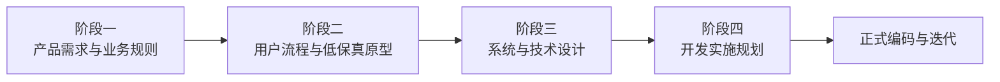
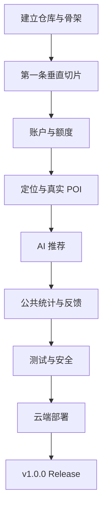

# EatWhat 项目总体规划与进度跟踪

> 文档用途：作为 EatWhat 项目的统一“总控台”，持续记录四个设计阶段、当前完成情况、下一步工作、待确认事项、版本更新记录和最终交付物。
>
> 当前状态日期：2026-07-20  
> 当前阶段：正式编码准备——M0 仓库与环境  
> 当前总体状态：**四个设计阶段已全部完成；下一步创建 GitHub 仓库、初始化 React 与 FastAPI，并建立第一批 Issue 和 CI**

---

# 1. 项目概述

## 1.1 项目名称

**EatWhat**

## 1.2 一句话说明

EatWhat 是一个面向中国大陆用户的响应式网页项目，通过简短问卷、可选 AI 追问、附近餐饮地点搜索和可解释推荐，帮助用户快速解决“今天吃什么”的选择困难。

## 1.3 当前项目目标

本项目当前只考虑：

- 作为用户的第一个完整 GitHub 全栈作品；
- 能够在 Windows 环境下开发；
- 可以在线演示；
- 同时适配电脑端和手机端；
- 展示前端、后端、数据库、认证、AI、定位、第三方 API、测试、部署和 GitHub 工程化能力；
- 控制第三方 API 成本；
- 不考虑现阶段长期商业化、高并发和大规模运营。

## 1.4 当前推荐技术方向

```text
React + TypeScript + Vite
        ↓
Python + FastAPI
        ↓
Supabase Auth + PostgreSQL
        ↓
AIProvider（Mock + 真实模型）
POIProvider（Mock + 高德）
        ↓
GitHub + 云端托管部署
```

---

# 2. 四阶段总体规划



---

# 3. 阶段一：产品需求与业务规则

## 3.1 阶段目标

回答以下问题：

- EatWhat 为谁服务？
- 解决什么问题？
- 第一版具体做什么？
- 哪些功能不做？
- 每个功能按什么业务规则运行？
- AI、定位、活动、公共统计和每日额度如何配合？
- 正常、异常和降级情况下分别怎么办？
- v1.0 与 v1.1 如何划分？

## 3.2 阶段交付物

- [x] 产品背景与目标
- [x] 目标用户
- [x] 产品定位
- [x] 产品边界
- [x] 用户角色
- [x] 核心使用场景
- [x] 功能架构
- [x] MVP 范围
- [x] 非 MVP 范围
- [x] 注册登录规则
- [x] 每日三次额度规则
- [x] 首页活动横幅规则
- [x] “今天大家都在吃什么”规则
- [x] 固定问卷规则
- [x] AI 补问规则
- [x] AI 最终推荐规则
- [x] 定位与地点选择规则
- [x] 附近商家展示规则
- [x] 我的推荐历史规则
- [x] 匿名共享规则
- [x] 满意度反馈规则
- [x] 免责声明与隐私边界
- [x] 异常和降级规则
- [x] v1.1 预留功能
- [x] 主要验收标准
- [x] 形成 PRD v1.0 初稿

## 3.3 当前状态

**状态：已完成。PRD v1.1 已确认为需求冻结版。**

当前已生成：

```text
01_EatWhat_PRD_产品需求文档_v1.1_需求冻结版.md
```

## 3.4 阶段一完成结果

- [x] 用户完成 PRD 审核
- [x] 记录并落实“公共模块冷启动数据”修改意见
- [x] 发布 PRD v1.1 需求冻结版
- [x] 确认后续文档均以冻结版 PRD 为依据

## 3.5 阶段一完成标准

只有同时满足以下条件，才视为阶段一正式完成：

- 用户确认产品目标无误；
- 核心业务流程无重大歧义；
- v1.0 与 v1.1 边界清楚；
- 每日额度、AI、定位、公共数据和历史记录规则明确；
- 所有关键功能都有可测试的验收标准；
- PRD 标记为“需求冻结版”。

---

# 4. 阶段二：用户流程与产品原型

## 4.1 阶段目标

回答以下问题：

- 网站由哪些页面组成？
- 用户从进入网站到完成推荐会经过哪些页面？
- 页面之间如何跳转？
- 电脑端和手机端如何分别布局？
- 每个页面包含什么内容？
- 加载、空数据、错误、拒绝定位等状态如何展示？

## 4.2 阶段交付物

### A. 用户流程

- [x] 注册流程
- [x] 登录流程
- [x] 演示账户登录流程
- [x] 首页浏览流程
- [x] 活动横幅点击流程
- [x] “今天大家都在吃什么”点击流程
- [x] 自主选择食物流程
- [x] AI 智能推荐流程
- [x] 定位授权流程
- [x] 手动搜索地点流程
- [x] 预设演示地点流程
- [x] 附近商家展示流程
- [x] 查看更多推荐流程
- [x] 我的推荐历史流程
- [x] 匿名共享流程
- [x] 满意度反馈流程
- [x] 退出登录流程

### B. 信息架构

- [x] 页面清单
- [x] 路由清单
- [x] 页面层级
- [x] 导航结构
- [x] 个人中心结构
- [x] v1.1 预留页面结构

### C. 原型

- [x] 登录页低保真原型
- [x] 注册页低保真原型
- [x] 首页电脑端原型
- [x] 首页手机端原型
- [x] 问卷页原型
- [x] AI 补问页原型
- [x] 推荐结果页原型
- [x] 商家列表页原型
- [x] 我的历史页原型
- [x] 反馈页原型
- [x] 免责声明页原型
- [x] 个人设置页原型
- [x] 加载状态
- [x] 空数据状态
- [x] 错误状态
- [x] 额度用完状态
- [x] 定位被拒绝状态
- [x] Live 模式关闭状态

## 4.3 预计主要文档

```text
02_EatWhat_用户流程.md
03_EatWhat_信息架构与页面清单.md
04_EatWhat_电脑端与手机端低保真原型.md
```

## 4.4 当前状态

**状态：已完成。用户流程、信息架构和文字版低保真原型均已交付。**

## 4.5 阶段二开始条件

- 阶段一 PRD 完成审核；
- 核心页面和业务规则不再发生结构性变化；
- 用户确认开始原型设计。

---

# 5. 阶段三：系统与技术设计

## 5.1 阶段目标

回答以下问题：

- 前端、后端、数据库、认证、AI 和地图如何连接？
- 数据如何流动？
- 数据库存什么？
- API 如何设计？
- Supabase Auth 如何验证？
- 每日三次额度如何可靠实现？
- AI 输出如何约束？
- Mock 和 Live 模式如何切换？
- 如何限流、缓存、降级和保护 API Key？

## 5.2 阶段交付物

### A. 总体架构

- [x] 系统总体架构图
- [x] 前端模块划分
- [x] 后端模块划分
- [x] Supabase Auth 集成方式
- [x] PostgreSQL 使用方式
- [x] AIProvider 抽象
- [x] POIProvider 抽象
- [x] Mock/Live 双模式
- [x] 部署架构

### B. 数据库

- [x] 用户业务扩展表
- [x] 每日额度表
- [x] 推荐任务表
- [x] 推荐历史表
- [x] 问卷答案表
- [x] AI 补问记录表
- [x] 共享选择表
- [x] 公共聚合数据设计
- [x] 满意度反馈表
- [x] 活动横幅配置结构
- [x] API 用量日志
- [x] 数据删除与匿名化规则
- [x] ER 图
- [x] 数据库迁移规划

### C. API

- [x] 注册登录相关接口边界
- [x] 用户资料接口
- [x] 剩余额度接口
- [x] 基础问卷接口
- [x] AI 补问接口
- [x] 智能推荐接口
- [x] 附近商家查询接口
- [x] 推荐历史接口
- [x] 匿名共享接口
- [x] 公共统计接口
- [x] 满意度反馈接口
- [x] 活动横幅接口
- [x] 健康检查接口
- [x] API 请求/响应示例
- [x] 错误码

### D. AI 与推荐

- [x] 食物分类库
- [x] 固定问卷与规则引擎
- [x] AI 补问触发条件
- [x] AI Prompt 结构
- [x] JSON Schema
- [x] 规则推荐降级
- [x] 模型超时与重试
- [x] Token 与成本记录

### E. 安全与隐私

- [x] API Key 环境变量
- [x] Token 验证
- [x] 限流
- [x] 输入校验
- [x] 日志脱敏
- [x] 位置数据处理
- [x] 账户注销预留
- [x] 邮箱验证和密码重置预留
- [x] 数据删除和匿名化

## 5.3 预计主要文档

```text
05_EatWhat_系统架构设计.md
06_EatWhat_数据库设计.md
07_EatWhat_API接口设计.md
08_EatWhat_AI推荐系统设计.md
09_EatWhat_隐私安全与免责声明.md
```

## 5.4 当前状态

**状态：已完成。系统架构、数据库、API、AI 推荐及隐私安全设计均已交付。**

## 5.5 阶段三开始条件

- 用户流程和页面清单完成；
- 低保真原型确认；
- 页面需要的数据字段基本稳定。

---

# 6. 阶段四：开发实施规划

## 6.1 阶段目标

回答以下问题：

- 开发环境需要安装什么？
- GitHub 仓库如何组织？
- 先写什么、后写什么？
- Codex 每次负责多大的任务？
- 如何测试？
- 如何部署？
- 何时发布 v1.0.0？

## 6.2 阶段交付物

> 本节勾选表示“开发实施方案已经设计完成”，不表示对应代码已经开发。

### A. 开发准备方案

- [x] Windows 软件安装清单
- [x] Node.js 与前端环境方案
- [x] Python、uv 与后端环境方案
- [x] Supabase 项目接入时机
- [x] Git 和 GitHub 配置方案
- [x] VS Code/Codex 使用方式
- [x] 本地环境变量设计
- [x] 开发启动方式

### B. GitHub 工程方案

- [x] Monorepo 仓库目录结构
- [x] README 结构规划
- [x] LICENSE 决策
- [x] `.gitignore` 规划
- [x] `.env.example` 规划
- [x] Issue 模板规划
- [x] Pull Request 模板规划
- [x] Git 分支规则
- [x] Commit 规范
- [x] Milestone 与 ROADMAP
- [x] Release 规则
- [x] GitHub Actions 流程
- [x] Codex 协作边界
- [x] Secret 与依赖安全规则

### C. 开发路线方案

- [x] 第一条垂直切片
- [x] 前端开发顺序
- [x] 后端开发顺序
- [x] 数据库开发顺序
- [x] Supabase Auth 接入顺序
- [x] 每日额度与幂等实现顺序
- [x] Mock POI 与高德接入顺序
- [x] 规则推荐与 AI 接入顺序
- [x] 公共统计、活动和反馈开发顺序
- [x] 缓存、限流和日志加入时机
- [x] 部署与发布顺序
- [x] M0—M12 里程碑
- [x] v0.1—v1.2 产品版本路线

### D. 测试与发布方案

- [x] 后端单元测试范围
- [x] API 与数据库集成测试范围
- [x] 前端组件测试范围
- [x] Playwright 端到端测试范围
- [x] 响应式与浏览器测试范围
- [x] 隐私和安全测试范围
- [x] Mock 与 Live 测试范围
- [x] GitHub Actions 测试矩阵
- [x] 缺陷等级和回滚条件
- [x] v1.0.0 发布验收表

## 6.3 预计主要文档

```text
10_EatWhat_MVP开发计划.md
11_EatWhat_测试与验收计划.md
12_EatWhat_ROADMAP.md
13_EatWhat_GitHub仓库与协作规范.md
```

## 6.4 当前状态

**状态：已完成。MVP开发计划、ROADMAP、测试验收计划和GitHub协作规范均已交付。**

## 6.5 阶段四开始条件

- 系统架构、数据库和 API 已确认；
- 第一版技术范围稳定；
- 可以拆分为明确开发任务。

---

# 7. 正式编码后的建议阶段

四个设计阶段完成后，再进入正式编码。



第一条垂直切片固定为：

```text
固定问卷
→ React 提交
→ FastAPI 接收
→ Mock POI
→ 规则推荐
→ 返回三个结果
→ 前端展示结果卡片
```

这一阶段暂时不接入：

- Supabase Auth；
- 高德；
- AI；
- 真实数据库；
- 用户历史。

目的是先证明前后端闭环和项目结构正确。

---

# 8. 总体文档清单

## 已完成

- [x] EatWhat 项目总体规划与进度跟踪 v0.9（设计阶段完成版）
- [x] EatWhat PRD 产品需求文档 v1.1 需求冻结版
- [x] 02_EatWhat_用户流程.md
- [x] 03_EatWhat_信息架构与页面清单.md
- [x] 04_EatWhat_文字版低保真原型与页面交互说明.md
- [x] 05_EatWhat_系统架构设计.md
- [x] 06_EatWhat_数据库设计.md
- [x] 07_EatWhat_API接口设计.md
- [x] 08_EatWhat_AI推荐系统设计.md
- [x] 09_EatWhat_隐私安全与免责声明.md
- [x] 10_EatWhat_MVP开发计划.md
- [x] 11_EatWhat_测试与验收计划.md
- [x] 12_EatWhat_ROADMAP.md
- [x] 13_EatWhat_GitHub仓库与协作规范.md

## 待开发

设计文档已经全部完成。代码实现尚未开始，下一阶段从 M0 仓库初始化开始。

---

# 9. 当前进度

## 9.1 总体进度估算

| 阶段 | 状态 | 进度 |
|---|---|---:|
| 阶段一：产品需求与业务规则 | 已完成，需求冻结 | 100% |
| 阶段二：用户流程与产品原型 | 已完成 | 100% |
| 阶段三：系统与技术设计 | 已完成 | 100% |
| 阶段四：开发实施规划 | 已完成 | 100% |
| 正式编码与部署 | 未开始 | 0% |

设计阶段总体进度约：

> **100%**

说明：该比例只是用于项目跟踪，不代表精确工时。

## 9.2 本次完成

- 完成 `11_EatWhat_测试与验收计划.md`；
- 建立后端单元、API集成、数据库、前端组件和Playwright端到端测试范围；
- 将每日额度并发、幂等、用户越权、精确位置和Secret列为重点测试；
- 建立Mock与Live服务测试、缺陷等级、发布验收表和回滚条件；
- 完成 `13_EatWhat_GitHub仓库与协作规范.md`；
- 确定短分支、Issue、Pull Request、Squash Merge和main保护规则；
- 确定Codex一次只处理一个明确Issue，并必须提交测试结果和风险说明；
- 确定GitHub Actions最小权限、依赖审查、Secret保护和Release流程；
- 第四阶段正式完成；
- 四个设计阶段总体进度达到100%。

## 9.3 下一次计划

正式进入开发阶段的 M0：仓库与环境。

下一次建议先完成：

```text
1. 创建 GitHub 仓库 eatwhat
2. 整理并导入 docs 目录
3. 创建 v0.1 Project Foundation Milestone
4. 创建 M0 第一批 Issue
5. 初始化 Monorepo 根目录
6. 初始化 React + TypeScript + Vite
7. 初始化 FastAPI + /health/live
8. 创建前后端基础 CI
```

实际创建仓库前，需要确认：

- GitHub 仓库建立在你的哪个账号下；
- 初期使用 Public 还是 Private；
- 是否由我通过已连接的 GitHub 工具直接创建和提交。

## 9.4 后续剩余

设计工作已经完成，剩余全部属于代码开发与发布：

```text
M0 仓库与环境
→ M1 第一条Mock垂直切片
→ M2 完整Mock产品
→ M3 数据库与历史
→ M4 Supabase Auth
→ M5 每日额度与幂等
→ M6 地点与Mock POI
→ M7 高德Live
→ M8 AI Live
→ M9 公共模块和活动
→ M10 反馈与设置
→ M11 测试与加固
→ M12 部署与v1.0.0发布
```

---

# 10. 本文档更新规则

每次完成一个正式交付物后，都应同步更新本文档：

1. 更新“当前阶段”；
2. 勾选已完成任务；
3. 更新总体进度；
4. 增加本次完成内容；
5. 增加下一次计划；
6. 标记新增待确认问题；
7. 更新文档清单；
8. 记录版本更新说明。

建议版本格式：

```text
v0.1  初始总体规划
v0.2  PRD 初稿完成
v0.3  PRD 冻结，进入用户流程
v0.4  原型完成
v0.5  技术设计完成
v0.6  开发计划完成
v0.9  四阶段设计完成
v1.0  正式进入编码
```

---

# 11. 更新记录

## v0.9 — 2026-07-22

- 完成测试与验收计划；
- 完成GitHub仓库与协作规范；
- 建立测试矩阵、P0发布门槛和回滚条件；
- 建立分支、Issue、PR、Commit、CI、Codex和Secret管理规范；
- 第四阶段进度更新为100%；
- 四个设计阶段全部完成；
- 当前状态切换为M0仓库与环境准备。

## v0.8 — 2026-07-21

- 完成MVP开发计划；
- 完成ROADMAP；
- 确定Node 24 LTS、Python 3.13、React、Vite、FastAPI等开发方向；
- 确定Monorepo、Mock优先和13个开发里程碑；
- 确定v0.1至v1.2版本路线；
- 第四阶段进度更新为55%；
- 下一步为测试验收和GitHub协作规范。

## v0.7 — 2026-07-21

- 完成 API 接口设计；
- 完成 AI 推荐系统设计；
- 完成隐私安全与免责声明设计；
- 第三阶段进度更新为 100%；
- 当前阶段切换到第四阶段准备状态；
- 下一步为 MVP 开发计划、路线图、测试和 GitHub 规范。

## v0.6 — 2026-07-21

- 完成系统架构设计；
- 完成数据库设计；
- 确定 Supabase Auth、FastAPI 和 PostgreSQL 的职责边界；
- 确定业务数据统一由 FastAPI 访问；
- 确定每日额度并发预留和幂等扣减机制；
- 确定匿名共享、位置最小化和 v1.1 删除策略；
- 第三阶段进度更新为 45%；
- 下一步为 API、AI 推荐和隐私安全设计。

## v0.5 — 2026-07-21

- 完成文字版低保真原型与页面交互说明；
- 完成电脑端和手机端布局描述；
- 完成关键异常与降级状态；
- 第二阶段进度更新为 100%；
- 当前阶段切换到第三阶段准备状态；
- 下一步为系统架构和数据库设计。

## v0.4 — 2026-07-21

- 完成用户流程文档；
- 完成信息架构与页面清单；
- 确定 v1.0 注册成功后自动登录；
- 确定受保护路由和推荐流程状态保护；
- 确定电脑端与手机端导航建议；
- 阶段二进度更新为 65%；
- 下一步为电脑端和手机端低保真原型。

## v0.3 — 2026-07-20

- 用户完成 PRD 审核；
- 更新公共模块冷启动数据规则；
- 明确不显示“演示数据”标签，但禁止虚构人数；
- 发布 PRD v1.1 需求冻结版；
- 阶段一进度更新为 100%；
- 当前阶段切换到第二阶段准备状态。

## v0.2 — 2026-07-20

- 创建四阶段总体规划；
- 建立完整交付物清单；
- 标记阶段一 PRD 初稿已完成；
- 确定下一步为 PRD 审核和需求冻结；
- 确定后续进入用户流程和信息架构设计。
