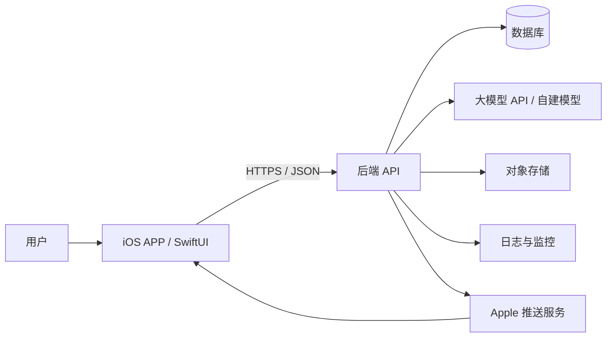
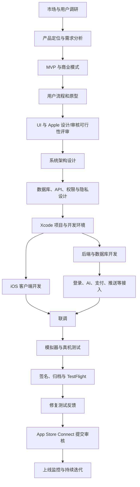
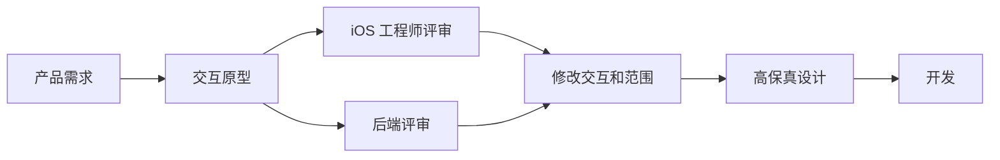
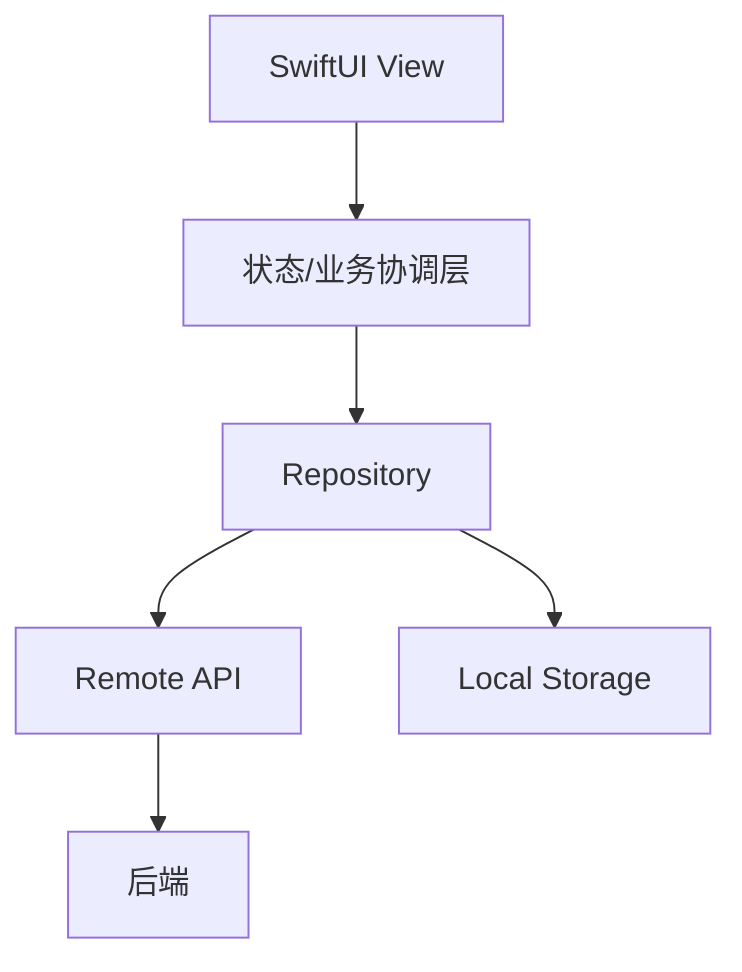
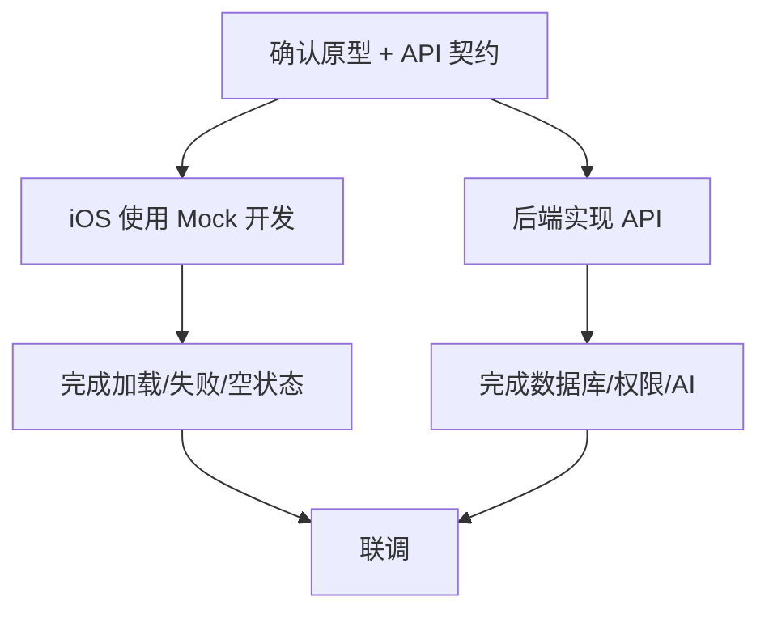
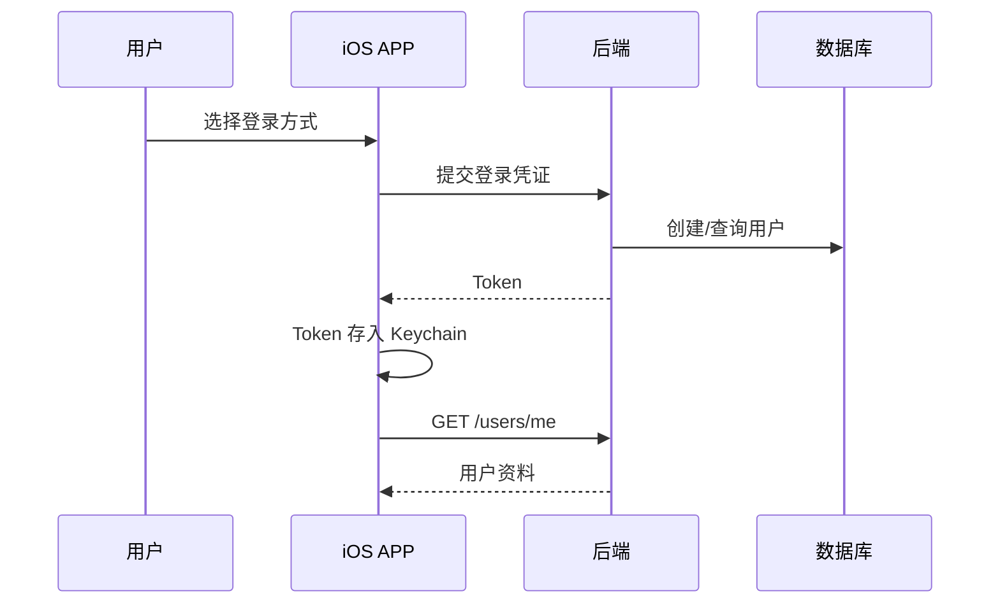
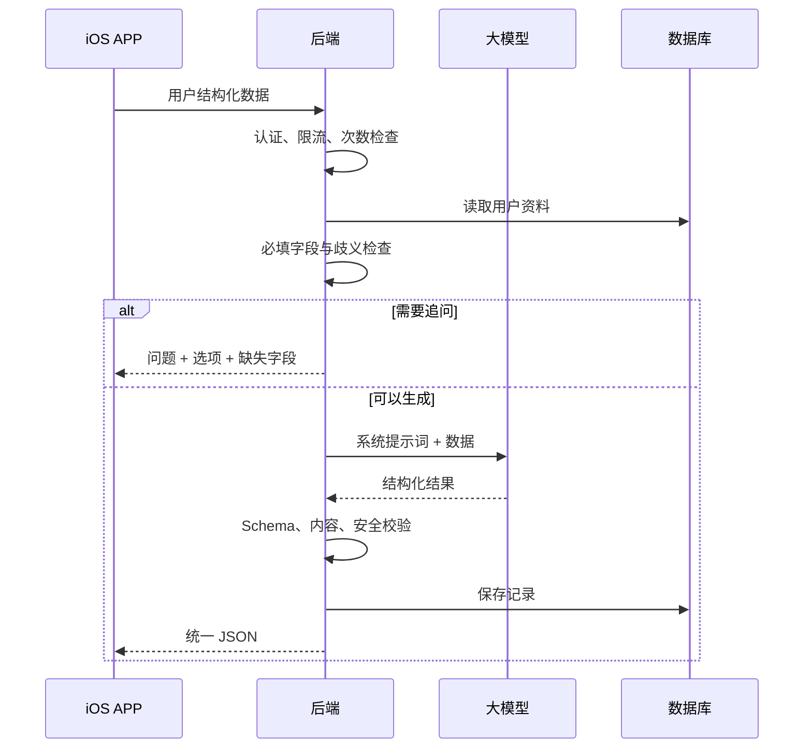

# iOS APP 完整系统开发流程

> 适用对象：第一次系统了解或开发 iPhone/iPad APP 的个人开发者、小团队，以及使用 AI 辅助编程的初学者。  
> 文档目标：从产品构想到 SwiftUI 开发、后端、AI、TestFlight、App Store 审核与持续迭代，描述一套完整系统。  
> 说明：Apple 的 SDK、签名和审核规则会变化，提交前应重新核对 Apple Developer 与 App Store Connect 的最新要求。

---

## 1. iOS APP 不是完整系统的全部

iOS APP 是运行在 iPhone/iPad 上的客户端。账号、会员、历史记录、AI 调用、数据库和管理功能通常仍在云端。



```text
iPhone/iPad 客户端
  ├─ 页面、导航、交互
  ├─ 本地设置和缓存
  ├─ 相机、相册、定位、通知
  └─ 调用云端 API

云端系统
  ├─ 登录认证
  ├─ 用户和业务数据
  ├─ AI 模型调用
  ├─ 支付/会员权威状态
  ├─ 文件与日志
  └─ 监控与备份
```

### iOS 客户端负责

- SwiftUI 页面和交互；
- 页面导航与状态管理；
- 表单初步校验；
- 网络请求和结果展示；
- UserDefaults、Keychain、SwiftData/Core Data 等本地数据；
- Apple 系统能力与权限；
- 适配 iPhone、iPad、深色模式、动态字体等。

### 后端负责

- 认证与权限；
- 业务规则；
- 数据库；
- AI 密钥、提示词和结果校验；
- 跨设备同步；
- 会员与支付状态校验；
- 日志、风控、限流和备份。

---

## 2. 推荐的 iOS 首版技术路线

| 层次 | 建议方案 | 作用 |
|---|---|---|
| 开发设备 | Mac | 运行 Xcode 与 Apple 开发工具 |
| IDE | Xcode | 编码、模拟器、调试、签名、发布 |
| 开发语言 | Swift | iOS 原生开发 |
| UI | SwiftUI | 声明式构建 iPhone/iPad 界面 |
| 网络 | URLSession（首选基础方案） | 调用后端 API |
| 简单设置 | UserDefaults | 主题、引导状态、普通偏好 |
| 敏感凭证 | Keychain | Token 等敏感信息 |
| 本地结构化数据 | SwiftData/Core Data（按需） | 离线数据和缓存 |
| 架构 | 分层 + 模块化单体 | 控制复杂度 |
| 后端 | Python FastAPI（示例） | 业务、登录、AI API |
| 数据库 | PostgreSQL | 用户、历史、会员和任务 |
| 测试分发 | TestFlight | 内外部测试 |

适合首版的项目结构示意：

```text
MyApp/
├─ App/
│  └─ MyAppApp.swift
├─ Features/
│  ├─ Auth/
│  ├─ Home/
│  ├─ Profile/
│  ├─ Generate/
│  └─ History/
├─ Core/
│  ├─ Networking/
│  ├─ Storage/
│  ├─ Models/
│  ├─ DesignSystem/
│  └─ Utilities/
├─ Resources/
└─ Tests/
```

---

## 3. iOS 完整开发流程总览



### 各阶段主要产物

| 阶段 | 主要产物 |
|---|---|
| 产品 | 用户问题、竞品、MVP、成功指标 |
| 原型/UI | 流程图、低保真、高保真、状态说明 |
| 架构 | 系统架构图、模块、技术栈、数据流 |
| 接口 | 数据库表、API、错误码、认证方案 |
| 客户端 | SwiftUI APP、系统权限和本地存储 |
| 后端 | API、业务、数据库、AI、日志 |
| 测试 | 单元/UI/真机/弱网/审核前检查 |
| 发布 | Archive、TestFlight、商店资料、审核版本 |
| 运营 | 埋点、崩溃、留存、成本、迭代计划 |

---

## 4. 第一阶段：市场调研与产品定位

先回答：

> 为什么用户需要安装一个 iOS APP，而不是使用网页、公众号、小程序或现有产品？

需要调查：

- iPhone/iPad 用户的目标场景；
- 是否需要通知、相机、健康数据、离线、本地计算等原生能力；
- 是否存在订阅或内购；
- 同类 App Store 产品的定位和差评；
- 用户对隐私、付费、账号体系的接受程度；
- 产品是否具有足够明确的核心价值。

建议产物：

```text
目标用户：________
关键场景：________
必须做成 APP 的原因：________
核心价值：________
首版功能：________
上线后验证指标：________
```

---

## 5. 第二阶段：需求分析与 MVP

一个 AI iOS APP 的首版闭环可以是：

```text
Apple/邮箱/手机号登录
  ↓
首次填写基础资料
  ↓
发起一次核心任务
  ↓
必要时追问
  ↓
生成结构化结果
  ↓
保存历史和再次查看
```

### 需求必须同时写正常和异常流程

```text
功能：生成分析
正常：点击 → 校验 → 请求 → 加载 → 结果
异常：无网 / 超时 / 格式错误 / 次数不足 / 被系统中断
后台恢复：切换到其他 APP 后返回时如何处理
取消：用户是否可以取消生成
重复点击：是否创建重复任务
```

### 首版应控制范围

优先：登录、用户资料、一个核心 AI 场景、历史记录、设置、注销。  
后做：社区、多模型选择、复杂社交、推荐系统、完整运营后台、过多动画。

---

## 6. 第三阶段：原型、UI 与可实现性评审

### 谁负责原型

- 产品经理或创始人：功能和流程；
- UX：交互与信息层级；
- UI：视觉与组件；
- iOS 工程师：系统能力与实现成本评审。

### iOS 原型必须考虑

- 安全区、刘海和灵动岛区域；
- 系统返回手势和导航栈；
- 键盘遮挡；
- 深色模式；
- Dynamic Type 动态字体；
- VoiceOver 等无障碍；
- iPhone 与 iPad 尺寸；
- 权限首次拒绝后如何引导；
- APP 切入后台、被系统终止、重新启动后的状态。

### 页面状态清单

```text
初始状态
加载状态
成功状态
空数据状态
失败状态
无网络状态
无权限状态
登录失效状态
按钮禁用状态
```

### 可实现性评审流程



评审应明确：数据来源、API、系统权限、加载时长、失败处理、是否影响审核、是否使用 Apple 提供的系统组件。

---

## 7. 第四阶段：架构设计

软件架构需要确定：系统组成、模块职责、通信、数据流、错误处理、安全、部署和扩展。

### 首版系统架构

```text
iOS APP
  ├─ Auth 功能
  ├─ Profile 功能
  ├─ AI Generate 功能
  ├─ History 功能
  └─ Settings 功能
       ↓ HTTPS
后端模块化单体
  ├─ auth
  ├─ users
  ├─ ai
  ├─ records
  ├─ payments（按需）
  └─ common
       ↓
PostgreSQL / 对象存储 / AI API / 日志
```

### iOS 客户端分层示意



首版不必为了套用名词而制造过多层级。原则是：页面不直接到处写网络请求；网络、本地存储、数据模型和页面职责清楚。

### 架构设计清单

- SwiftUI 页面与导航；
- 状态管理；
- 网络层与 API；
- 本地缓存与 Keychain；
- 后端模块；
- 数据库；
- 登录与 Token；
- AI 工作流；
- 推送；
- 内购/订阅（按需）；
- 日志、崩溃和分析；
- 云端部署和备份。

---

## 8. 第五阶段：数据与 API 设计

### 数据放在哪里

| 数据 | 建议位置 |
|---|---|
| 固定文本、图标、默认选项 | APP Resources / Swift 常量 |
| Mock 数据 | 本地 JSON |
| 普通偏好 | UserDefaults |
| Token、敏感凭证 | Keychain |
| 离线结构化缓存 | SwiftData/Core Data |
| 用户账号、资料、历史、会员 | 云数据库 |
| 图片、文档、音频 | 对象存储 |
| 模型 API Key、数据库密码 | 后端环境变量 |

### 用户资料只填写一次

正确逻辑不是“不存数据库”，而是：

```text
第一次填写 → 写入云数据库
以后登录 → 从云数据库读取
用户修改 → 更新云数据库
本地可缓存 → 但以后端为权威数据
```

### API 设计示例

```text
POST /api/v1/auth/login
GET  /api/v1/users/me
PUT  /api/v1/users/me/profile
POST /api/v1/ai/tasks
GET  /api/v1/ai/tasks/{id}
GET  /api/v1/records
DELETE /api/v1/records/{id}
```

统一返回结构：

```json
{
  "code": 0,
  "message": "success",
  "data": {}
}
```

同时定义：错误码、字段类型、分页、Token、超时、幂等、接口版本。

---

## 9. 第六阶段：开发环境与服务启动

### iOS 开发环境

```text
Mac
  ↓
Xcode
  ├─ Swift 编译器
  ├─ SwiftUI Preview
  ├─ iOS Simulator
  ├─ 调试与性能工具
  └─ 签名、Archive、上传
```

模拟器适合快速开发，但以下功能必须真机测试：相机、推送、性能、网络切换、部分权限、后台行为、实际触感和屏幕显示。

### 后端服务

- 后端 API；
- 数据库；
- Redis（可选）；
- 后台任务服务（可选）；
- 本地模型服务（仅自建模型）；
- 日志与监控。

“服务启动”不是独立的最后一步，而是贯穿后端开发、测试和部署全过程。

### 三套环境

```text
Development：本地调试
Staging：联调与测试
Production：真实用户
```

三个环境应使用不同的域名、数据库、密钥和配置，避免测试数据进入正式库。

---

## 10. 第七阶段：iOS 与后端并行开发



### iOS 侧任务

1. 建立 Xcode 工程与 Git；
2. 建立 Design System；
3. 完成导航和页面；
4. 使用本地 JSON/Mock；
5. 封装网络和错误；
6. 接入 Keychain 与本地存储；
7. 替换为测试环境 API；
8. 真机调试。

### 后端侧任务

1. 后端项目与数据库；
2. 认证和权限；
3. 用户资料；
4. AI 任务；
5. 历史记录；
6. 日志和异常；
7. 测试环境部署。

---

## 11. 第八阶段：登录、Apple 能力与隐私

### 登录流程



### 登录系统至少包含

- 登录和自动登录；
- Token 失效处理；
- 退出；
- 注销；
- 隐私政策；
- 用户数据导出/删除策略；
- 账号合并和第三方登录边界（按需）。

### 权限设计原则

- 用到时再申请；
- 申请前解释用途；
- 拒绝后提供可理解的替代流程；
- 不申请与核心功能无关的权限；
- 后端同样要遵循最小数据原则。

---

## 12. 第九阶段：AI 模型接入

### 完整 AI 流程



### 比“90% 把握”更可靠的规则

```text
程序定义硬性必填字段
  +
AI 判断语义歧义
  +
追问上限 1～3 轮
  +
缺少非关键项时明确假设
```

### 后端记录

- 模型与提示词版本；
- 输入输出 Token；
- 调用费用；
- 延迟；
- 成功/失败；
- 重试原因；
- 用户反馈；
- 结果是否被编辑或采用。

---

## 13. 第十阶段：测试

| 测试类型 | iOS 重点 |
|---|---|
| 单元测试 | 数据转换、状态逻辑、业务规则 |
| UI 测试 | 表单、导航、错误提示、关键流程 |
| 模拟器 | 多尺寸、系统版本、快速回归 |
| 真机 | 性能、权限、相机、推送、后台、网络切换 |
| 无障碍 | 动态字体、VoiceOver、对比度 |
| 弱网 | 超时、重试、重复提交、恢复 |
| 安全 | Keychain、Token、越权、敏感日志 |
| AI | 格式、超时、拒答、提示注入、成本 |
| 审核前 | 崩溃、占位页、无效链接、账号注销、测试账号 |

### 需要特别测试的生命周期

```text
前台使用
→ 切到后台
→ 后台停留
→ 返回前台
→ 被系统回收
→ 冷启动恢复
```

AI 生成过程中如果切入后台，必须明确：任务是否继续、返回后如何查询、是否重复提交。

---

## 14. 第十一阶段：签名、TestFlight 与 App Store 发布

### iOS 发布链路

```text
Xcode Release 构建
  ↓
Archive
  ↓
签名与校验
  ↓
上传 App Store Connect
  ↓
TestFlight 内部/外部测试
  ↓
填写商店资料与隐私信息
  ↓
提交 App Review
  ↓
审核通过后手动或自动发布
```

### 发布前资料

- APP 名称、副标题和描述；
- 图标和商店截图；
- 支持网址、隐私政策；
- 类别、年龄分级；
- 数据收集说明；
- 审核备注和测试账号；
- 订阅/内购资料（按需）；
- 账号注销入口；
- 后端生产环境与监控。

### iOS 特有风险

- 只有 Windows 电脑，无法完成标准 Xcode 原生开发链路；
- 证书、Bundle Identifier、Capabilities 配置不一致；
- 真机和模拟器行为不同；
- 隐私用途说明不完整；
- 登录、付费、订阅、用户生成内容等触发额外审核要求；
- 审核人员无法登录或无法体验核心功能；
- APP 只是网页壳，缺少足够原生价值和完整体验；
- 后端在审核期间不可用。

---

## 15. 第十二阶段：云端部署

```text
iOS APP
  ↓ HTTPS
API 网关 / 反向代理
  ↓
后端应用容器
  ├─ PostgreSQL
  ├─ Redis（按需）
  ├─ 对象存储
  ├─ 大模型 API
  ├─ 推送服务
  └─ 日志、监控、告警
```

### 生产部署至少包含

- HTTPS；
- 环境变量和密钥管理；
- 数据库自动备份；
- 日志检索；
- 错误告警；
- API 限流；
- AI 成本控制；
- 灰度或版本兼容；
- 旧版 APP 仍在使用时的 API 兼容。

iOS APP 发布后，用户不会立即全部升级，因此后端 API 不能随意删除旧字段或突然改变结构。

---

## 16. 第十三阶段：监控、增长与迭代

### 关键漏斗

```text
商店页面访问
→ 下载
→ 首次启动
→ 注册成功
→ 资料完成
→ 首次生成成功
→ 次日/七日留存
→ 订阅或分享
```

### 技术指标

- 崩溃率；
- 无响应和卡顿；
- 冷启动时间；
- API 错误率；
- AI 成功率、成本、延迟；
- 版本分布；
- 推送送达和打开率。

### 产品指标

- 首次任务完成率；
- 追问中退出率；
- 结果保存/分享率；
- 次日、七日和三十日留存；
- 订阅试用转付费；
- 退款与取消原因。

增长实验应建立在产品有真实价值和留存基础上。

---

## 17. 岗位职责

| 岗位 | iOS 项目职责 |
|---|---|
| 产品经理 | 用户、需求、PRD、原型、优先级、验收 |
| UX/UI | Apple 平台交互、视觉、组件和无障碍 |
| iOS 工程师 | Swift、SwiftUI、Xcode、系统能力、签名发布 |
| 后端工程师 | API、认证、数据库、业务和 AI 服务 |
| AI 应用工程师 | 模型、提示词、结构化输出、评测、成本 |
| 测试工程师 | 功能、真机、生命周期、接口、审核前测试 |
| DevOps/运维 | 云端、CI/CD、监控、备份和故障 |
| 运营/数据 | 商店素材、埋点、增长、留存、商业化 |

---

## 18. 适合初学者的 iOS 实施路线

```text
第 1 步：确认只有一个核心 AI 使用场景
第 2 步：用 Figma/纸笔画核心页面
第 3 步：学习 Swift 基础和 SwiftUI 状态/导航
第 4 步：使用本地 Mock JSON 完成完整页面流程
第 5 步：设计 API 和数据库
第 6 步：FastAPI 完成登录、资料和 AI 接口
第 7 步：iOS 接真实 API，Token 放 Keychain
第 8 步：真机测试后台、权限、网络和性能
第 9 步：TestFlight 小范围测试
第 10 步：根据反馈修复后再提交审核
```

首版不要把“学会所有 Swift”和“完成产品”混在一起。围绕一个完整闭环学习必要内容，效果更好。

---

## 19. 最终检查表

### 产品与设计

- [ ] MVP 和核心用户价值明确
- [ ] 原型包含加载、失败、空数据和权限状态
- [ ] iPhone/iPad、深色模式和动态字体已考虑

### 客户端

- [ ] Token 放在 Keychain
- [ ] 网络错误和登录过期可恢复
- [ ] 没有把模型 API Key 放入 APP
- [ ] 真机测试已完成

### 后端

- [ ] API 版本和错误码清晰
- [ ] 用户数据隔离和权限检查完成
- [ ] AI 输出经过 Schema 校验
- [ ] 日志、限流、备份已配置

### 发布

- [ ] Bundle ID、证书、签名正确
- [ ] TestFlight 已完成测试
- [ ] 商店截图、隐私政策、审核账号齐全
- [ ] 生产后端在审核期间稳定可用
- [ ] 账号注销和数据处理符合产品设计

---

## 20. 一句话总结

> iOS 完整开发流程与 Android 的产品和后端逻辑大体相同，但客户端必须围绕 Mac、Xcode、Swift/SwiftUI、Apple 权限与生命周期、代码签名、TestFlight 和 App Store 审核进行专门设计。
