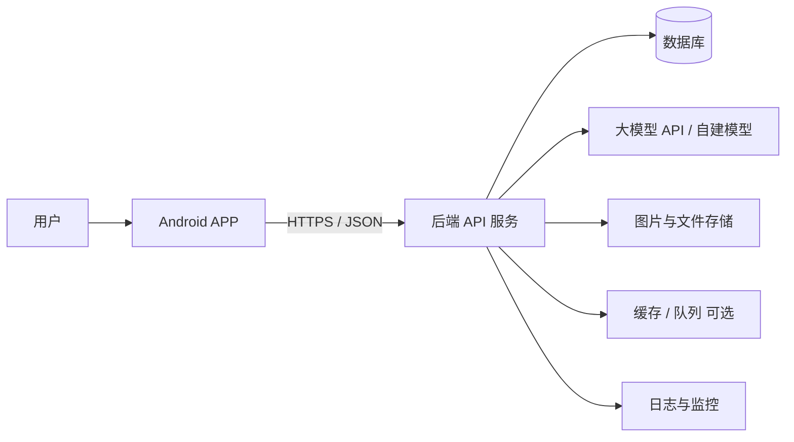
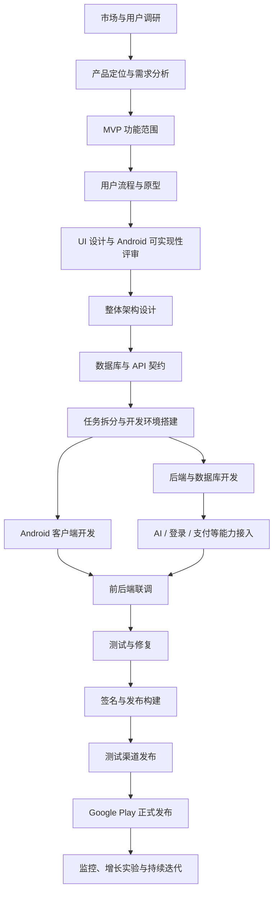
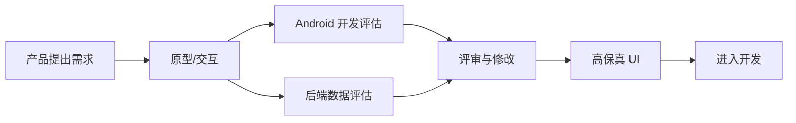
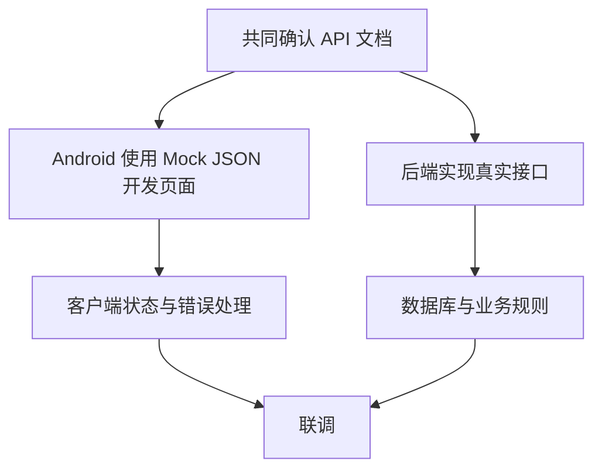
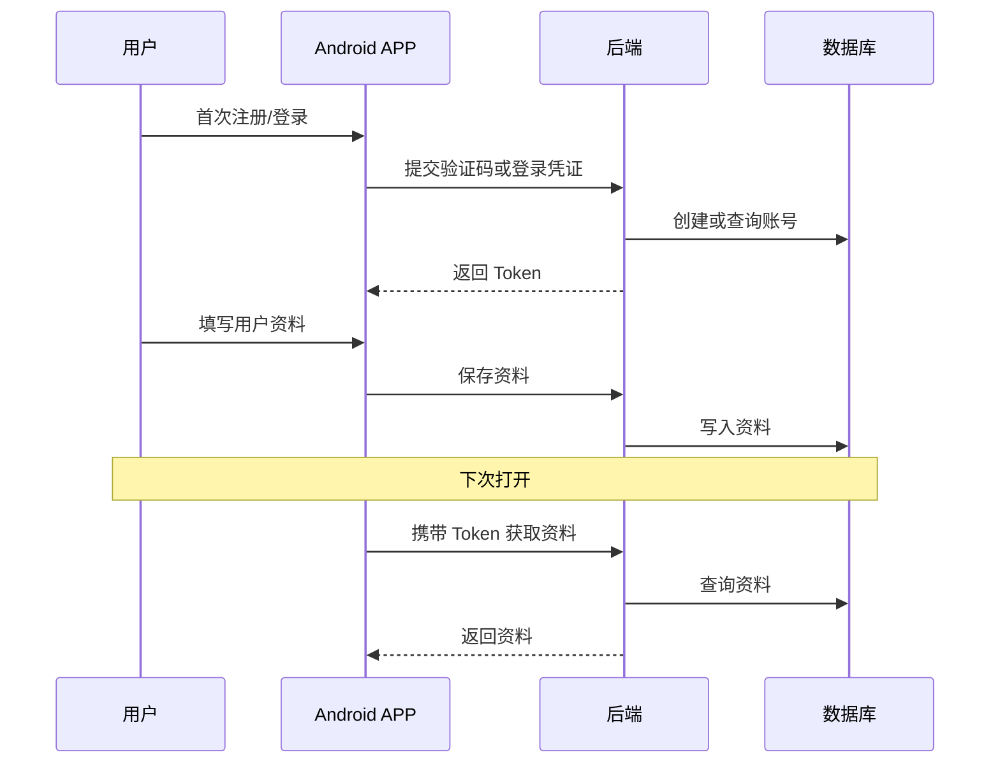
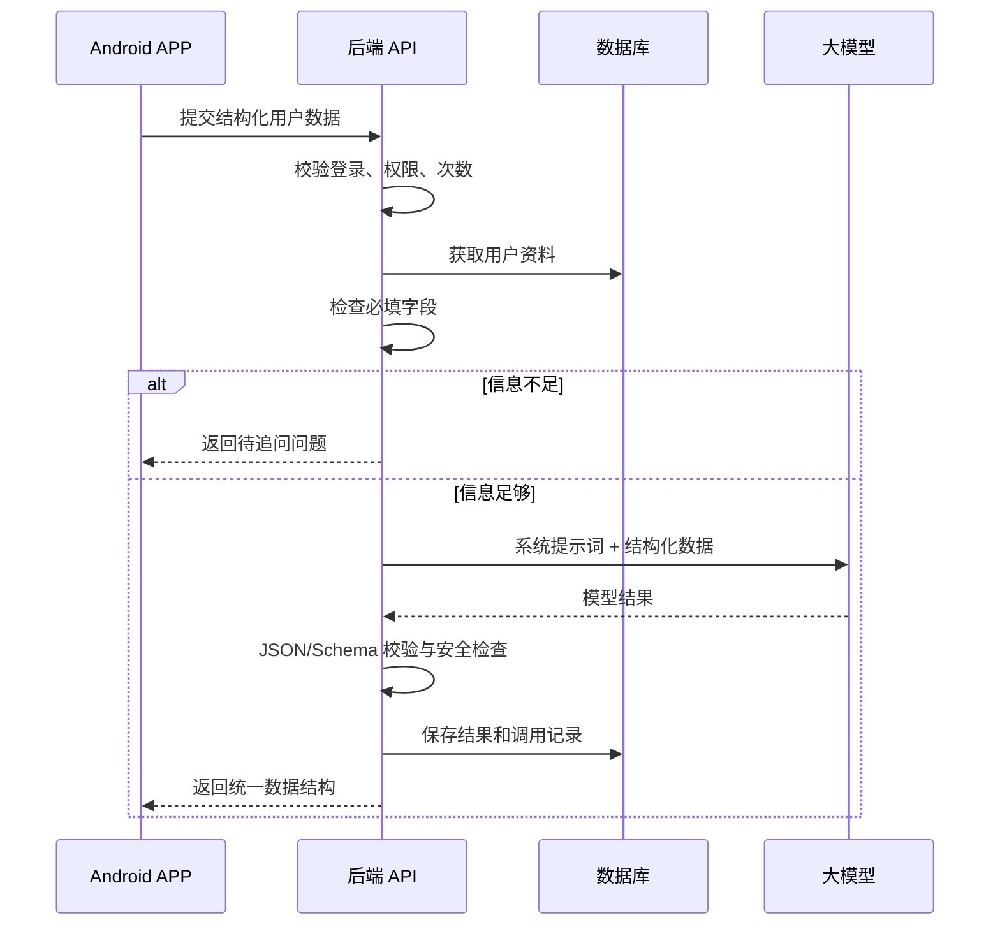

# 安卓 APP 完整系统开发流程

> 适用对象：第一次系统了解或开发 Android APP 的个人开发者、小团队，以及使用 AI 辅助编程的初学者。  
> 文档目标：从“产品想法”一直讲到“Google Play 发布、监控与迭代”，并说明前端、后端、数据库、AI 服务之间如何协作。  
> 说明：商店政策、目标 API 等要求会变化，真正发布前应重新核对 Google Play 与 Android 官方文档。

---

## 1. Android APP 与完整系统的关系

Android APP 通常只是完整系统的“客户端”。用户看到的页面、按钮、输入框运行在手机上；登录、数据库、AI 模型、订单、会员资格等通常由云端后端处理。



文字版：

```text
用户
  ↓
Android 手机客户端
  ↓ HTTPS 请求
后端 API
  ├─ 用户与权限
  ├─ 业务逻辑
  ├─ AI 调用
  ├─ 数据库
  ├─ 文件存储
  └─ 日志监控
```

### Android 客户端负责

- 页面显示、按钮交互、动画与导航；
- 表单初步校验；
- 调用后端 API；
- 展示加载、成功、空数据和失败状态；
- 保存少量本地设置与缓存；
- 调用摄像头、定位、通知等 Android 系统能力。

### 后端负责

- 登录注册与身份认证；
- 业务规则和权限判断；
- 用户资料、历史记录、会员状态等数据；
- 大模型密钥、提示词、AI 调用和结果校验；
- 防刷、限流、安全审计、日志和数据备份。

> 重要原则：API Key、会员资格、支付结果、剩余次数等不能只放在 Android 客户端判断。

---

## 2. 推荐的 Android 首版技术路线

对于个人开发者或初学者，首版不建议堆叠过多框架。

| 层次 | 建议方案 | 作用 |
|---|---|---|
| 开发语言 | Kotlin | 编写 Android 原生客户端 |
| IDE | Android Studio | 编码、构建、模拟器、调试 |
| UI | Jetpack Compose | 编写页面与响应式界面 |
| 导航 | Navigation Compose | 管理页面跳转 |
| 本地简单设置 | DataStore | 保存主题、开关、少量配置 |
| 本地结构化数据 | Room（按需） | 离线记录、缓存、数据库 |
| 网络层 | Retrofit/OkHttp 或 Ktor Client | 调用后端 API |
| 架构 | 模块化单体 + 分层设计 | 保持代码清晰但不过度复杂 |
| 后端 | Python FastAPI（示例） | 提供业务和 AI API |
| 云数据库 | PostgreSQL | 用户、任务、历史结果 |
| 部署 | Docker + 云服务器 | 运行后端与相关服务 |

一个适合首版的 Android 目录示意：

```text
app/
├─ ui/
│  ├─ login/
│  ├─ home/
│  ├─ profile/
│  ├─ generate/
│  └─ history/
├─ data/
│  ├─ remote/          # 后端 API
│  ├─ local/           # DataStore / Room
│  ├─ model/           # 数据结构
│  └─ repository/      # 统一数据入口
├─ domain/             # 复杂业务时再增加
├─ navigation/
├─ common/
└─ MainActivity.kt
```

---

## 3. Android 完整开发流程总览



### 阶段产物总表

| 阶段 | 核心产物 |
|---|---|
| 市场调研 | 目标用户、痛点、竞品、使用场景 |
| 需求分析 | PRD、功能清单、优先级 |
| 原型设计 | 用户流程图、低保真原型、异常状态 |
| UI 设计 | 高保真稿、组件规范、尺寸与资源 |
| 架构设计 | 系统架构图、模块职责、技术栈 |
| 数据与接口 | 数据库表、API 文档、错误码 |
| 客户端开发 | 可运行 Android APP |
| 后端开发 | API、数据库、认证、AI 服务 |
| 测试 | 测试用例、缺陷清单、测试报告 |
| 发布 | 签名 AAB、商店素材、隐私材料 |
| 运营迭代 | 埋点指标、用户反馈、版本计划 |

---

## 4. 第一阶段：市场调研与产品定位

先回答一句话：

> 这个 Android APP 帮助哪类用户，在什么场景下，解决什么具体问题？

### 需要调查

1. 谁是目标用户；
2. 用户当前怎么解决问题；
3. 现有 APP 有什么不足；
4. 用户为什么愿意安装，而不是直接使用网页或微信小程序；
5. 用户为什么会再次打开；
6. AI 是否真正提高效果，而不是为了“有 AI”而加 AI。

### 建议产物

```text
目标用户：________
核心场景：________
核心问题：________
现有替代方案：________
本产品优势：________
首版成功指标：________
```

---

## 5. 第二阶段：需求分析与 MVP 确定

MVP 是“最小可行产品”，目标是先完成最短价值闭环。

例如一个 AI 方案生成 APP 的首版：

```text
注册/登录
  ↓
首次填写用户资料
  ↓
提交当前需求
  ↓
必要时进行 1～3 轮追问
  ↓
生成结构化结果
  ↓
保存并查看历史记录
```

### 功能优先级

| 优先级 | 含义 | 示例 |
|---|---|---|
| P0 | 没有就无法形成闭环 | 登录、资料、生成、结果 |
| P1 | 明显改善体验 | 历史记录、编辑资料、分享 |
| P2 | 可后续迭代 | 社区、排行榜、复杂会员 |

### 每个功能应写清

```text
功能名称：生成报告
前置条件：已登录，关键资料齐全
触发方式：点击“生成”
正常流程：校验 → 请求后端 → 加载 → 展示结果
异常流程：网络失败 / AI 超时 / 次数不足 / 返回格式错误
成功标准：结果可展示、可保存、可再次查看
```

---

## 6. 第三阶段：用户流程、原型与 UI 设计

### 谁画原型

- 产品经理或产品负责人；
- UX/交互设计师；
- 个人开发时由开发者自己完成。

### Android 原型必须考虑

- 返回键和系统手势；
- 不同手机尺寸、平板、折叠屏；
- 软键盘弹出后的布局；
- 系统深色模式；
- 权限申请流程；
- 通知点击后的跳转；
- 无网、弱网和重新加载。

### 每个页面至少设计六种状态

```text
正常状态
加载状态
空数据状态
失败状态
无权限状态
按钮禁用状态
```

### 如何保证前端能实现



原型评审重点：

- 需要哪些 API 和字段；
- Android 系统是否支持；
- 实现成本是否超过首版范围；
- 加载、失败、重复点击如何处理；
- 是否需要定位、相机、相册、通知等权限；
- 设计资源能否适配不同密度和屏幕。

---

## 7. 第四阶段：整体架构设计

架构设计不是“画一张漂亮的图”，而是决定：

- 系统由哪些部分组成；
- 每部分负责什么；
- 如何通信；
- 数据如何流动；
- 出错如何处理；
- 如何部署和扩展。

### 首版推荐：模块化单体后端

```text
backend/
├─ auth/       # 登录、Token、验证码
├─ users/      # 用户与资料
├─ ai/         # 提示词、模型调用、结果校验
├─ records/    # 历史记录
├─ payments/   # 会员与支付，可后做
├─ admin/      # 管理接口，可后做
└─ common/     # 日志、错误码、公共工具
```

不要在首版一开始就拆成很多微服务。一个后端项目内部清晰分模块，更适合个人开发和早期验证。

### 架构设计清单

- 客户端技术栈；
- 后端技术栈；
- 数据库与缓存；
- 模块划分；
- API 规范；
- 登录认证；
- AI 工作流；
- 文件存储；
- 日志监控；
- 安全与隐私；
- 部署结构；
- 数据备份与恢复。

---

## 8. 第五阶段：数据、数据库和 API 设计

### 不要把所有数据都放 JSON

| 数据类型 | 建议位置 |
|---|---|
| 固定文案、默认选项 | Kotlin 常量或资源文件 |
| Mock 演示数据 | 本地 JSON |
| 少量用户设置 | DataStore |
| 离线结构化缓存 | Room |
| 账号、用户资料、历史记录 | 云数据库 |
| 图片、音频、PDF | 对象存储 |
| API Key、数据库密码 | 后端环境变量 |

### 静态与动态数据

```text
静态：图标、固定说明、默认选项、页面资源
动态：用户资料、会员状态、AI 结果、订单、历史记录
```

注意：动态数据不一定都来自后端，静态数据也不一定只能在前端；分类依据是“是否随用户和业务变化”。

### 数据库示例

```text
users
- id
- email_or_phone
- status
- created_at

user_profiles
- user_id
- nickname
- profile_json
- updated_at

ai_records
- id
- user_id
- input_json
- output_json
- model_name
- status
- created_at
```

### API 契约示例

```http
POST /api/v1/ai/generate
Authorization: Bearer <token>
Content-Type: application/json
```

```json
{
  "scene": "weekly_plan",
  "answers": {
    "goal": "提高体能",
    "available_days": 3
  }
}
```

```json
{
  "code": 0,
  "message": "success",
  "data": {
    "record_id": "r_001",
    "summary": "...",
    "sections": []
  }
}
```

API 文档还要定义：字段类型、是否必填、错误码、权限、超时、分页和版本。

---

## 9. 第六阶段：开发环境与“服务启动”

### Android 客户端需要启动什么

- Android Studio；
- Android 模拟器或真机；
- Gradle 构建；
- APP 调试进程。

### 后端可能需要启动什么服务

```text
后端 API 服务
数据库服务
Redis（可选）
后台任务队列（可选）
本地模型服务（仅自建模型时）
```

如果使用第三方大模型 API，不需要在本地“启动大模型”，只需要后端能够访问其 API。

### Windows 本地一键启动

BAT 文件可以用于开发环境：

```bat
@echo off
start cmd /k "cd backend && uvicorn app.main:app --reload"
start cmd /k "cd frontend-admin && npm run dev"
pause
```

但生产环境一般使用 Docker、进程管理器或云平台，而不是依赖双击 BAT。

### 推荐开发环境分层

```text
开发环境：开发者电脑，允许热更新和调试
测试环境：供联调和测试人员使用
生产环境：真实用户使用，稳定、安全、可监控
```

---

## 10. 第七阶段：Android 与后端并行开发

并行开发的关键不是“各写各的”，而是先确定 API 契约。



### Android 工作流

1. 建立页面和导航；
2. 用 Mock 数据展示；
3. 建立网络层；
4. 建立 Repository；
5. 完成加载、失败、空状态；
6. 替换为真实 API；
7. 处理 Token、超时和重试。

### 后端工作流

1. 建立项目和配置；
2. 建数据库表；
3. 实现认证；
4. 实现业务 API；
5. 实现 AI 服务；
6. 实现日志、错误码和权限；
7. 提供测试环境。

---

## 11. 第八阶段：登录系统设计

“用户只填一次资料”的正确实现：



### Android 端保存什么

- Token 或会话信息：安全存储；
- 主题、引导完成状态：DataStore；
- 账号、会员、历史记录的权威值：以后端为准。

### 首版最低功能

- 登录；
- 自动登录；
- Token 过期处理；
- 退出登录；
- 注销账号；
- 用户只能访问自己的数据。

---

## 12. 第九阶段：AI 模型接入

### 推荐调用链



### 不建议用“AI 自报 90% 把握”

更可靠的方式：

```text
第一层：程序检查必要字段
第二层：AI 判断关键歧义
第三层：最多追问 1～3 轮
第四层：仍缺信息时明确写出假设后生成
```

### 后端必须做

- API Key 只放后端；
- 提示词模板版本管理；
- 结构化输出 Schema；
- 返回格式校验；
- 超时、重试、备用模型；
- 敏感内容处理；
- Token、费用和耗时记录；
- 防止同一按钮重复提交。

---

## 13. 第十阶段：测试

### Android 测试矩阵

| 类型 | 重点 |
|---|---|
| 单元测试 | ViewModel、数据转换、业务规则 |
| UI 测试 | 页面交互、导航、表单、状态 |
| API 测试 | 参数、权限、错误码、边界值 |
| 真机测试 | 相机、通知、定位、键盘、后台恢复 |
| 兼容性 | 不同 Android 版本、屏幕、品牌、平板、折叠屏 |
| 弱网测试 | 超时、断网、重试、重复提交 |
| 安全测试 | Token、越权、敏感信息、接口滥用 |
| AI 测试 | 结果格式、事实性、拒答、成本、超时 |
| 性能测试 | 启动速度、内存、耗电、网络流量 |

### 登录功能示例用例

```text
正确验证码
错误验证码
验证码过期
网络中断
Token 过期
账号被禁用
重复点击登录
切换账号
退出后返回受保护页面
注销后数据处理
```

---

## 14. 第十一阶段：Android 发布

### 发布前

- 配置应用 ID 与版本号；
- 清理测试代码和调试开关；
- 配置正式后端地址；
- 准备应用图标、截图、说明；
- 完成隐私政策和用户协议；
- 检查权限是否必要；
- 生成并妥善保管签名密钥；
- 构建 release 版本；
- 生成 Android App Bundle（AAB）；
- 在真机和测试渠道验证。

### 推荐发布流程

```text
本地 release 测试
  ↓
内部测试
  ↓
封闭测试
  ↓
开放测试（按需）
  ↓
正式发布
  ↓
分批放量与监控
```

### Android 发布中特别容易出问题的地方

- 签名密钥丢失；
- 只在一台手机上测试；
- 权限说明不充分；
- APP 指向了本地后端地址；
- release 构建与 debug 行为不同；
- 第三方 SDK 收集数据但隐私声明未覆盖；
- 上架前才发现目标 API、包体或政策要求变化。

---

## 15. 第十二阶段：云端部署与监控

### 生产结构示意

```text
Android APP
  ↓ HTTPS
域名 / 网关
  ↓
后端容器
  ├─ PostgreSQL
  ├─ 对象存储
  ├─ Redis（可选）
  ├─ AI 服务
  └─ 日志与告警
```

### 必须监控

- API 成功率；
- 5xx 错误；
- 平均响应时间；
- AI 调用成功率；
- AI 单次成本；
- 数据库连接与容量；
- APP 崩溃率和无响应；
- 登录、生成、支付等核心漏斗。

### 数据备份

- 数据库定期备份；
- 备份要实际演练恢复；
- 重要配置不要只存在个人电脑；
- 密钥使用环境变量或密钥管理服务。

---

## 16. 第十三阶段：数据分析、增长实验与迭代

增长实验属于上线后的产品与运营阶段，不应替代产品价值验证。

### 建议核心漏斗

```text
下载
→ 首次打开
→ 完成注册
→ 填完资料
→ 首次生成成功
→ 次日再次使用
→ 分享或付费
```

### AI 可以协助的增长实验

- 新手引导 A/B 测试；
- 生成结果展示形式；
- 免费次数设计；
- 分享卡片；
- 邀请奖励；
- 推送时机；
- 会员价格和套餐文案。

### 不能只看

- 下载量；
- 注册量；
- AI 生成次数。

还应看：首次任务完成率、次日/七日留存、生成失败率、获客成本、模型成本、付费转化和退款。

---

## 17. 岗位职责划分

| 岗位 | 在 Android 项目中的职责 |
|---|---|
| 产品经理 | 调研、需求、优先级、原型、验收 |
| UX/UI | 交互、页面、组件、视觉规范 |
| Android 工程师 | Kotlin、Compose、系统能力、客户端架构 |
| 后端工程师 | API、业务、认证、数据库、AI 调用 |
| AI 应用工程师 | 提示词、模型工作流、评测、成本优化 |
| 测试工程师 | 用例、接口/UI/兼容性/自动化测试 |
| DevOps/运维 | 部署、CI/CD、监控、备份、故障处理 |
| 数据分析/运营 | 埋点、留存、增长、用户反馈 |

个人开发时一个人可以承担多个岗位，但每种职责仍然存在，不能因为“只有一个人”就跳过。

---

## 18. 适合初学者的实施顺序

```text
第 1 步：先写产品一句话和 MVP
第 2 步：画 6～10 个核心页面原型
第 3 步：确定数据表与 API 契约
第 4 步：用 Compose + Mock JSON 完成页面
第 5 步：用 FastAPI + PostgreSQL 完成最小后端
第 6 步：完成登录和用户资料
第 7 步：接入一个 AI 场景
第 8 步：联调并补齐异常状态
第 9 步：小范围真机测试
第 10 步：测试渠道发布，再考虑正式上架
```

首版不要同时做：微服务、复杂社交、多模型路由、推荐系统、完整管理后台、复杂支付和大量动画。

---

## 19. 最终交付检查表

### 产品

- [ ] 目标用户和核心问题明确
- [ ] MVP 范围明确
- [ ] 正常与异常流程齐全

### 设计

- [ ] 原型经过 Android 和后端评审
- [ ] 有加载、空、失败、无权限状态
- [ ] 适配常见屏幕和深色模式

### 技术

- [ ] 架构和模块职责清楚
- [ ] API 文档完成
- [ ] 数据库和权限设计完成
- [ ] 密钥未放入 APP

### 测试

- [ ] 真机测试
- [ ] 弱网与断网测试
- [ ] 登录过期与越权测试
- [ ] AI 格式错误与超时测试
- [ ] release 构建测试

### 发布

- [ ] 签名密钥安全保存
- [ ] 隐私政策和商店资料完成
- [ ] AAB 已经过测试渠道验证
- [ ] 线上日志、监控和备份已配置

---

## 20. 一句话总结

> Android 完整开发不是“先把页面写完，再临时接后端”，而是先确定产品闭环、系统架构、数据库与 API 契约，再让 Android 客户端和后端并行开发，最后经过真机兼容性测试、签名发布和线上监控形成完整闭环。
