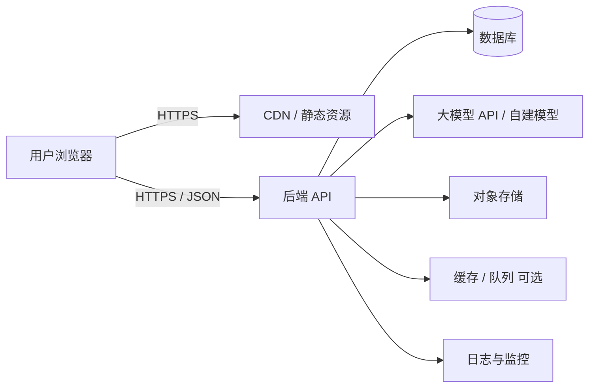
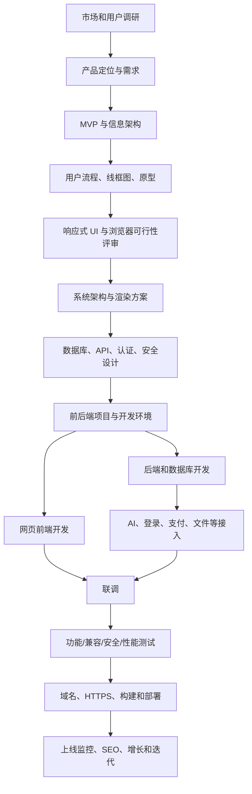
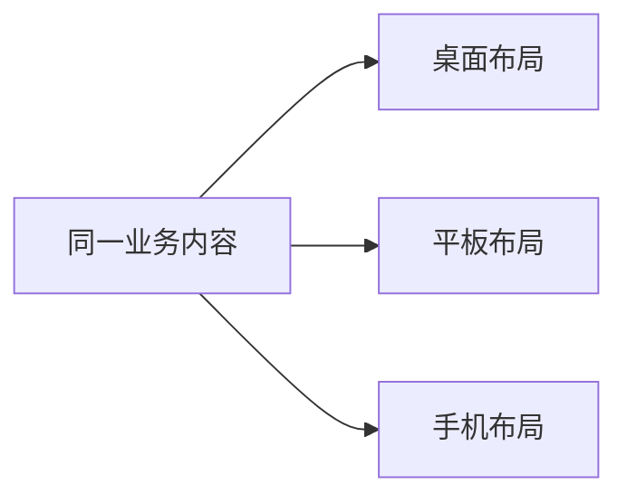
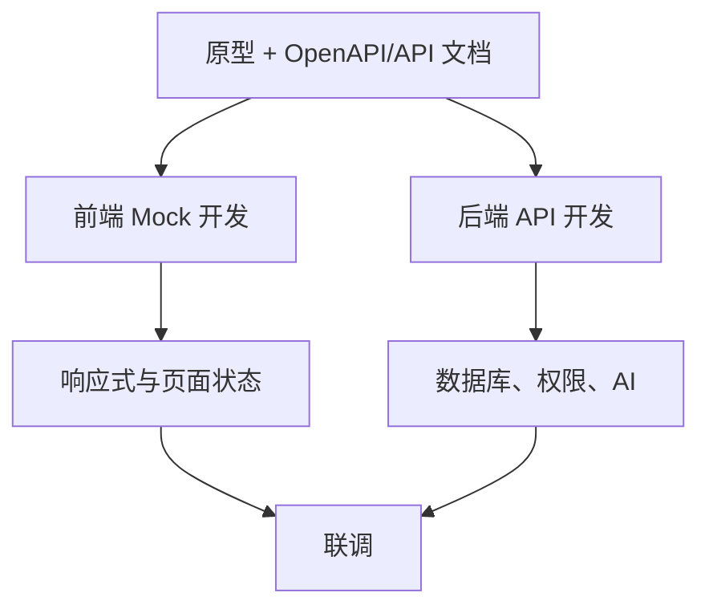
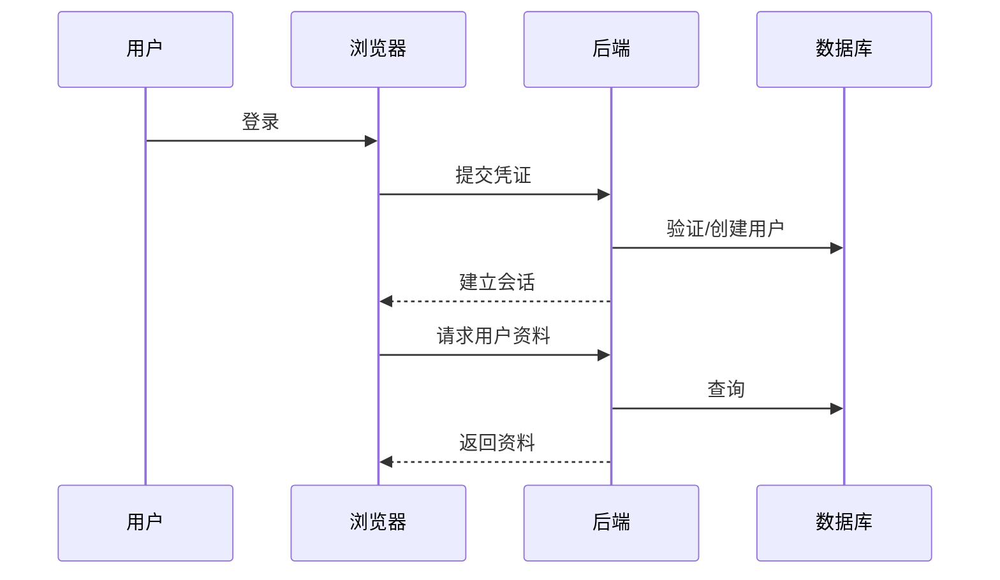
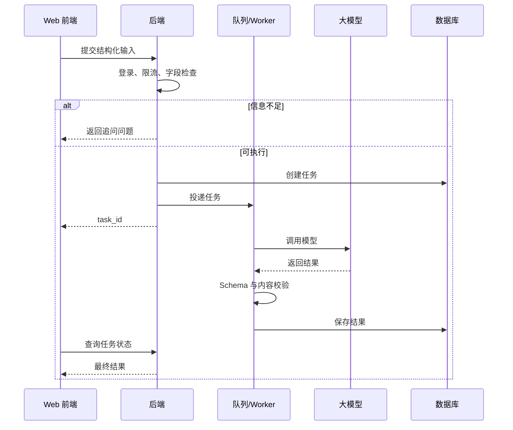
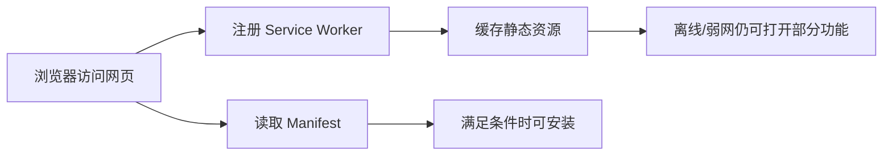

# 网页端完整系统开发流程

> 适用对象：第一次系统了解网站/Web APP 开发的个人开发者、小团队，以及使用 AI 辅助编程的初学者。  
> 文档目标：把“市场调研 → 原型 → 前端 → 后端 → AI → 测试 → 部署 → 运营”完整映射到网页端，并说明普通网站、Web APP 和 PWA 的区别。  
> 说明：浏览器、框架和部署平台变化较快，实际开发时应根据项目规模选择，不必追逐所有新框架。

---

## 1. APP 的整体逻辑能否用于网页开发

可以。产品、需求、原型、架构、前后端、数据库、登录、AI、测试、部署、监控和增长这一整套逻辑同样适用于网页。

主要区别在于客户端运行环境：

```text
Android：运行在 Android 系统，通过安装包/商店分发
iOS：运行在 Apple 系统，通过 Xcode、签名和 App Store 分发
Web：运行在浏览器，通过域名和网址访问
```

### 网页完整系统架构



### 网页端负责

- HTML 页面结构；
- CSS 样式、响应式布局；
- JavaScript/TypeScript 交互；
- 路由、状态管理；
- 调用 API；
- 表单和数据展示；
- 浏览器本地缓存；
- SEO、可访问性和浏览器兼容性。

### 后端负责

与 APP 基本相同：账号、权限、业务、数据库、AI、文件、支付、日志、安全和备份。

---

## 2. 普通网站、Web APP 和 PWA

| 类型 | 特征 | 适合场景 |
|---|---|---|
| 内容网站 | 以阅读和展示为主 | 官网、博客、新闻、文档 |
| Web APP | 交互和业务较复杂 | 管理系统、AI 工具、在线编辑器 |
| PWA | Web APP 基础上增加安装、离线、缓存等能力 | 希望接近 APP 体验但保持网页分发 |

PWA 仍然是网页，不等于完全替代原生 APP。它可以提供安装入口、离线缓存等体验，但设备能力、后台行为和浏览器支持仍可能与原生应用存在差异。

---

## 3. 推荐的网页首版技术路线

### 方案 A：初学者最小路线

| 层次 | 方案 |
|---|---|
| 页面 | HTML + CSS + JavaScript |
| 后端 | Python FastAPI |
| 数据库 | PostgreSQL |
| 部署 | 静态站点平台 + 云后端 |

适合先理解浏览器、HTTP、DOM、表单和 API。

### 方案 B：中小型 Web APP

| 层次 | 建议方案 |
|---|---|
| 前端语言 | TypeScript |
| 前端框架 | React / Vue（选择其一） |
| 构建工具 | Vite 或框架自带工具 |
| UI | 组件库 + 自定义 Design System |
| 网络 | Fetch / Axios |
| 后端 | FastAPI / Node.js 等 |
| 数据库 | PostgreSQL |
| 缓存 | Redis（按需） |
| 部署 | CDN + 云服务器/容器 |

### 方案 C：需要 SEO 和服务端渲染

可考虑支持 SSR/SSG 的全栈框架。是否需要由内容检索、首屏速度、团队能力和部署复杂度决定，不要只因框架流行就选择。

---

## 4. 网页完整开发流程总览



### 阶段产物

| 阶段 | 核心产物 |
|---|---|
| 市场调研 | 用户、场景、竞品、价值 |
| 需求 | PRD、MVP、优先级、验收标准 |
| 信息架构 | 页面层级、导航、内容结构 |
| 原型/UI | 桌面/平板/手机原型与设计稿 |
| 架构 | SPA/SSR/MPA/PWA 选择、模块、数据流 |
| 数据/API | 表结构、接口、认证、错误码 |
| 开发 | 前端、后端、AI、管理能力 |
| 测试 | 功能、兼容、安全、性能、无障碍 |
| 部署 | 域名、DNS、HTTPS、CDN、服务器 |
| 运营 | SEO、分析、漏斗、留存、迭代 |

---

## 5. 第一阶段：市场调研与网页定位

先回答：

> 用户为什么愿意访问这个网站？为什么要注册？为什么会收藏并再次访问？

需要明确：

- 是内容站、工具站、平台还是管理系统；
- 主要用户来自电脑还是手机；
- 是否需要搜索引擎流量；
- 是否必须登录才能使用；
- 是否需要付费；
- 是否需要离线或安装为 PWA；
- 是否需要后台管理端。

### 网页特有的入口问题

```text
搜索引擎
外部链接
社交分享
广告
直接输入域名
收藏夹
PWA 图标
```

不同入口的用户意图不同，首页和落地页设计也会不同。

---

## 6. 第二阶段：需求、MVP 与信息架构

### AI Web APP 的最小闭环

```text
进入落地页
  ↓
了解价值和示例
  ↓
注册/试用
  ↓
填写基础资料或任务
  ↓
必要时追问
  ↓
生成结果
  ↓
保存、复制、导出或分享
```

### 网页需要额外设计信息架构

```text
公共页面
├─ 首页
├─ 产品介绍
├─ 价格
├─ 帮助
├─ 隐私政策
└─ 登录/注册

登录后应用
├─ 工作台
├─ 新建任务
├─ 历史记录
├─ 用户资料
├─ 会员/账单
└─ 设置

管理端（按需）
├─ 用户
├─ 内容
├─ 订单
├─ AI 调用
└─ 运营数据
```

### 功能需求模板

```text
页面/功能：AI 生成页
访问条件：登录或游客额度
输入：文本、选项、文件
正常流程：校验 → 提交 → 流式/非流式展示 → 保存
异常：断网、刷新、超时、重复提交、格式错误
SEO：此页面是否需要公开索引
权限：用户是否只能查看自己的结果
```

---

## 7. 第三阶段：原型与响应式 UI

### 网页原型由谁画

- 产品经理：页面、功能、用户流程；
- UX：信息架构和交互；
- UI：视觉和组件；
- 前端：响应式、浏览器和实现成本评审。

### 网页必须考虑三类尺寸

```text
桌面端：多列、侧边栏、鼠标和键盘
平板端：中等宽度、触摸操作
手机端：单列、底部操作、软键盘
```

### 响应式原型示意



不是把桌面页面按比例缩小，而是重新排列信息优先级。

### 页面状态

```text
首屏加载
骨架屏
正常内容
空数据
接口失败
无网络
未登录
无权限
表单错误
上传中
生成中
保存成功/失败
```

### 可实现性评审

- 是否能在目标浏览器实现；
- 是否依赖实验性 API；
- 手机端如何布局；
- 刷新页面是否丢状态；
- 浏览器前进/后退如何工作；
- URL 是否能直接访问某个页面；
- 文件上传大小和格式；
- 生成耗时和断线恢复；
- 无障碍和键盘操作。

---

## 8. 第四阶段：网页架构设计

### 需要先做的选择

1. 纯静态、MPA、SPA 还是 SSR；
2. 是否需要 SEO；
3. 是否需要登录后的复杂交互；
4. 是否做 PWA；
5. 前后端是否独立部署；
6. 是否需要后台管理系统；
7. 文件和 AI 任务是否异步。

### 简化理解

| 方式 | 特点 |
|---|---|
| 静态站点 | 页面提前生成，部署简单 |
| MPA | 每次导航由服务器返回新页面 |
| SPA | 浏览器加载应用后，前端路由和更新界面 |
| SSR | 服务器先生成 HTML，再交给浏览器交互 |
| PWA | 在 Web 基础上增加清单、缓存、安装等能力 |

### 首版 Web APP 架构

```text
Browser Frontend
  ├─ Public Pages
  ├─ Auth Pages
  ├─ App Dashboard
  ├─ API Client
  ├─ State and Cache
  └─ Analytics
        ↓ HTTPS
Backend API
  ├─ auth
  ├─ users
  ├─ ai
  ├─ records
  ├─ billing
  └─ admin
        ↓
PostgreSQL / Object Storage / AI API / Logs
```

### 前端目录示意

```text
src/
├─ pages/ or routes/
├─ features/
│  ├─ auth/
│  ├─ profile/
│  ├─ generate/
│  └─ history/
├─ components/
├─ services/       # API
├─ stores/         # 状态
├─ types/
├─ utils/
└─ assets/
```

---

## 9. 第五阶段：数据、静态资源与 API

### 数据位置

| 数据 | 建议位置 |
|---|---|
| 页面图标、固定文案 | 前端资源/代码 |
| Mock 数据 | JSON |
| 临时表单 | 内存状态 |
| 普通本地偏好 | localStorage（谨慎） |
| 会话 | 安全 Cookie 或合理的 Token 方案 |
| 用户、历史、订单 | 云数据库 |
| 图片和文件 | 对象存储 |
| API Key 和密码 | 服务器环境变量 |

### 注意浏览器本地数据

localStorage 可被前端 JavaScript 读取，不适合随意存放高敏感凭证。认证方案需要结合 XSS、CSRF、跨域、刷新和退出机制统一设计。

### 前后端接口示例

```http
POST /api/v1/ai/tasks
Content-Type: application/json
```

```json
{
  "scene": "analysis",
  "input": {
    "topic": "...",
    "answers": {}
  }
}
```

```json
{
  "code": 0,
  "message": "success",
  "data": {
    "task_id": "task_001",
    "status": "processing"
  }
}
```

耗时任务可以采用：

```text
提交任务 → 返回 task_id → 轮询/推送状态 → 获取最终结果
```

---

## 10. 第六阶段：服务启动与开发环境

### 网页前端“启动”

开发时通常启动本地开发服务器：

```text
npm run dev
→ 浏览器访问 localhost
→ 修改代码后热更新
```

它是开发工具，不等于正式生产服务器。

### 后端服务

- API 服务；
- 数据库；
- Redis（可选）；
- 队列和 Worker（耗时 AI/文件任务时）；
- 对象存储；
- 日志监控。

### 一键启动

Windows 可以使用 BAT，跨平台更推荐 Docker Compose 或统一脚本：

```text
docker compose up
  ├─ frontend
  ├─ backend
  ├─ database
  └─ redis
```

### 环境配置

```text
.env.development
.env.staging
.env.production
```

注意不要把生产密钥提交到 Git。

---

## 11. 第七阶段：前后端并行开发



### 前端任务

1. 搭建项目、路由和布局；
2. 建 Design System；
3. 用 Mock 数据完成页面；
4. 封装 API；
5. 登录状态；
6. 错误、加载和空状态；
7. 响应式；
8. 浏览器兼容和可访问性。

### 后端任务

1. 数据库；
2. 认证与授权；
3. 业务 API；
4. AI 任务；
5. 文件上传；
6. 日志、限流和错误；
7. 测试环境部署。

### 接口变更规则

- 字段改动先更新文档；
- 不随意改变字段类型；
- 删除字段要考虑旧前端；
- 使用接口版本；
- 自动生成类型或校验 Schema 可减少错误。

---

## 12. 第八阶段：登录与会话

### 基本流程



### 网页登录要考虑

- Cookie/Token 的存储方式；
- CSRF；
- XSS；
- CORS；
- 登录过期；
- 多标签页同步；
- 刷新页面状态；
- 忘记密码；
- 第三方登录；
- 注销和数据删除。

### 用户资料逻辑

```text
首次填写 → 云数据库
再次访问 → 登录后获取
本地缓存 → 提升体验
最终权威 → 后端数据库
```

---

## 13. 第九阶段：AI 模型接入

### 推荐架构



快速任务可同步调用；时间较长、可能断线或需要重试的任务更适合任务队列。

### 信息完整度

```text
必要字段规则
+ AI 歧义识别
+ 追问次数上限
+ 默认值与显式假设
```

不要让模型无限追问，也不要把“90% 自信”当成真实概率。

### 流式输出

网页可以使用流式方式逐步展示文字，但需要设计：断线、取消、重新连接、内容审核、最终结构化保存。

---

## 14. 第十阶段：网页测试

| 测试类型 | 重点 |
|---|---|
| 功能测试 | 页面、表单、流程、权限 |
| API 测试 | 参数、错误码、越权、边界 |
| 浏览器兼容 | Chrome、Edge、Safari、Firefox 等目标浏览器 |
| 响应式 | 桌面、平板、手机、多种缩放 |
| 可访问性 | 键盘、语义标签、对比度、读屏 |
| 性能 | 首屏、资源体积、图片、缓存、接口 |
| 安全 | XSS、CSRF、SQL 注入、文件上传、CORS |
| SEO | 标题、描述、可抓取、结构化数据、链接 |
| AI | 提示注入、格式、超时、成本、拒答 |
| PWA | 安装、离线、更新、缓存失效 |

### 网页特有场景

```text
刷新页面
浏览器前进/后退
直接访问深层 URL
复制链接给别人
打开多个标签页
清除 Cookie 和缓存
禁用第三方 Cookie
缩放页面
网络从在线切换离线
```

---

## 15. 第十一阶段：部署上线

### 上线结构

```text
域名
  ↓ DNS
CDN / 静态托管
  ↓
前端构建产物

浏览器 API 请求
  ↓ HTTPS
反向代理 / API 网关
  ↓
后端容器
  ├─ 数据库
  ├─ Redis
  ├─ Worker
  ├─ 对象存储
  └─ AI API
```

### 上线步骤

1. 购买或配置域名；
2. 设置 DNS；
3. 配置 HTTPS；
4. 构建前端生产版本；
5. 部署后端；
6. 运行数据库迁移；
7. 配置生产环境变量；
8. 配置 CDN 和缓存；
9. 配置日志、监控和告警；
10. 小流量验证后正式开放。

### CI/CD

```text
提交代码
→ 自动检查格式
→ 自动测试
→ 构建
→ 部署测试环境
→ 审核
→ 部署生产环境
```

---

## 16. PWA 可选流程

当你希望网页具有“可安装、离线、接近 APP”的能力时，可增加：

- Web App Manifest；
- Service Worker；
- HTTPS；
- 图标与启动体验；
- 缓存策略；
- 离线页面；
- 更新提示；
- 安装引导。



PWA 缓存最容易出现“用户一直看到旧版本”，因此必须设计缓存版本和更新策略。

---

## 17. 第十二阶段：监控、SEO 和增长

### 技术监控

- 页面加载速度；
- JavaScript 错误；
- API 错误率；
- 后端响应时间；
- AI 延迟和成本；
- 数据库和服务器；
- 核心流程成功率。

### SEO（需要公开获客时）

- 页面标题和描述；
- 清晰 URL；
- 可抓取内容；
- 站点地图；
- 正确状态码；
- 性能和移动端体验；
- 内容质量；
- 内部链接。

登录后的私人工作台一般不需要被搜索引擎收录。

### 增长漏斗

```text
访问落地页
→ 点击试用
→ 注册
→ 完成首次任务
→ 保存/分享结果
→ 再次访问
→ 付费
```

AI 可协助设计 A/B 实验，但上线决策要依赖真实数据、用户反馈和成本。

---

## 18. 岗位职责

| 岗位 | 网页项目职责 |
|---|---|
| 产品经理 | 调研、需求、信息架构、原型、验收 |
| UX/UI | 响应式交互、视觉、组件、可访问性 |
| Web 前端 | HTML/CSS/JS、框架、浏览器、性能、SEO |
| 后端工程师 | API、认证、数据库、业务、AI、文件 |
| AI 应用工程师 | 提示词、模型、工作流、评测、成本 |
| 测试工程师 | 功能、浏览器、接口、安全、自动化 |
| DevOps/运维 | 域名、部署、CI/CD、监控、备份 |
| SEO/运营/数据 | 获客、内容、分析、转化和留存 |

---

## 19. 适合初学者的网页实施路线

```text
第 1 步：先用 HTML/CSS/JS 做出静态页面
第 2 步：理解浏览器、HTTP、JSON 和 Fetch
第 3 步：画响应式原型
第 4 步：用 Mock JSON 完成完整交互
第 5 步：学习一个前端框架，而不是同时学多个
第 6 步：FastAPI + PostgreSQL 实现后端
第 7 步：完成登录、资料和一个 AI 场景
第 8 步：补安全、异常、兼容和性能测试
第 9 步：部署域名、HTTPS、前后端
第 10 步：根据真实数据决定是否增加 PWA 或原生 APP
```

网页通常是验证产品想法的低成本入口：无需用户先安装，也更容易快速更新。但需要额外重视浏览器安全、响应式、SEO、URL 和兼容性。

---

## 20. 最终检查表

### 产品与设计

- [ ] 网页类型和目标设备明确
- [ ] MVP 与信息架构完成
- [ ] 桌面、平板、手机布局完成
- [ ] 页面各种状态完成

### 前端

- [ ] 路由和直接 URL 可用
- [ ] 刷新、前进、后退正常
- [ ] 浏览器兼容和可访问性测试完成
- [ ] 前端没有敏感密钥

### 后端与安全

- [ ] 认证、权限、CORS、CSRF/XSS 风险已处理
- [ ] API、数据库、AI 输出校验完成
- [ ] 文件上传有限制
- [ ] 日志、限流和备份完成

### 部署

- [ ] 域名、DNS、HTTPS 正常
- [ ] 生产环境变量正确
- [ ] 前端缓存更新策略正确
- [ ] 监控和告警已配置
- [ ] 数据库可恢复

### 运营

- [ ] 埋点和核心漏斗明确
- [ ] SEO 范围明确
- [ ] 隐私政策和用户协议可访问
- [ ] 增长实验有指标和停止条件

---

## 21. 一句话总结

> 网页开发可以完整复用你总结的产品、架构、前后端、登录、AI、部署和增长逻辑，只是客户端从手机操作系统变成了浏览器，因此要额外设计响应式布局、URL、浏览器兼容、安全、SEO、域名、HTTPS 和缓存。
